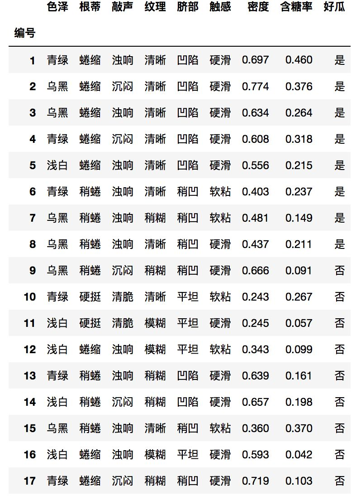

<a name="f82b8dc3"></a>
## 贝叶斯决策论

贝叶斯决策论是概率框架下实施决策的基本方法。对分类任务来说，在所有相关概率都已知的理想情形下，贝叶斯决策论考虑如何基于这些概率和误判损失来选择最优的类别标记。

假设有种可能的类别标记，即，是将一个真实标记为的样本误分类为所产生的损失，基于后验概率可获得将样本分类为所产生的期望损失，即在样本上的“条件风险”：


我们的任务是寻找一个判定准则以最小化总体风险


显然，对每个样本，若能最小化条件风险，则总体风险也将被最小化。这就产生了贝叶斯判定准则：为最小化总体风险，只需在每个样本上选择那个能使条件风险最小的类型标记，即


此时，称为贝叶斯最优分类器，与之对应的总体风险称为贝叶斯风险。反映了分类器所能达到的最好性能，即通过机器学习所能产生的模型精度的上限。具体来说，若目标是最小化分类错误率，则误判损失可写为


此时条件风险


于是，最小化分类错误率的贝叶斯最优分类器为


即对每个样本，选择能使后验概率最大的类别标记。

不难看出，欲使用贝叶斯判定准则来最小化决策风险，首先要获得后验概率。然而，在现实任务中这通常难以直接获得。从这个角度来看，机器学习所要实现的是基于有限的训练样本集尽可能准确地估计出后验概率。大体来说，主要有两种策略：

1. 给定，可通过直接建模来预测，这样就得到的是“判别式模型”
2. 先对联合概率分布建模，然后再由此获得，这样得到的是“生成模型”

显然决策树，支持向量机等都可归入判别模型范畴。对生成模型来说，必然考虑


基于贝叶斯定理，可写为


其中，是类“先验”概率；是样本相对于标记的类条件概率，或称为“似然”；是用于归一化的“证据”因子。对给定样本，证据因子与类标记无关，因此估计的问题就转化为如何基于训练数据来估计先验概率和似然

类先验概率表达了样本空间中各样本所占的比例，根据大数定律，当训练集包含充足的独立同分布样本时，可通过各类样本出现的频率来进行估计。

对类条件概率来说，由于它涉及关于所有属性的联合概率，直接根据样本出现的频率来估计将会遇到严重的困难。例如，假设样本个属性值都是二值的，则样本空间将有种可能的取值，在现实应用中，这个值往往远大于训练样本数，也就是说，很多样本取值在训练集中根本没出现，直接用频率来估计显然不可行，因为“未被观测到”与“出现概率为零”通常是不同的。估计类条件概率的一种常用策略是先假定其具有某种确定的概率分布形式，再基于训练样本对概率分布的参数进行估计。具体地，记关于类别的类条件概率为，假设具有确定的形式并且被参数向量唯一确定，则我们的任务就是利用训练集估计参数。为明确起见，我们将记为。事实上，概率模型的训练过程就是参数估计的过程，可用极大似然估计来确定估计概率分布参数。

<a name="6bc3d12f"></a>
## 朴素贝叶斯分类器

不难发现，基于贝叶斯公式来估计后验概率的主要困难在于：类条件概率是所有属性上的联合概率，难以从有限的训练样本直接估计而得。为避开这个障碍，朴素贝叶斯分类器采用了“属性条件独立性假设”：对已知类别，假设所有属性独立。换言之，假设每个属性独立地对分类结果发生影响。基于属性条件独立性假设：


其中为属性数目，为在第个属性上的取值。

由于对所有类别来说相同，因此基于的贝叶斯判定准则：


这就是朴素贝叶斯分类器的表达式。显然，朴素贝叶斯分类器的训练过程就是基于训练集来估计类先验概率，并为每个属性估计条件概率。

令表示训练集中第类样本的集合，若有充足的独立同分布样本，则可容易地估计出类先验概率


对离散属性而言，令表示中在第个属性上取值为的样本组成的集合，则条件概率可估计为


对连续属性可考虑概率密度，假定，其中和分别是第类样本在第个属性上取值的均值和方差，则有


<a name="ea0be9f2"></a>
#### 举例说明



假设我们对编号1进行分类（假设不知道其是否好瓜）

1、首先估计类先验概率，显然有：

    

2、然后，为每个属性估计条件概率：


于是，有


由于，因此，朴素贝叶斯分类器将样本1判别为“好瓜”。

需注意，若某个属性值在训练集中没有与某个类同时出现过，则直接用上述方法进行概率估计会出现问题，假设对一个“敲声=清脆”的测试例，有。所以无论其他属性是什么，连乘计算出概率为零。为避免这种情况，在估计概率值时通常进行“平滑”，常用“拉普拉斯修正”。

<a name="487beb27"></a>
## [Code实现](https://github.com/fengdu78/lihang-code/blob/master/code/%E7%AC%AC4%E7%AB%A0%20%E6%9C%B4%E7%B4%A0%E8%B4%9D%E5%8F%B6%E6%96%AF%28NaiveBayes%29/GaussianNB.ipynb)

基于贝叶斯定理与特征条件独立假设的分类方法。模型：高斯模型、多项式模型、伯努利模型

<a name="0d830788"></a>
### 数据

```python
import numpy as np
import pandas as pd
import matplotlib.pyplot as plt
%matplotlib inline

from sklearn.datasets import load_iris
from sklearn.model_selection import train_test_split

from collections import Counter
import math

# data
def create_data():
    iris = load_iris()
    df = pd.DataFrame(iris.data, columns=iris.feature_names)
    df['label'] = iris.target
    df.columns = ['sepal length', 'sepal width', 'petal length', 'petal width', 'label']
    data = np.array(df.iloc[:100, :])
    # print(data)
    return data[:,:-1], data[:,-1]

X, y = create_data()
X_train, X_test, y_train, y_test = train_test_split(X, y, test_size=0.3)
```

<a name="6f8f142d"></a>
### 手写实现

```python
class NaiveBayes:
    def __init__(self):
        self.model = None

    # 数学期望
    @staticmethod
    def mean(X):
        return sum(X) / float(len(X))

    # 标准差（方差）
    def stdev(self, X):
        avg = self.mean(X)
        return math.sqrt(sum([pow(x-avg, 2) for x in X]) / float(len(X)))

    # 概率密度函数
    def gaussian_probability(self, x, mean, stdev):
        exponent = math.exp(-(math.pow(x-mean,2)/(2*math.pow(stdev,2))))
        return (1 / (math.sqrt(2*math.pi) * stdev)) * exponent

    # 处理X_train
    def summarize(self, train_data):
        summaries = [(self.mean(i), self.stdev(i)) for i in zip(*train_data)]
        return summaries

    # 分类别求出数学期望和标准差
    def fit(self, X, y):
        labels = list(set(y))
        data = {label:[] for label in labels}
        for f, label in zip(X, y):
            data[label].append(f)
        self.model = {label: self.summarize(value) for label, value in data.items()}
        return 'gaussianNB train done!'

    # 计算概率
    def calculate_probabilities(self, input_data):
        # summaries:{0.0: [(5.0, 0.37),(3.42, 0.40)], 1.0: [(5.8, 0.449),(2.7, 0.27)]}
        # input_data:[1.1, 2.2]
        probabilities = {}
        for label, value in self.model.items():
            probabilities[label] = 1
            for i in range(len(value)):
                mean, stdev = value[i]
                probabilities[label] *= self.gaussian_probability(input_data[i], mean, stdev)
        return probabilities

    # 类别
    def predict(self, X_test):
        # {0.0: 2.9680340789325763e-27, 1.0: 3.5749783019849535e-26}
        label = sorted(self.calculate_probabilities(X_test).items(), key=lambda x: x[-1])[-1][0]
        return label

    def score(self, X_test, y_test):
        right = 0
        for X, y in zip(X_test, y_test):
            label = self.predict(X)
            if label == y:
                right += 1

        return right / float(len(X_test))

model = NaiveBayes()
model.fit(X_train, y_train)
print(model.predict([4.4,  3.2,  1.3,  0.2]))
model.score(X_test, y_test)
```

<a name="904b59e8"></a>
### sklearn实现

[https://scikit-learn.org/stable/modules/generated/sklearn.naive_bayes.GaussianNB.html](https://scikit-learn.org/stable/modules/generated/sklearn.naive_bayes.GaussianNB.html)

```python
from sklearn.naive_bayes import GaussianNB
from sklearn.naive_bayes import BernoulliNB, MultinomialNB # 伯努利模型和多项式模型

clf = GaussianNB()
clf.fit(X_train, y_train)

clf.score(X_test, y_test)
clf.predict([[4.4,  3.2,  1.3,  0.2]])
```
