
## XGBoost简介

在数据建模中，经常采用Boosting方法，该方法将成百上千个分类准确率较低的树模型组合起来，成为一个准确率很高的预测模型。这个模型会不断地迭代，每次迭代就生成一颗新的树。但在数据集较复杂的时候，可能需要几千次迭代运算，这将造成巨大的计算瓶颈。

针对这个问题。华盛顿大学的陈天奇博士开发的XGBoost（eXtreme Gradient Boosting）基于C++通过多线程实现了回归树的并行构建，并在原有Gradient Boosting算法基础上加以改进，从而极大地提升了模型训练速度和预测精度。在Kaggle的比赛中，多次有队伍借助XGBoost在比赛中夺得第一。其次，因为它的效果好，计算复杂度不高，在工业界中也有大量的应用。

## 监督学习的三要素

因为Boosting Tree本身是一种有监督学习算法，要讲Boosting Tree，先从监督学习讲起。在监督学习中有几个逻辑上的重要组成部件，粗略地可以分为：模型、参数、目标函数和优化算法。

### 模型

模型指的是给定输入如何去预测输出。我们比较常见的模型如线性模型（包括线性回归和Logistic Regression）采用线性加和的方式进行预测

这里的预测值可以有不同的解释，比如我们可以把它作为回归目标的输出，或者进行sigmoid变换得到概率（即用来预测正例的概率），或者作为排序的指标等。一个线性模型根据的解释不同（以及设计对应的目标函数），分别用到回归、分类或者排序等场景。

### 参数

参数就是我们根据模型要从数据里头学习的东西，比如线性模型中的线性系数：

### 目标函数：误差函数+正则化项

模型和参数本身指定了给定输入我们如何预测，但是没有告诉我们如何去寻找一个比较好的参数，这个时候就需要目标函数函数登场了。一般地目标函数包含两项：一项是损失函数，它说明了我们的模型有多拟合数据；另一项是正则化项，它惩罚了复杂模型。

1、：损失函数，常见的损失函数有：

- 平方损失：
- Logistic损失：

2、：正则化项，之所以要引入它是因为我们的目标是希望生成的模型能准确地预测新的样本（即应用于测试数据集），而不是简单地拟合训练集的结果（这样会导致过拟合）。所以需要在保证模型“简单”的基础上最小化训练误差，这样得到的参数才具有好的泛化性能。而正则化项就是用于惩罚复杂模型，避免模型过分拟合训练数据。常用的正则有正则与正则：

- 正则(Lasso)：
- 正则：

上述目标函数的设计来自于统计学习里面的一个重要概念叫做Bias-variance tradeoff（偏差-方差权衡），比较感性的理解，Bias可以理解为假设我们有无限多数据的时候，可以训练出最好的模型所拿到的误差。而Variance是因为我们只有有限数据，其中随机性带来的误差。目标中误差函数鼓励我们的模型尽量去拟合训练数据，这样相对来说最后的模型会有比较少的Bias。而正则化项则鼓励更加简单的模型。因为当模型简单之后，有限数据拟合出来结果的随机性比较小，不容易过拟合，使得最后模型的预测更加稳定。

## XGBoost原理

### 目标函数及二阶泰勒展开

在XGBoost中，选择树模型为基学习器，我们需要正则的对象，或者说需要控制复杂度的对象就是这颗树，通常树的参数有树的深度，叶子节点的个数，叶子节点值的取值（XGBoost里称为权重weight)。所以，我们的目标函数形式如下：

其中第一部分是训练损失，如上面所述的平方损失或者Logistic Loss等，第二部分是每棵树的复杂度的和。因为现在我们的参数可以认为是在一个函数空间里面，我们不能采用传统的如SGD之类的算法来学习我们的模型，因此我们会采用一种叫做additive training的方式。即每次迭代生成一棵新的回归树，从而使预测值不断逼近真实值（即进一步最小化目标函数）。每一次保留原来的模型不变，加入一个新的函数到模型里面：

所以，对于第次的目标函数为：

其中为前棵树的正则化项和，是一个常数。

根据，进一步为：

上面的式子意思很明显，只需要寻找一棵合适的树使得目标函数最小。然后不断地迭代次就可以完成个学习器的训练。那么我们这棵树到底怎么找呢？在GBDT里面（当然GBDT没有正则），我们的树是通过拟合上一棵树的负梯度值，建树的时候采用的启发式准则，如MSE等。然而，在XGBoost里面，它是通过对损失函数进行二阶泰勒展开：

对损失函数二阶泰勒展开(前棵树即，第棵树即)：

注意的是，这里的是标签值，是个常数，而是第次学习的结果，也是个常数。所以只要把变化量看成我们需要学习的模型，把看作就可以展成上面的样子。

这里，我们用记为第个样本损失函数的一阶导，记为第个样本损失函数的二阶导：

上面两式非常重要，贯串整个树的创建（分裂，叶子节点值的计算）。同时二阶导式子是我们利用XGBoost做特征选择时的一个评价指标。所以我们可以得到我们进化后的目标函数：

我们先回忆一下，一颗树用数学模型来描述是什么样，很简单其实就是一个分段函数。比如有下面一颗树。

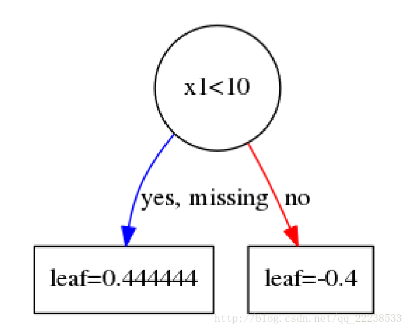

也就是说，一棵树其实可以由一片区域以及若干个叶子节点来表达。而同时，构建一颗树也是为了找到每个节点的区域以及叶子节点的值。

也就说可以有如下映射的关系。其中叶子节点的编号（从左往右遍）。是叶子节点的取值。即对于任意一个样本，其最后会落在树的某个叶子节点上，其值为。

既然一棵树可以用叶子节点来表达，我们可以对叶子节点进行惩罚（正则），比如取正则，以及我们控制一下叶子节点的个数，那么正则项有：

正则为什么可以控制模型复杂度呢？有很多角度可以看这个问题，最直观就是，我们为了使得目标函数最小，自然正则项也要小，正则项要小，叶子节点个数要小（叶子节点个数少，树就简单）。

而为什么要对叶子节点的值进行正则，这个可以参考一下逻辑回归里面进行正则的原因，简单的说就是逻辑回归没有加正则，整个的参数空间是无限大的，只有加了正则之后，才会把的解规范在一个范围内。（对此困惑的话可以跑一个不带正则的逻辑回归，每次出来的权重都不一样，但是Loss都是一样的，加了正则后，每次得到的都是一样的）。

我们的目标函数（移除常数项后，注意：也是常数）就可以改写成这样（用叶子节点表达）：

其实我们可以进一步化简，也是最重要的一步化简（上式展开之后按照叶子节点编号进行合并后可以得到下式）。那么最后可以化简成：

下面，我们把记为，把记为，那么目标函数可以进一步简化为：

我们做了这么多，其实一直都是在对二阶泰勒展开后的式子化简，其实刚展开的时候就已经是一个二次函数了，只不过化简到这里能够把问题看的更加清楚。所以对于这个目标函数，我们对求导，然后代入极值点，可以得到一个极值：

 

上面第一个式子即为叶子节点取值的表达式，第二个式子即为目标函数的值。

值得注意的是：在GBDT中，不同的损失函数有不同的叶子节点的取值，而在Xgboost里，叶子节点取值的表达式很简洁，推导起来也比GBDT的要简便许多。

### 分裂准则

我们一直都是在围绕目标函数进行分析，这个到底是为什么呢？为了我们寻找，也就是建树的过程。

具体来说，我们回忆一下建树的时候需要做什么，建树的时候最关键的一步就是选择一个分裂的准则，也就如何评价分裂的质量。比如在前面文章GBDT的介绍里，我们可以选择MSE，MAE来评价我们的分裂的质量，但是，我们所选择的分裂准则似乎不总是和我们的损失函数有关，因为这种选择是启发式的。比如，在分类任务里面，损失函数可以选择logloss，分裂准确选择MSE，这样看来，似乎分裂的好坏和我们的损失并没有直接挂钩。

但是，在Xgboost里面，我们的分裂准则是直接与损失函数挂钩的准则，这个也是Xgboost和GBDT一个很不一样的地方。具体来说，XGBoost选择：

其实选择这个作为准则的原因很简单也很直观。我们这样考虑，由知道，对于一个节点，假设我们不分裂的话，此时的损失为。假设在这个节点分裂的话，分裂之后左右叶子节点的损失分别为：、。

既然要分裂的时候，我们当然是选择分裂成左右子节点后，损失减少的最多。也就是找到一种分裂有：

那么的作用是什么呢？利用可以控制树的复杂度，进一步来说，利用来作为阈值，只有大于时候才选择分裂。这个其实起到了预剪枝的作用。最后就是如何得到左右子节点的样本集合？这个和普通的树一样，都是通过遍历特征所有取值，逐个尝试。

至此，我们把Xgboost的基本原理阐述了一遍。我们总结一下，其实就是做了以下几件事情：

- 在损失函数的基础上加入了正则项
- 对目标函数进行二阶泰勒展开
- 利用推导得到的表达式作为分裂标准，来构建一棵树

### 算法流程

[XGBoost核心部分的算法流程图如下：](https://arxiv.org/pdf/1603.02754.pdf)

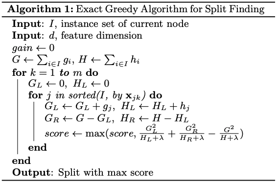

## 手动计算还原XGBoost过程

上面阐述了整个流程，有一些细节的地方可能都说的不太清楚。在这里，我以一个简单的UCI数据集，一步一步地和大家演算整个XGBoost的过程。

### 数据集、参数设置以及损失函数

数据集的样本条数只有15条，2个特征。具体如下：

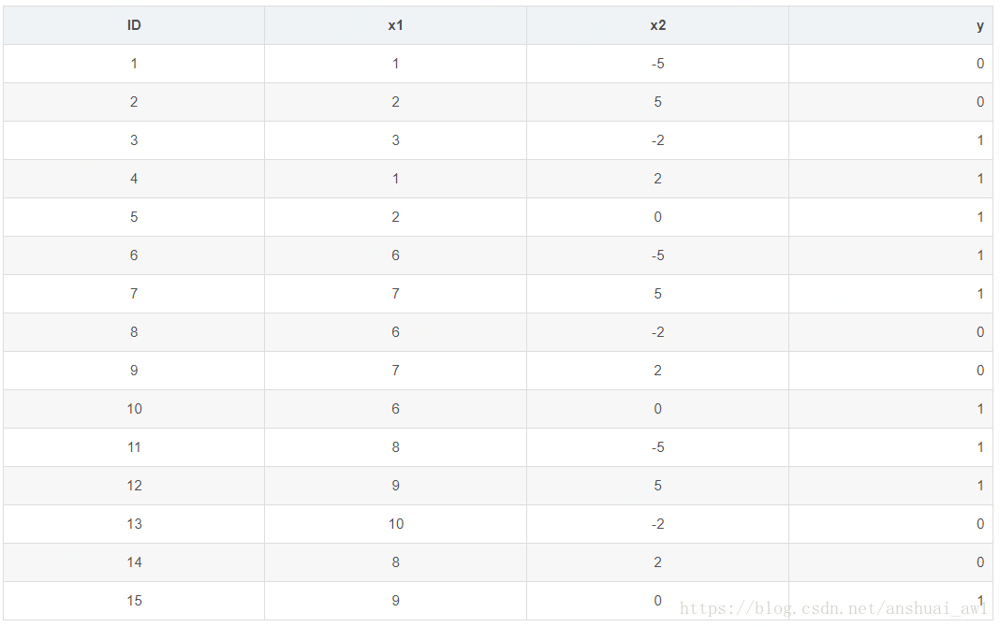

这里为了简单起见，树的深度设置为3(max_depth=3)，树的颗数设置为2(num_boost_round=2),学习率为0.1(eta=0.1)。另外再设置两个正则的参数，，。损失选择logloss。 由于后面需要用到logloss的一阶导数以及二阶导数，这里先简单推导一下：

两边对求一阶导数：

其中，

在一阶导的基础上再求一次导（其实就是sigmoid函数求导）：

所以样本的一阶导数值

样本的二阶导数值

### 建立第一棵树（k=1）

建树的时候从根节点开始(Top-down greedy)，在根节点上的样本有ID1～ID15。那么回顾Xgboost的算法流程，我们需要在根节点处进行分裂，分裂的时候需要计算式子：

式子表达的是：在节点处把样本分成左子节点和右子节点两集合。分别求两集合的，然后计算增益。

而这里，其实可以先计算每个样本的一阶导数值和二阶导数值，但是这里你可能碰到了一个问题，那就是第一颗树的时候每个样本的预测的概率是多少？这里和GBDT一样，应该说和所有的Boosting算法一样，都需要一个初始值。而在XGBoost里面，对于分类任务只需要初始化为中的任意一个数都可以。具体来说就是参数base_score。（其默认值是。值得注意的是base_score是一个经过sigmod映射的值，可以理解为一个概率值，提这个原因是后面建第二颗树会用到，需要注意这个细节）

这里我们也设base_score= 。然后我们可以计算每个样本的一阶导数值和二阶导数值了。具体如下表

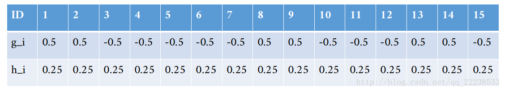

对于ID=1样本，，。那么把样本如何分成两个集合呢？这里就是上面说到选取一个最佳的特征以及分裂点使得最大。

比如说对于特征，一共有这种取值。可以得到种划分+不划分(分裂)方式。

以为划分时（）：

左子节点包含的样本：

右子节点包含的样本：

那么左子节点为空，和

右子节点的一阶导数和：

右子节点的二阶导数和：

最后我们在计算以下增益 ，可以得到。计算出来发现其实不用惊讶， 因为左子结点为空，也就是这次分裂把全部样本都归到右子结点，这个和没分裂有啥区别？所以，分裂的时候每个结点至少有一个样本。

下面，再计算当以划分时的增益（以为划分时）：

左子节点包含的样本：

右子节点包含的样本：

左子节点的一阶导数和：

左子节点的二阶导数和：

右子节点的一阶导数和：

右子节点的二阶导数和：

最后计算一下增益：

其他的值类似，计算归总到下表：

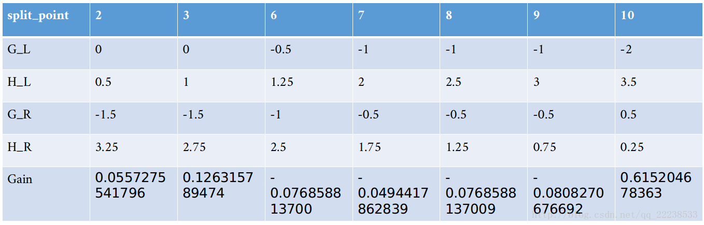

从上表我们可以看到，如果特征以分裂时可以得到最大的增益。 按照算法的流程，这个时候需要遍历下一个特征，对于特征也是重复上面这些步骤，可以得到类似的表如下：

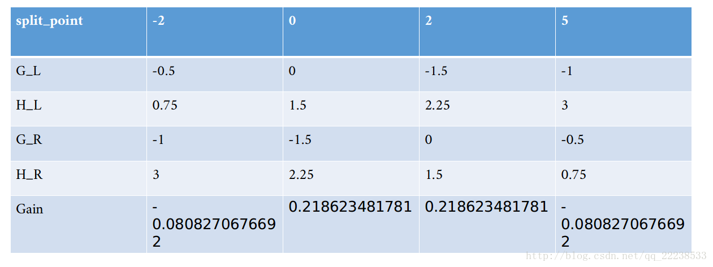

可以看到，以特征来分裂时，最大的增益是。所以在根节点处，以来进行分裂。

由于设置的最大深度是，此时只有层，所以还需要继续往下分裂。

左子节点的样本集合：

右子节点的样本集合：

右子节点此时只剩一个样本，不需要分裂了，也就是已经是叶子结点。可以计算其对应的叶子结点值了，按照公式：

下面就是对左子节点进行分裂。分裂的时候把此时的节点看成根节点，其实就是循环上面的过程，同时，同样也是需要遍历所有特征，的所有取值作为分裂点，选取增益最大的点。重复上面的过程，得到和特征分裂的增益分别为下两表：

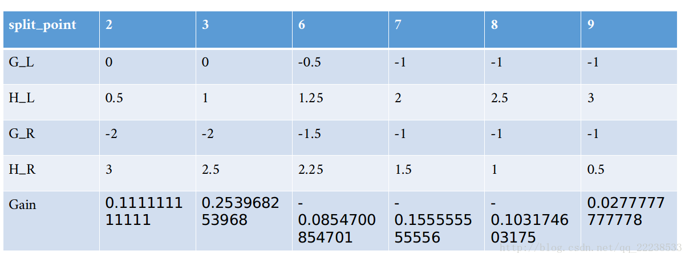 

可以看到，时分裂可以获得最大的增益。就这样重复下去，直到到达规定深度。这里就不啰嗦了，第一个树结构如下图：

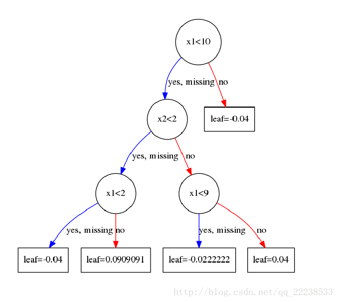

这里有的人可能对叶子结点取值感到困惑。为何我算出来的是，可图上却是？

这里以最左边的一个叶子结点为例，展示一下计算的过程。落在最左边这个叶子节点的样本有所以由公式：

落在从左边数起第二个叶子结点上的样本有：

到这里完全没有问题，但是为什么和图上的不一样呢？这里其实和我们在GBDT中的处理一样，我们会以一个学习率来乘这个值，当完全取时说明学习率取，这个时候很容易过拟合。所以每次得到叶子结点的值后需要乘上学习率，在前面我们已经设置了学习率是。这里也是GBDT和XGBoost一个共同点，大家都是通过学习率来进行Shrinkage，以减少过拟合的风险。

至此，我们学习完了第一颗树。

### 建立第二颗树（k=2）

这里，我们开始拟合我们第二颗树。其实过程和第一颗树完全一样。只不过对需要进行更新，也就是拟合第二颗树是在第一颗树预测的结果基础上。这和GBDT一样，因为大家都是Boosting思想的算法。

由于在第一棵树构造时之前没有树，所以初始，即参数base_score为。

假设此时，模型只有这一颗树()，那么模型对样例进行预测时，预测的结果表达是什么呢？

由加法模型： 

的值是样例落在第一棵树上的叶子节点值。那么是什么呢？ 这里就涉及前面提到一个问题base_score是一个经过sigmod映射后的值（因为选择使用log loss做损失函数，概率）

所以需要将逆运算后可以得到。

所以第一棵树预测的结果就是（其实当训练次数K足够多的时候，初始化这个值几乎不起作用的，这个在官网文档上有说明）

所以，我们可以得到第一棵树预测的结果为下表（预测后将其映射成概率）

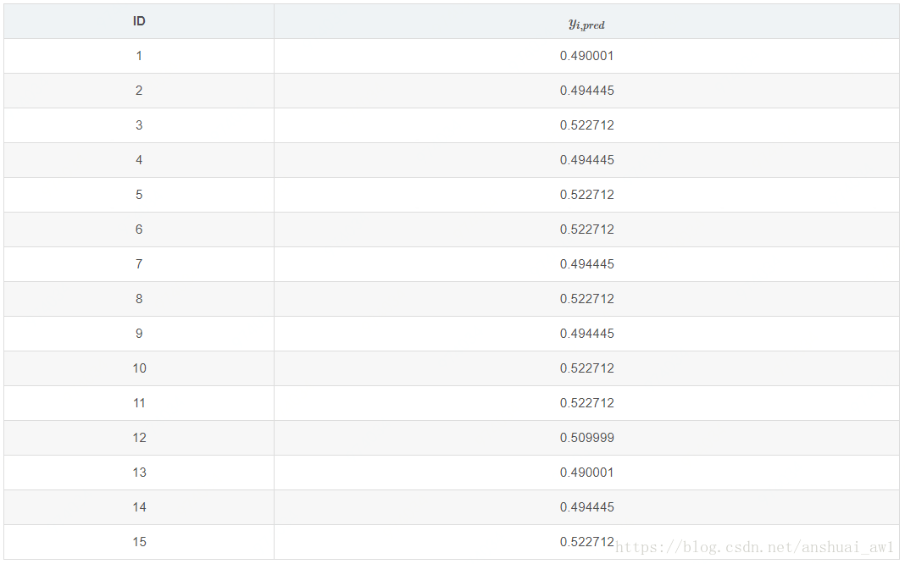

比如对于ID=1的样本，其落在这个节点。经过sigmod映射后的值为。有了这个之后，根据公式和我们就可以计算所有样本新的一阶导数和二阶导数的值了。具体如下：

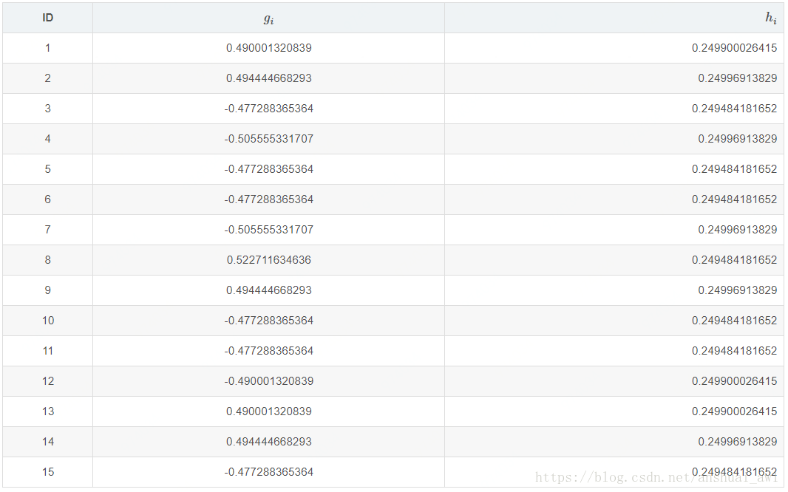

之后，我们和第一棵树建立的时候一样以公式去建树。

拟合完后第二棵树如下图：

后面的所有过程都是重复这个过程，这里就不再啰嗦了。

## XGBoost近似分位数算法

当数据量非常大难以被全部加载进内存时或者分布式环境下时，exact greedy算法将不再合适。因此作者提出近似算法（Approximate Algorithm）来寻找分割点。 [近似算法的大致流程见下面的算法](https://arxiv.org/pdf/1603.02754.pdf) 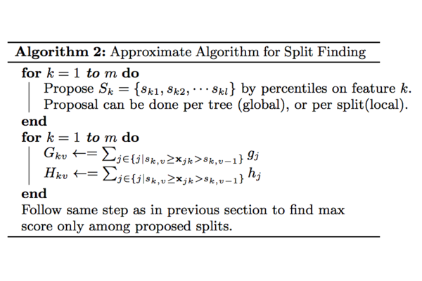 对于某个特征，算法首先根据特征分布的分位数找到特征切割点的候选集合；然后将特征的值根据集合划分到桶(bucket)中，接着对每个桶内的样本统计值、进行累加统计，最后在这些累计的统计量上寻找最佳分裂点。

不同于基本的穷举算法，paper指出两种近似算法：一种是全局算法，即在初始化tree的时候划分好候选分割点，并且在树的每一层都使用这些候选分割点；另一种是局部算法，即每一次划分的时候都重新计算候选分割点。这两者各有利弊，全局算法不需要多次计算候选节点，但需要一次获取较多的候选节点供后续树生长使用，而局部算法一次获取的候选节点较少，可以在分支过程中不断改善，即适用于生长更深的树，两者在effect和accuracy做trade off。

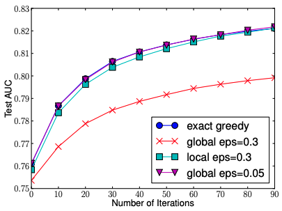

从算法伪代码可以看出近似算法的核心是如何根据分位数采样得到分割点的候选集合。XGBoost提出了Weighted Quantile Sketch来解决这个问题。

在讲述Weighted Quantile Sketch之前，必须先要介绍一下什么是Quantile。这是Weighted Quantile Sketch的关键，如果不理解Quantile，就不会理解，在当数据量非常大难以被全部加载进内存时或者分布式环境下时，XGBoost的近似算法是如何寻找分割点的候选集合的。

### Quantile

#### -quantile

输入数据： 14, 19, 3, 15, 4, 6, 1, 13, 13, 7, 11, 8, 4, 5, 15, 2

则排序后，该组数据为： 1, 2, 3, 4, 4, 5, 6, 7, 8, 11, 13, 13, 14, 15, 15, 19. 如下图所示：

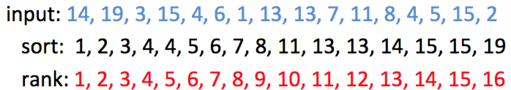

在上面的序列中，

第1小的数是什么？ 很明显是：1 (rank=1)。 第4小的数是什么？ 答案是：4 (rank=4)。

第50%小的数是什么？ 50% * 16 = 8（rank=8)， 则答案为：7

什么是分位点呢？-quantile表示的元素，其中，为序列中元素的个数。例如，在上面的例子中： 0.25-quantile是什么？ rank=0.25×16=4，所以答案为：4

#### -approximate -quantiles

-approximate -quantiles 的意思就是：在-quantiles误差-approximate以内位置的取值。即近似分位点。

即 -quantiles 是在区间，而不是之前的精确的。还是上面的例子，令，，由数据可知，此时为，即rank为，-approximate -quantiles 为。

物理含义是什么呢？就是说，如果我们允许是的误差的话，那么-quantiles 的值为都可以。

####  -approximate quantile summary

我们已经可以看到，即便是求一个序列的-approximate -quantiles，也必须先对数据进行排序，而如果我们的内存不足以让全部数据排序时，应该怎么解决？早在2001年，M.Greenwald和S. Khanna提出了GK Summay分位点近似算法（-approximate -quantiles），直到到2007年被Q. Zhang和W. Wang提出的多层level的merge与compress/prune框架进行高度优化，而被称为A fast algorithm for approximate quantiles，目前XGBoost框架套用A fast algorithm算法结构。

GK Summay巧妙地设计了-approximate quantile summary。-approximate quantile summary 是一种数据结构，该数据结构能够以的精度计算任意的分位查询。当一个序列无法全部加载到内存时，常常采用quantile suammary近似的计算分位点。

大致来讲下思路：-approximate quantile summary 这个数据结构不需要一次存入所有的数据，它先用一些元组存入部分数据（当然在内部需要排序），这些元组记录的是现有的value值和一些位置信息，有了这些信息，就保证了能够以的精度计算任意的分位查询。只要流式系统中每个时刻都维持这种summary结构，每次查询都能满足精度要求，但是流式数据实时更新，需要解决新增数据的summary更新问题。为此，算法提供了insert操作，insert操作可以保证现有的summary结构仍然可以保证的精度。当然，每次数据插入都需要新增元组，summary结构不能持续增加而不删除，因此到达一定程度需要对summary进行delete。同时，delete操作也可以保证现有的summary结构仍然可以保证的精度

### Weighted Datasets

现在我们回到XGBoost中，在建立第棵树的时候已经知道数据集在前面棵树的误差，因此采样的时候是需要考虑误差，对于误差大的特征值采样粒度要加大，误差小的特征值采样粒度可以减小，也就是说采样的样本是需要权重的。重新审视目标函数

因此可以将该目标还是看作是关于标签的和权重为的平方误差形式。为样本的二阶导数

#### 二阶导数为权重的解释

如果损失函数是Square loss，即，则，那么实际上式不带权（每个样本的权重一样）。如果损失函数是Log loss，则。 这是个开口朝下的一元二次函数，所以最大值在。当pred在附近，值都比较大，也就是权重都比较大，在切直方图时，我们希望桶比较均匀，因此这部分就会被切分的更细。

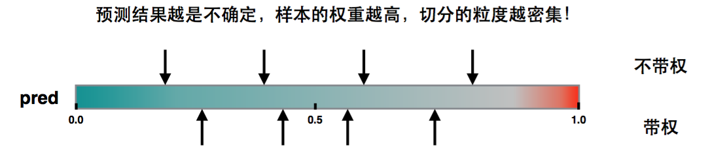

#### 问题转换

表示每个训练样本的第维特征值和对应二阶导数。接下来定义排序函数为

函数表示特征的值小于的样本分布占比，其中二阶导数可以视为权重。

在这个排序函数下，我们找到一组点，满足

其中，，，为采样率，直观上理解，我们最后会得到个分界点。注意，这里的就是每个桶的比例大小。白话说就是让相邻两个候选分裂点相差不超过某个值因此，总会得到个切分点。

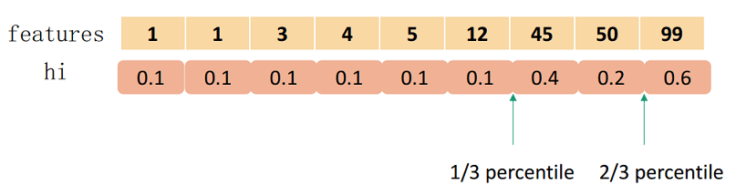

要切分为3个，总和为1.8，因此第1个在0.6处，第2个在1.2处。

在XGBoost[官方文档](https://xgboost.readthedocs.io/en/latest/parameter.html)中设置tree_method=approx，然后设置sketch_eps，就可以确定有多少个候选分割点

### Weighted Quantile Sketch

好了，如果我们的数据集比较小（特征的不同value不多），采用近似算法的话，我们只需要排序特征的所有特征值，然后根据公式就可以求出候选的分割点。但是，如果这里的关键是：如果我们的数据量特别大（某些特征的不同value特别特别多），以致于无法排序找到分位点，我们应该怎么做？

对于这种weighted datasets的情况，陈天奇博士提出了Weighted Quantile Sketch算法。 我们可以求得一个大数据集每个特征的近似分位点，也就是求得了算法2中最核心的。且这个近似分为点的精度是在之内的。就是第二部分的的意思。

## XGBoost一些细节

### XGBoost如何画出树

对XGBoost使用了一定程度的读者，肯定会面临如何画出树这个问题，毕竟不画出树就是一个黑箱，黑箱总是难以让人放心。这篇[博客](https://blog.csdn.net/anshuai_aw1/article/details/82988494)完整地给出了如何画出XGBoost中的树的过程。

### XGBoost与传统GBDT区别和联系

#### 区别

XGBoost和GBDT的一个区别在于目标函数上。 在Xgboost中，损失函数+正则项。 GBDT中，只有损失函数

XGBoost中利用二阶导数的信息，而GBDT只利用了一阶导数。

XGBoost在建树的时候利用的准则来源于目标函数推导，而GBDT建树利用的是启发式准则。

XGBoost中可以自动处理空缺值，自动学习空缺值的分裂方向，GBDT(sklearn版本）不允许包含空缺值。

列抽样（column subsampling）：XGBoost借鉴了随机森林的做法，支持列抽样，不仅能降低过拟合，还能减少计算，这也是XGBoost异于传统GBDT的一个特性。

XGBoost工具支持并行：Boosting不是一种串行的结构吗?怎么并行的？注意XGBoost的并行不是tree粒度的并行，XGBoost也是一次迭代完才能进行下一次迭代的（第t次迭代的损失函数里包含了前面t−1次迭代的预测值）。XGBoost的并行是在特征粒度上的。我们知道，决策树的学习最耗时的一个步骤就是对特征的值进行排序（因为要确定最佳分割点），XGBoost在训练之前，预先对数据进行了排序，然后保存为block(块)结构，后面的迭代中重复地使用这个结构，大大减小计算量。这个block结构也使得并行成为了可能，在进行节点的分裂时，需要计算每个特征的增益，最终选增益最大的那个特征去做分裂，那么各个特征的增益计算就可以开多线程进行。

线程缓冲区存储：按照特征列方式存储能优化寻找最佳的分割点，但是当以行计算梯度数据时会导致内存的不连续访问，严重时会导致cache miss，降低算法效率。paper中提到，可先将数据收集到线程内部的buffer（缓冲区），主要是结合多线程、数据压缩、分片的方法，然后再计算，提高算法的效率。

可并行的近似直方图算法：树节点在进行分裂时，我们需要计算每个特征的每个分割点对应的增益，即用贪心法枚举所有可能的分割点。当数据无法一次载入内存或者在分布式情况下，贪心算法效率就会变得很低，所以XGBoost还提出了一种可并行的近似直方图算法，用于高效地生成候选的分割点。大致的思想是根据百分位法列举几个可能成为分割点的候选者，然后从候选者中根据上面求分割点的公式计算找出最佳的分割点。

#### 联系

XGBoost和GBDT的学习过程都是一样的，都是基于Boosting的思想，先学习前个学习器，然后基于前个学习器学习第个学习器。(Boosting)

建树过程都利用了损失函数的导数信息(Gradient)，只是大家利用的方式不一样而已。

都使用了学习率来进行Shrinkage，从前面我们能看到不管是GBDT还是XGBoost，我们都会利用学习率对拟合结果做缩减以减少过拟合的风险。

### [XGBoost构造新特征+LR融合](https://blog.csdn.net/anshuai_aw1/article/details/82983997)

为什么要使用LR模型进行融合呢？这是因为LR (逻辑回归) 算法简单有效，成为工业界最常用的算法之一。但 LR 算法是线性模型，不能捕捉到非线性信息，需要大量特征工程找到特征组合。为了发现有效的特征组合，Facebook 在 2014年的论文ractical Lessons from Predicting Clicks on Ads at Facebook介绍了通过 GBDT （Gradient Boost Decision Tree）+ LR 的方案 （XGBoost 是 GBDT 的后续发展）。在这篇论文中他们提出了一种将Xgboost作为feature transform的方法。随后在多个Kaggle 竞赛实践中，均证明了此思路的有效性。

大概的思想可以描述为如下：先用已有特征训练XGBoost模型，然后利用XGBoost模型学习到的树来构造新特征，最后把这些新特征加入原有特征一起训练模型。构造的新特征向量是取值的，向量的每个元素对应于XGBoost模型中树的叶子结点。当一个样本点通过某棵树最终落在这棵树的一个叶子结点上，那么在新特征向量中这个叶子结点对应的元素值为，而这棵树的其他叶子结点对应的元素值为。新特征向量的长度等于XGBoost模型里所有树包含的叶子结点数之和。最后将新的特征扔到LR模型进行训练。

### 如何理解训练过程的参数min_child_weight

在选择分裂的时候，我们是选取分裂点为一个最大的增益Gain。但是其实在Xgboost里面有一个参数叫min_child_weight。 先来看看官网对这个参数的解释：

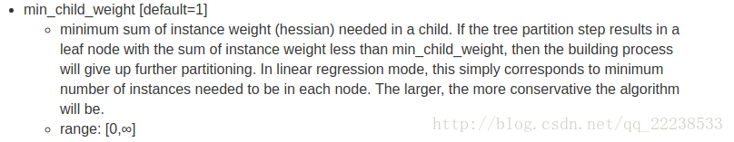

可能看完大概知道这个权重指的应该是二阶导数，但是具体是怎么一回事呢。 其实是这样的：

在前面建立第一颗的根结点的时候，我们得到特征每个分裂点的这个表：

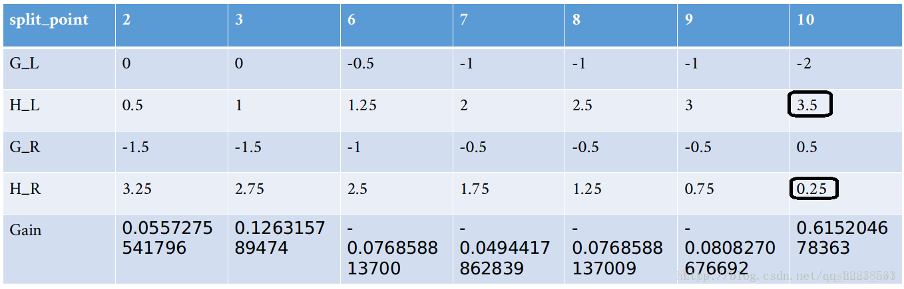

我们当时选取了分裂，但是！ 这个是有前提的，那就是参数。如果设置，分裂点就不是选择，而是放弃这个最大增益，考虑次大增益。如果次大增益也不满足，则继续往下找，如果没有找到一个满足的，则不进行分裂。 （在上面中min_child_weight取的0，所以只要是最大的增益就选为分裂点）

### 如何理解训练过程的参数

在前面例子里，我们把设成了0，如果我们设置成其他值比如1的话，在考虑最大增益的同时，也要考虑这个最大的增益是否比大，如果小于则不进行分裂（预剪枝），由增益公式得到此结论

### XGBoost如何处理缺失值

XGBoost对缺失值的处理思想很简单，具体看下面的算法流程：

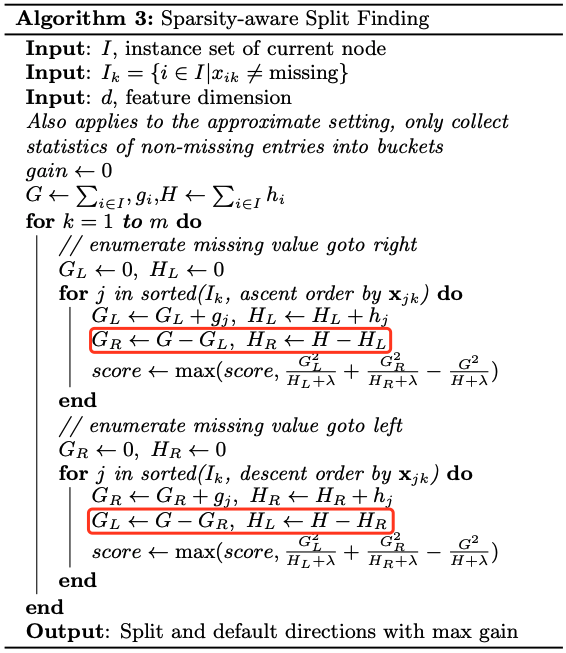

首先需要注意到两个集合一个是，其包含所有的样本（包括含空缺值的样本）。

是不包含空缺值样本的集合。在计算总的和时用的是，也就是说空缺值的一阶导数和二阶导数已经包含进去了。

可以看到内层循环里面有两个，这两个针对的集合就是。

第一个是把特征取值从小到大的排序，然后从小到大进行扫描，这个时候在计算的时候是用总的减去 ，也是同样用总的减去，这意味着把空缺样本归到了右子节点。

第二个相反过来，把空缺样本归到了左子节点。

所以，只要比较这两次最大增益出现在第一个中还是第二个中就可以知道对于空缺值的分裂方向，这就是XGBoost如何学习空缺值的思想。

### XGBoost如何用于特征选择

相信很多做过数据挖掘比赛的人都利用Xgboost来做特征选择。

一般我们调用xgb库的get_fscore()。但其实Xgboost里面有三个指标用于对特征进行评价，而get_fscore()只是其中一个指标weight。这个指标大部分玩家都很熟悉，其代表着某个特征被选作分裂的次数。

比如在前面举的例子里，我们得到这两颗树：

  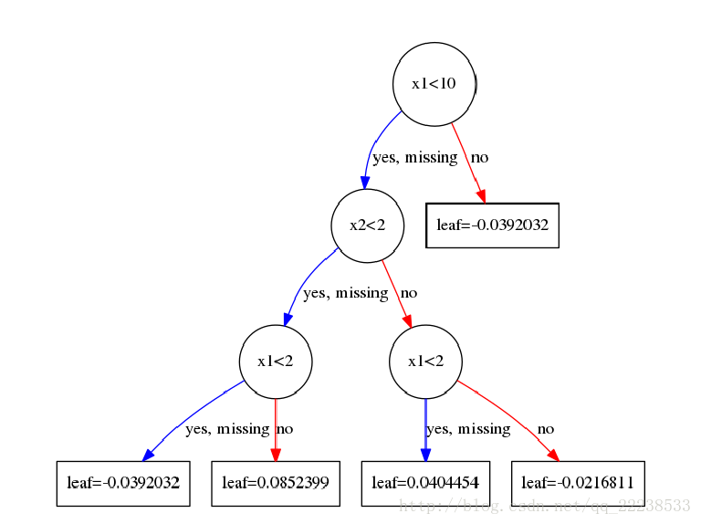

可以看到特征被选作分裂点的次数为，被选做分裂点的次数为。 get_fscore()就是返回这个指标。

而XGBoost还提供了另外两个指标，一个叫gain，一个叫cover。可以利用get_score()来选择。那么gain是指什么呢？其代表着某个特征的平均增益。比如，特征被选了次作为分裂的特征，每次的增益假如为，那么其平均增益为。

最后一个cover指的是什么呢？其代表着每个特征在分裂时结点处的平均二阶导数。

这个为了加深理解，还是UCI数据集，不过此时只有max_depth=2，num_boost_round=1。

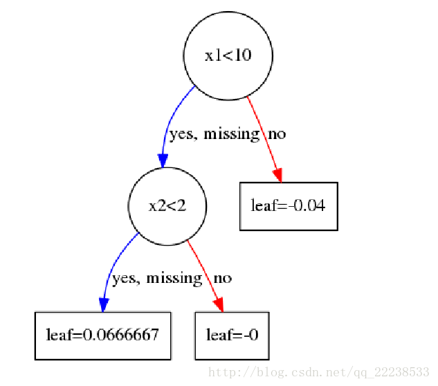

建树完之后，其结构如上。 在第一个结点分裂时，的特征增益表如下：

第二个结点分裂时，的特征增益表如下：

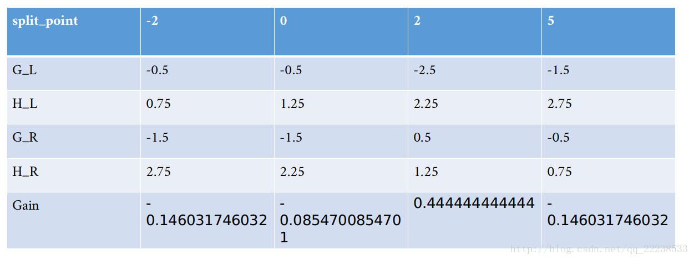

那么特征的cover是如下计算的：

在第一个节点处被选择为分裂特征，在特征值为时进行分裂。此时节点处的总二阶导数。故的cover值为。这里只是被分裂的了一次，如果后续还有就是求平均。

同样地，的cover值为。

举这个例子就是先给大家说一下何为平均二阶导数。为什么需要选择二阶导数？这个二阶导数背后有什么意义吗？我们先看看官网对cover的定义：

‘cover’ - the average coverage of the feature when it is used in trees。大概的意义就是特征覆盖了多少个样本。 这里，我们不妨假设损失函数是mse，也就是，我们求其二阶导数，很容易得到为常数。也就是每个样本对应的二阶导数都是，那么这个cover指标不就是意味着，在某个特征在某个结点进行分裂时所覆盖的样本个数。

## XGBoot系统设计

### 分块并行 – Column Block for Parallel Learning

在建树的过程中，最耗时是找最优的切分点，而这个过程中，最耗时的部分是将数据排序。为了减少排序的时间，XGBoost采用Block结构存储数据。它有如下几点特征：

- Block中的数据以稀疏格式CSC进行存储。CSC格式请参考该[文章](https://www.cnblogs.com/rollenholt/p/5960523.html)。
- Block中的特征进行排序（不对缺失值排序），且只需要排序依次，以后的分裂树的过程可以复用。

对于exact greedy算法来说，Xgboost将所有的数据放到了一个Block中。在Block中，可以同时对所有叶子进行分裂点的计算，因此对Block进行一次扫描将可以得到所有叶子的分割特征点候选者的统计数据。（We do the split finding of all leaves collectively, so one scan over the block will collect the statistics of the split candidates in all leaf branches.） Block 中特征还需存储指向样本的索引，这样才能根据特征的值来取梯度。如下图所示：

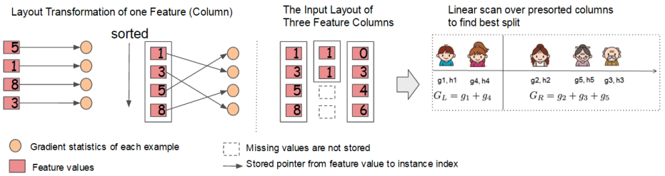

对于approximate算法来说，Xgboost使用了多个Block，存在多个机器上或者磁盘中。每个Block对应原来数据的子集。不同的Block可以在不同的机器上计算。该方法对Local策略尤其有效，因为Local策略每次分支都重新生成候选切分点。

Block结构还有其它好处，数据按列存储，可以同时访问所有的列，很容易实现并行的寻找分裂点算法。缺点是空间消耗大了一倍。

### 缓存优化 – Cache-aware Access

使用Block结构的一个缺点是取梯度的时候，是通过索引来获取的，而这些梯度的获取顺序是按照特征的大小顺序的。这将导致非连续的内存访问，可能使得CPU cache缓存命中率低，从而影响算法效率。如下图所示：

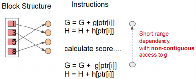

因此，对于exact greedy算法中, 使用缓存预取（cache-aware prefetching）。具体来说，对每个线程分配一个连续的buffer，读取梯度信息并存入Buffer中（这样就实现了非连续到连续的转化），然后再统计梯度信息。该方式在训练样本数大的时候特别有用，见下图：

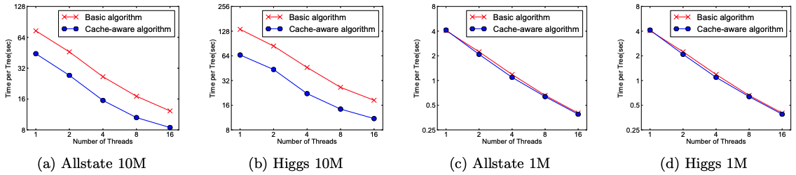

可以看到，对于大规模数据，效果十分明显。

在approximate 算法中，对Block的大小进行了合理的设置。定义Block的大小为Block中最多的样本数。设置合适的大小是很重要的，设置过大则容易导致命中率低，过小则容易导致并行化效率不高。经过实验，发现比较好。如下图：

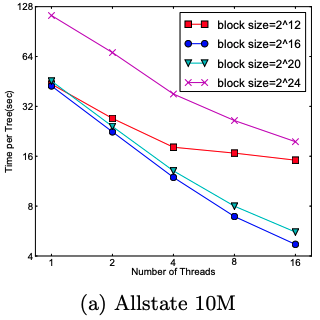  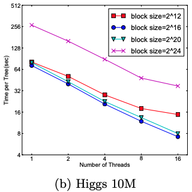

### Blocks for Out-of-core Computation

当数据量太大不能全部放入主内存的时候，为了使得out-of-core计算称为可能，将数据划分为多个Block并存放在磁盘上。计算的时候，使用独立的线程预先将Block放入主内存，因此可以在计算的同时读取磁盘。但是由于磁盘IO速度太慢，通常更不上计算的速度。因此，需要提升磁盘IO的销量。XGBoost采用了2个策略：

- Block压缩（Block Compression）：将Block按列压缩（LZ4压缩算法？），读取的时候用另外的线程解压。对于行索引，只保存第一个索引值，然后只保存该数据与第一个索引值之差(offset)，一共用16个bits来保存 offset，因此，一个block一般有2的16次方个样本。
- Block拆分（Block Sharding）：将数据划分到不同磁盘上，为每个磁盘分配一个预取（pre-fetcher）线程，并将数据提取到内存缓冲区中。然后，训练线程交替地从每个缓冲区读取数据。这有助于在多个磁盘可用时增加磁盘读取的吞吐量。

## 算法实现

[https://github.com/dmlc/xgboost](https://github.com/dmlc/xgboost)

## Source

[https://arxiv.org/abs/1603.02754](https://arxiv.org/abs/1603.02754) [https://blog.csdn.net/anshuai_aw1/article/details/82970489#_604](https://blog.csdn.net/anshuai_aw1/article/details/82970489#_604) [https://blog.csdn.net/anshuai_aw1/article/details/85093106](https://blog.csdn.net/anshuai_aw1/article/details/85093106)
