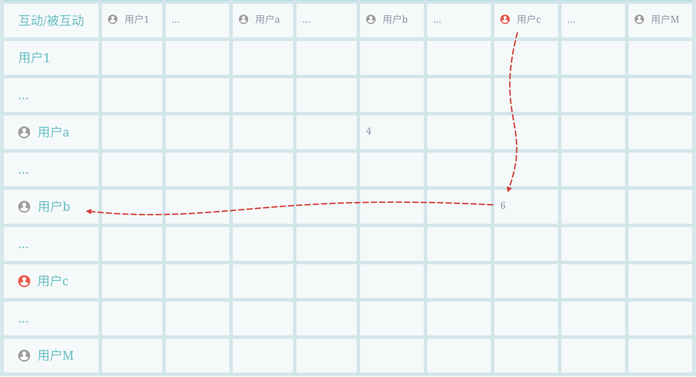
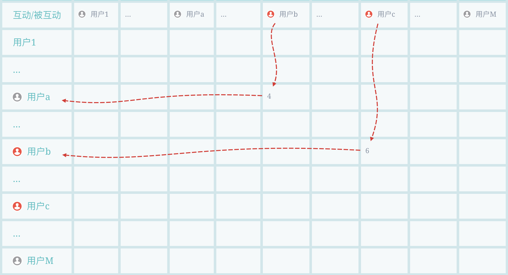
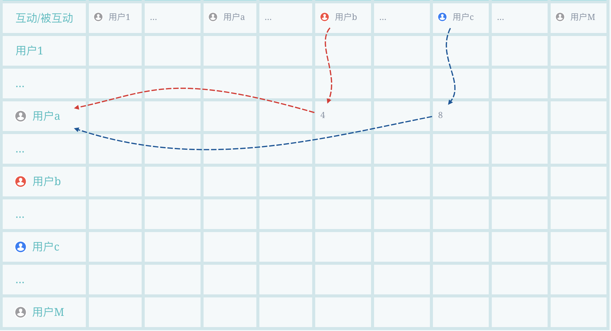
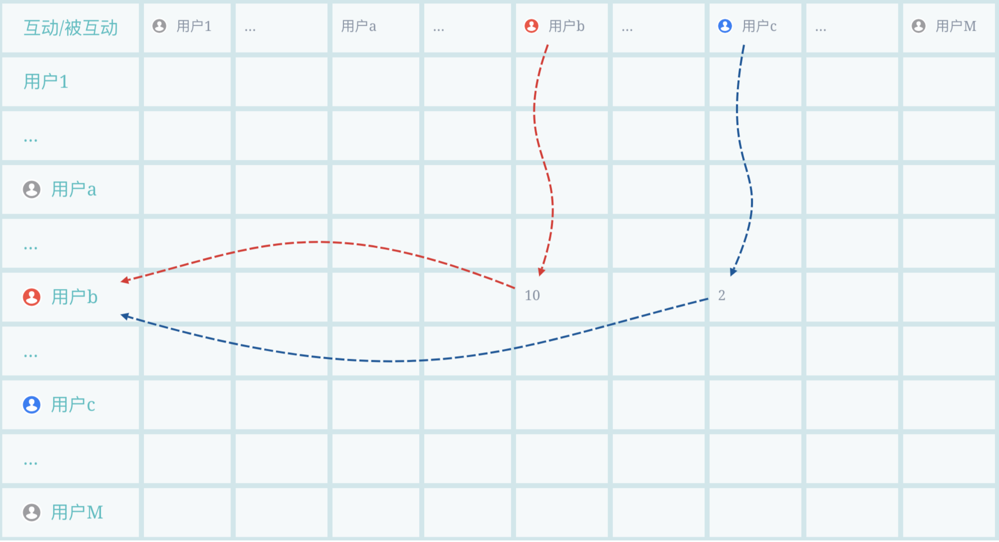
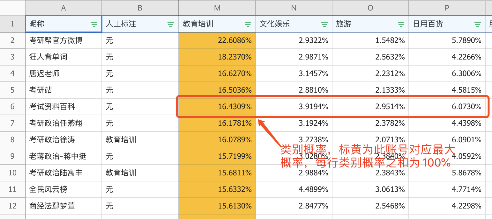
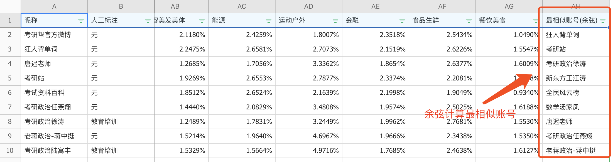

标签体系是各大公司业务系统最重要的基石，无论是user标签还是item标签。可以这样说，评价一个公司技术能力强弱，其构建起的标签体系是最关键的评价指标。这里基于个人经验，借鉴GNetMine以及PageRank算法，阐述自己设计的基于社交图谱的标签传播算法。

标签体系最基础也是最难的两个目标，就是准和全。准即准确率，要求算法打的标签要准确，毕竟标签体系很大一部分是作为其他后续算法的输入，如果后续算法的数据源都不准确，何谈产出好效果；全即覆盖率，要求覆盖一定量数据集，如果数据集很少那人工打标即可，还特别准，然而现实业务场景应用中，数据集非常大，人工只能打标其中一部分，这就要求算法要具有一般性。**这里我利用知识图谱的信息传递性，尤其社交网络中的关系传递，只用约万分之一的已标注样本量给大量待标注数据进行标签标注(约十万已标注账号给数十亿账号打标)，且效果准确，可用于商业推广。**

# 算法概述

基于约十万已标注账号信息，一段时间内账号间社交互动(关注、转发、评论等)信息，输出预测未标注账号属于各类别概率，设计了基于社交网络的多轮迭代标签传播算法。分为损失函数、标签传播、结果汇集三部分解释。总流程如下：
```c
初始化: f(0)=y, Loss(0)=Inf

while Loss变小:
    标签传播: 由第t-1轮结果f(t-1)和社交互动关系R，得到第t轮结果f(t)
    结果汇集: 基于第t轮结果f(t)汇集成p(t)
    损失计算: 基于p(t)计算Loss(t)

输出Loss最小一轮结果p
```

算法基于知识图谱的信息传递性（[相关知识](https://www.yuque.com/angsweet/machine-learning/wang-luo-tu-mo-xing_wang-luo-tu-mo-xing_da-gui-mo-tu-chu-li_heterogeneous-network)之前阐述过，这里我就不展开赘述了），可以想象农田水渠灌溉，标签传播就像水流随着水渠流动，只不过算法中是类别信息按照社交互动行为进行流动，且是多源头的，比如下图，大的几个图标是源头，他们的标签信息会随着和他们进行互动的路径传播出去。这里的多源既是多类别源头(比如下面红绿蓝3个最大的图标各代表1类的源头，共3类)，也指的单类别多源头(假设下面是黑色的，都是一个类别，这个类别有3个信息源)。


<a name="duo-tiao-chuan-bo"></a>

## **多跳传播**
灰色为未知类别，用户b对用户c进行过互动(比如6次转发等)，用户c的类别就会传递给b(左图)。经过上一轮的传递后，用户b从c那里获得了类别信息，用户a对b也进行过互动(比如4次评论等)，c的类别信息就由经b也流向了a，即完成了2 hop传播(右图)。现实网络里肯定存在环，所以会有无穷尽hop传播，我们基于Loss在合适的时刻进行切断。<br />
<a name="kua-lei-yu-zi-chuan-bo"></a>
## **跨类与自传播**
就如我们前面说多源部分说的，可能一个用户(如左图用户a)和多个类别的(用户b、c)进行过互动，那b和c的标签信息都流给a，a也会将他们两个信息也再往后传(左图)。还有自传播(用户b转发10次自己的文章)，已标注另一类别的传播给本类别节点(用户c传播给用户b)等(右图)。<br />
<a name="suan-fa-she-ji"></a>
# 算法设计
<a name="sun-shi-han-shu"></a>
## 损失函数
损失如下公式，由精度损失和泛化损失两部分组成，其中和调节更关注准确还是泛化：

<br />1、精度损失：

- 集合为Ground Truth，即人工标注样本的集合；
- 参数表示第个已标注样本账号的重要程度，比如在微博场景下是此账号的粉丝数等，我们更倾向于将粉丝量大的账号类别预测准；
- 余弦距离即第轮账号的预测向量和其Ground Truth向量的余弦距离，向量每一列对应一个类别，比如分成语数外三类， ，账号实际属于数学类别。

2、泛化损失： 

- 集合为相似账号的集合；
- 参数表示账号和的相似程度，可以使用SimRank，Random Walk，PathSim等等，这里我采用了粉丝重合度，两账号粉丝交集数/两账号粉丝并集数，我们更倾向于关注粉丝重合度高的账号对，物理意义即若两账号粉丝相同，则两账号类别大概率相似；
- 余弦距离第轮账号的预测向量和账号的预测向量的余弦距离。
<a name="biao-qian-chuan-bo"></a>
## 标签传播
具体标签传播过程可以由下面公式表达，第轮结果由第轮结果进行传播加Ground Truth：


1、标签传播：

- 集合为社交互动类型集合，比如，即其中一种互动类型；
- 即互动类型的影响因子，比如微博场景下关注、转发、评论的社交成本是不一样的，转发的少，而评论和关注次之，而大家经常随意点赞，这个因子是调节不同社交互动的融合权重；
- 为账号影响力矩阵，一百万个粉丝的账号和一万个粉丝的账号影响力不同，使用这个矩阵进行调节影响力权重，比如账号的对应影响力权重为其粉丝量；
- 矩阵就是标签传播的路径。以关注关系简单举例，假设社交网络中有个账号节点，行表示关注人，列表示被关注人，矩阵为维，假设账号共关注了、和三个账号，则矩阵中对应账号行，对应、和账号列的值各为；
- 即第轮结果，若个账号分为类，则是一个的矩阵，第行第列即代表账号属于第类的权值，其中第轮初始化，即假设有个已标注账号，的这行对应的所属类别列值为，其他为，剩下的行(待分类账号属于各类权值)全为。

2、加入Ground Truth：

- 每轮结果再加入Ground Truth，为行业及账号权重调节，比如微博场景下，文娱和金融和教育几个类别量级是不一样的，这里做标准化；
- 即Ground Truth的矩阵。
<a name="jie-guo-hui-ji"></a>
## 结果汇集
获得第轮的结果后，根据关系对聚合成对应账号的结果向量：


账号结果通过其粉丝集合求和，然后经过输出函数得到。输出函数任选，比如softmax，数据量太大可以直接计算对应值除以总和得到占比。
<a name="suan-fa-jie-shi"></a>
# 算法解释
**具体实现：**可以看到，算法基于矩阵运算，可以使用GPU加速。当然，直接用Hive也可以实现，矩阵加法用union+sum group by，乘法用inner join，稀疏矩阵里的在数据表里不存在此记录，所以数据量、计算速度也都可以接受。

**标签传播：**算法下一轮结果都由当前轮结果进行标签传播再加Ground Truth ，可以想象为农田水渠灌溉，每轮加Ground Truth就像水源头，标签传播就像水流随着水渠流动，只不过算法中是类别权重按照社交互动行为进行流动。

**多跳传播：**第轮，会进行跳传播，例如时，只有跳传播，已标注账号的信息传播至与其进行过社交互动的账号；当时，已标注账号的信息依旧传播至与其社交互动的账号(跳)，此时上一轮通过跳得到信息的账号，在这一轮将信息传给了与他互动的账号，即已标注账号信息通过跳媒介又将信息传播了出去(跳)...

**Loss表现：**1、对于精度损失(已标注账号和其预估结果)，每个账号的维向量是由其粉丝向量聚合得到，已标注账号的标签传给其粉丝，粉丝又将标签汇集给已标注账号；对于泛化损失(粉丝相同两账号分类应相似)，粉丝重合越高，两账号和越相似，获得的维向量和由粉丝向量聚合得到，所以也会约接近。随着轮数越来越多，标签传播hop增多，噪声干扰会越来越多，会导致Loss上升。所以模型经多轮计算，Loss逐渐下降，待到开始上升时停止迭代，输出Loss最小轮时所生成的结果。

**应用方式：**算法最后得出的是一个维的矩阵，其中是账号数，每个账号对应一行，是类别数，第列的值为属于这个类别的权值。所以，一个账号对应一个可解释的维向量：

- 账号分类，比如进行广告行业分类，一个娱乐搞笑账号投什么行业广告比较好也就知道了 
- 通过计算向量间余弦距离，获得相似账号，进行账号聚类，Lookalike扩充等
- 当然，向量可以作为后续算法的输入，为匹配，点击等等模型提供源数据
- 结果发现会有向量值全的异常账号，查验这些是刷的僵尸号，也可用于甄别异常号
<a name="6toTR"></a>
# 结果展示
<br />
