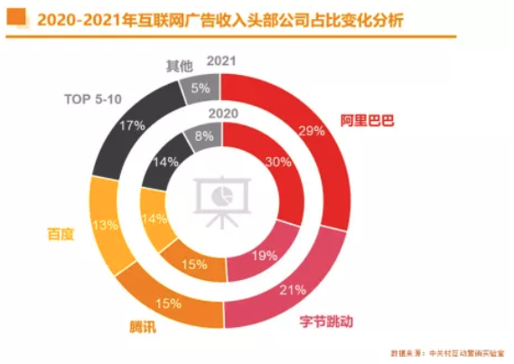

社会及技术的发展推动着信息传播主动权慢慢从企业到用户偏移，最直接的表现就是终端的变化，从电视到电脑再到移动终端，信息媒介的升级变化让互联网更加贴近人的生活，当然广告也接风直上，可以更贴近人们的生活 

# 收入模式
互联网公司根据其核心业务的不同收入也可有多种渠道形式，比如，滴滴收取打车用户服务佣金、美团收取商铺会员费、京东卖出东西后的款项做现金流投资到结算时再交付给供应商等。挣用户的钱，还是挣客户的钱？从To B和To C端维度划分可以如下图。 

# [市场规模](https://www.samr.gov.cn/ggjgs/sjdt/gzdt/202201/t20220125_339370.html)
虽然变现渠道众多，但大部分互联网最主要的方式是会员费与广告营销两种渠道，下图为17年到21年互联网广告规模，可以看到这是个千亿级的市场。2021年是我国互联网广告市场稳中向好，踵事增华之年，在国家政策有效引导与防疫抗疫举措得力的支撑下，克服诸多不确定因素，实现了全社会各行业的稳步复苏。互联网行业受益于内生需求的增长，实现了广告收入5,435亿人民币（不含港澳台地区），同比增长9.32%，增幅较上年减缓了4.53个百分点；互联网营销市场规模约为6,173亿人民币，较上年增长12.36%，广告与营销市场规模合计约为11,608亿元，较上年增长11.01%。为“十四五”良好开局，为实体经济创新发展及消除贫困改善民生构筑了一个关乎10.11亿网民的大平台。 

# [市场划分](https://weibo.com/ttarticle/p/show?id=2309404725248841876165)

## 公司划分
2021年中国互联网广告市场集中度较去年不降反升，TOP10企业的市场份额占比反弹至94.85%，而TOP4企业的市场份额占比则进一步提升至78.2%。TOP3的企业增速均在减缓，受反垄断监管的影响，阿里巴巴的营销业务得到有效规范，广告收入增长进一步放缓；字节跳动增速虽有减缓但市场份额仍进一步扩大，大有迎头赶超的趋势  腾讯的广告收入增长也有所放缓，但稳定在第三的位置；百度广告收入在经历上年下滑后，2021年恢复增长，保持了第四的位置；TOP5-10企业中，京东第二梯队领头羊的位置已受到美团点评的威胁，今年美团点评广告收入大幅增长，收入规模与京东基本持平；快手借短视频广告势头于去年首次挤进榜单前十后，今年继续发力，广告收入规模持续增长，与京东、美团点评同列第三阵营。 

## 行业划分
2021年食品饮料与个护及母婴行业的合计市场占比已从去年的50%提升至今年的62%，并均呈现了大幅度的增长，个护及母婴品类更是交出了58.7%的增长答卷，市场规模于5年来第一次反超食品饮料，成为互联网广告市场第一大品类；受监管影响，房地产品类于五年内首次出现负增长，并且降幅较去年高达47.3%，已跌至第五位；受全球芯片短缺影响，交通行业也出现了13.2%的下滑，收入降至465.3亿元；而网络与通信类收入则一改上年增长放缓的趋势，2021年增幅上扬，收入达到418.99亿元，与交通行业共同组成第二梯队；受宏观政策调控影响，教育培训行业出现断崖式下跌，全年收入下跌69.6%，收入规模也跌回至五年前的水平。 

## 平台划分
电商平台继续占据广告渠道头把交椅，市场占比高达36.75%。2021年电商广告维持了2020年的市场份额；展示类广告出现了近5年来首次6.58%的下降，市场份额也由上年的34%下滑至今年的29%；搜索类广告持续势微，市场占比连续三年下滑至11.9%；由于视频直播市场的持续火爆，视频类广告继续强势增长，市场占比已达20.4%，年增速也较上年进一步提高，达52.68%。  2021年从平台类型收入占比看，电商平台继续占据广告渠道头把交椅，近五年来市场份额持续增长，继续占据市场收入总量的三分之一。强借由视频直播的迅猛发展，视频类平台广告收入持续大幅增长30.28%，市场份额提升至（21.66%），遥遥领先搜索类平台（10.43%）与社交类平台（9.77%），连续第二年成为第二大类别广告平台；搜索类平台连续第三年在广告收入与市场份额两方面出现下滑，但广告收入降幅较上年有所收窄，降幅为3.04%；社交类平台收入跟随整体广告市场的增长步伐，市场份额在近几年一直稳定在9.77% 

# 行业Top公司趋势
   

# Source
[《2021中国互联网广告数据报告》发布](https://www.samr.gov.cn/ggjgs/sjdt/gzdt/202201/t20220125_339370.html) [Sina Visitor System](https://weibo.com/ttarticle/p/show?id=2309404725248841876165) [《2021中国互联网广告数据报告》（完整版）](https://mp.weixin.qq.com/s/-jWlxX8RX_cMSCMMumP_VQ)
