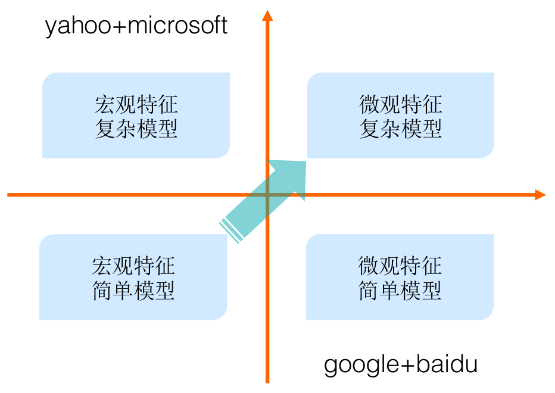
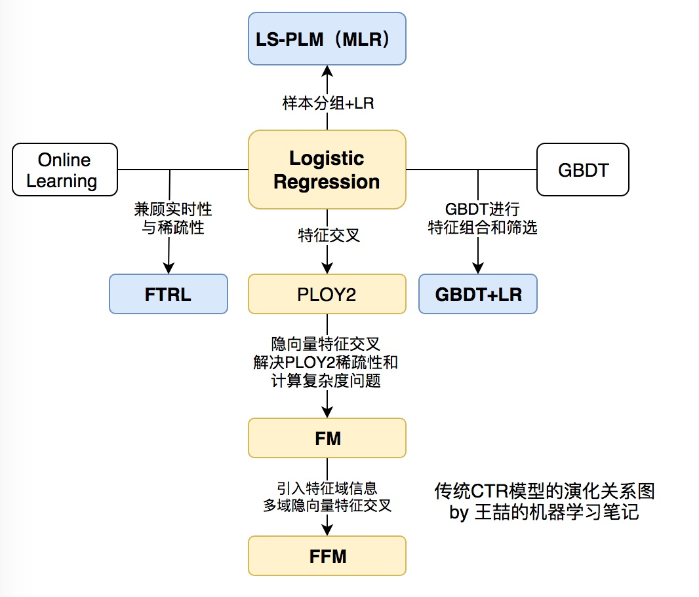
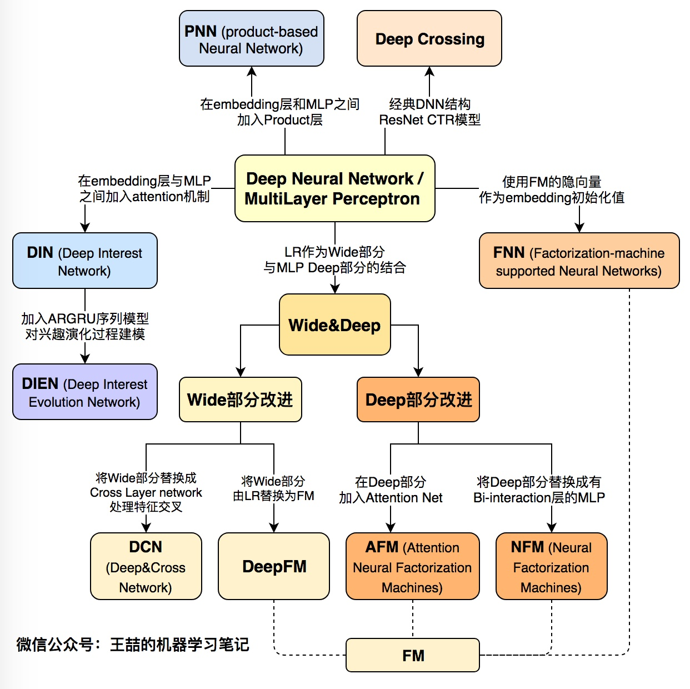

广告技术的核心目标其实可以用一个公式来表达：，其中是用户，是场景，是广告，我们所要做的就是找到这样一个函数，可以让用户在合适的场景下看到适合的广告。

# 技术演化
下图展示里各大公司采用了不同的技术道路，有走宏观特征+复杂模型的Yahoo和Microsoft，也有尝试微观特征+简单模型的Google+Baidu，当然走哪条路决定性因素是各公司的业务，但需要指出的是在2005-2015这十年间，大规模机器学习模型(特指浅层模型)一度统治着CTR预估领域，以G/B两家为代表的”大规模离散特征+特征工程+分布式线性LR模型”解法几乎成为了那个时代的标准解。相关的工作相信读者们耳熟能详，甚至据我所知今天业界的不少团队依然采用这样的技术。随着数据量、计算能力和技术的发展，大家殊途同归，都向着微观特征+复杂模型的方向发展。 

## [浅层模型](https://zhuanlan.zhihu.com/p/61154299)
在互联网永不停歇的增长需求的驱动下，CTR预估模型（以下简称CTR模型）的发展也可谓一日千里，从2010年之前千篇一律的**逻辑回归**（Logistic Regression，LR），进化到**因子分解机**（Factorization Machine，FM）、**梯度提升树**（Gradient Boosting Decision Tree，GBDT），再到2015年之后深度学习的百花齐放，各种模型架构层出不穷。认真的回顾前深度学习时代的CTR模型仍是非常必要的。原因有两点：

1. 即使是深度学习空前流行的今天，**LR、FM等传统CTR模型仍然凭借其可解释性强、轻量级的训练部署要求、便于在线学习等不可替代的优势，拥有大量适用的应用场景**。模型的应用不分新旧贵贱，熟悉每种模型的优缺点，能够灵活运用和改进不同的算法模型是算法工程师的基本要求。
2. **传统CTR模型是深度学习CTR模型的基础**。深度神经网络（Deep Nerual Network，DNN）从一个神经元生发而来，而LR正是单一神经元的经典结构；此外，影响力很大的FNN，DeepFM，NFM等深度学习模型更是与传统的FM模型有着千丝万缕的联系；更不要说各种梯度下降方法的一脉相承。所以说传统CTR模型是深度学习模型的地基和入口。

## [深度模型](https://zhuanlan.zhihu.com/p/63186101)
随着微软的Deep Crossing，Google的Wide&Deep，以及FNN，PNN等一大批优秀的深度学习CTR预估模型在2016年被提出，**计算广告和推荐系统领域全面进入了深度学习时代**，时至今日，深度学习CTR模型已经成为广告和推荐领域毫无疑问的主流。在进入深度学习时代之后，CTR模型不仅在表达能力、模型效果上有了质的提升，而且大量借鉴并融合了深度学习在图像、语音以及自然语言处理方向的成果，在模型结构上进行了快速的演化。 

# Source
[镶嵌在互联网技术上的明珠：漫谈深度学习时代点击率预估技术进展](https://zhuanlan.zhihu.com/p/54822778) [前深度学习时代CTR预估模型的演化之路](https://zhuanlan.zhihu.com/p/61154299) [谷歌、阿里、微软等10大深度学习CTR模型最全演化图谱【推荐、广告、搜索领域】](https://zhuanlan.zhihu.com/p/63186101) [深度学习前沿笔记](https://zhuanlan.zhihu.com/c_188941548) [阿里妈妈展示广告预估校准技术演进之路](https://mp.weixin.qq.com/s?__biz=Mzg3MDYxODE2Ng==&mid=2247485008&idx=2&sn=e96a0f9064970e778e7d4d95b597debf&chksm=ce8a4309f9fdca1fc5794a103e8eaf90dff0b27704be7777040f2e28d109359512cee69f6cfd&scene=21#wechat_redirect) [你真的懂点击率（CTR）建模吗？](https://mp.weixin.qq.com/s?__biz=Mzg3MDYxODE2Ng==&mid=2247484017&idx=2&sn=0fdd3f49b1c5c101486a2318986473d5&chksm=ce8a4728f9fdce3e1803ef08da66f18892bd86c8f1a9258c49a4f4fd97ac14ed6008c15c6304&scene=21#wechat_redirect)
