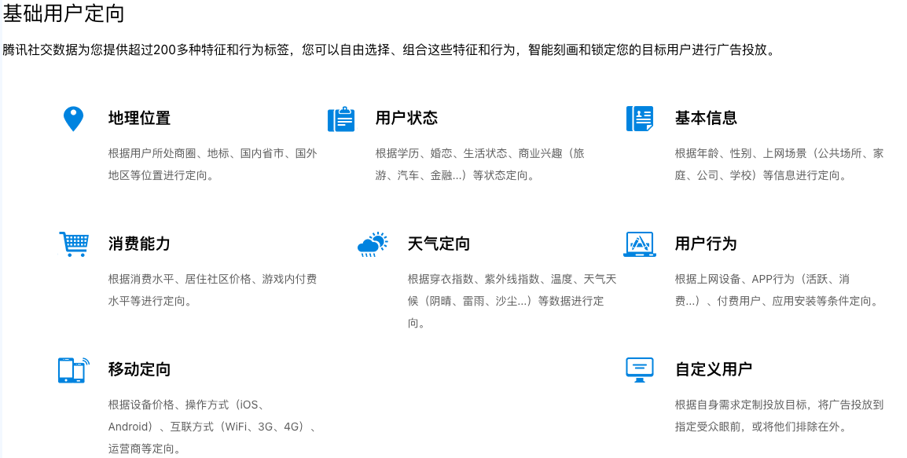

用户定向是广告投放里最核心的一环，给用户打上相应的标签，广告主对自己的目标客户人群都会有基本的人群画像，直接选择符合其客户画像的标签进行投放是最简单直接的投放方式；并且各种定向标签又是广告各种模型，比如ctr/cvr以及成本控制等模型的基础特征或基础输入数据，所以说是极其重要且基础的一环。

# 定向分类
以下图的腾讯社交基础用户定向分类举例(各平台分类差不多，也方便广告主多平台投放时直接计划迁移) 

# Source
[广告定向投放_腾讯广告定向方式有哪些-腾讯社交广告营销平台](https://e.qq.com/targeting/)
