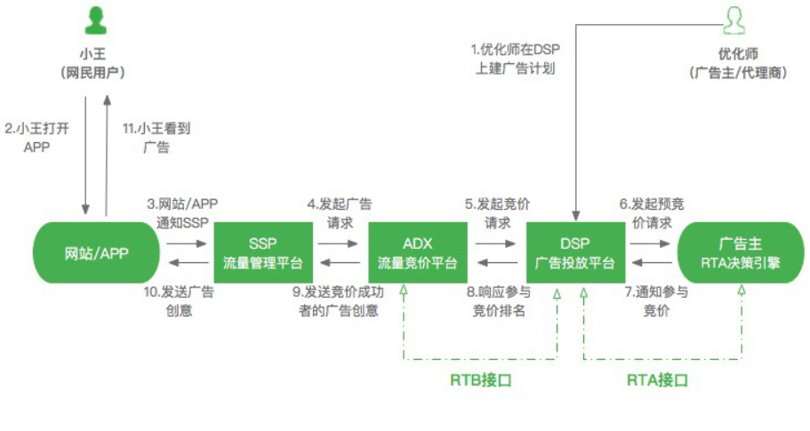
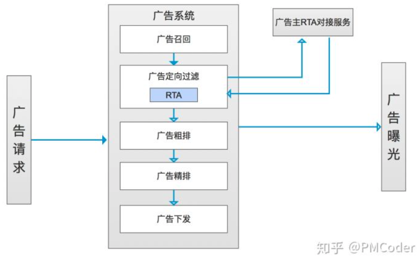
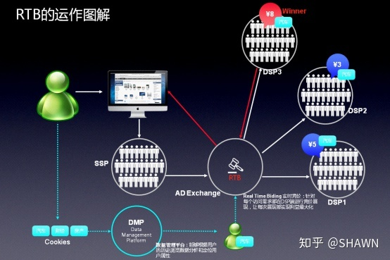

# RTA
RTA 即Realtime API的简称，用于满足广告主实时个性化的投放需求。RTA 将直投的广告主的流量选择权交给广告主，通常在定向环节中将用户身份的识别的请求发送给广告主，进行用户的筛选，让广告主在广告曝光前进行投放策略的判断，满足“拉新”“拉活”等个性化需求。RTA 本质来说，是解决广告系统平台无法实时个性化定向的一个需求。

RTA 是一种实时的广告程序接口，通过发挥媒体与广告主双方的数据、模型能力，实现实时的广告优选；RTA 是一种接口技术，更是一种策略导向的投放能力。  为什么会有RTA？我们必须要从需求场景进行入手。任何脱离需求场景而讨论技术方案的行为都是耍流氓。首先将结论同步下，RTA的产生这里很大的一部分原因主要是广告平台侧数据的缺失而无法解决实时的定向而导致的。比如有这么一个广告主，他希望针对已安装不活跃的用户进行拉活，但是绝大部分的广告平台（排除厂商拥有系统权限之外）都只知道应用是否安装的状态，但是并无法知道应用到底有没有活跃，并且活跃用户到底怎么定义的也是只有广告主才能明确，比如有些定义为一周内曾打开过APP且使用了某个功能的才能叫活跃，那么这个数据就只有广告主有，广告平台是无法提供这样的一种定向的。如果直接使用广告平台的投放能力进行投放定向，是无法满足这样的一种需求的，而使用上传人群包，又无法解决实时用户数据更新的问题（也有些广告主不想将人群包信息同步到广告平台）。所以必须要以实时接口响应的方式进行定向或者出价。这样RTA就产生了。

RTA解决的是个性化定向的问题，拥有实时化以及数据安全这些特点。解决的是以下几个个场景的问题：

1.  广告主具备一方数据，但是投放的目标人群实时变动，通过平台的定向标签能力无法实现精准定向又或者通过用户包无法实现实时定向更新的这样的一种情况，需要结合双方的数据能力共同提升广告主投放效果的广告主。所以这里必须要求广告主有一定的用户甄别和筛选能力。
2.  出于数据安全或者价值的考虑，不愿意将转化数据回传给广告平台的广告主。比如金融公司投放金融广告的时候，需要将无效征信的用户去除，但是由于无效征信的属于高度敏感的数据，广告平台其实是没有这个数据的，金融广告公司出于数据安全的考虑，无法将数据传到广告平台上。所以金融公司投放广告的时候需要经过RTA进行用户的进一步的筛选。
3. 个性化买量需求的广告主。针对不同的用户选择不同的投放策略和方案的广告主。比如，不同的公司的增长团队，对于纯新增用户，安装卸载，安装不活跃用户有不同的投放策略。很多精细化的数据逻辑只有广告主有，这个时候可以通过RTA进行广告的投放。

RTA当前主要是一种定向的能力，针对一些大型的媒体广告平台，比如腾讯，头条或者百度的流量，每次都对广告主进行RTA请求的话势必会导致广告主服务器QPS的量很大，压力很有可能扛不住。那么，这个时候可以进行缓存的优化处理，即对广告主已经进行“识别”或者“标记”的用户进行缓存或者记录，下次无需再请求。随着数据量级积累越来越多，其实广告平台其实就能掌握更多的广告主用户侧的数据特征，从而减少RTA的次数。同时这个数据的积累对于广告平台的好处也是显而易见的。

# RTB
Real Time Bidding（即时竞价）运作方式：当一个用户打开某个网页，这个网页中的广告位信息通过SSP（Supply Side Platform）供应方平台提供给广告交易平台（Ad Exchange），同时，这个用户所用的浏览器获得的Cookies的标签进入DMP（Data Management Platform）管理平台进行分析，将分析所得到的用户属性的标签也传送给Ad Exchange；接下来，Ad Exchange 将这些信息向所有接入到交易平台的广告主或者广告代理商的DSP（Demand Side Platform）需求方平台发出指令，DSP开始向Ad Exchange实时出价，进入RTB模式；经过竞价，用户的属性标签一致，且出价最高的DSP就获得了这次展示广告的机会，广告自动返回到用户的浏览器所打开的这个网页中——这一系列的过程非常快，通常是在80－100毫秒中完成的。  RTB广告的特点在于，广告平台（即供应方平台：互联网广告提供者 SSP）售卖的不仅仅是传统意义上的广告位了，而是访问这个广告位的具体用户，这个用户会有自己的兴趣爱好，广告如果能够投其所好就能产生最大的收益。这样的用户在互联网海洋里可是稀缺资源，他完全有魅力让广告主来竞相竞价获得在用户面前展现自己的机会，RTB广告放大了网络广告的指向性和精准度，并将网络广告的作用发挥到一个崭新的水平，使需求方的效益最大化。

# Source
[RTA 广告产品能力详解](https://zhuanlan.zhihu.com/p/125464058) [什么是RTB广告？](https://zhuanlan.zhihu.com/p/46829735)
