2020年中国互联网广告市场规模达5292亿元，根据秒针《2020中国异常流量报告》显示，异常流量占比约8.6%。作为全球顶级广告平台，阿里妈妈坐拥价值逾千亿的商业流量，是黑灰产觊觎的主要目标。风控团队的核心工作之一，就是甄别其中作弊、低质量的部分，保护广告主和平台的利益。

# 广告风控流程
下图是广告主投放内容与风控团队、下游业务团队的简易交互流程。广告素材通过内容风控审核后，即可以在线上进行展示。在展示期间，广告主可能会主动作弊、也可能受到其他广告主攻击。风控团队需要对无效流量进行过滤，保护广告主的利益，维护健康的广告投放环境。本文重点介绍在线展示期间，流量、淘客交易场景下的业务风险与算法体系。详细的解决方案在未来的文章中逐一介绍。 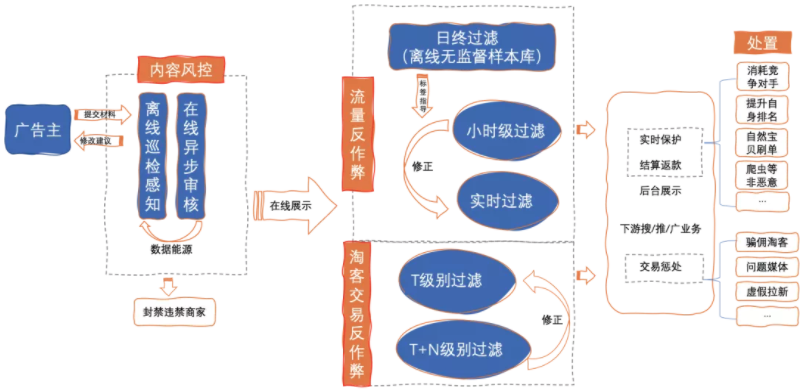

# 无效流量
流量反作弊系统的核心能力就是清洗、过滤无效流量。但是无效流量并不等价于作弊流量。我们将这部分流量的定义分为2个层面：

1. 低质量：重复点击计费策略、频率控制策略、剧烈波动策略等；
2. 作弊：转化效果概率为0的流量；

作弊流量转化期望概率一定为0，比如爬虫产生的点击流量。但后续实际频率为0的流量不一定是作弊。比如新商品累计1万点击后仍没有转化，只能说频率为0。不能直接断定为作弊流量。

常见的无效流量包括：1）消耗竞争对手；2）提升自身排名；3）自然宝贝刷单误伤广告主；4）非恶意无效流量。如下图所示，一名诚信投放的广告主，可能受到多种维度的影响 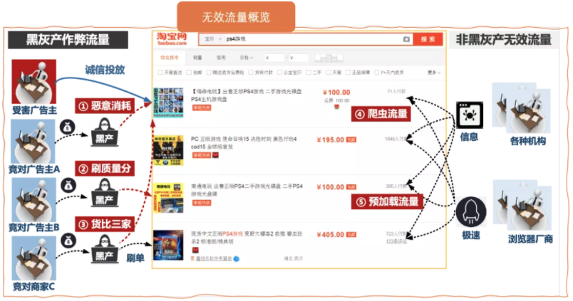

## 消耗竞争对手
广告主在设置投放策略的时候，通常有预算限制。一些广告主，通过构造虚假流量，攻击其他广告主，消耗预算致使广告下架。如原定计划可以投放7日的广告内容，在第2天突然被完全消耗。这种情况下，很容易引起受害广告主的投诉，影响恶劣。 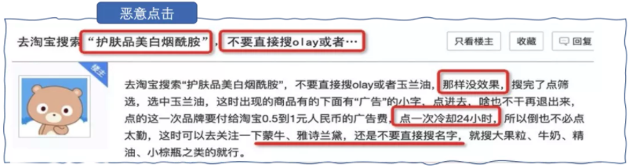

## 提升自身排名
广告排名由出价和质量评分决定。一些广告主会雇佣黑产刷单，提高广告的转化率。通过低成本获得靠前的广告排名。这些作弊利益驱动属性也很强，比较容易被平台和相关广告主感知到。对平台的影响也较为恶劣。

## 自然宝贝刷单
一些广告主通过雇佣黑产提高店铺的成交数、好评数、加购收藏数等。刷手为了更好地隐藏自己，往往会装作“货比三家”，查看多个宝贝信息。该过程偶尔会误伤了广告展示宝贝。这种作弊对广告生态的影响比较弱。感知程度会偏低一些。此外，人工刷手往往伪装的更好，在流量甄别上难度比较大。 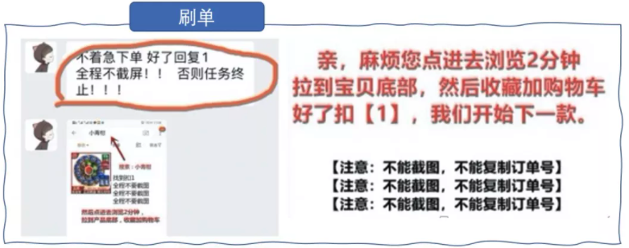

## 非恶意无效流量
除上述带有恶意的虚假流量。还有非恶意、非薅羊毛的无效流量需要被过滤。比如一些浏览器在打开淘宝首页时，会预加载所有的宝贝链接后续跳转网页。显然这些是无效流量。又比如，爬虫或浏览器劫持而产生的流量，不应该计入广告主的费用中。

## 淘客交易作弊
淘宝联盟是阿里妈妈平台给淘宝客推广者搭建的推广平台，在淘宝联盟后台可以完成取链、推广和提现等一系列操作。而淘客交易作弊，不满足作弊流量转化概率为0的假设。根据计费方式不同，常见的2种作弊形式为：1）流量劫持；2）黑灰产淘客拉新。

### 流量劫持
CPS计费下的主要作弊手法是流量劫持。常见的流量劫持有2种。第一种，是篡改记录用户流量来源，将其他淘宝客的拉新流量据为己有。广告主会明显感知到自然流量变少，拉新流量增加。第二种，是修改用户跳转链接，使得用户跳转到自己的宝贝页面。会导致用户在不知情的情况下购买了另一家店铺的商品。此时商家会在销量层面有一定感知。 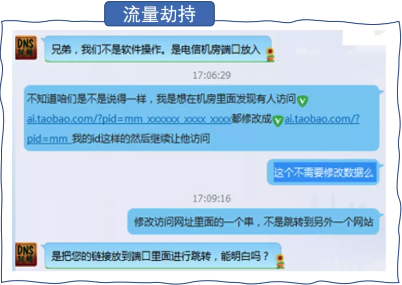

### 黑灰产淘客拉新
CPA计费下的主要问题是虚假地址。常见的CPA通常发生在产品拉新中，如用户注册、用户下单...等。在一些淘宝客拉新场景中，需要拉新用户完成注册、下单等一系列流程。此时一些淘宝客通过批量注册，下单廉价商品来赚取拉新差价。

除了虚拟类目以外，实体商品需要填写明确的收获地址。由于大量相同地址容易引起商家警觉，真实非本人地址可能引起快递机构的投诉，影响其后续结算。所以淘宝客往往会构造一些半真半假的虚假地址，用于收货。因此虚假地址的识别是该场景下的重点抓手之一。

# 算法实践
相比于其他正向业务，流量反作弊对于精度的要求尤其高。多过滤导致平台收益减少、少过滤引起广告主投诉，破坏投放生态。而且业务场景对实时返款的诉求越来越强烈，同时作弊对抗升级，从集中式、大规模转向分布式、稀疏化攻击，识别难度增大。亟需基于高维异常检查的新系统能力。为此，我们建立了集异常主动感知、人工洞察分析、自动处置过滤、客观评价高效循环一体的风控系统。 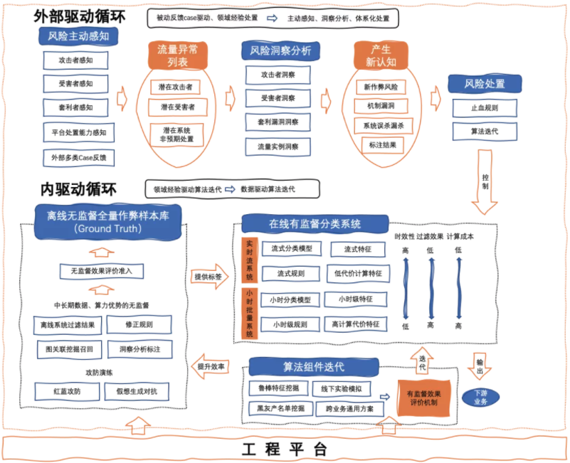

## 感知
在历史的风控体系中，往往是Case驱动的。即遇到问题通过滞后的算法或策略迭代来覆盖风险。为了提前发现问题，尽可能减少投诉，净化投放环境，我们引入了感知。通过感知捕捉与常见分布不同的数据，输出异常列表。

我们将可感知异常流量分为：1）受害者可感知；2）平台可感知；3）实战攻防可感知；4）假想攻防可感知；5）算法挖掘可感知。

感知是重召回的，但并不是单纯为了更多地召回现有风险。它设计的核心是去感知所有的“异常”。以2020年初为例，由于骑行政策的调整，售卖头盔商家的访问量显著偏高，连带着必然影响到点击率、转化率等一系列指标。这些异常是商铺可感知的，需要被我们捕捉到。但并不属于作弊流量。所以不会被流量反作弊系统所过滤。 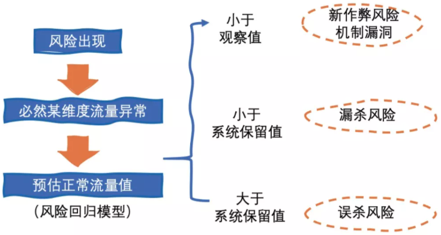 那感知究竟如何来做呢？以“点击流量反作弊”来说，作弊一定会导致点击量增加。如果可以预估出一个商品每天的点击数量。则超出该值的点击一定为作弊。因此流量反作弊感知的核心之一，就是如何在大盘召回率未知的情况下，精准预估正常流量值。这部分内容在后续文章中进行介绍。

## 洞察
为了确认感知到的异常流量哪些属于作弊，分析人员需要进行洞察分析。“洞察 ”的目的是从“感知”到的异常中将风险抽离出来，进而发现新的风险模式。我们将洞察分为：1）受害者洞察；2）攻击者洞察；3）套利漏洞洞察；4）流量实例洞察。

传统洞察需要人工挑选可疑特征（如停留时长、注册时长），并与大盘好样本进行比较。如下图。这就对领域经验有强依赖。而领域专家毕竟是少数。并且随着作弊越发高级，单一维度或少量维度下逐渐难以发现作弊。为此，我们引入了高维数据下的可视化洞察分析技术。 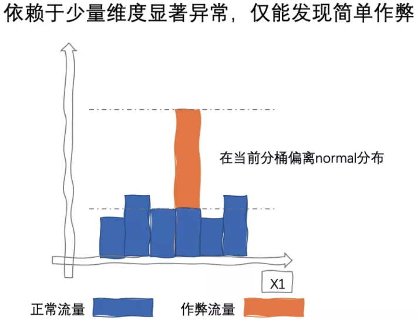 在洞察环节，首先需要对样本进行高度抽象表示。如何在高维数据中选择合适的子空间投影，是非常具有挑战性的课题。后续文章会展开介绍。确定合适的子空间后，除了和大盘比较，我们还引入了时间维度的分布同比，如下图所示。对于分布稳定的某个广告，3月6日降维图中突然出现明显不同的一簇（红圈内），很可能是新的异常模式。（图中“样本库”指最终被识别为作弊的流量，在下节进行介绍） 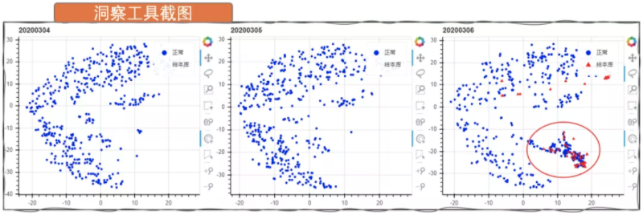 洞察的难点在于，如何减轻未召回的作弊对正常分布的污染。比如上图中蓝色线条内部分可能也存在作弊，这时通过同比就无法发现异常。如何跳出既有认知去召回未知异常模式，以及非常棘手的冷启动问题，这些都是后续文章的重点内容。

## 处置
处置，指对风险进行处置。对于不同的风险实体、风险类型，会使用不同的处置方法。

### 流量反作弊的处置
传统的算法迭代模式，是根据洞察分析的结果，指导规则、统计模型为主的无监督过滤系统。对领域经验比较依赖，而且效率低下、难以形成沉淀。因此，对于流量反作弊的处置，我们部署了实时流式、小时批处理双重防线。其逻辑如下图所示。 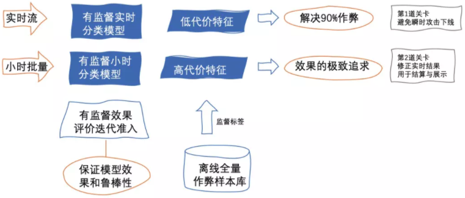 在线实时过滤系统，综合了无监督、半监督的特征工程，以及监督的集成（Ensemble）异常检测器。相比于单条策略的独立决策，集成的容错性更高（召回能力下降，适用于精度高的场景）。例如，PC端反作弊策略依赖于网页采集的前端行为、鼠标点击行为等，当数据采集出错时，过渡依赖某一策略将导致大面积误差。

同时，我们会尽可能使用更触及作弊本质、更具有鲁棒性的特征。和正向业务不同，我们不会在特征设计层面，过分聚焦于正样本的区分度。比如绝大部分爬虫流量都是PC端带来的，“是否是PC”就是一个极强的特征。但一旦这种作弊没有继续攻击，模型的效果就大打折扣。因此更多会使用各个维度上计算与Normal分布的偏差、到Normal簇的距离...等。

实时过滤系统基本可以解决90%的问题。为了更好地拟合高级作弊，我们又引入了小时级别过滤系统，使用开销更大的特征与更复杂的模型。而且广告结算支持事后返款，可以使用小时级结果对实时流模型进行修正，用于结算与展示。当然，处置能力最终收敛于实时流过滤系统，会是我们更长期的追求。

此外，在线实时过滤系统可以让新同学快速上手迭代其中的组件，将不同同学的产出解耦，更客观的评价业务贡献。

### 淘客交易反作弊的处置
对于过滤系统判定作弊的淘客，我们首先冻结其佣金。搜集证据后下达处罚结果。并通过“预估佣金”、“异常特征”来对待处罚淘客进行分级处置。 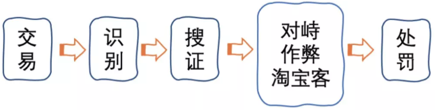 此外，传统的处罚机制为月结，从媒体开始作弊到下达处罚有一定延迟。一方面不利于及时管控风险，另一方面会导致非主观恶意作弊淘客的强烈反弹，为提升管控的时效，减少淘客的损失，同时提升用户体验，我们在原有的月结机制基础上，增加周/天的处罚机制。

## 评价
对于整个流量反作弊系统，我们有4部分需要评价：1）在线有监督精度；2）在线有监督召回；3）离线无监督精度；4）离线无监督召回。因为没有Ground Truth，为了客观评价在线有监督过滤系统的精度与召回，我们建立了离线无监督样本库。使用离线无监督样本库的最终结果，作为在线有监督系统的Groud Truth，就可以评估其分类效果。但也引入了后面2部分无监督评价问题。

### 有监督过滤系统的评价
在线与离线2者的关系如下图所示。基于纯无监督的挖掘体系，我们的底线是消灭3.2.1中提到的5种可感知异常流量中的作弊流量，终局则是消灭不可感知的作弊流量。通过天级别的事后信息引入，以无监督的方式对线上实时系统过滤结果进行修正，并将标签用于后续在线监督系统学习。 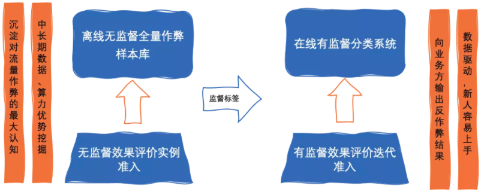 基于现有标签的AUC、KS、MAX-F1...等指标，会过分高估风控模型效果。例如，实时模型的AUC很容易高于0.99。然而这其中绝大多数的样本都来自于简单的爬虫、或傻瓜式疯狂点击，如下图离散分布的红点。在更高级的作弊上AUC可能不足0.8，如下图红圈中的样本。为了更客观地评价模型，我们引入了“样本库分级”，将“简单作弊”与“高级作弊”区分开。并通过结构化采样构造封闭评测集，指导模型迭代。 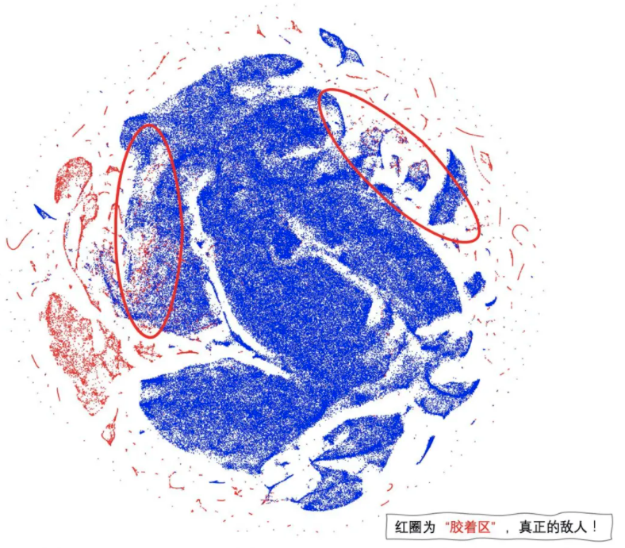

### 无监督精准评价
无监督系统的精准与召回评价一直是业内的难题。传统的评价方法是通过数据抽样，由专家进行标注进行评估。效率低下且非常主观。为此我们借助淘系生态数据，为无监督系统引入了自动化评价体系。基于无效流量转化概率为0的假设，通过统计推断，得到模型在指定置信度下的精度指数下限。基于区间估计的精度推断方法，在后续专题文章中进行介绍。

### 无监督召回评价
真实环境下的召回评价，是难以定量的。除了大盘抽样巡检外，由于引入了完备的感知、洞察体系。将所有的异常流量，均归纳至一个风险池。无论何时有需要对流量进行处置（临时止血或迭代模型），我们都可以迅速定位到问题根源。于是将安全感最大化。

# Source
[阿里妈妈流量反作弊算法实践](https://mp.weixin.qq.com/s?__biz=Mzg3MDYxODE2Ng==&mid=2247484728&idx=1&sn=3305a981f34fe30e2464c627f3842ec8&chksm=ce8a4061f9fdc977cb18acf91d212352a26d9f060dbae6ead52514102e95b9e31cd32523e564&scene=21#wechat_redirect)
