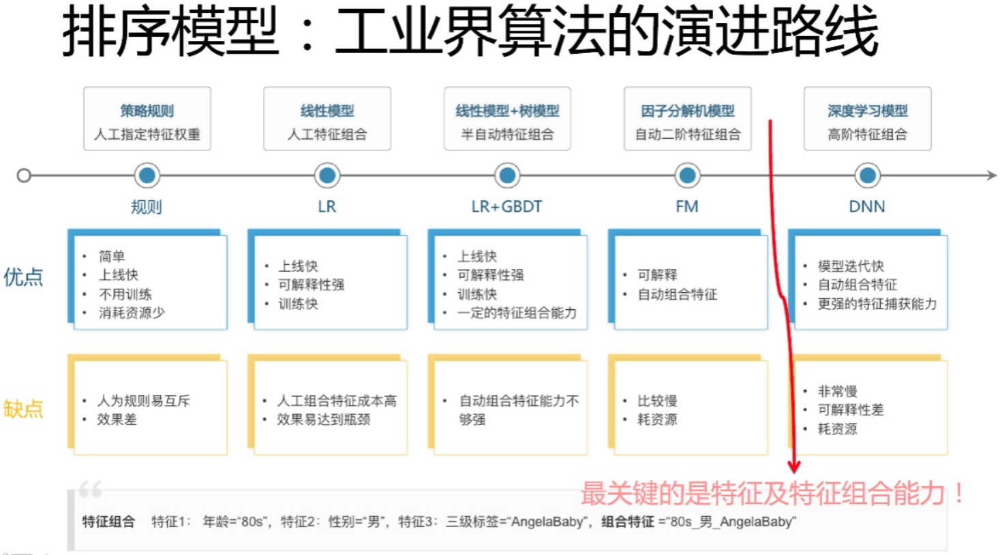
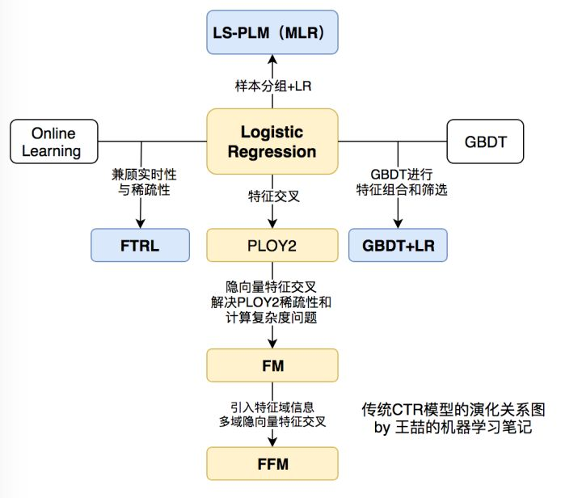
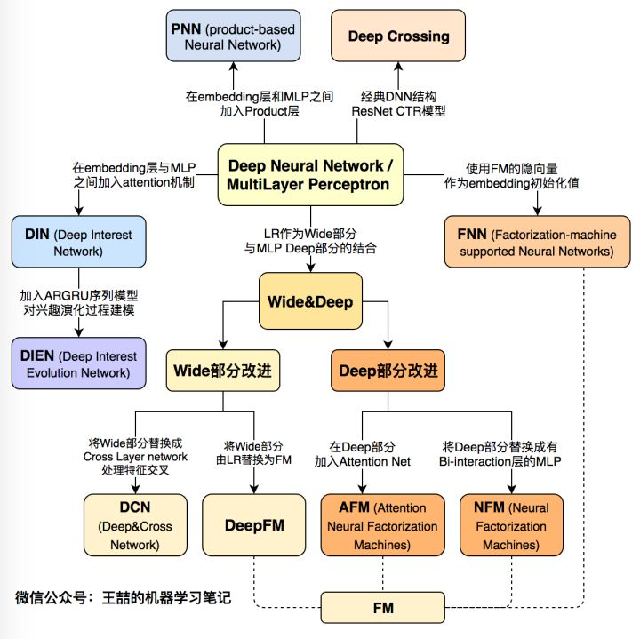

# 演进路线
CTR模型、推荐模型发展的历史很久了，举个例子，百度部署广告系统，同时也部署了CTR的预估系统，到目前为止应该有十几到二十年的经验了。那么我们要归纳一下，公司做推荐的话，模型是按照一个什么样的轨迹发展的。下面PPT展示了这个发展过程。  最早的是规则。什么叫规则？这个规则可能和你想的规则不太一样，比如说给用户推荐最热门的内容，这是一种规则，此外还可以添加很多其他的规则。规则的好处是什么？特别简单，如果想通过一个规则去做推荐，三天就能上线，效果也不会特别差，训练速度快，而且还可能不需要有监督地去训练。但是如果后来的规则越来越多的话，问题就出现了，它们会相互冲突，系统的综合效果，很难往上提升，因为对于系统来说，很难有个明确的优化目标，这是问题所在。

在早期的规则推荐之后，业内一般会用LR，也就是逻辑回归。LR之后，一般就是LR加GBDT。所有的CTR模型，它的核心就是有效特征的选择，以及有效的特征组合的发现和利用。所以，怎么有效解决特征组合的问题，是个引领技术发展的纲领，CTR或者排序模型的发展路径就按照这个方向发展。

LR的特性是可以人工做特征组合，但是人工做特征组合有个问题：需要投入相当大的人力才可以做好。那么GBDT相对LR来比的话，有什么好处？GBDT可以**半自动化**地做一些特征组合，于是LR后面大家就用LR+GBDT模型，能够半自动地做特征组合了，不完全依赖人工。

再往后发展就是FM。FM跟LR+GBDT区别又是什么？它可以**全自动化**地做特征组合。那么从特征组合的角度讲，又有什么新的特点呢？很简单，我们用FM的时候，因为一般因为计算量的问题，只做二阶特征组合。那么什么叫二阶特征组合？很好理解，举个例子，比如两个特征，一个特征是性别，假设“性别=女”，另外一个特征是时间，假设“时间=双十一”，这两个特征如果组合到一起，你会发现是一个非常强的指示，是用户会不会买东西的一个特征，这就叫二阶组合特征，因为有两个单特征进行组合。

再往后，也就是现在这个阶段，大家都在讲DNN排序模型。那么DNN相对FM有什么好处？除了一阶和二阶特征外，它可以捕获三阶特征、四阶特征、五阶特征等更高阶的特征组合； FM一般来说很难捕获高阶的特征，DNN典型的特点就是可以捕获更高阶的特征。按照这个路线往后捋，你要把握核心的一点是：特征组合自动化，包括更高阶的特征怎么融合进去，这是CTR模型进化的总体方向。

# 传统模型

# 深度模型

# Source
[FFM及DeepFFM模型在推荐系统的探索](https://zhuanlan.zhihu.com/p/67795161) [前深度学习时代CTR预估模型的演化之路](https://zhuanlan.zhihu.com/p/61154299) [谷歌、阿里、微软等10大深度学习CTR模型最全演化图谱【推荐、广告、搜索领域】](https://zhuanlan.zhihu.com/p/63186101)
