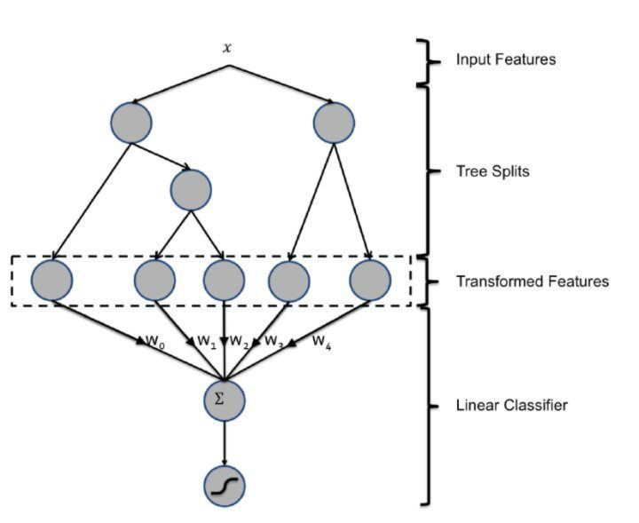
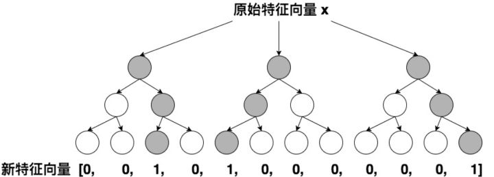

LR模型的流行是有三方面原因的：

1. 数学形式和含义上的支撑
2. 人类的直觉和可解释性的原因
3. 三是工程化的需要

# 数学支撑
逻辑回归作为广义线性模型的一种，它的假设是因变量y服从伯努利分布。那么在点击率预估这个问题上，“点击”这个事件是否发生就是模型的因变量。而用户是否点击广告这个问题是一个经典的掷偏心硬币问题，因此CTR模型的因变量显然应该服从伯努利分布。所以采用LR作为CTR 模型是符合“点击”这一事件的物理意义的。

与之相比较，线性回归（Linear Regression）作为广义线性模型的另一个特例，其假设是因变量服从高斯分布，这明显不是点击这类二分类问题的数学假设。

在了解LR的数学理论基础后，其数学形式就不再是空中楼阁了，具体的形式如下：

其中是输入向量，是我们要学习的参数向量。结合CTR模型的问题来说，就是输入的特征向量，就是我们最终希望得到的点击率。

# 可解释性
直观来讲，LR模型目标函数的形式就是各特征的加权和，再施以sigmoid函数。忽略其数学基础（虽然这是其模型成立的本质支撑），仅靠人类的直觉认知也可以一定程度上得出使用LR作为CTR模型的合理性。

使用各特征的加权和是为了综合不同特征对CTR的影响，而由于不同特征的重要程度不一样，所以为不同特征指定不同的权重来代表不同特征的重要程度。最后要套上sigmoid函数，正是希望其值能够映射到0-1之间，使其符合CTR的物理意义。

LR如此符合人类的直觉认知显然有其他的好处，就是模型具有极强的可解释性，算法工程师们可以轻易的解释哪些特征比较重要，在CTR模型的预测有偏差的时候，也可以轻易找到哪些因素影响了最后的结果，如果你有跟运营、产品一起工作的经验的话，更会知道可解释性强是一个模型多么优秀的“品质”。

# 工程需要
在互联网公司每天动辄TB级别的数据面前，模型的训练开销就异常重要了。在GPU尚未流行开来的2012年之前，LR模型也凭借其易于并行化、模型简单、训练开销小等特点占据着工程领域的主流。囿于工程团队的限制，即使其他复杂模型的效果有所提升，在没有明显打败LR之前，公司也不会贸然加大计算资源的投入升级CTR模型，这是LR持续流行的另一重要原因。

# LR+GBDT
2014年，Facebook提出了一种利用GBDT自动进行特征筛选和组合，进而生成新的离散特征向量，再把该特征向量当作LR模型输入，预估CTR的模型结构。  需要强调的是，用GBDT构建特征工程，和利用LR预估CTR两步是独立训练的。所以自然不存在如何将LR的梯度回传到GBDT这类复杂的问题，而利用LR预估CTR的过程前面已经有所介绍，在此不再赘述，下面着重讲解如何利用GBDT构建新的特征向量。

大家知道，GBDT是由多棵回归树组成的树林，后一棵树利用前面树林的结果与真实结果的残差做为拟合目标。每棵树生成的过程是一棵标准的回归树生成过程，因此每个节点的分裂是一个自然的特征选择的过程，而多层节点的结构自然进行了有效的特征组合，也就非常高效的解决了过去非常棘手的特征选择和特征组合的问题。

利用训练集训练好GBDT模型之后，就可以利用该模型完成从原始特征向量到新的离散型特征向量的转化。具体过程是这样的，一个训练样本在输入GBDT的某一子树后，会根据每个节点的规则最终落入某一叶子节点，那么我们把该叶子节点置为1，其他叶子节点置为0，所有叶子节点组成的向量即形成了该棵树的特征向量，把GBDT所有子树的特征向量连接起来，即形成了后续LR输入的特征向量。  举例来说，如上图所示，GBDT由三颗子树构成，每个子树有4个叶子节点，一个训练样本进来后，先后落入“子树1”的第3个叶节点中，那么特征向量就是[0,0,1,0]，“子树2”的第1个叶节点，特征向量为[1,0,0,0]，“子树3”的第4个叶节点，特征向量为[0,0,0,1]，最后连接所有特征向量，形成最终的特征向量[0,0,1,0,1,0,0,0,0,0,0,1]。

由于决策树的结构特点，事实上，决策树的深度就决定了特征交叉的维度。如果决策树的深度为4，通过三次节点分裂，最终的叶节点实际上是进行了3阶特征组合后的结果，如此强的特征组合能力显然是FM系的模型不具备的。但由于GBDT容易产生过拟合，以及GBDT这种特征转换方式实际上丢失了大量特征的数值信息，因此我们不能简单说GBDT由于特征交叉的能力更强，效果就比FFM好，在模型的选择和调试上，永远都是多种因素综合作用的结果。

GBDT+LR比FM重要的意义在于，**它大大推进了特征工程模型化这一重要趋势**，某种意义上来说，之后深度学习的各类网络结构，以及embedding技术的应用，都是这一趋势的延续。

# Source
[前深度学习时代CTR预估模型的演化之路](https://zhuanlan.zhihu.com/p/61154299)
