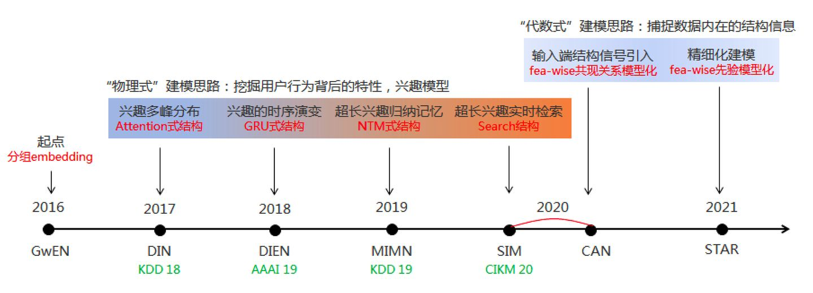
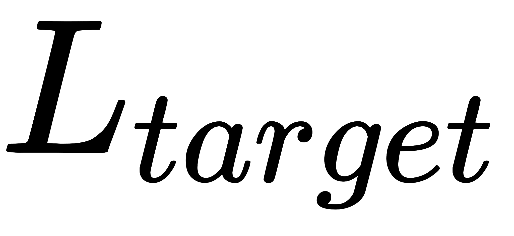
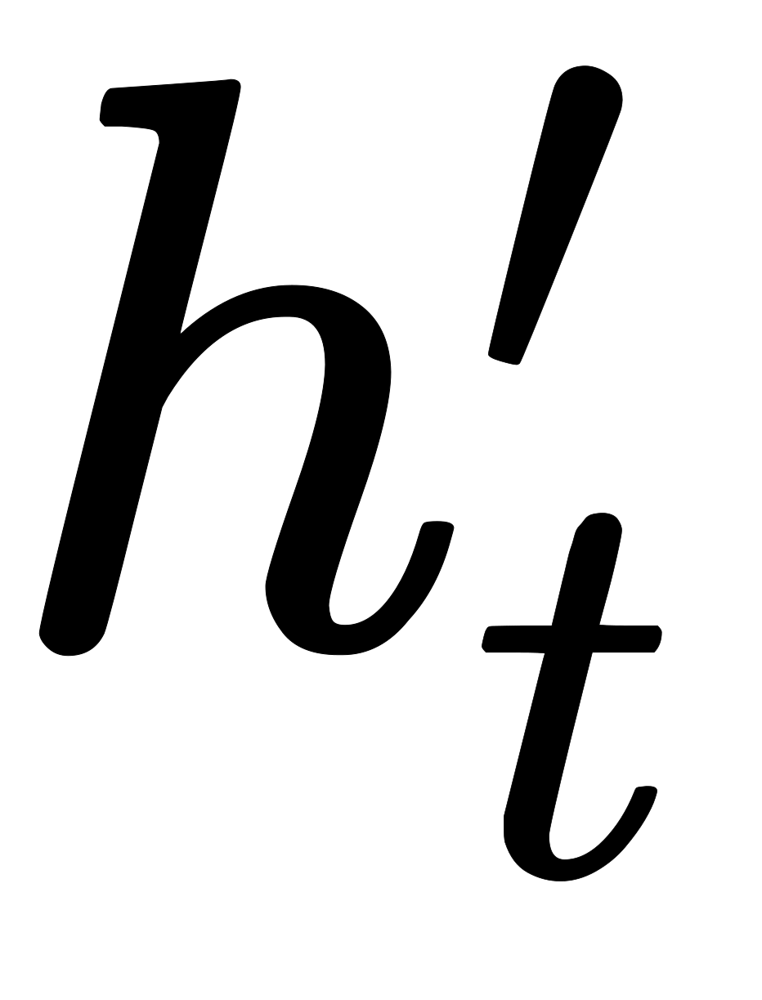

DIN/DIEN/MIMN/SIM等兴趣模型本质上是对**“用户兴趣”**这个概念进行的数学化解析，聚焦用户的序列行为挖掘 

# [DIN](https://arxiv.org/abs/1706.06978v4)
DIN的核心是基于数据的内在特点，引入了更高阶的学习范式。互联网上用户兴趣是多种多样的，从数学的角度来看，用户的兴趣在兴趣空间是一个多峰分布。在预测多兴趣的用户点击某个商品的概率时，其实用户的很多兴趣跟候选商品是无关的，也就是说我们只需要考虑用户跟商品相关的局部兴趣。所以DIN网络结构引入了兴趣局部激活单元，它受attention机制启发，从用户大量的行为集合中捕获到与candidate商品相关的行为子簇，对于用户行为子簇，通过Embedding操作，做weighted sum便可很好的预估出用户与candidate相关的兴趣度。传统的GwEN、WDL、FNN等模型在刻画用户兴趣分布时，会简单的将用户兴趣特征组做sum或average的pooling操作，这会把用户真正相关的兴趣淹没在pooling过程中  对于一个电商来说，历史数据当然就是点击，添加购物车，下单这些行为了。论文中给了一位用户的行为序列  显然是一个女生的行为历史啦，从最左边的手套，鞋子到右边的杯子，睡衣。要被推荐的候选商品是一件女式大衣。我们应该如何计算这件大衣的CTR呢？

如果按照之前的做法，我们会一碗水端平的考虑所有行为记录的影响，对应到模型中就是我们会用一个average pooling层把用户交互过的所有商品的embedding vector平均一下形成这个用户的user vector，机灵一点的工程师最多加一个time decay，让最近的行为产生的影响大些，在做average pooling的时候按时间调整一下权重

但是我们仔细想一想我们自己的购买过程，其实每个用户的兴趣都是多样的，女生喜欢买衣服包包，也喜欢化妆品，甚至还为自己男朋友挑选过球衣球鞋，那么你在买大衣的时候，真的要把给男朋友买球鞋的偏好考虑进来么？具体到本文的例子中，在预测大衣的CTR这件事情上，用户浏览过杯子，跟用户浏览过另一件大衣这两个行为的重要程度是一样的吗？肯定是浏览过另一件大衣这件事的参考价值高啊。好了，就是这件你老妈都知道的事情，让阿里妈妈的算法工程师们加上了attention机制

**注意力机制顾名思义，就是模型在预测的时候，对用户不同行为的注意力是不一样的**，“相关”的行为历史看重一些，“不相关”的历史甚至可以忽略。那么这样的思想反应到模型中也是直观的

上式中，是用户的embedding向量，是候选广告商品的embedding向量，是用户u的第i次行为的embedding向量，因为这里用户的行为就是浏览商品或店铺，所以行为的embedding的向量就是那次浏览的商品或店铺的embedding向量

因为加入了注意力机制，从过去的加和变成了的**加权和**，的权重就由与的关系决定，也就是上式中的，不负责任的说，这个的加入就是本文70%的价值所在。那么这个函数到底采用什么比较好呢？看完下面的架构图自然就清楚了  相比原来这个标准的深度推荐网络（Base model），DIN在生成用户embedding vector的时候加入了一个activation unit层，这一层产生了每个用户行为的权重，下面我们仔细看一下这个权重是怎么生成的，也就是是如何定义的

传统的Attention机制中，给定两个item embedding，比如u和v，通常是直接做点积uv或者uWv，其中W是一个|u|x|v|的权重矩阵，但这篇paper中阿里显然做了更进一步的改进，着重看上图右上角的activation unit，**首先是把u和v以及u v的element wise差值向量合并起来作为输入，然后喂给全连接层，最后得出权重**，这样的方法显然损失的信息更少。但如果你自己想方便的引入attention机制的话，不妨先从点积的方法做起尝试一下，因为这样连训练都不用训练

再稍微留意一下这个架构图中的红线，你会发现每个ad会有 good_id, shop_id 两层属性，shop_id只跟用户历史中的shop_id序列发生作用，good_id只跟用户的good_id序列发生作用，这样做的原因也是显而易见的

# [DIEN](https://arxiv.org/abs/1809.03672)
DIEN是深度兴趣网络DIN的升级版，DIN考虑了用户兴趣，提出用户兴趣是多样的，使用注意力机制来捕捉和target item的相对兴趣，将这种自适应的兴趣表示用于模型预估。但是大多该类模型将用户的行为直接看做兴趣，而用户的潜在兴趣往往很难通过行为来完全表示。因此需要挖掘行为背后的用户真实兴趣，并考虑用户兴趣的动态变化。基于这些考虑作者提出了Deep Interest Evolution Network(DIEN)模型

下图清晰地展示了模型的框架图。首先将所有特征转换成对应的embedding，特征除了用户行为模块，还有Target Ad、Context和User Profile特征等。用户行为建模（图中带颜色的部分）主要包含两个核心模块：Interest Extractor Layer和Interest Evolving Layer，也是文章重点。后续跟DIN类似，就是把所有特征concat起来送入全连接进行预测。损失是常见的交叉熵损失，这里记作。下面先简单介绍兴趣建模的核心模块的作用，再详细介绍如何实现  **Interest Extractor层**：合适的兴趣表示是兴趣演化模型的基础。在Interest Extractor层，模型使用GRU来对用户行为之间的依赖进行建模。GRU的输入是用户按时间排序的行为序列，也就是行为对应的商品，GRU的计算方式如下：

   

其中表示sigmoid函数，表示element-wise product，是GRU的输入，代表用户的第t个行为的embedding向量，则是GRU的隐状态

接下来介绍辅助损失。假设有N对行为embedding序列，其中表示点击行为的序列，表示负样本序列

 最终损失函数为，其中是平衡最终预测和兴趣表示的超参数

作者指出GRU只能学习行为之间的依赖，并不能很好反映用户兴趣。只包含了最终兴趣的监督信息（因为最终兴趣导致了点击行为），而中间的历史状态并不能得到监督信息来指导学习。我们知道兴趣可能会导致产生多个连续行为。所以模型引入辅助loss。具体来说就是用行为来知道的学习，正样本就是真实的下一个item，负样本就是从item set中随机抽取的item

辅助loss的引入有多个好处：1、正如作者强调的，辅助loss可以帮助GRU的隐状态更好地表示用户兴趣。2、RNN在长序列建模场景下梯度传播可能并不能很好的影响到序列开始部分，如果在序列的每个部分都引入一个辅助的监督信号，则可一定程度降低优化难度。3、辅助loss可以给embedding层的学习带来更多语义信息，学习到item对应的更好的embedding

**Interest Evolving层**：随着外部环境和内部认知的变化，用户兴趣也不断变化。用户对不同商品的点击行为受不同兴趣的影响。Interest Evolving层对与target item相关的兴趣演化轨迹进行建模。作者提出了带注意力更新门的GRU结果也就是AUGRU。通过使用兴趣状态和target item计算得到的相关性，AUGRU增强相关兴趣的影响，同时减弱不相关兴趣的影响

这部分结合了注意力机制中的局部激活能力和GRU的序列学习能力来实现建模兴趣演化的目标。该层GRU的输入就是上一层GRU的输出，，输出是，最后一个状态是最终的输出，和其他各类特征concat一起送给全连接

attention部分系数计算方式如下：其中是advertisement的不同field特征的concat

但是如何将attention机制加到GRU中呢？文中提出了三个方法：

- GRU with attentional input（AIGRU）: 较为简单，直接将attention系数和输入相乘：

- Attention based GRU（AGRU）：采用问答领域文章提到的一种方法，直接将attention系数来替换GRU的update gate，直接对隐状态进行更新：

- GRU with attentional update gate（AUGRU）：虽然AGRU使用attention系数来直接控制隐状态的更新，但是它使用了一个标量（）来代替了update gate（），也就是忽略了不同维度重要的区别。作者提出了增加了attentional update gate的GRU结构实现attention机制和GRU的无缝结合：

 

# Source
[基于深度学习的广告CTR预估算法](https://zhuanlan.zhihu.com/p/34940250) [推荐系统中的注意力机制——阿里深度兴趣网络（DIN）](https://zhuanlan.zhihu.com/p/51623339) [详解阿里之Deep Interest Evolution Network(AAAI 2019)](https://zhuanlan.zhihu.com/p/50758485) [镶嵌在互联网技术上的明珠：漫谈深度学习时代点击率预估技术进展](https://zhuanlan.zhihu.com/p/54822778) [屠龙少年与龙：漫谈深度学习驱动的广告推荐技术发展周期](https://zhuanlan.zhihu.com/p/398041971)
