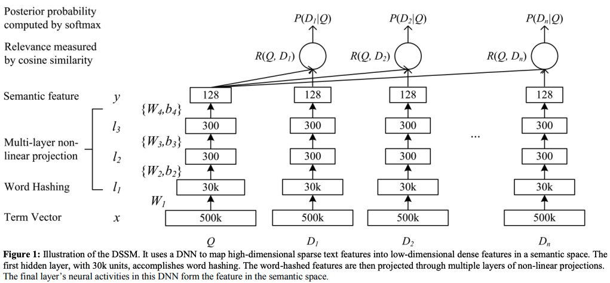

Deep Structured Semantic Model（DSSM）模型是微软2013年提出的。原理是把query/doc中的关键信息（Term Vector）提取出来进行简单的Word Hashing之后，把query/doc域分别投影到300维的子空间去。query里的每个word都对应一个300维的向量，一个query里会有多个向量，后面用sum求和操作得到一个汇总的300维向量，这是一个典型的Embedding操作。从图中可以看到，30k是指word字典的长度，300是embedding维数，30k*300≈千万量级的参数。DSSM模型第一次探索了如何把大量稀疏的ID进行稠密表达的路径。 

# Source
[基于深度学习的广告CTR预估算法](https://zhuanlan.zhihu.com/p/34940250)
