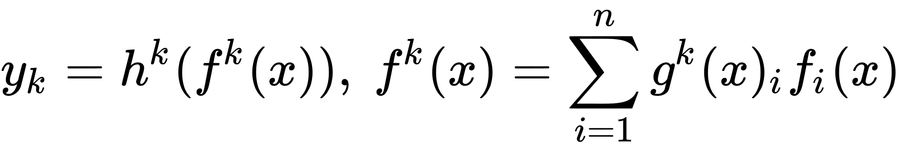
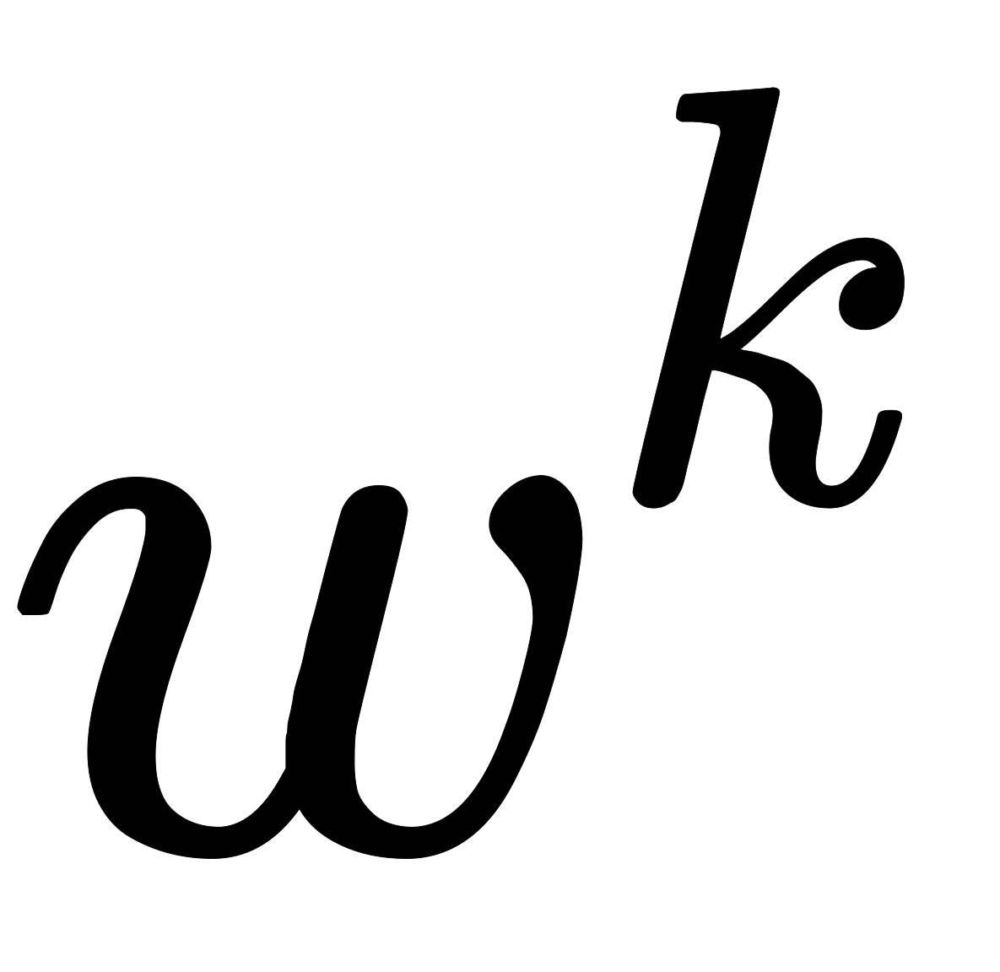

多任务学习好处是可以同时优化多个目标，利用任务的相关性做到各任务均衡与提升，对于推荐场景，多个任务通常是CTR，CVR，视频播放时长，用户停留时常，关注率，点赞率等等。多任务学习有两种主要模式：

- hard parameter sharing：底层embedding和mlp参数共享，上层演化出各个任务的分支，最后loss函数是各个任务的简单加权和，通过多任务之间的关系来建模出新的loss函数，比如阿里的ESMM，ESM2
- soft parameter sharing：通过Multi-gate Mixture-of-Experts(MMoE)这种特殊的多任务结构来学习出不同任务的权重，比如YouTube的多任务模型

# [ESMM](https://github.com/alibaba/x-deeplearning/wiki/%E5%85%A8%E7%A9%BA%E9%97%B4%E5%A4%9A%E4%BB%BB%E5%8A%A1%E6%A8%A1%E5%9E%8B(ESMM))
 通常来讲一次购买行为是商品曝光->点击->转化，ESMM 充分利用这个用户行为的序列模式

在 CTR 和 CTCVR 两项辅助任务的帮助下，优雅地解决了在实践中遇到的 CVR 建模和的挑战。ESMM 可以很容易地推广到具有序列依赖性的用户行为(浏览、点击、加购、购买等)预估中，构建跨域多场景全链路预估模型。

- ：样本选择偏差(sample selection bias，SSB)：传统的推荐系统仅用(点击行为样本空间)中的样本来训练CVR预估模型，但训练好的模型是在整个样本空间去做推断的。由于点击事件相对于曝光事件来说要少很多，因此只是样本空间的一个很小的子集，从上提取的特征相对于从中提取的特征而言是有偏的，甚至是很不相同。从而，按这种方法构建的训练样本集相当于是从一个与真实分布不一致的分布中采样得到的，这一定程度上违背了机器学习中独立同分布的假设。这种训练样本从整体样本空间的一个较小子集中提取，而训练得到的模型却需要对整个样本空间中的样本做推断预测的现象称之为样本选择偏差。样本选择偏差会伤害学到的模型的泛化性能。
- ：数据稀疏(data sparsity，DS):推荐系统展现给用户的商品数量要远远大于被用户点击的商品数量，同时有点击行为的用户也仅仅只占所有用户的一小部分，因此有点击行为的样本空间相对于整个样本空间来说是很小的，通常来讲，量级要少1~3个数量级。如下表所示，在淘宝公开的训练数据集上，只占整个样本空间的4%。这就是所谓的训练数据稀疏的问题，高度稀疏的训练数据使得模型的学习变得相当困难

广告或推荐系统中，用户行为的系统链路可以表示为 召回  粗排  精排  展现  点击  转化  复购 的序列。通常我们在引擎请求的时候进行多阶段的综合排序并不断选取头部的子集传给下一级，最终在展现阶段返回给用户。每阶段任务的输入量级都会因为上一阶段任务经过系统筛选（比如 召回到粗排、粗排到精排、精排到展现）或者用户主动筛选（比如 展现到点击、点击到转化、转化到复购）而逐步减少。ESMM 适用于成熟的电商推荐或者广告全链路预估系统。 

## 算法原理
ESMM 引入两个预估展现点击率（CTR）和展现后点击转化率（CTCVR）作为辅助任务。ESMM 将 pCVR 作为一个中间变量，并将其乘以 pCTR 得到 pCTCVR，而不是直接基于有偏的点击样本子集进行 CVR 模型训练。pCTCVR 和 pCTR 是在全空间中以所有展现样本估计的，因此衍生的 pCVR 也适用于全空间并且缓解了问题。此外，CVR 任务的特征表示网络与 CTR 任务共享，后者用更丰富的样本进行训练。这种参数共享遵循特征表示迁移学习范式，并为缓解问题提供了显著的帮助。pCTCVR定义： 

- impression：用户观察到曝光的产品
- click：用户对impression的点击行为
- conversion：用户点击之后对物品的购买行为
- CTR：从impression到click的比例
- CVR：从click到conversion的比例
- CTCVR：从impression到conversion的比例
- x：impression feature
- y：click label
- z：conversion
- pCTR：p(click=1 | impression)
- pCVR: p(conversion=1 | click=1,impression)
- pCTCVR: p(conversion=1,click=1 |impression) = p(click=1 | impression) * p(conversion=1|click=1,impression)

当无法直接建模pCVR，可以建模学习pCTCVR和pCTR，反向求pCVR的预测，因此ESSM中两个学习的模型是建模CTR和CTCVR的子模型

## 模型框架
这里pctr预测一个impression的click，pcvr预测一个impression的conversion，pctcvr预测一个impression→click→convrsion的sequence概率。其损失函数：

 

## 全空间建模
pCTR 和 pCTCVR 是 ESMM 在全空间实际预估的变量。这种乘法形式使得三个关联和共同训练的分类器能够在训练期间利用数据的序列模式并相互传递信息。 ESMM的损失函数如下，它由 CTR 和 CTCVR 任务中的两个损失项组成，这些任务通过所有展现次数的样本进行计算：

其中和是 CTR 和 CVR 网络的参数，函数是交叉熵损失函数。 在数学上，公式将分解为两部分对应于 CTR 和 CTCVR 任务的标签，构造训练数据集如下： 对于CTR任务，单击的展现被标记为，否则为；对于 CTCVR 任务，同时发生点击和转化事件的展现被标记为y & z = 1，否则y & z = 0，y和y & z ，这实际上是利用点击和转化标签的序列依赖性。

## 迁移学习
正如 BASE 模型部分介绍的那样，Embedding Layer 将大规模稀疏输入映射到低维稠密向量中，它占据深度网络的大部分参数，需要大量的样本来进行训练。在 ESMM 中，CVR 网络的 Embedding 参数与 CTR 任务共享。它遵循特征表示转化学习范式。CTR 任务所有展现次数的样本规模比 CVR 任务要丰富多个量级。该参数共享机制使 ESMM 中的 CVR 网络可以从未点击的展现中学习，缓解了数据稀疏性问题。

## 结构扩展性
它主要由两个子网组成：CVR 网络在图的左边部分和右边部分的 CTR 网络。 CVR 和 CTR 网络都采用与 BASE 模型相同的结构。 CTCVR 将 CVR 和 CTR 网络的输出结果相乘作为输出。其中每个子网络结果可以被替代为任意的分类预估网络。

# [MMoE](https://www.youtube.com/watch?v=Dweg47Tswxw)
多任务模型通过学习不同任务的联系和差异，可提高每个任务的学习效率和质量。多任务学习的的框架广泛采用shared-bottom的结构，不同任务间共用底部的隐层。这种结构本质上可以减少过拟合的风险，但是效果上可能受到任务差异和数据分布带来的影响。也有一些其他结构，比如两个任务的参数不共用，但是通过对不同任务的参数增加L2范数的限制；也有一些对每个任务分别学习一套隐层然后学习所有隐层的组合。和shared-bottom结构相比，这些模型对增加了针对任务的特定参数，在任务差异会影响公共参数的情况下对最终效果有提升。缺点就是模型增加了参数量所以需要更大的数据量来训练模型，而且模型更复杂并不利于在真实生产环境中实际部署使用。因此，MMoE模型刻画了任务相关性，基于共享表示来学习特定任务的函数，避免了明显增加参数的缺点

## 模型介绍
MMoE模型的结构(下图c)基于广泛使用的Shared-Bottom结构(下图a)和MoE结构，其中图(b)是图(c)的一种特殊情况，下面依次介绍 

### Shared-Bottom Model
如上图a所示shared-bottom网络（表示函数）位于底部，多个任务共用这一层。往上，个子任务分别对应一个tower network（表示为），每个子任务的输出

### Mixture-of-Experts
注意这里说的是MoE模型，并非上图b的One-gate MoE Model。MoE模型可以形式化表示为

其中。其中是个expert network（expert network可认为是一个神经网络）。是组合experts结果的gating network，具体来说产生个expert上的概率分布，最终的输出是所有experts的带权加和。显然，MoE可看做基于多个独立模型的集成方法。

### Multi-gate MoE Model
MMoE目的就是相对于shared-bottom结构不明显增加模型参数的要求下捕捉任务的不同。其核心思想是将shared-bottom网络中的函数f替换成MoE层，如上图c所示，形式化表达为：

其中，输入就是input feature，输出是所有experts上的权重。

一方面，因为gating networks通常是轻量级的，而且expert networks是所有任务共用，所以相对于论文中提到的一些baseline方法在计算量和参数量上具有优势。

另一方面，相对于所有任务公共一个门控网络(One-gate MoE model，如上图b)，这里MMoE(上图c)中每个任务使用单独的gating networks。每个任务的gating networks通过最终输出权重不同实现对experts的选择性利用。不同任务的gating networks可以学习到不同的组合experts的模式，因此模型考虑了捕捉到任务的相关性和区别

# [PLE](https://dl.acm.org/doi/abs/10.1145/3383313.3412236)
PLE相对于前面的MMOE和ESMM，主要解决以下问题：多任务学习中往往存在跷跷板现象，也就是说，多任务学习相对于多个单任务学习的模型，往往能够提升一部分任务的效果，同时牺牲另外部分任务的效果。即使通过MMoE这种方式减轻负迁移现象，跷跷板现象仍然是广泛存在的。

前面的MMOE模型存在以下两方面的缺点：

- MMOE中所有的Expert是被所有任务所共享的，这可能无法捕捉到任务之间更复杂的关系，从而给部分任务带来一定的噪声
- 不同的Expert之间没有交互，联合优化的效果有所折扣

## Expert被所有任务共享缺点
为了解决第一个问题，每个任务保留独立的Expert，同时也保留了共享的Expert，如下图  图中ExpertsA和ExpertsB是任务A和B各自的专家系统，中间的Experts Shared是共享的专家系统。图中的**selector**表示选择的专家系统。对于任务A，使用Experts A和Experts Shared里面的多个Expert的输出。

任务的输出可以表示为：

其中，表示第的tower network，是gating network(门控网络)，是选择专家系统中所有Expert的权重，可以表示为，，和分别是共享Expert个数以及任务独有Expert个数，是输入维度，由共享Experts和任务的Experts组成，表示为

## Expert之间无交互缺点
考虑不同Expert之间的交互，模型结构如下，即PLE  PLE中第层的第个任务的门控网络输出表示为：

经过全部gating network和Expert计算，我们可以得到PLE模型中第个任务的预测结果：

## Single-level vs Multi-level MTL

### Single-level
 a）Hard Parameter Sharing：这也是最为常见的MTL模型，不同的任务底层的模块是共享的，然后共享层的输出分别输入到不同任务的独有模块中，得到各自的输出。当两个任务相关性较高时，用这种结构往往可以取得不错的效果，但任务相关性不高时，会存在负迁移现象，导致效果不理想。

b）Asymmetry Sharing（不对称共享）：可以看到，这种结构的MTL，不同任务的底层模块有各自对应的输出，但其中部分任务的输出会被其他任务所使用，而部分任务则使用自己独有的输出。哪部分任务使用其他任务的输出，则需要人为指定。

c）Customized Sharing（自定义共享）：可以看到，这种结构的MTL，不同任务的底层模块不仅有各自独立的输出，还有共享的输出。2和3这两种结构同样是论文提出的，但不会过多的介绍。

d）MMoE：这种结构的MTL之前的文章中也都介绍过了，相信大家也比较熟悉。底层包含多个Expert，然后基于门控机制，不同任务会对不同Expert的输出进行过滤。

e）CGC：PLE论文中提出的结构。

### Multi-level
 f）Cross-Stitch Network（“十字绣”网络）：出自论文《Cross-stitch Networks for Multi-task Learning》，上图中可能表示的不太清楚，可以参考下图：   从上面的公式中可以看出，当或者值为0时，说明两者没有共享的特征，相反的，当两者的值越大，说明共享部分越大。

g）Sluice Network（水闸网络）：这个结构出自论文《Sluice networks: Learning what to share between loosely related tasks》

h）ML-MMoE：MMoE的多级结构

i）PLE：PLE论文中提出的结构。

# Source
[https://arxiv.org/pdf/1804.07931.pdf](https://arxiv.org/pdf/1804.07931.pdf) [全空间多任务模型(ESMM) · alibaba/x-deeplearning Wiki](https://github.com/alibaba/x-deeplearning/wiki/%E5%85%A8%E7%A9%BA%E9%97%B4%E5%A4%9A%E4%BB%BB%E5%8A%A1%E6%A8%A1%E5%9E%8B(ESMM)) [论文笔记：ESMM(阿里出品)](https://zhuanlan.zhihu.com/p/55259412) [https://dl.acm.org/doi/pdf/10.1145/3219819.3220007](https://dl.acm.org/doi/pdf/10.1145/3219819.3220007) [https://www.youtube.com/watch?v=Dweg47Tswxw](https://www.youtube.com/watch?v=Dweg47Tswxw) [https://zhuanlan.zhihu.com/p/55752344](https://zhuanlan.zhihu.com/p/55752344) [https://dl.acm.org/doi/abs/10.1145/3383313.3412236](https://dl.acm.org/doi/abs/10.1145/3383313.3412236) [https://mp.weixin.qq.com/s/IEtlu2AhvwI-W6lZY1j4NQ](https://mp.weixin.qq.com/s/IEtlu2AhvwI-W6lZY1j4NQ) [https://zhuanlan.zhihu.com/p/291406172](https://zhuanlan.zhihu.com/p/291406172)

