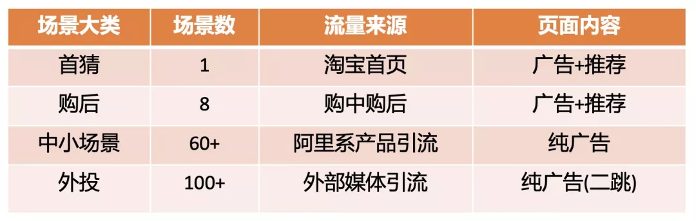
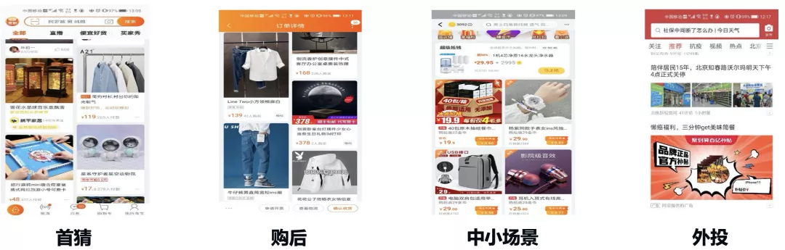
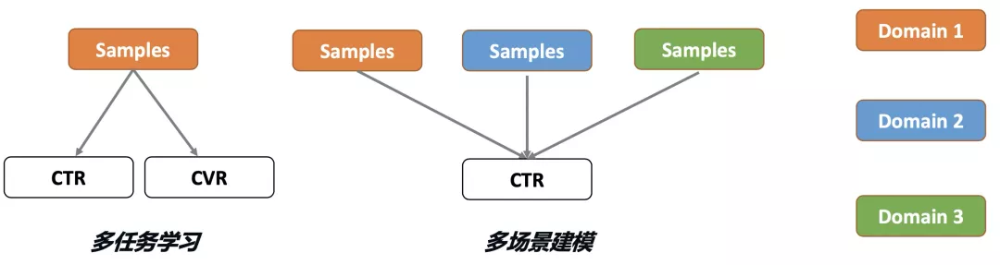
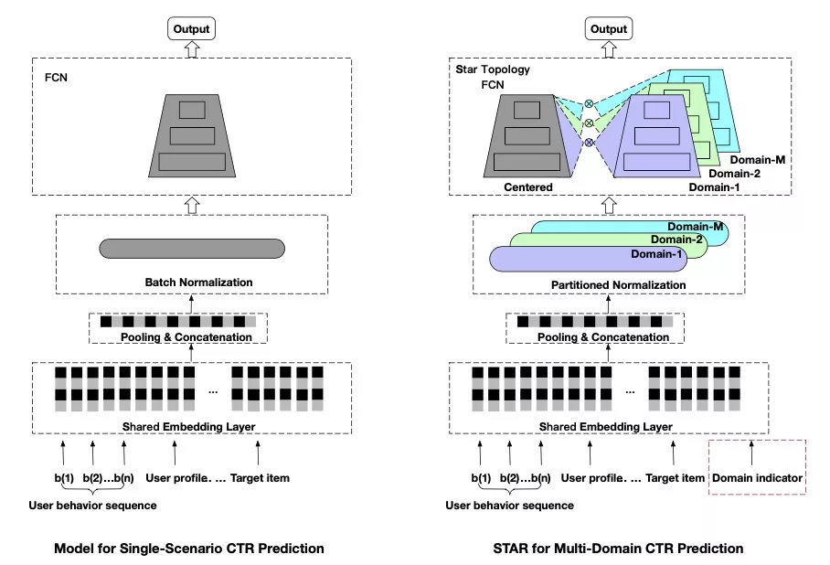
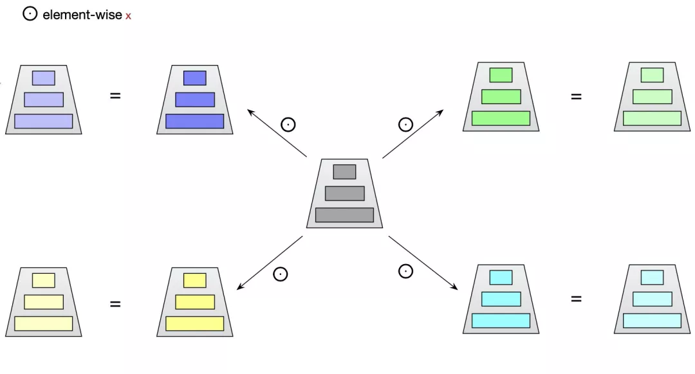
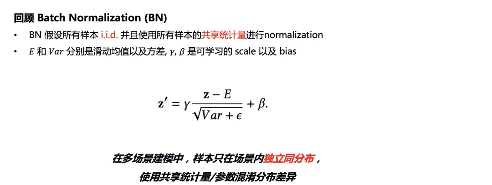
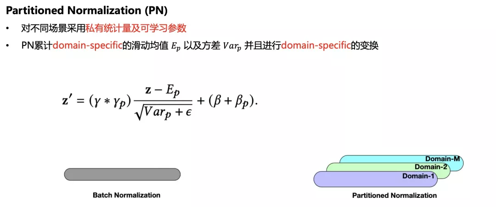
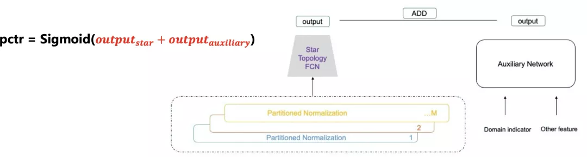
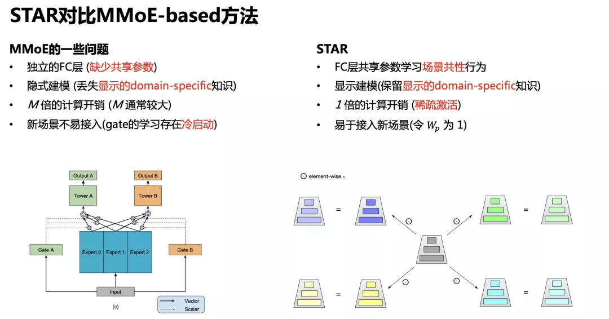

阿里妈妈展示广告需要为大量的场景提供广告排序能力，在业务场景数急剧膨胀的背景下，我们开始研究多场景联合建模。本篇文章主要介绍，我们在多场景建模下遇到的挑战、挑战背后的思考以及算法工程 co-design 的解决方案——多场景下的星型 CTR 预估模型 STAR。该项工作论文已被CIKM 2021接收，[论文下载](https://arxiv.org/pdf/2101.11427) 

# 业务背景
随着业务的演进，阿里妈妈展示广告rank团队需要在越来越多的广告场景提供广告排序能力，包括淘宝首页猜你喜欢，购后（包括购物车订单页等八大场景），阿里系引流的各大活动场景以及对外部流量竞价成功后的跳转到淘内的广告浏览页面。  以往我们通常在各个场景单独建模，之所以多场景联合建模，主要是从算法和效能两方面考虑。算法层面，各个场景独立建模受限于数据量，长尾场景学习不充分，而简单共享模型难以建模场景差异性；效能方面，我们需要考虑系统资源和人力成本限制。

多场景建模的一个难点是，不同场景分布不同，如何同时建模场景共性和差异性。具体来说不同场景具有用户差异，即使是同一用户，在不同场景下的心智也不同，页面呈现的形式和内容，进入页面前的用户状态也有很大的差异。这两点反映在数据里的现象是，同一广告在不同场景下的展现频次、平均点击率等均有较大的差别。也就是说，尽管不同场景之间的共性和关联性可以共享信息，但与此同时，受产品形态和引流方式的影响，各场景也存在一定的差异性。  我们总结了多场景建模的三个挑战：

1. 场景数多且存在长尾问题
2. 不同场景样本分布差异大
3. 人力和资源的限制

我们的建模重点是有效利用场景间共性并建模不同场景差异性，同时打造一套兼顾效能，可快速迭代的建模体系

# 问题定义
现在我们形式化多场景建模这个问题，并与单场景 CTR 预估进行对比。传统单场景 CTR 模型是对于样本 x 进行预估，数据从单个场景中采样得到，这背后的假设是样本独立同分布。但在多场景建模中，模型对于样本 x, p 进行预估，其中 p 是 domain indicator。在多场景建模中，数据是从多个相关但分布不同的场景中采样得到，样本只在场景内独立同分布。

和多场景建模很相似的任务是多任务学习，但这二者关注点不同。多任务学习解决相同场景/分布下的不同任务，而多场景建模解决不同场景/分布下的相同任务。例如：推荐场景下的多任务学习通常是单个样本对于 CTR，CVR 等目标同时预估，而多场景建模是对不同场景样本预估相同的 CTR 目标。直接采用多任务学习的方法解决多场景建模也会存在一些问题。  对于多场景建模，如果采用各场景独立的方式，会忽视场景共性，导致长尾小场景难以学好，同时每个场景维护一个模型极大地增加系统资源开销和人力成本；如果直接将样本混合，训练共享模型，会忽视场景差异性，导致预测准度下降。

# 模型介绍
对于多场景建模问题，我们的核心想法是同时学习场景内特定行为和场景间的共性行为。沿着这个想法，我们提出了 STAR 模型，通过场景私有参数和场景共享参数同时建模场景差异性和共性。场景私有参数以及场景共享参数最终聚合得到每个场景的模型。STAR 的结构如下图所示。  STAR 主要包含三部分，星型拓扑结构的全连接网络（STAR Topology Fully-Connected Network），Partitioned Normalization 以及辅助网络。我们接下来会依次介绍。

## STAR Topology Fully-Connected Network
 在STAR中，对于每一个FC层，都有中心的共享参数和场景私有参数，每个场景最终的参数通过二者进行element-wise product得到：

，

假设FC层的输入时，那么输出由下式计算得到：

通过这样的实现方式，STAR的共享参数被所有场景样本的梯度更新，学习场景共性，而场景私有参数只被场景内样本更新，建模场景差异性。

## Partitioned Normalization
为了加快模型收敛，现在很多 CTR 模型都会采用 BN。展示广告之前的CTR模型中在 embedding 之后会过一层 BN，同时 FC 激活函数 DICE [2] 还会有BN。但是 BN 在多场景中会有一些问题，我们提出了 Partitioned Normalization（PN）。

回顾 BN，我们可以发现 BN 其实假设所有样本 i.i.d. 并使用所有样本的共享统计量进行normalization。但在多场景建模中，样本只在场景内独立同分布，使用共享统计量/参数混淆了分布差异，不利于更加精细的建模。  对此，PN 的解决方案是对不同场景采用私有统计量和可学习参数。具体来说，PN 累计 domain-specific 的滑动均值以及方差并且进行 domain-specific 的变换。  通过这种方式，PN 实现了对不同场景进行自适应的 normalization，保留场景差异信息，进行更加精细的建模。

## Auxiliary Network
除了 STAR FCN 和 PN，我们还设计了一个 Auxiliary Network。我们认为好的多场景模型应该具备丰富的场景特征并能让场景特征能够直接影响最后的 pctr，学习场景差异性。因此，类似于 wide and deep 的做法，我们引入一个额外的小辅助网络，将场景相关特征送进去，并将 auxiliary network 输出与 STAR 网络相加得到最终 pctr。这样能够让场景相关特征直接影响最终预测值，捕捉场景差异性。 

# 对比MMoE
我们也注意到，业界很多技术部门采用了 MMoE 的方式建模多场景。其实在多场景建模问题上，STAR 相对 MMoE 更具优势

- MMoE 对不同任务采用独立的 FC 层，缺少共享参数，而 STAR 的 FC 层共享参数可以学习场景共性行为。
- MMoE 通过可学习 gate 隐式的建模场景间的关系，这样会丢失显示的 domain-specific 知识，而 STAR 引入场景先验，通过场景私有/共享参数 而不是 gate 显示建模场景间的关系，保留显示的 domain-specific 知识（保留在场景私有参数内）。
- MMoE 通过 gate，需要计算每个场景的 expert，相对共享模型 FC 层会有 M 倍的计算开销 (M 为场景数，通常较大，在展示广告下可达上百)，而 STAR 稀疏激活的特性不引入额外计算，和原来计算开销持平。
- 由于 gate 的学习存在冷启动，MMoE 对于新场景不友好，而 STAR 更易于接入新场景，只需将新场景私有参数全初始化为1即可开始 fine-tune 接入，更加符合展示广告场景动态变化的需求。

# 在离线实验
我们在展示广告生产数据集上进行了实验，对比方法包括 Base (共享模型),Shared-Bottom, MulANN, MMoE, Cross-Stitch。实验结果显示，STAR 可以一致的提升各个场景的表现。我们也进行了 Ablation Study 分析了每个模块的效果。

在真实生产环境的流式训练环境下，我们重新设计了样本管线，将样本流拆分为多个场景，轮流输出进行训练，每个 batch 仅包含一个场景样本。为了缓解不同场景流量高峰不同的 “跷跷板”效应，ODL 会缓存并 shuffle 样本，确保每个时刻样本分布不会发生突变。STAR 上线后，在不额外增加特征、算力、RT 的情况下，取得了 ctr+8% rpm+6% 的效果。

# Beyond多场景建模
业务没有多场景，STAR还能用吗?

事实上，STAR 开启的视角远比多场景建模宏大，STAR 提供了一个混合多分布下的差异化精准建模方案。我们发现，推荐广告样本往往是多个子分布混合的数据，例如在电商场景下，男女用户的点击行为具有很大差异，不同场景下的用户心智显著不同。在这种混合多分布数据下，采用同样的模型参数混淆了不同分布的差异，不利于更精细的CTR建模，而 STAR 恰好提供了一个混合多分布下的差异化精准建模方案，而场景是划分样本分布的一种重要方式。它把我们对通用建模中一些细微的、先验认为具备特征间/样本间差异性的信息，如场景，通过对应的输入特征设计独立的网络结构，把d omain knowledge 变成网络结构引入，实现更加精细的建模。我们实验发现，STAR在不同样本划分方式均有一定提升，如用户性别，年龄，广告类目等均有 GAUC +0.2% 以上的提升。我们也期待后续有更多工作沿着这条思路走下去，构建“一人一世界”的模型。

# Source
[CIKM 2021 | 多场景下的星型CTR预估模型STAR](https://mp.weixin.qq.com/s?__biz=Mzg3MDYxODE2Ng==&mid=2247485923&idx=1&sn=cb4a5f6840a795a87728f80855819a4b&chksm=ce8a4cbaf9fdc5ac80f4fa0dcc3e495b38fef7edf4754a821e492696dd78f865cb46945b486c&scene=21#wechat_redirect)
