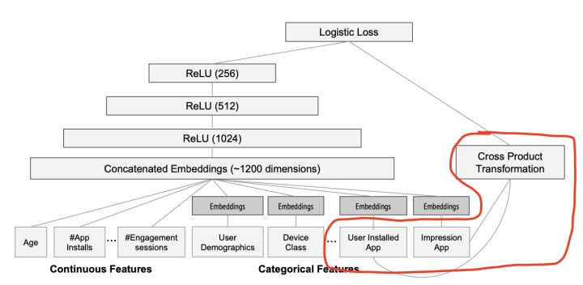

Google Wide&Deep模型的主要思路正如其名，**把单输入层的Wide部分和经过多层感知机的Deep部分连接起来，一起输入最终的输出层**。其中Wide部分的主要作用是让模型具有记忆性（Memorization），单层的Wide部分善于处理大量稀疏的id类特征，便于让模型直接“记住”用户的大量历史信息；Deep部分的主要作用是让模型具有“泛化性”（Generalization），利用DNN表达能力强的特点，挖掘藏在特征后面的数据模式。最终利用LR输出层将Wide部分和Deep部分组合起来，形成统一的模型。Wide&Deep对之后模型的影响在于——大量深度学习模型采用了两部分甚至多部分组合的形式，利用不同网络结构挖掘不同的信息后进行组合，充分利用和结合了不同网络结构的特点。  一句话概括此结构的优点：**Wide部分有利于增强模型的“记忆能力”，Deep部分有利于增强模型的“泛化能力”。**

# Wide部分
为什么wide部分要用L1 FTRL训练？这个问题是一个很有意思的问题，可能近几年毕业的同学都不大清楚FTRL是什么了。四五年前FTRL曾风靡全部互联网头部公司，成为线性模型在线训练的主要方法。

彻底解释清楚FTRL并不是一件容易的事情，可能要花上10-20页左右的篇幅，感兴趣的同学可以参考冯扬当时的著名文章“[在线最优化求解](https://link.zhihu.com/?target=https%3A//github.com/wzhe06/Ad-papers/blob/master/Optimization%2520Method/%25E5%259C%25A8%25E7%25BA%25BF%25E6%259C%2580%25E4%25BC%2598%25E5%258C%2596%25E6%25B1%2582%25E8%25A7%25A3%2528Online%2520Optimization%2529-%25E5%2586%25AF%25E6%2589%25AC.pdf)”。

这里简要介绍一下，你可以把FTRL当作一个**稀疏性很好**，**精度又不错**的**随机梯度下降方法**。由于是随机梯度下降，当然可以做到来一个样本就训练一次，进而实现模型的在线更新。所以在四五年前，大部分公司还是线性模型为主的时代，FTRL凭借非常好的在线学习能力成为主流。

说完了FTRL，再说L1正则化，参加过算法岗面试的同学可能都碰到过那个经典面试题“为什么L1正则化比L2正则化更容易产生稀疏解？”。问题的答案现在当然已经是显学了，但这里“**稀疏**”这个性质又冒出来了。**也就是说FTRL with L1非常注重模型的稀疏性。这也就是问题的答案，W&D采用L1 FTRL是想让Wide部分变得更加稀疏。再白话一点就是，L1 FTRL会让Wide部分的大部分权重都为0，我们准备特征的时候就不用准备那么多0权重的特征了，这大大压缩了模型权重，也压缩了特征向量的维度。**

稀疏性不见得一直是一个好东西，它不管怎样都会让模型的精度有一定的损伤。肯定是特征向量维度过高导致“稀疏性”成为了关键的考量。这就涉及到Google Wide部分的特征选取了，到底Google选了什么特征需要这么注重稀疏性。我们回到他的业务场景中来。  大家可以看到红圈内的Wide部分采用了什么特征，它居然采用了两个id类特征的乘积，这两个id类特征是： **User Installed App** 和 **Impression App**

这篇文章是Google的应用商店团队Google Play发表的，我们不难猜测Google的工程师使用这个组合特征的意图，他们是想发现当前曝光app和用户安装app的关联关系，以此来直接影响最终的得分。

但是两个id类特征向量进行组合，在维度爆炸的同时，会让原本已经非常稀疏的multihot特征向量，变得更加稀疏。正因如此，wide部分的权重数量其实是海量的。为了不把数量如此之巨的权重都搬到线上进行model serving，采用FTRL过滤掉哪些稀疏特征无疑是非常好的工程经验。

大家注意观察可以发现Deep部分的输入，要么是Age，#App Installs这些数值类特征，要么是已经降维并稠密化的Embedding向量，工程师们不会也不敢把过度稀疏的特征向量直接输入到Deep网络中。所以Deep部分不存在严重的特征稀疏问题，自然可以使用精度更好，更适用于深度学习训练的AdaGrad去训练。

# 泛化和记忆能力
我想到这应该把文首的问题回答清楚了。最后我想再说回所谓wide部分的“记忆能力”。其实大家可以看到，所谓的“记忆能力”，可以简单理解为发现“直接的”、“暴力的”、“显然的”关联规则的能力。比如该问题中，Google W&D期望在wide部分发现这样的规则：

**用户安装了应用A，此时曝光应用B，用户安装的B概率大。**

而Deep部分就更黑盒一些，它把能想到的所有特征扔进这个黑盒去做函数的拟合，显然这样的过程会“模糊”一些直接的因果关系，泛化成一些间接的，可能的相关性。

从这个角度来说，所谓“泛化能力”和“记忆能力”就更容易被直观的理解了。

# Source
[谷歌、阿里、微软等10大深度学习CTR模型最全演化图谱【推荐、广告、搜索领域】](https://zhuanlan.zhihu.com/p/63186101) [见微知著，你真的搞懂Google的Wide&Deep模型了吗？](https://zhuanlan.zhihu.com/p/142958834) [https://github.com/tensorflow/tensorflow/blob/r1.2/tensorflow/examples/learn/wide_n_deep_tutorial.py](https://github.com/tensorflow/tensorflow/blob/r1.2/tensorflow/examples/learn/wide_n_deep_tutorial.py)
