深度学习作为最火的研究方向，被人们期望是计算机解决人类问题的终极方案。为什么能被寄予如此厚望？这里我简单进行说明，人能解决相应问题，比如区分图片中的猫狗，理解文章中作者表达的思想...其实都是基于得到的信息，脑海中有个映射函数，这里的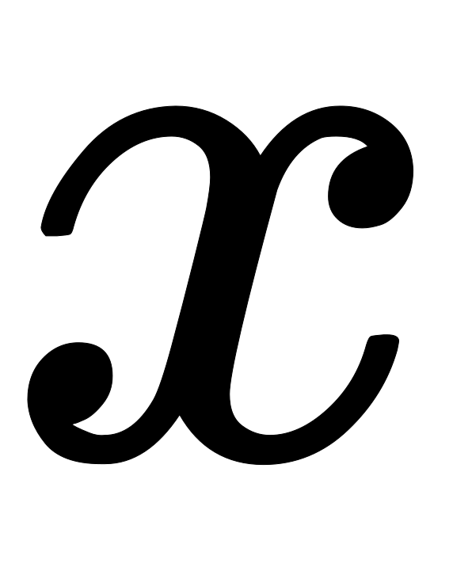即信息(图片，文章)，输出即问题答案(猫狗，作者思想)。而深度学习就是在拟合这个映射函数。用更数学一点的方式来解释，其实就是我们遇到的大多数问题往往都是非线性的，深度学习相较之前的机器学习算法有更好的非线性拟合。

这里就有两点，一是信息要全，二是能否拟合。首先，如果信息不全，人类也无法做到正确解答。比如提问“刘亦菲男朋友是谁”，如果大家不知道是我，肯定也无法正确作答。同理，在信息不全的情况下，深度学习也不能保证作出正确解答。对于第二点，能否拟合，[万能近似定理(Universal approximation theorem)](https://en.wikipedia.org/wiki/Universal_approximation_theorem)表明，一个前馈神经网络如果具有线性输出层和至少一层具有任何一种“挤压”性质的激活函数的隐藏层，只要给与网络足够数量的隐藏单元，它可以以任意的精度来近似任何从一个有限维空间到另一个有限维空间的Borel可测函数。前馈网络的导数也可以任意好的来近似函数的导数。即只要给予符合条件的层和足够的隐藏单元，前馈神经网络可以表示任何函数。

所以，只要信息全，万能近似定理证明了我们可以拟合出映射函数。即深度学习有能力解决人类问题。那为什么现在没能解决呢？通过万能近似定理我们知道一个大的MLP一定能够表示这个函数。然而，我们不能保证训练算法能够学得这个函数。即使MLP能够表达该函数，学习也可能因两个不同的原因而失败：

   1. 用于训练的优化算法可能找不到用于期望函数的参数值
   2. 训练算法可能由于过拟合而选择了错误的函数

所以，深度学习需要解决的问题：1、特征表达；2、模型优化(欠/过拟合)

# 深度学习介绍
这里先以三位大佬(Yann LeCun, Yoshua Bengio & Geoffrey Hinton)15年在《Nature》的文章简单介绍，帮助理解深度学习：[http://playground.tensorflow.org/](http://playground.tensorflow.org/)

> Deep learning allows computational models that are composed of multiple processing layers to learn representations of data with multiple levels of abstraction. These methods have dramatically improved the state-of-the-art in speech recognition, visual object recognition, object detection and many other domains such as drug discovery and genomics. Deep learning discovers intricate structure in large data sets by using the backpropagation algorithm to indicate how a machine should change its internal parameters that are used to compute the representation in each layer from the representation in the previous layer. Deep convolutional nets have brought about breakthroughs in processing images, video, speech and audio, whereas recurrent nets have shone light on sequential data such as text and speech

模式识别或者说机器学习最大的痛点就是处理原始数据的能力，说白了就是特征工程部分艰难，既耗时还必须需要专业经验知识指导。我们需要：1、从感受器(麦克风等)获得原始数据；2:、进行数据预处理(降噪等)；3、特征提取；4、特征选择；5、进行预测或识别

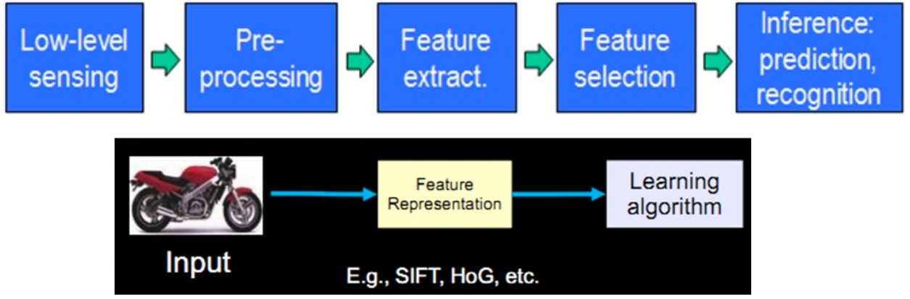

相较而言，深度学习是一种表示学习(Representation Learning)，即可以直接将原始数据喂给深度学习模型，模型会自动发掘特征表达。简单的非线性结构组合即可学得高级抽象特征表达，且如果组合足够，可以学的任何复杂函数映射（[万能近似定理(Universal approximation theorem)](https://en.wikipedia.org/wiki/Universal_approximation_theorem)）。所以，深度学习可以避免大量的特征工程工作，而且只用通用学习结构即可。 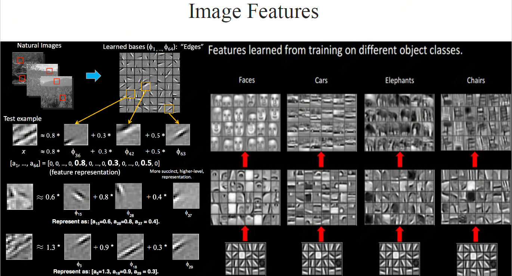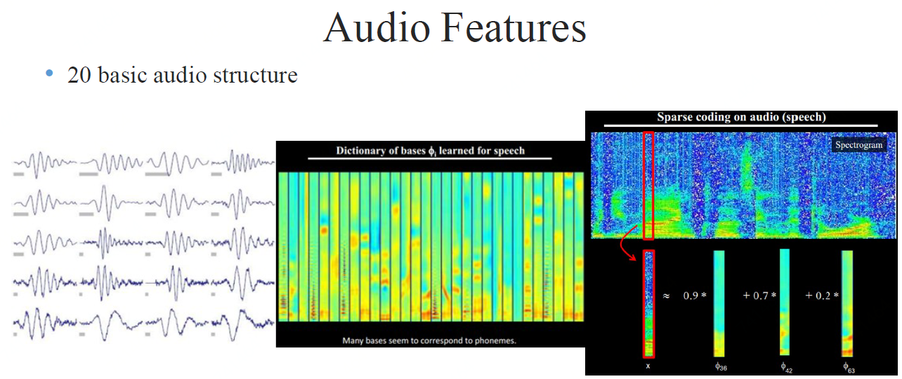

## 监督学习(Supervised learning)

大部分的机器学习、深度学习等都是监督学习。比如我们要给样本分类，根据模型计算出来的每个样本对应类别的值，将最高值对应的类别赋给这个样本。我们首先设计目标函数或叫损失函数来衡量预测值与真实值间的错误或距离，然后模型调整参数减少这个错误或距离。

### 随机梯度下降

在实践中，大多数从业者使用称为随机梯度下降（SGD）的方法。这包括

1. 显示几个示例的输入向量，计算输出和误差，计算这些示例的平均梯度，以及相应地调整权重。
2. 对于来自训练集的许多小例子，重复该过程，直到目标函数的平均值停止减小。它被称为随机因为每个小的例子给出了对所有例子的平均梯度的噪声估计。

与更精细的优化技术相比，这种简单的程序通常能够以惊人的速度快速找到一组良好的权重。在训练之后，系统的性能在称为测试集的不同示例集上测量。这有助于测试机器的泛化能力 - 它能够在训练期间从未见过的新输入产生合理的答案。

### 线性分类器或浅层分类器vs.深度学习

对于一些问题，线性分类器或者浅层分类器得不到好的效果。比如图片分类，线性分类器不好解决非线性问题，使用核函数可以解决一部分但效果也比较一般。而深度学习可以解决这些问题。

## 多层结构中的计算

计算目标函数在多层模块权重的梯度的反向传播只不过是链式规则的实际应用。关键的点是目标的导数（或梯度）对于每模块的输入可以通过相对于该模块的输出（或后续模块的输入）从梯度向后工作来计算

### 链式法则
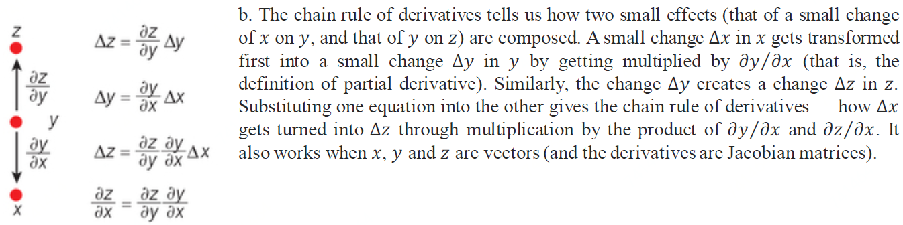

### 多层结构
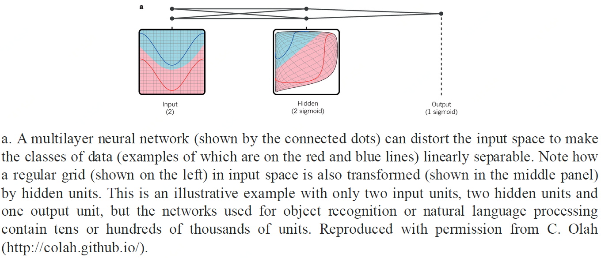

### 前馈传播
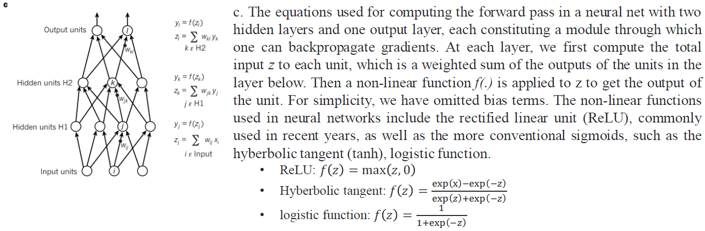

### 反向传播
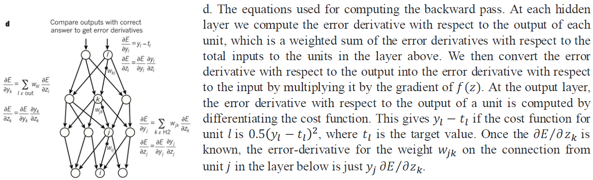

---

# 网络分类

随着深度学习的快速发展，人们创建了一整套神经网络结构来解决各种各样的任务和问题。 尽管有无数的神经网络结构，这里有十一种对于任何深度学习工程师来说都应该理解的结构，可以分为四大类: 标准网络(DNN)、卷积网络(CNN)、循环网络(RNN)、和自编码器(Auto Encoder)。

| 标准网络 | 卷积网络 | 循环网络 | 自编码器 |
| --- | --- | --- | --- |
| 感知机、前馈网络、残差网络、回声状态 | 卷积神经网络、反卷积神经网络、生成对抗网络 | 循环神经网络、长短时记忆网络、回声状态网络 | 自动编码器、变分自动编码器 |

## 

## 标准网络

### 感知机(Perceptron)
感知器是所有神经网络中最基本的，也是更复杂的神经网络的基本组成部分。 它只连接一个输入神经元和一个输出神经元。 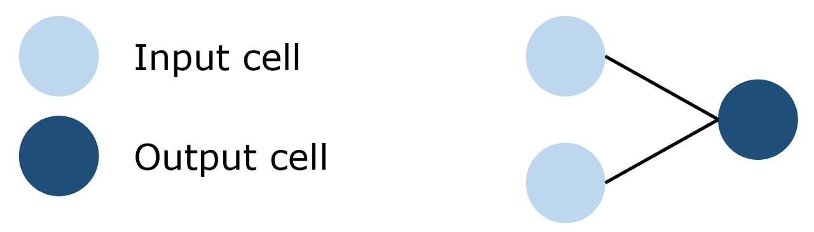

### 前馈网络(Feed-Forward)
前馈网络是感知器的集合，其中有三种基本类型的层: 输入层、隐藏层和输出层。 在每个连接过程中，来自前一层的信号被乘以一个权重，增加一个偏置，然后通过一个激活函数。 前馈网络使用反向传播迭代更新参数，直到达到理想的性能。 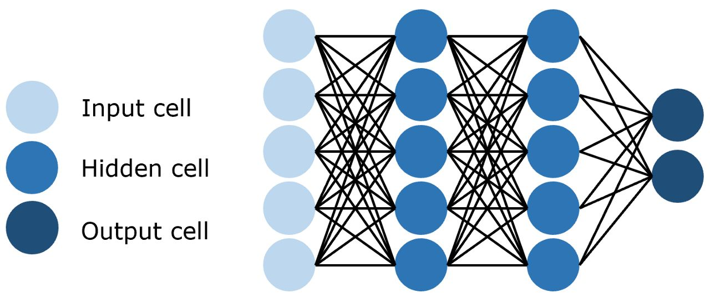

### 残差网络(Residual Networks/ResNet)
深层前馈神经网络的一个问题是所谓的梯度消失，即当网络太深时，有用的信息无法在整个网络中反向传播。 当更新参数的信号通过网络传播时，它会逐渐减少，直到网络前面部分的权重不再改变或者根本不再使用。

为了解决这个问题，残差网络使用跳过连接实现信号跨层传播。 通过使用这种不易受到影响的连接来减少梯度消失问题。 随着时间的推移，通过学习特征空间，网络学会了重建跳过的层，但训练更有效，因为它的梯度不容易消失和需要探索更少的特征空间。 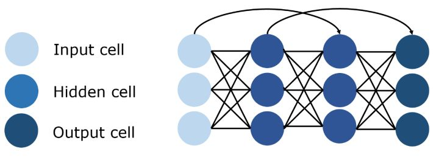

## 卷积网络

### 卷积神经网络(Convolutional Neural Network/CNN)
图像具有非常高的维数，因此训练一个标准的前馈网络来识别图像将需要成千上万的输入神经元，除了显而易见的高计算量，还可能导致许多与神经网络中的维数灾难相关的问题。 卷积神经网络提供了一个解决方案，利用卷积和池化层，来降低图像的维度。 由于卷积层是可训练的，但参数明显少于标准的隐藏层，它能够突出图像的重要部分，并向前传播每个重要部分。 传统的CNNs中，最后几层是隐藏层，用来处理“压缩的图像信息”。 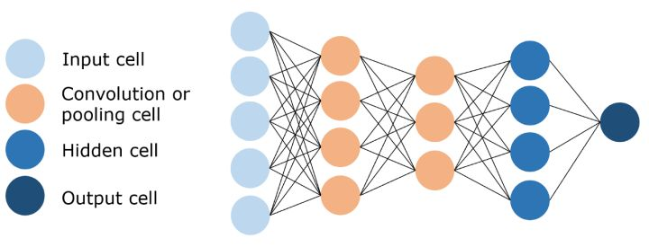

### 反卷积神经网络(Deconvolutional Neural Network)
正如它的名字所暗示的那样，反卷积神经网络与卷积神经网络操作相反。 DNN不是通过卷积来降低图像的维数，而是利用反卷积来创建图像，通常是从噪声中获得图像。 这本身就是一项艰巨的任务; 想象一下 CNN 的任务：用三句话写出奥威尔《1984》全书的总结摘要，而 DNN 的任务是把这三句话扩展成全本书。 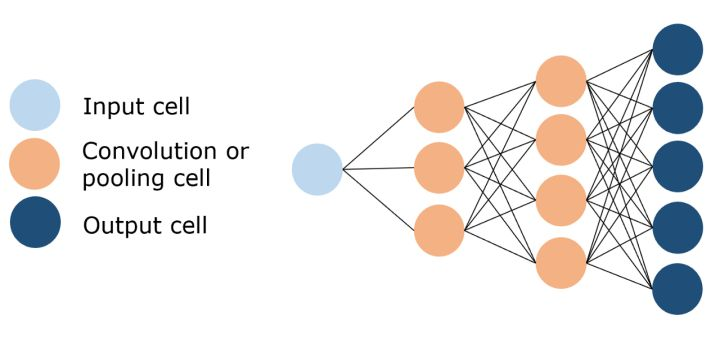

### 生成对抗网络(Generative Adversarial Network/GAN)
生成对抗网络是一种专门设计用于生成图像的网络，由两个网络组成: 一个鉴别器和一个生成器。 鉴别器的任务是区分图像是从数据集中提取的还是由生成器生成的，生成器的任务是生成足够逼真的图像，以至于鉴别器无法区分图像是否真实。

随着时间的推移，在谨慎的监督下，这两个对手相互竞争，彼此都想成功地改进对方。 最终的结果是一个训练有素的生成器，可以生成逼真的图像。 鉴别器是一个卷积神经网络，其目标是最大限度地提高识别真假图像的准确率，而生成器是一个反卷积神经网络，其目标是最小化鉴别器的性能。 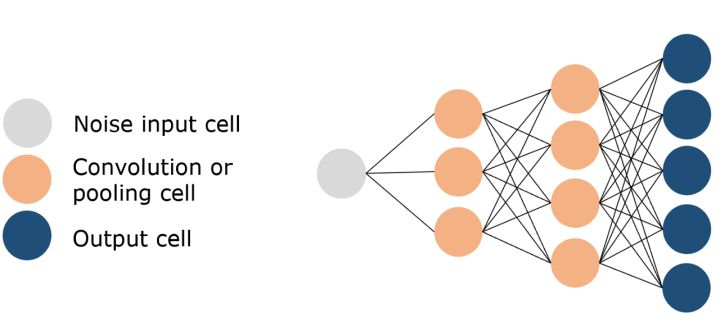

## 循环网络

### 循环神经网络(Recurrent Neural Network/RNN)
循环神经网络是一种特殊类型的网络，它包含环和自重复，因此被称为“循环”。 由于允许信息存储在网络中，RNNs 使用以前训练中的推理来对即将到来的事件做出更好、更明智的决定。 为了做到这一点，它使用以前的预测作为“上下文信号”。 由于其性质，RNNs 通常用于处理顺序任务，如逐字生成文本或预测时间序列数据(例如股票价格)。 它们还可以处理任意大小的输入。 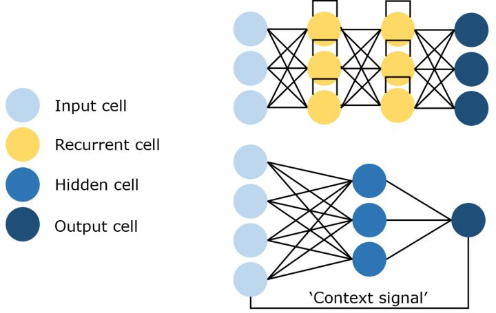

### 长短时记忆网络(Long Short Term Memory Network/LSTM)
由于上下文信息的范围在实践中是非常有限的，所以 RNNs 有个大问题。 给定的输入对隐藏层(即对网络的输出)输入的影响(反向传播误差) ，要么指数级爆炸，要么网络连接循环衰减为零。 解决这个梯度消失问题的方法是长短期记忆网络(LSTM)。

这种 RNN 结构是专门为解决梯度消失问题而设计的，结构中加入了内存块。 这些模块可以看作是计算机中的内存芯片——每个模块包含几个循环连接的内存单元和三个门(输入、输出和遗忘，相当于写入、读取和重置)。 该网络只能通过每个门与神经元进行互动，因此这些门学会智能地打开和关闭，以防止梯度爆炸或消失，但也通过“不断错误传送带”传播有用信息，以及丢弃不相关的内存内容。 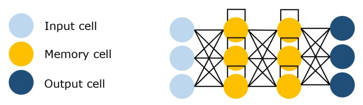 标准的 RNNs 在输入事件和目标信号之间的时间滞后大于5到10个时间步长时无法学习，LSTM 则不会受到影响，甚至连接时间滞后1,000个时间步长它都可以通过实施一个有用的常量误差流来学习。

### 回声状态网络(Echo State Networks/ESN)
回声状态网络是循环神经网络的一个变种，它有一个非常稀疏连接的隐藏层(通常是百分之一的连通性)。 神经元的连通性和权重是随机分配的，忽略层和神经元的差异(跳过连接)。 通过学习输出神经元的权重，使网络能够产生和再现特定的时间模式。 这个网络背后的原因是，尽管它是非线性的，但在训练过程中修改的权重只是突触连接，因此误差函数可以被微分为线性系统。 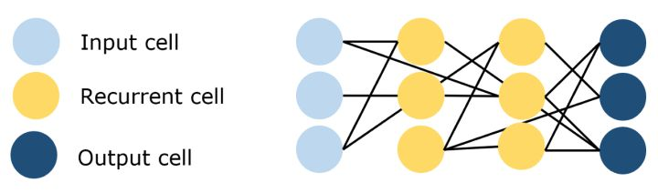

## 自编码器

### 自动编码器(Auto Encoder/AE)
自动编码器的基本思想是将原始的高维数据“压缩”成高信息量的低维数据，然后将压缩后的数据投影到一个新的空间中。 自动编码器有许多应用，包括降维、图像压缩、数据去噪、特征提取、图像生成和推荐系统。 它既可以是无监督的方法，也可以是有监督的，可以得到对数据本质的洞见。 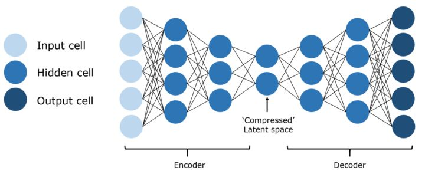

### 变分自动编码器(Variational Auto Encoder/VAE)
自动编码器学习一个输入（可以是图像或文本序列）的压缩表示，例如，压缩输入，然后解压缩回来匹配原始输入，而变分自动编码器学习表示的数据的概率分布的参数。 不仅仅是学习一个代表数据的函数，它还获得了更详细和细致的数据视图，从分布中抽样并生成新的输入数据样本。 从这个意义上说，它更像是一个纯粹的“生成”模型，就像一个 GAN。 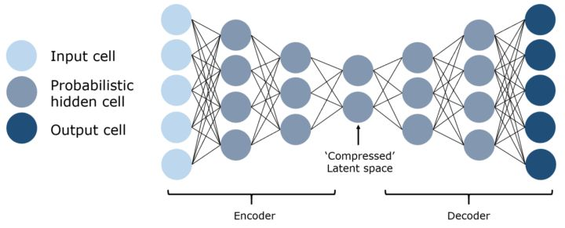

# Source
[https://zhuanlan.zhihu.com/p/152057236](https://zhuanlan.zhihu.com/p/152057236) [https://creativecoding.soe.ucsc.edu/courses/cs523/slides/week3/DeepLearning_LeCun.pdf](https://creativecoding.soe.ucsc.edu/courses/cs523/slides/week3/DeepLearning_LeCun.pdf) [http://www.bioinfo.org.cn/~casp/temp/DeepLearning.pdf](http://www.bioinfo.org.cn/~casp/temp/DeepLearning.pdf)
