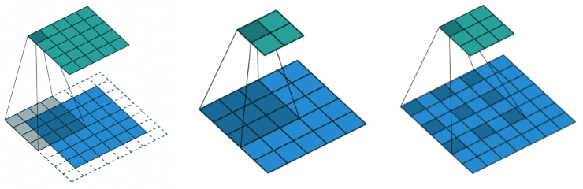
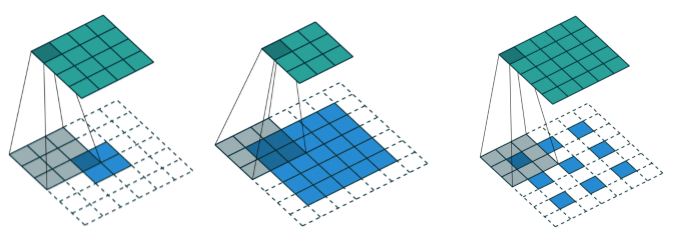
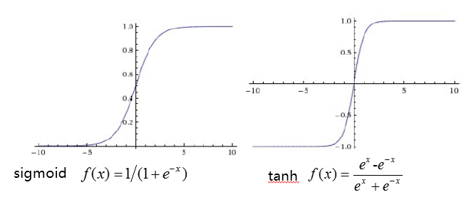
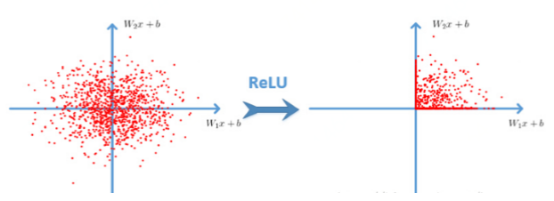
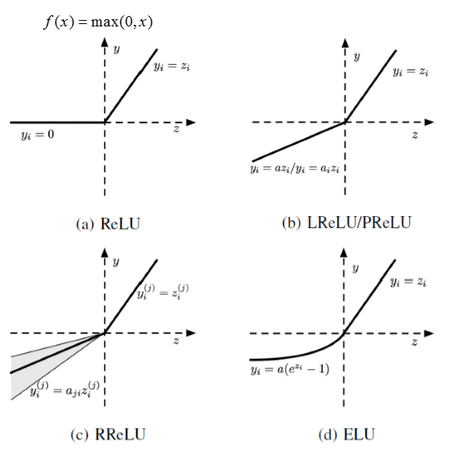
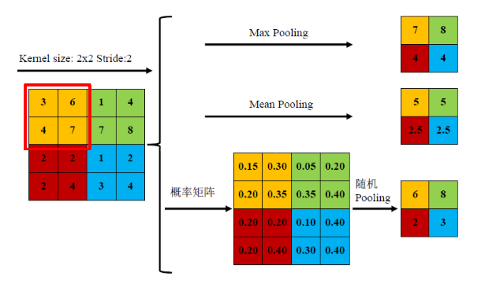
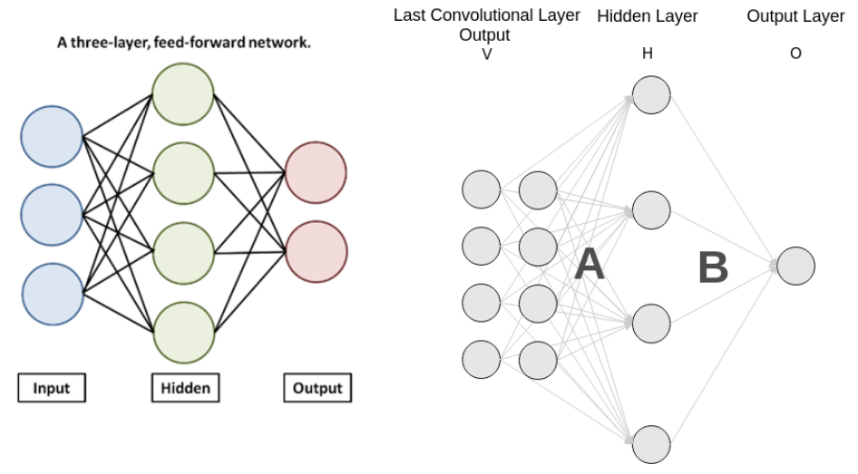

## 基本组成单元

卷积(Convolution)、激活函数(Active Function)、池化(Pooling)、全连接(Softmax)

### 卷积(Convolution) 
有padding，strides，dilation，transposed四种(对应下图前四个)。第五个为padding+strides，第六个为padding+strides+transposed。 

### 激活函数(Active Function) 

模仿人类神经元、非线性变换增强特征的表达能力、同时考虑优化时梯度消失问题 (轻轻抚摸一个人可能感觉不到，但重击一个人会有明显感觉，激活函数作相似事情，增加特征表达能力)

### 池化(Pooling) 

降低计算复杂度，增强特征的空间变换不变性

### 全连接(Softmax) 

全连接操作的特点：需要固定维度、参数多，计算量大，占整个网络的参数量、计算量的一半以上

## Code实现

[https://github.com/jiqizhixin/ML-Tutorial-Experiment/blob/master/Experiments/tf_Keras_CNN.ipynb](https://github.com/jiqizhixin/ML-Tutorial-Experiment/blob/master/Experiments/tf_Keras_CNN.ipynb)
