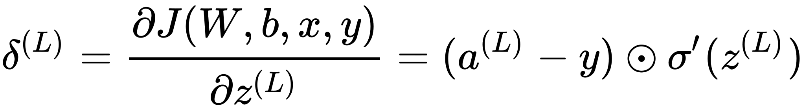
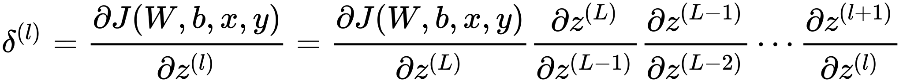

当我们使用前馈神经网络接收输入并产生输出时，信息通过网络向前流动。输入提供初始信息，然后传播到每一层的隐藏单元，最终产生输出，这称之为前向传播。在训练过程中，前向传播可以持续向前直到它产生一个标量代价函数。反向传播算法(Back Propagation)，允许来自代价函数的信息通过网络向后流动，以便计算梯度。建议边在[http://playground.tensorflow.org/](http://playground.tensorflow.org/)上操作，边看本文。

## 链式法则

微积分中的链式法则（为了不与概率中的链式法则相混淆）用于计算复合函数的导数。反向传播是一种计算链式法则的算法，使用高效的特定运算顺序。

设是实数，和是从实数映射到实数的函数。并且。那么链式法则是说：

我们可以将这种标量情况进行拓展。假设假设，，是从到的映射，是 到 的映射。如果并且，那么

使用向量记法，可以等价地写成 

这里是的的Jacobian矩阵。

通常我们将反向传播算法应用于任意维度的张量，而不仅仅用于向量。从概念上讲，这与使用向量的方向传播完全相同。唯一的区别是如何将数字排列称网格以形成张量。我们可以想象，在运行反向传播之前，将每个张量扁平为一个向量，计算一个向量值梯度，然后将该梯度重新构造成一个张量。从这种重新排列的观点上看，反向传播仍然只是将Jacobian乘以梯度。

## 反向传播

在进行DNN反向传播算法前，我们需要选择一个损失函数，来度量训练样本计算出的输出和真实的训练样本输出之间的损失。DNN可选择的损失函数有不少，为了专注算法，这里我们使用最常见的均方差来度量损失。当然，针对不同的任务，可以选择不同的损失函数。即对于每个样本，我们期望最小化下式：

其中，和为_维度的向量，而_为的范数。损失函数有了，现在我们开始用梯度下降法迭代求解每一层的和。

#### 第一步
首先是输出层（第层）。输出层的和满足下式：

这样对于输出层的参数，我们的损失函数变为：

这样求解和的梯度就简单了：

上面式子前两项之所以是Hadamard积形式，是因为都是针对同一层的神经元。如果我们考虑对于层的第个神经元，即，那么整合这一层的神经元，自然是这样Hadamard积的形式。

在第一个式子的最后是因为若，那么。

#### 第二步
我们注意到在求解输出层的和时，有公共的部分，因此我们可以把公共的部分即对先算出来，记为

根据第一步的公式我们可以把输出层的梯度计算出来，计算上一层 ，上上层...的梯度就需要步步递推了：对于第层的未激活输出，它的梯度可以表示为

如果我们可以依次计算出第层的，则该层的和就很好计算了，因为根据前向传播：

所以我们可以很方便的计算出第层的和的梯度如下

#### 第三步
现在问题的关键就是求了。这里我们使用数学归纳法，假设第层的已经求出，那我们如何求第 层的呢： 

可见，关键在于求解，而和的关系很容易求出：

这样可得

上式的意思是的每一列都是Hadamard积 ，将上式代入 ，得  

#### 总结

其实，对于更新每一层的的对应梯度，我们仔细观察整个过程，发现只需要四个公式就可以完整地进行更新。这就是著名的反向传播的四个公式。我们稍加改动，使其可以适用于多种损失函数，即：

   

### Source
[https://blog.csdn.net/anshuai_aw1/article/details/84666595](https://blog.csdn.net/anshuai_aw1/article/details/84666595) [https://arxiv.org/pdf/1411.2738.pdf](https://arxiv.org/pdf/1411.2738.pdf)

