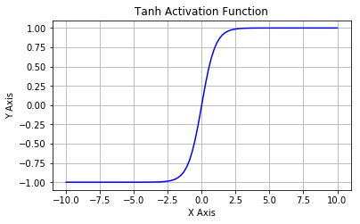
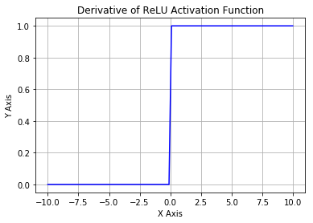

通过非线性学习部分，我们知道激活函数引入非线性，让神经网络可以解决非线性问题。如何选择隐藏单元的类型，即如何选择合适的激活函数，是一个非常活跃的研究领域，并且还没有许多明确的指导性理论原则。整流线性单元(ReLU)是隐藏单元极好的默认选择，许多隐藏单元也可用。建议边[http://playground.tensorflow.org/](http://playground.tensorflow.org/)上操作，边看本文。

- 右饱和：当x趋向于正无穷时，函数的导数趋近于0，此时称为右饱和。
- 左饱和：当x趋向于负无穷时，函数的导数趋近于0，此时称为左饱和。

当一个函数既满足右饱和又满足左饱和，则称为饱和函数，如Sigmoid和tanh，否则称为非饱和函数，如ReLU。

## [常用激活函数](https://keras-cn.readthedocs.io/en/latest/other/activations/)

### Sigmoid
Sigmoid又叫作 Logistic 激活函数，它将实数值压缩进 0 到 1 的区间内，还可以在预测概率的输出层中使用。该函数将大的负数转换成 0，将大的正数转换成 1。数学公式为：  下图展示了 Sigmoid 函数及其导数：   Sigmoid 函数的三个主要缺陷：

1. 梯度消失：注意：Sigmoid 函数趋近 0 和 1 的时候变化率会变得平坦，也就是说，Sigmoid 的梯度趋近于 0。神经网络使用 Sigmoid 激活函数进行反向传播时，输出接近 0 或 1 的神经元其梯度趋近于 0。这些神经元叫作饱和神经元。因此，这些神经元的权重不会更新。此外，与此类神经元相连的神经元的权重也更新得很慢。该问题叫作梯度消失。因此，想象一下，如果一个大型神经网络包含 Sigmoid 神经元，而其中很多个都处于饱和状态，那么该网络无法执行反向传播。
2. 不以零为中心：Sigmoid 输出不以零为中心的。
3. 计算成本高昂：exp() 函数与其他非线性激活函数相比，计算成本高昂。

### Tanh
  Tanh 激活函数又叫作双曲正切激活函数（hyperbolic tangent activation function）。与 Sigmoid 函数类似，Tanh 函数也使用真值，但 Tanh 函数将其压缩至-1 到 1 的区间内。与 Sigmoid 不同，Tanh 函数的输出以零为中心，因为区间在-1 到 1 之间。你可以将 Tanh 函数想象成两个 Sigmoid 函数放在一起。在实践中，Tanh 函数的使用优先性高于 Sigmoid 函数。负数输入被当作负值，零输入值的映射接近零，正数输入被当作正值。 唯一的缺点是：Tanh 函数也会有梯度消失的问题，因此在饱和时也会“杀死”梯度。

### ReLU
为了解决梯度消失问题，我们来讨论另一个非线性激活函数——修正线性单元（rectified linear unit，ReLU），该函数明显优于前面两个函数，是现在使用最广泛的函数。   从上图可以看到，ReLU 是从底部开始半修正的一种函数。数学公式为：

当输入 x<0 时，输出为 0，当 x> 0 时，输出为 x。该激活函数使网络更快速地收敛。它不会饱和，即它可以对抗梯度消失问题，至少在正区域（x> 0 时）可以这样，因此神经元至少在一半区域中不会把所有零进行反向传播。由于使用了简单的阈值化（thresholding），ReLU 计算效率很高。

但是 ReLU 神经元也存在一些缺点：

1. 不以零为中心：和 Sigmoid 激活函数类似，ReLU 函数的输出不以零为中心。
2. 前向传导（forward pass）过程中，如果 x < 0，则神经元保持非激活状态，且在后向传导（backward pass）中「杀死」梯度。这样权重无法得到更新，网络无法学习。当 x = 0 时，该点的梯度未定义，但是这个问题在实现中得到了解决，通过采用左侧或右侧的梯度的方式。

### Leaky ReLU
为了解决 ReLU 激活函数中的梯度消失问题，当 x < 0 时，我们使用 Leaky ReLU——该函数试图修复 dead ReLU 问题。  该函数试图缓解 dead ReLU 问题。数学公式为：

Leaky ReLU 的概念是：当 x < 0 时，它得到 0.1 的正梯度。该函数一定程度上缓解了 dead ReLU 问题，但是使用该函数的结果并不连贯。尽管它具备 ReLU 激活函数的所有特征，如计算高效、快速收敛、在正区域内不会饱和。Leaky ReLU 可以得到更多扩展。不让 x 乘常数项，而是让 x 乘超参数，这看起来比 Leaky ReLU 效果要好。该扩展就是 Parametric ReLU。

### Swish
 根据上图，我们可以观察到在 x 轴的负区域曲线的形状与 ReLU 激活函数不同，因此，Swish 激活函数的输出可能下降，即使在输入值增大的情况下。大多数激活函数是单调的，即输入值增大的情况下，输出值不可能下降。而 Swish 函数为 0 时具备单侧有界（one-sided boundedness）的特性，它是平滑、非单调的。

## 其他激活函数

### **Step**

激活函数 Step 更倾向于理论而不是实际，它模仿了生物神经元要么全有要么全无的属性。它无法应用于神经网络，因为其导数是 0（除了零点导数无定义以外），这意味着基于梯度的优化方法并不可行。

### **Identity**

通过激活函数 Identity，节点的输入等于输出。它完美适合于潜在行为是线性（与线性回归相似）的任务。当存在非线性，单独使用该激活函数是不够的，但它依然可以在最终输出节点上作为激活函数用于回归任务。

### **PReLU**

参数化修正线性单元（Parameteric Rectified Linear Unit，PReLU）属于 ReLU 修正类激活函数的一员。它和 RReLU 以及 Leaky ReLU 有一些共同点，即为负值输入添加了一个线性项。而最关键的区别是，这个线性项的斜率实际上是在模型训练中学习到的。

### **RReLU**

随机带泄露的修正线性单元（Randomized Leaky Rectified Linear Unit，RReLU）也属于 ReLU 修正类激活函数的一员。和 Leaky ReLU 以及 PReLU 很相似，为负值输入添加了一个线性项。而最关键的区别是，这个线性项的斜率在每一个节点上都是随机分配的（通常服从均匀分布）。

### **ELU**
 指数线性单元（Exponential Linear Unit，ELU）也属于 ReLU 修正类激活函数的一员。和 PReLU 以及 RReLU 类似，为负值输入添加了一个非零输出。和其它修正类激活函数不同的是，它包括一个负指数项，从而防止静默神经元出现，导数收敛为零，从而提高学习效率。

### **SELU**

扩展指数线性单元（Scaled Exponential Linear Unit，SELU）是激活函数指数线性单元（ELU）的一个变种。其中λ和α是固定数值（分别为 1.0507 和 1.6726）。这些值背后的推论（零均值/单位方差）构成了自归一化神经网络的基础（SNN）。

### **SReLU**

S 型整流线性激活单元（S-shaped Rectified Linear Activation Unit，SReLU）属于以 ReLU 为代表的整流激活函数族。它由三个分段线性函数组成。其中两种函数的斜度，以及函数相交的位置会在模型训练中被学习。

### **Hard Sigmoid**

Hard Sigmoid 是 Logistic Sigmoid 激活函数的分段线性近似。它更易计算，这使得学习计算的速度更快，尽管首次派生值为零可能导致静默神经元/过慢的学习速率（详见 ReLU）。

### **Hard Tanh**

Hard Tanh 是 Tanh 激活函数的线性分段近似。相较而言，它更易计算，这使得学习计算的速度更快，尽管首次派生值为零可能导致静默神经元/过慢的学习速率（详见 ReLU）。

### **LeCun Tanh**

LeCun Tanh（也被称作 Scaled Tanh）是 Tanh 激活函数的扩展版本。它具有以下几个可以改善学习的属性：f(± 1) = ±1；二阶导数在 x=1 最大化；且有效增益接近 1。

### **ArcTan**

视觉上类似于双曲正切（Tanh）函数，ArcTan 激活函数更加平坦，这让它比其他双曲线更加清晰。在默认情况下，其输出范围在-π/2 和π/2 之间。其导数趋向于零的速度也更慢，这意味着学习的效率更高。但这也意味着，导数的计算比 Tanh 更加昂贵。

### **SoftSign**

SoftSign 是 Tanh 激活函数的另一个替代选择。就像 Tanh 一样，SoftSign 是反对称、去中心、可微分，并返回-1 和 1 之间的值。其更平坦的曲线与更慢的下降导数表明它可以更高效地学习。另一方面，导数的计算比 Tanh 更麻烦。

### SoftPlus

作为 ReLU 的一个不错的替代选择，SoftPlus 能够返回任何大于 0 的值。与 ReLU 不同，SoftPlus 的导数是连续的、非零的，无处不在，从而防止出现静默神经元。然而，SoftPlus 另一个不同于 ReLU 的地方在于其不对称性，不以零为中心，这兴许会妨碍学习。此外，由于导数常常小于 1，也可能出现梯度消失的问题。

### **Signum**

激活函数 Signum（或者简写为 Sign）是二值阶跃激活函数的扩展版本。它的值域为 [-1,1]，原点值是 0。尽管缺少阶跃函数的生物动机，Signum 依然是反对称的，这对激活函数来说是一个有利的特征。

### **Bent Identity**

激活函数 Bent Identity 是介于 Identity 与 ReLU 之间的一种折衷选择。它允许非线性行为，尽管其非零导数有效提升了学习并克服了与 ReLU 相关的静默神经元的问题。由于其导数可在 1 的任意一侧返回值，因此它可能容易受到梯度爆炸和消失的影响。

### **Symmetrical Sigmoid**

Symmetrical Sigmoid 是另一个 Tanh 激活函数的变种（实际上，它相当于输入减半的 Tanh）。和 Tanh 一样，它是反对称的、零中心、可微分的，值域在 -1 到 1 之间。它更平坦的形状和更慢的下降派生表明它可以更有效地进行学习。

### **Log Log**

Log Log 激活函数（由上图 f(x) 可知该函数为以 e 为底的嵌套指数函数）的值域为 [0,1]，Complementary Log Log 激活函数有潜力替代经典的 Sigmoid 激活函数。该函数饱和地更快，且零点值要高于 0.5。

### **Gaussian**

高斯激活函数（Gaussian）并不是径向基函数网络（RBFN）中常用的高斯核函数，高斯激活函数在多层感知机类的模型中并不是很流行。该函数处处可微且为偶函数，但一阶导会很快收敛到零。

### **Absolute**

顾名思义，绝对值（Absolute）激活函数返回输入的绝对值。该函数的导数除了零点外处处有定义，且导数的量值处处为 1。这种激活函数一定不会出现梯度爆炸或消失的情况。

### **Sinusoid**

如同余弦函数，Sinusoid（或简单正弦函数）激活函数为神经网络引入了周期性。该函数的值域为 [-1,1]，且导数处处连续。此外，Sinusoid 激活函数为零点对称的奇函数。

### **Cos**

如同正弦函数，余弦激活函数（Cos/Cosine）为神经网络引入了周期性。它的值域为 [-1,1]，且导数处处连续。和 Sinusoid 函数不同，余弦函数为不以零点对称的偶函数。

### **Sinc**

Sinc 函数（全称是 Cardinal Sine）在信号处理中尤为重要，因为它表征了矩形函数的傅立叶变换（Fourier transform）。作为一种激活函数，它的优势在于处处可微和对称的特性，不过它比较容易产生梯度消失的问题。

## Source
[26种神经网络激活函数可视化](https://www.jiqizhixin.com/articles/2017-10-10-3) [一文概览深度学习中的激活函数](https://www.jiqizhixin.com/articles/2017-11-02-26) [激活函数Activations - Keras中文文档](https://keras-cn.readthedocs.io/en/latest/other/activations/)
