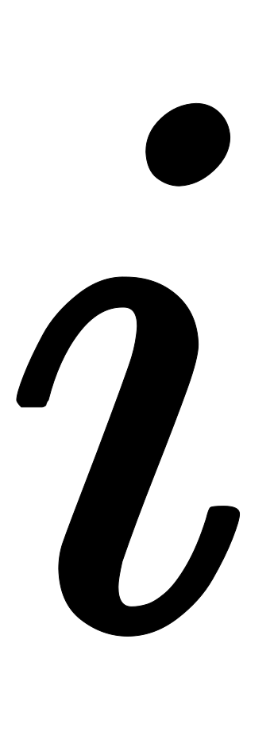
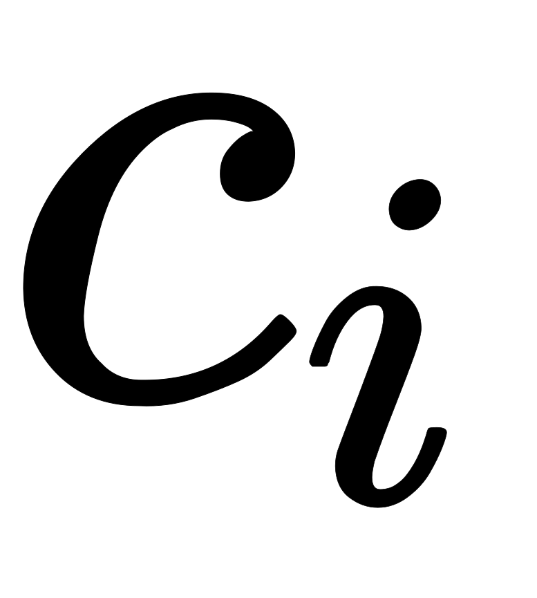

在Encoder-Decoder结构（即Seq2Seq，N vs. M）中，Encoder把所有的输入序列都编码成一个统一的语义特征再解码，因此， 中必须包含原始序列中的所有信息，它的长度就成了限制模型性能的瓶颈。如机器翻译问题，当要翻译的句子较长时，一个可能存不下那么多信息，就会造成翻译精度的下降。

或者

Attention机制通过在每个时间输入不同的来解决这个问题，下图是带有Attention机制的Decoder：

每一个会自动去选取与当前所要输出的最合适的上下文信息。具体来说，我们用衡量Encoder中第阶段的和解码时第阶段的相关性，最终Decoder中第i阶段的输入的上下文信息就来自于所有对的加权和。

以机器翻译为例（将中文翻译成英文）：

输入的序列是“我爱中国”，因此，Encoder中的就可以分别看做是“我”、“爱”、“中”、“国”所代表的信息。在翻译成英语时，第一个上下文应该和“我”这个字最相关，因此对应的就比较大，而相应的就比较小。应该和“爱”最相关，因此对应的就比较大。最后的和最相关，因此的值就比较大。

至此，关于Attention模型，我们就只剩最后一个问题了，那就是：这些权重是怎么来的？事实上，同样是从模型中学出的，它实际和Decoder的第阶段的隐状态、Encoder第个阶段的隐状态有关。

同样还是拿上面的机器翻译举例，的计算（此时箭头就表示对和同时做变换）：

计算：  

计算： 

计算： 

以上就是带有Attention的Encoder-Decoder模型计算的全过程。

## Source
[完全图解RNN、RNN变体、Seq2Seq、Attention机制](https://zhuanlan.zhihu.com/p/28054589)
