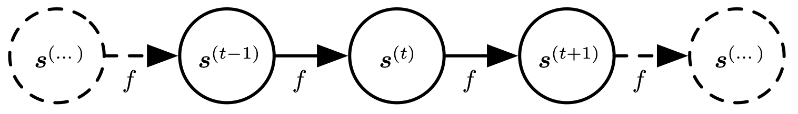
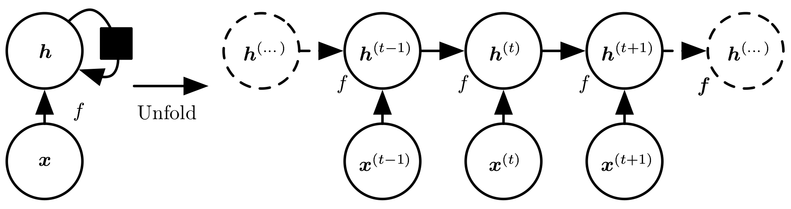

计算图是形式化一组计算结构的方式，如那些涉及将输入和参数映射到输出和损失的计算。我们对展开递归或循环计算得到的重复结构进行解释，这些重复结构通常对应于一个事件链。展开这个计算图将导致深度网络结构中的参数共享。例如，考虑动态系统的经典形式：

其中称为系统的状态。在时刻的定义需要参考时刻时同样的定义。因此上式是循环的。对有限时间步，次应用这个定义可以展开这个图。例如，我们对上式展开，可以得到

以这种方式重复应用定义，展开等式，就能得到不涉及循环的表达。现在我们可以使用传统的有向无环图呈现这样的表达，如下图

作为另一个例子，让我们考虑由外部信号驱动的动态系统。

我们可以看到，当前状态包含了整个过去序列的信息。

循环神经网络可以通过许多不同的方式建立。就像几乎所有函数都可以被认为是前馈网络，本质上任何涉及循环的函数都可以视为一个循环神经网络。很多循环神经网络使用下式或类似的公式定义隐藏单元的值。为了表明状态是网络的隐藏单元，我们使用变量代表状态重写式：

如下图所示，典型RNN会增加额外的架构特性，如读取状态信息进行预测的输出层。

当训练循环网络根据过去预测未来时，网络通常要学会使用作为过去序列（直到）与任务相关方面的有损摘要。此摘要一般而言一定是有损的，因为其映射任意长度的序列到一固定长度的向量。根据不同的训练准则，摘要可能选择性地精确保留过去序列的某些方面。例如，如果在统计语言模型中使用RNN，通常给定前一个词预测下一个词，可能没有必要存储时刻前输入序列中的所有信息；而仅仅存储足够预测句子其余部分的信息。最苛刻的情况是我们要求足够丰富，并能大致恢复输入序列，如自编码器框架。

展开图的大小取决于序列长度，我们可以用一个函数代表经步展开后的循环：

函数将全部的过去序列作为输入来生成当前状态，但是展开的循环架构允许我们将分解为函数的重复应用。因此，展开过程引入两个主要优点：

- 无论序列的长度，学成的模型始终具有相同的输入大小，因此它指定的是从一种状态到另一种状态的转移，而不是在可变长度的历史状态上操作。
- 我们可以在每个时间步使用相同参数的相同转移函数。

这两个因素使得学习在所有时间步和所有序列长度上操作单一的模型是可能的，而不需要在所有可能时间步学习独立的模型。学习单一的共享模型允许泛化到没有见过的序列长度（没有出现在训练集中），并且估计模型所需的训练样本远远少于不带参数共享的模型。

无论是循环图和展开图都有其用途。循环图简洁。展开图能够明确描述其中的计算流程。展开图还通过显式的信息流动路径帮助说明信息在时间上向前（计算输出和损失）和向后（计算梯度）的思想。
