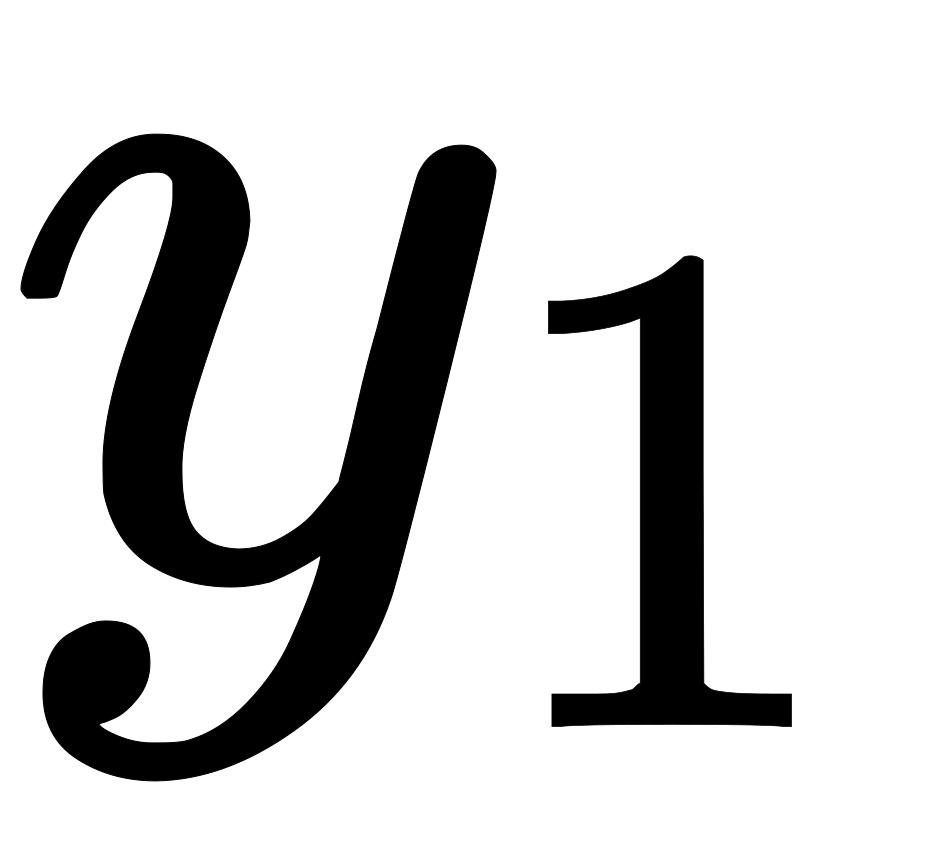
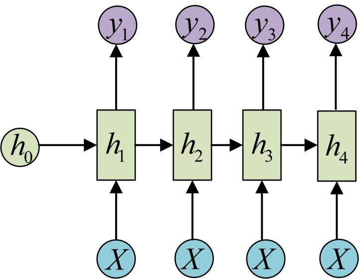
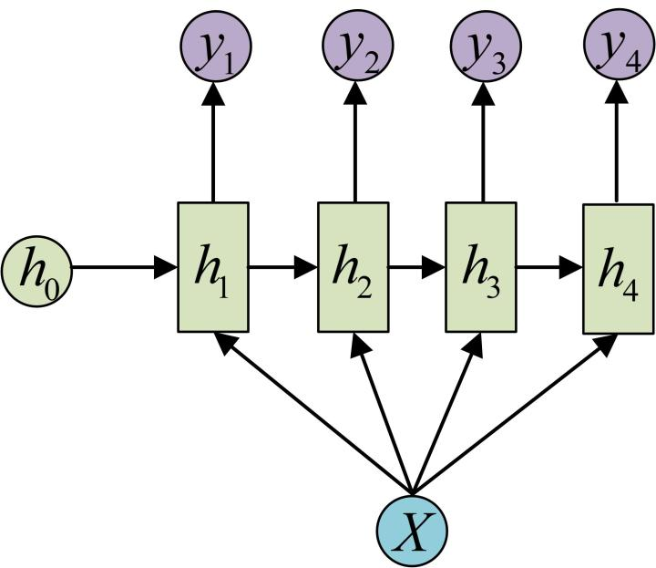
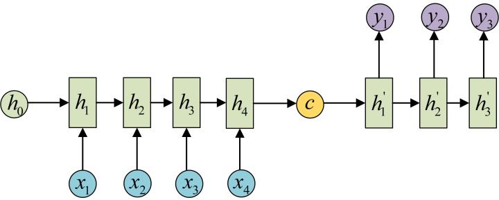
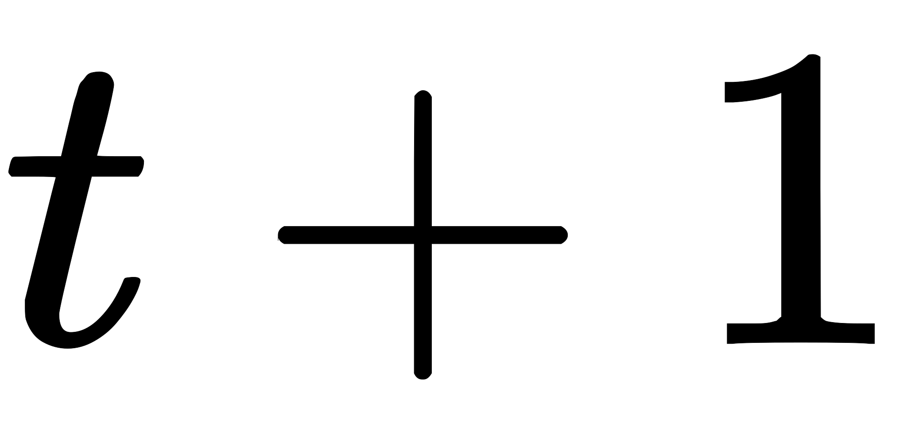
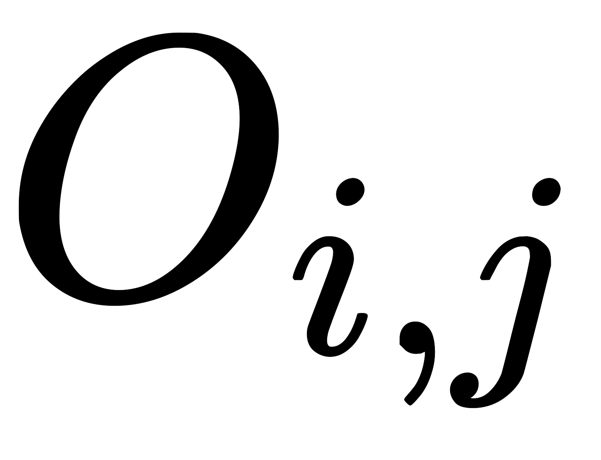

## 网络结构

### 单层网络

在学习RNN之前，首先要了解一下最基本的单层网络，它的结构如图：

输入是，经过变换和激活函数得到输出。相信大家对这个已经非常熟悉了。

### 经典的RNN结构（N vs. N）

在实际应用中，我们还会遇到很多序列形的数据，比如：

- 自然语言处理问题。可以看做是第一个单词，可以看做是第二个单词，依次类推。
- 语音处理。此时，是每帧的声音信号。
- 时间序列问题。例如每天的股票价格等等。

序列形的数据就不太好用原始的神经网络处理了。为了建模序列问题，RNN引入了隐状态（hidden state）的概念，可以对序列形的数据提取特征，接着再转换为输出。先从的计算开始看：

图示中记号的含义是：

- 圆圈或方块表示的是向量。
- 一个箭头表示对该向量做一次变换。上图中和分别有一个箭头连接，就表示对和各做了一次变换。

在很多论文中也会出现类似的记号，初学的时候很容易搞乱，但只要把握住以上两点，就可以比较轻松地理解图示背后的含义。

的计算和类似。要注意的是，在计算时，每一步使用的参数，，都是一样的，也就是说每个步骤的参数都是共享的，这是RNN的重要特点，一定要牢记。

依次计算剩下来的（使用相同的参数，，）：

我们这里为了方便起见，只画出序列长度为4的情况，实际上，这个计算过程可以无限地持续下去。 我们目前的RNN还没有输出，得到输出值的方法就是直接通过进行计算：

正如之前所说，一个箭头就表示对对应的向量做一次类似于的变换，这里的这个箭头就表示对进行一次变换，得到输出。剩下的输出类似进行（使用和同样的参数和）：

OK！大功告成！这就是最经典的RNN结构，我们像搭积木一样把它搭好了。它的输入是，输出为，也就是说，输入和输出序列必须要是等长的。由于这个限制的存在，经典RNN的适用范围比较小，但也有一些问题适合用经典的RNN结构建模，如：

- 计算视频中每一帧的分类标签。因为要对每一帧进行计算，因此输入和输出序列等长。
- 输入为字符，输出为下一个字符的概率。这就是著名的[Char RNN](http://karpathy.github.io/2015/05/21/rnn-effectiveness/)，Char RNN可以用来生成文章，诗歌，甚至是代码，非常有意思。

### N vs. 1

有的时候，我们要处理的问题输入是一个序列，输出是一个单独的值而不是序列，应该怎样建模呢？实际上，我们只在最后一个上进行输出变换就可以了：

这种结构通常用来处理序列分类问题。如输入一段文字判别它所属的类别，输入一个句子判断其情感倾向，输入一段视频并判断它的类别等等。

### 1 vs. N

输入不是序列而输出为序列的情况怎么处理？我们可以只在序列开始进行输入计算：

还有一种结构是把输入信息作为每个阶段的输入：

下图省略了一些的圆圈，是一个等价表示：

这种1 VS N的结构可以处理的问题有：

- 从图像生成文字（image caption），此时输入的就是图像的特征，而输出的序列就是一段句子
- 从类别生成语音或音乐等

### Seq2Seq或Encoder-Decoder（N vs. M）

下面我们来介绍RNN最重要的一个变种：N vs M。这种结构又叫Encoder-Decoder模型，也可以称之为Seq2Seq模型。原始的N vs. N RNN要求序列等长，然而我们遇到的大部分问题序列都是不等长的，如机器翻译中，源语言和目标语言的句子往往并没有相同的长度。

为此，Encoder-Decoder结构先将输入数据编码成一个上下文向量：

得到有多种方式，最简单的方法就是把Encoder的最后一个隐状态赋值给，还可以对最后的隐状态做一个变换得到，也可以对所有的隐状态做变换。拿到之后，就用另一个RNN网络对其进行解码，这部分RNN网络被称为Decoder。具体做法就是将当做之前的初始状态输入到Decoder中：

还有一种做法是将当做每一步的输入：

由于这种Encoder-Decoder结构不限制输入和输出的序列长度，因此应用的范围非常广泛，比如：

- 机器翻译。Encoder-Decoder的最经典应用，事实上这一结构就是在机器翻译领域最先提出的
- 文本摘要。输入是一段文本序列，输出是这段文本序列的摘要序列。
- 阅读理解。将输入的文章和问题分别编码，再对其进行解码得到问题的答案。
- 语音识别。输入是语音信号序列，输出是文字序列。
- ... ... ...

---

## 网络计算

### 前向传播

现在我们研究每个时间步都有输出，并且隐藏单元之间有循环连接的循环网络的前向传播公式，即下图

这幅图描述了在序列索引号附近RNN的模型。其中：

- 代表在序列时训练样本的输入。和代表在序列索引号和时训练样本的输入。
- 代表在序列时模型的隐藏状态。是由和共同决定。
- 代表在序列时模型的输出。只由模型当前的隐藏状态决定。
- 代表在序列时模型的损失函数。
- 代表在序列时训练样本序列的真实输出。
- 这三个矩阵是我们的模型的线性关系参数，它在整个RNN网络中是共享的。也正因为是共享的，它体现了RNN的模型的“循环反馈”的思想。

有了上面的模型，RNN的前向传播算法就很容易得到了：

对于任意一个序列索引号，我们隐藏状态由和得到：

其中为RNN的激活函数，一般为tanh，[RNN为什么采用tanh而不是ReLU](https://www.zhihu.com/question/61265076/answer/186347780)，为线性关系的偏倚。

序列索引号时的模型的输出的表达式比较简单：

在最终在序列索引号时我们的预测输出为：

通常RNN是分类模型，所以上面这个激活函数一般是softmax。

通过损失函数，比如对数似然损失函数，我们可以量化模型在当前位置的损失，即和差距

### 反向传播

RNN反向传播算法的思路和DNN是一样的，即通过梯度下降法一轮轮的迭代，得到合适的RNN模型参数。由于我们是基于时间反向传播，所以RNN的反向传播有时也叫做BPTT（back-propagation through time）。当然这里的BPTT和DNN也有很大的不同点，即这里所有的在序列的各个位置是共享的，反向传播时我们更新的是相同的参数。

为了简化描述，这里的损失函数我们为对数损失函数，输出的激活函数为softmax函数，隐藏层的激活函数为tanh函数。对于RNN，由于我们在序列的每个位置都有损失函数，因此最终的损失为：

由，可计算的梯度：

 

对于的求导，，由于激活函数是softmax，损失函数是对数损失，因此该推导过程与[深度学习（二）：DNN损失函数和激活函数的选择](https://blog.csdn.net/anshuai_aw1/article/details/84666595)里的公式（4）完全一样。

对于的求导，为什么会放在后面，那是因为在实际矩阵求导得链式法则里面，对于两步的链式法则：

（1）如果是**标量对矩阵求导**改成链式法则，那么求导得后半部分不用提前。比如，，为标量，为矩阵，则：

（2）如果是**标量对向量求导**改成链式法则，那么求导得后半部分不用提前。比如，，为标量，为向量，则：

但是的梯度计算就比较复杂了。从RNN的模型可以看出，在反向传播时，在某一序列位置的梯度损失由当前位置的输出对应的梯度损失和序列索引位置时的梯度损失两部分共同决定。对于在某一序列位置的梯度损失需要反向传播一步步的计算。我们定义序列索引位置的隐藏状态的梯度为

这里我们可以像DNN一样从递推  

上面第一个公式中两部分相加的原因是：

    

所以对求导时，要分别经过和对进行求导。

的导数是，这是显然的。重点是的导数怎么求。根据公式

在前面我们假设隐含层的激活函数是tanh，即，它的导数为。结合[深度学习（一）：DNN前向传播算法和反向传播算法](https://blog.csdn.net/anshuai_aw1/article/details/84615935)中公式（12），有

这里是双曲正切激活函数，矩阵中对角线元素表示向量中各个值的导数，可以去掉哈达马乘积，转化为矩阵乘法

对于，正确的运算顺序应该是先（注意这里的哈德玛乘积的意思，即个元素对应位置相乘，并非乘以），然后再用与上面的结果运算。即先进行哈德玛乘积。

有了，计算就容易了，这里给出对应的梯度计算表达式：

  

## 双向RNN

前为止我们考虑的所有循环神经网络有一个“因果”结构，意味着在时刻的状态只能从过去的序列以及当前的输入捕获信息。然而，在许多应用中，我们要输出的的预测可能依赖于整个输入序列。例如，在语音识别中，由于协同发音，当前声音作为音素的正确解释可能取决于未来几个音素，甚至潜在的可能取决于未来的几个词，因为词与附近的词之间的存在语义依赖：如果当前的词有两种声学上的合理的解释，我们可能要在更远的未来（和过去）寻找信息区分它们。这在手写识别和许多其他序列到序列学习的任务中也是如此。

双向循环神经网络（或双向RNN）为满足这种需要而被发明。顾名思义，双向RNN结合时间上从序列起点开始移动的RNN和另一个时间上从序列末尾开始移动的RNN。下图展示了典型的双向RNN，其中代表通过时间向前移动的子RNN的状态，代表通过时间向后移动的子RNN的状态。这允许输出单元能够计算同时依赖于过去和未来且对时刻的输入值最敏感的表示，而不必指定周围固定大小的窗口。

这个想法可以自然地扩展到维输入，如图像，由四个RNN组成，每一个沿着四个方向中的一个计算：上、下、左、右。如果RNN能够学习到承载长期信息，那在维网格每个点的输出就能计算一个能捕捉到大多局部信息但仍依赖于长期输入的表示。相比卷积网络，应用于图像的RNN计算成本通常更高，但允许同一特征图的特征之间存在长期横向的相互作用。实际上，对于这样的RNN，前向传播公式可以写成表示使用卷积的形式，计算自底向上到每一层的输入（在整合横向相互作用的特征图的循环传播之前）。

## Source
[https://zhuanlan.zhihu.com/p/28054589](https://zhuanlan.zhihu.com/p/28054589) [https://blog.csdn.net/anshuai_aw1/article/details/85163572](https://blog.csdn.net/anshuai_aw1/article/details/85163572) [https://blog.csdn.net/anshuai_aw1/article/details/84666595](https://blog.csdn.net/anshuai_aw1/article/details/84666595) [https://blog.csdn.net/anshuai_aw1/article/details/84615935](https://blog.csdn.net/anshuai_aw1/article/details/84615935)
