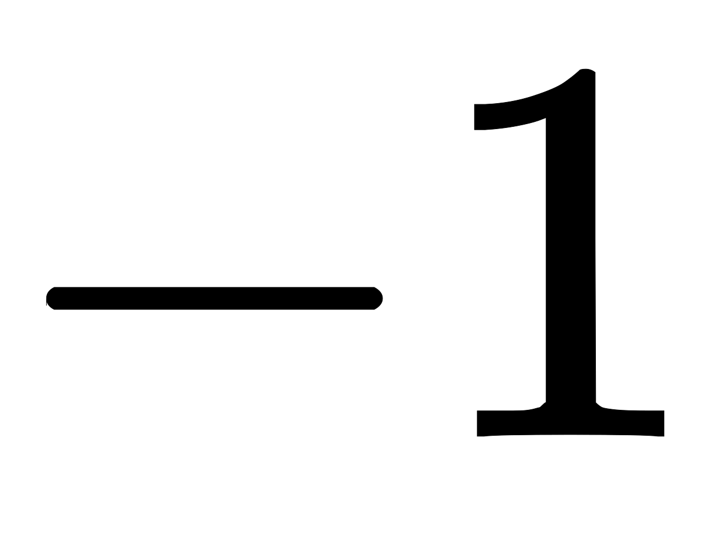
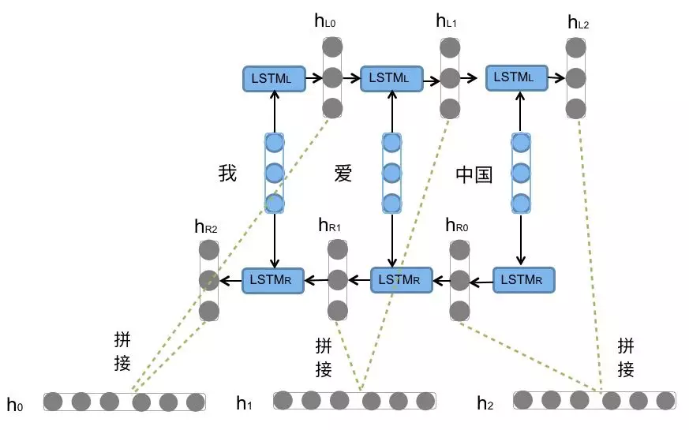

## RNN长期记忆的依赖问题

RNN的一个特点就是可以结合之前的信息解决当前的任务，比如利用视频前几帧来帮助理解视频当前帧的内容。有时，我们只需要关注近邻的信息就可以解决当前任务，比如我们预测“云彩飘在天”这句话最后一个词，我们很容易得到“天”。这种情况下，相关信息与当前任务距离很小，RNN完全能利用之前信息解决问题

然而，有很多情况是需要更多地信息才能解决任务。比如我们还是预测最后一个词，但是这次是一大段话“我成长在法国....我能说一口流利的法语”。近邻相关信息确定最后这个词要给一种语言，然而需要这一段的第一句话，一开头的“法国”作为有效信息才能预测出“法语”。这个距离间隔就很大了。很不幸的是，随着间隔距离增大，RNN有时不能学到那些关联的有效信息。

理论上，RNN完全能解决这个长期记忆的依赖问题，只需要设置合理的参数就可以。然而实际中，很困难，具体原因可见这两篇paper：[Hochreiter (1991) [German]](http://people.idsia.ch/~juergen/SeppHochreiter1991ThesisAdvisorSchmidhuber.pdf) and [Bengio, et al. (1994)](http://www-dsi.ing.unifi.it/~paolo/ps/tnn-94-gradient.pdf)。

## LSTM网络

长短期记忆网络（Long Short Term Memory networks(LSTMs)）是一种特殊的RNN，旨在避免长期记忆的依赖问题。所有循环神经网络都具有神经网络重复模块链的形式。在标准RNNs中，这个重复模块有很简单的结构，比如tanh层，如下图。

LSTMs也有这样的链式结构，但是重复模块也些许区别。不同于标准RNN的一层（比如上例tanh），LSTM的更新模块具有4个不同的层相互作用，如下图。

在上图中，每一行都携带一个完整的向量，从一个节点的输出到其他节点的输入。粉色圆圈表示逐点运算，如矢量加法，而黄色框表示神经网络层。行合并表示连接，而行分叉表示其内容被复制，副本将转移到不同的位置。

## LSTM的核心思想

从上一部分的图中可以看出，在每个序列索引位置时刻向前传播的除了和RNN一样的隐藏状态，还多了另一个隐藏状态，如下图中上面的长横线。这个隐藏状态我们一般称为细胞状态(Cell State)，是LSTM的关键。细胞状态有点像传送带。它直接沿着整个链运行，只有一些微小的线性相互作用。信息很容易沿着它不变地流动。

LSTM能够移除或添加信息到细胞状态，由称为门(Gates)的结构进行调节。门会选择性的让信息穿过。它们是由sigmoid神经网络层和逐点乘法运算组成。sigmoid层输出到之间的数字，描述每个组件应该通过多少。值为意味着“不让任何东西通过”，而值为则意味着“让一切都通过！”

LSTM在在每个序列索引位置的门一般包括遗忘门，输入门和输出门三种来保护和控制细胞状态。

## LSTM整体流程

### 步骤一：遗忘

LSTM的第一步是确定我们将从细胞状态中丢弃的信息。这个决定是由称为“遗忘门层”的Sigmoid层决定的。这里的是指Sigmoid函数，对于状态矩阵当中每个输入的值，都会有对应的一个输出的值，输出的值在之间，相当于是决定了遗忘多少部分。如果输出值为，说明全部保留，不删除原本的记忆，如果是，说明状态矩阵对应的这个值全部删除。

### 步骤二：输入

下一步是确定我们将在细胞状态中存储哪些新信息。这里有两部分同时进行：第一部分使用了sigmoid激活函数，输出为，决定哪些值我们将进行更新；第二部分使用了tanh函数创建新候选值的向量，此向量可被加至状态。下一步，我们结合这两者给状态来创建一个更新。

### 步骤三：更新

现在更新旧细胞状态至：我们将旧状态乘以，忘记我们之前决定忘记的事情。然后我们添加。这是新的候选值，根据我们决定更新每个状态的值来缩放。

### 步骤四：输出

最后，我们需要决定我们要输出的内容。此输出将基于我们的细胞状态，但将是过滤版本。首先，我们运行一个sigmoid来决定细胞状态的哪些部分会被输出。然后，我们将细胞状态代入tanh（将值转化到介于和之间）并将其乘以sigmoid门的输出，以便我们只输出我们决定的部分。

## BiLSTM

双向LSTM（BiLSTM）和双向RNN所述同理，有些时候预测可能需要由前面若干输入和后面若干输入共同决定，这样会更加准确。因此提出了双向循环神经网络，网络结构如下图。

可以看到Forward层和Backward层共同连接着输出层，其中包含了个共享权值。

在Forward层从时刻到时刻正向计算一遍，得到并保存每个时刻向前隐含层的输出。在Backward层沿着时刻到时刻反向计算一遍，得到并保存每个时刻向后隐含层的输出。最后在每个时刻结合Forward层和Backward层的相应时刻输出的结果得到最终的输出，用数学表达式如下：

  

例子：前向的LSTM与后向的LSTM结合成BiLSTM。比如，我们对“我爱中国”这句话进行编码，模型下图所示

前向的LSTM依次输入“我”，“爱”，“中国”得到三个向量。后向的LSTM依次输入“中国”，“爱”，“我”得到三个向量。最后将前向和后向的隐向量进行拼接得到，即。

对于情感分类任务来说，我们采用的句子的表示往往是。因为其包含了前向与后向的所有信息，如下图 

## Source

[http://colah.github.io/posts/2015-08-Understanding-LSTMs/](http://colah.github.io/posts/2015-08-Understanding-LSTMs/) [https://blog.csdn.net/anshuai_aw1/article/details/85168486](https://blog.csdn.net/anshuai_aw1/article/details/85168486) [http://www.tensorflownews.com/2018/05/04/keras_lstm/](http://www.tensorflownews.com/2018/05/04/keras_lstm/) [https://www.jiqizhixin.com/articles/2018-10-24-13](https://www.jiqizhixin.com/articles/2018-10-24-13)
