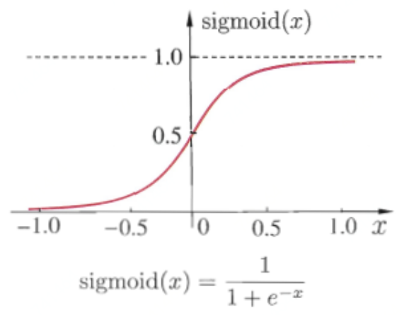

# 学习vs优化
用于深度模型训练的优化算法与传统的优化算法在几个方面有所不同。机器学习通常是间接作用的。在大多数机器学习问题中，我们关注某些性能度量，其定义于测试集上并且可能是不可解的。因此，我们只是间接地优化。我们希望通过降低代价函数来提高。这一点与纯优化不同，纯优化最小化目标本身。训练深度模型的优化算法通常也会包括一些针对机器学习目标函数的特定结构进行的特化。通常，代价函数可写为训练集上的平均，如

其中是每个样本的损失函数，是输入时所预测的输出，是经验分布。监督学习中，是目标输出。在本章中，我们会介绍不带正则化的监督学习，的变量是和。不难将这种监督学习扩展成其他形式，如包括或者作为参数，或是去掉参数，以发展不同形式的正则化或是无监督学习。

定义了训练集上的目标函数。通常，我们更希望最小化取自数据生成分布的期望，而不仅仅是有限训练集上的对应目标函数：

## 经验风险最小化

机器学习算法的目标是降低所示的期望泛化误差。这个数据量被称为风险。在这里，我们强调该期望取自真实的潜在分布。如果我们知道了真实分布，那么最小化风险变成了一个可以被优化算法解决的优化问题。然而，我们遇到的机器学习问题，通常是不知道，只知道训练集中的样本。

将机器学习问题转化回一个优化问题的最简单方法是最小化训练集上的期望损失。这意味着用训练集上的经验分布替代真是分布。现在，我们将最小化经验风险：

其中表示训练样本的数目。

基于最小化这种平均训练误差的训练过程被称为经验风险最小化。在这种情况下，机器学习仍然和传统的直接优化很相似。我们并不直接最优化风险，而是最优化经验风险，希望也能够很大地降低风险。一系列不同的理论构造了一些条件，使得这些条件下真实风险的期望可以下降不同的量。

然而，经验风险最小化很容易导致过拟合。高容量的模型会简单地记住训练集。在很多情况下，经验风险最小化并非真的可行。最有效的现代优化算法是基于梯度下降的，但是很多有用的损失函数，如损失，没有有效的导数（导数要么为零，要么处处未定义）。这两个问题说明，在深度学习中我们很少使用经验风险最小化。反之，我们会使用一个稍有不同的方法，我们真正优化的目标会更加不同于我们希望优化的目标。

## 代理损失函数和提前终止

有时，我们真正关心的损失函数（比如分类误差）并不能被高效地优化。例如，即使对于线性分类器而言，精确地最小化损失通常是不可解的（复杂度是输入维数的指数级别）。在这种情况下，我们通常会优化代理损失函数。代理损失函数作为原目标的代理，还具备一些优点。例如，正确类别的负对数似然通常用作损失的替代。负对数似然允许模型估计给定样本类别的条件概率，如果该模型效果好，那么它能够输出期望最小分类误差所对应的类别。

在某些情况下，代理损失函数比原函数学到的更多。例如，使用对数似然替代函数时，在训练集上的损失达到之后，测试集上的损失还能持续下降很长一段时间。这是因为即使损失期望是零时，我们还能拉开不同类别的距离以改进分类器的鲁棒性，获得一个更强壮的、更值得信赖的分类器，从而，相对于简单地最小化训练集上的平均损失，它能够从训练数据中抽取更多信息。

一般地优化和我们用于训练算法的优化有一个重要不同：训练算法通常不会停止在局部极小点。反之，机器学习通常优化代理损失函数，但是在基于提前终止的收敛条件满足时停止。通常，提前终止使用真实潜在损失函数，如验证集上的损失，并设计为在过拟合发生之前终止。与纯优化不同的是，提前终止时代理损失函数仍然有较大的导数，而纯优化终止时导数较小。

## 批量算法和小批量算法

机器学习算法和一般优化算法不同的一点是，机器学习算法的目标函数通常可以分解为训练样本上的求和。机器学习中的优化算法在计算参数的每一次更新时通常仅使用整个代价函数中一部分来估计代价函数的期望值。

例如，最大似然估计问题可以在对数空间中分解成各个样本的总和：

最大化这个总和等价于最大化训练集在经验分布上的期望：

优化算法用到的目标函数中的大多数属性也是训练集上的期望。例如，最常用的属性是梯度：

准确计算这个期望的计算代价非常大，因为我们需要在整个数据集上的每个样本估计模型。在实践中，我们可以从数据集中随机采样少量的样本，然后计算这些样本的平均值。

个样本均值的标准差是，其中是样本值真实的标准差，分母表明使用更多样本来估计梯度的方法的回报是低于线性的。比较两个假想的梯度计算，一个基于个样本，另一个基于个样本。后者需要的计算量是前者的倍，但却只降低了倍的均值标准差。如果能够快速地计算出梯度估计值，而不是缓慢地计算准确值，那么大多数优化算法会收敛地更快（就总的计算量而言，而不是指更新次数）。

另一个促使我们从小数目样本中获得梯度的统计估计的动机是训练集的冗余。在最坏的情况下，训练集中所有的个样本都是彼此相同的拷贝。基于采样的梯度估计可以使用单个样本计算出正确的梯度，而比原来的做法少花了倍时间。实践中，我们不太可能真的遇到这种最坏情况，但我们可能会发现大量样本都对梯度做出了非常相似的贡献。

使用整个训练集的优化算法被称为批量（batch）或确定性（deterministic）梯度算法，因为它们会在一个大批量中同时处理所有样本。这个术语可能有点令人困惑，因为“批量”这个词也常被用来描述小批量随机梯度下降算法中用到的小批量样本。通常，术语“批量梯度下降”指使用全部训练集，而术语“批量”单独出现时指一组样本。例如，我们普遍使用术语“批量大小”表示小批量的大小。

每次只使用单个样本的优化算法有时被称为随机（stochastic）或者在线（on-line）算法。术语“在线”通常是指从连续产生样本的数据流中抽取样本的情况，而不是从一个固定大小的训练集中遍历多次采样的情况

大多数用于深度学习的算法介于以上两者之间，使用一个以上，而又不是全部的训练样本。传统上，这些会被称为小批量（minibatch）或小批量随机（minibatch stochastic）方法，现在通常将它们简单地称为随机方法。随机方法的典型示例是随机梯度下降，小批量的大小通常由以下几个因素决定：

- 更大的批量会计算更精确的梯度估计，但是回报却是小于线性的
- 极小批量通常难以充分利用多核架构。这促使我们使用一些绝对最小批量，低于这个值的小批量处理不会减少计算时间。
- 如果批量处理中的所有样本可以并行地处理（通常确是如此），那么内存消耗和批量大小会正比。对于很多硬件设施，这是批量大小的限制因素。
- 在某些硬件上使用特定大小的数组时，运行时间会更少。尤其是在使用GPU时，通常使用的幂数作为批量大小可以获得更少的运行时间。一般，的幂数的取值范围是到，有时在尝试大模型时使用。
- 可能是由于小批量在学习过程中加入了噪声，它们会有一些正则化效果。泛化误差通常在批量大小为时最好。因为梯度估计的高方差，小批量训练需要较小的学习率以保持稳定性。因为降低的学习率和消耗更多步骤来遍历整个训练集都会产生更多的步骤，所以会导致总的运行时间非常大。

不同的算法使用不同的方法从小批量中获取不同的信息。有些算法对采样误差比其他算法更敏感，这通常由两个可能原因。一个是它们使用了很难在少量样本上精确估计的信息，另一个是它们以放大采样误差的方式使用了信息。仅基于梯度的更新方法通常相对鲁棒，并能使用较小的批量获得成功，如。使用Hessian矩阵，计算如更新的二阶方法通常需要更大的批量，如。这些大批量需要最小化估计的波动。假设被精确估计，但是有病态条件数。乘以或是其逆会放大之前存在的误差（这个示例中是指的估计误差）。及时被精确估计，中非常小的变化也会导致更新值中非常大的变化。当然，我们通常只会近似地估计，因此相对于我们使用具有较差条件的操作去估计，更新会含有更多的误差。

小批量是随机抽取的这点也很重要。从一组样本中计算出梯度期望的无偏估计要求这些样本是独立的。我们也希望两个连续的梯度估计是相互独立的，因此两个连续的小批量样本也应该是彼此独立的。很多现实的数据集自然排列，从而使得连续的样本之间具有高度相关性。例如，假设我们有一个很长的血液样本测试结果清单。清单上的数据有可能是这样获取的，头五个血液样本于不同时间段取自第一个病人，接下来三个血液样本取自第二个病人，再随后的血液样本取自第三个病人，等等。如果我们从这个清单上顺序抽取样本，那么我们的每个小批量数据的偏差都很大，因为这个小批量很可能只代表着数据集上众多患者中的某一个患者。在这种数据集中的顺序有很大影响的情况下，很有必要在抽取小批量样本前打乱样本顺序。对于非常大的数据集，如数据中心含有几十亿样本的数据集，我们每次构建小批量样本时都将样本完全均匀地抽取出来是不太现实的。幸运的是，实践中通常将样本顺序打乱一次，然后按照这个顺序存储起来就足够了。之后训练模型时会用到的一组组小批量连续样本是固定的，每个独立的模型每次遍历训练数据时都会重复使用这个顺序。然而，这种偏离真实随机采样的方法并没有很严重的有害影响。不以某种方式打乱样本顺序才会极大地降低算法的性能。

很多机器学习上的优化问题都可以分解成并行地计算不同样本上单独的更新。换言之，我们在计算小批量样本上最小化的更新时，同时可以计算其他小批量样本上的更新。

小批量随机梯度下降的一个有趣动机是，只要没有重复使用样本，它将遵循着真实泛化误差的梯度。很多小批量随机梯度下降方法的实现都会打乱数据顺序一次，然后多次遍历数据来更新参数。第一次遍历时，每个小批量样本都用来计算真实泛化误差的无偏估计。第二次遍历时，估计将会是有偏的，因为它重新抽取了已经用过的样本，而不是从和原先样本相同的数据生成分布中获取新的无偏的样本。

我们不难从在线学习的情况中看出随机梯度最小化泛化误差的原因。这时样本或者小批量都是从数据流中抽取出来的。换言之，学习器好像是一个每次看到新样本的人，每个样本都来自，而不是使用大小固定的训练集。这种情况下，样本永远不会重复；每次更新的样本是从分布中采样获得的无偏样本。

在和是离散时，以上的等价性很容易得到。在这种情况下，泛化误差表示为

上式的准确梯度为

我们已经在对数似然中看到了相同的结果；现在我们发现这一点在包括似然的其他函数上也是成立的。在一些关于和的温和假设下，在和是连续时也能得到类似的结果。

因此，我们可以从数据生成分布抽取小批量样本以及对应的目标，然后计算该小批量上损失函数关于对应参数的梯度

以此获得泛化误差准确梯度的无偏估计。最后，在泛化误差上使用随机梯度下降方法在方向上更新

当然，这个解释只能用于样本没有重复使用的情况。然而，除非训练集特别大，通常最好是多次遍历训练集。当多次遍历数据集更新时，只有第一遍满足泛化误差梯度的无偏估计。但是，额外的遍历更新当然会由于减小训练误差而得到足够的好处，以抵消其带来的训练误差和测试误差间差距的增加。

随着数据集的规模迅速增长，超越了计算能力的增速，机器学习应用每个样本只使用一次的情况变得越来越常见，甚至是不完整地使用训练集。在使用一个非常大的训练集时，过拟合不再是问题，而欠拟合和计算效率变成了主要的顾虑。

# 学习

## 非线性学习
对于非线性问题，我们必须用非线性函数来描述特征。大多是神经网络通过仿射变换之后紧跟着一个被称为激活函数的固定非线性函数来实现这个目标，其中仿射变换由学得的参数控制。例如，

定义，其中是线性变换的权重矩阵，是偏置。此前，为了描述线性回归模型，我们使用权重向量和一个标量的偏置参数来描述从输入向量到输出标量的仿射变换。现在，因为描述的是向量到向量的放射变换，所以我们需要一整个向量的偏置参数。激活函数通常选择对每个元素分别起作用的函数，有

在现代神经网络中，默认的推荐使用由激活函数定义的整流线性单元或者称为ReLU

## 基于梯度的学习

帮助理解深度学习：[http://playground.tensorflow.org/](http://playground.tensorflow.org/)

神经网络的非线性导致大多数我们感兴趣的代价函数都变得非凸，这意味着神经网络的训练通常使用迭代的、基于梯度的优化，仅仅使得代价函数到到一个非常小的值；而不是像用于训练线性回归模型的线性方程求解器，或者用于训练逻辑回归或SVM的凸优化算法那样保证全局收敛。

### 代价函数

深度神经网络设计中的一个重要方面是代价函数的选择。在大多数情况下，参数模型定义了一个分布并且简单地使用最大似然原理。这意味着我们可使用训练数据和模型预测间的交叉熵作为代价函数。有时，我们使用一个更简单的方法，不是预测的完整分布，而是仅仅预测在给定的条件下的某些统计量。用于训练神经网络的完整的代价函数，通常在我们这里描述的基本代价函数的基础上结合一个正则项。

#### 最大似然学习条件分布

大多数现代的神经网络使用最大似然来训练。这意味着代价函数就是负的对数似然，它与训练数据和模型分布间的交叉熵等价。这个代价函数表示为

代价函数的具体形式随着模型而改变，取决于的具体形式。上述方程的展开形式通常会有一些项不依赖于模型的参数，我们可以舍去。例如，如果，那么我们就重新得到了均方差代价

至少系数和常数项不依赖于。舍弃的常数是基于高斯分布的方差，在这种情况下，我们选择不把它参数化。之前，我们看到了对输出分布的最大似然估计和对线性模型均方误差的最小化之间的等价性，但事实上，这种等价性并不要求用于预测高斯分布的均值。

使用最大似然来导出代价函数的方法的一个优势是，它减轻了为每个模型设计代价函数的负担。明确一个模型则自动地确定了一个代价函数。

贯串神经网络设计的一个反复出现的主题是代价函数的梯度必须足够的大和具有足够的预测性，来为学习算法提供一个好的指引。饱和（变得非常平，比如sigmoid的两边）的函数破坏了这一目标，因为它们把梯度变得非常小。这在很多情况下都会发生，因为由于产生隐藏单元或者输出单元的输出的激活函数会饱和。负的对数似然帮助我们在很多模型中避免了这个问题。很多输出单元都会包含一个指数函数，这在它的变量取绝对值非常大的负值时会造成饱和。负对数似然代价函数中的对数函数消除了某些输出单元中的指数效果。

用于实现最大似然估计的交叉熵代价函数有一个不同寻常的特性，那就是当它被应用于实践中经常遇到的模型时，它通常没有最小值。对于离散型输出变量，大多数模型以一种特殊的形式来参数化，即它们不能表示概率零和一，但是可以无限接近。逻辑回归是其中一个例子。对于真实的输出变量，如果模型可以控制输出分布的密度（例如，通过学习高斯输出分布的方差参数），那么它可能对正确的训练集输出赋予极其高的密度，这将导致交叉熵趋向负无穷。

#### 学习条件统计量

有时我们并不是想学习一个完整的概率分布，而仅仅是想学习在给定时的某个条件统计量。例如，我们有一个预测器，想用它来预测的均值。如果使用一个足够强大的神经网络，我们可以认为这个神经网络能够表示一大类函数中的任何一个函数，这个类仅仅被一些特征所限制，例如连续性和有界，而不是具有特殊的参数形式。从这个角度来看，我们可以把代价函数看作一个泛函，而不仅仅是一个函数。泛函是函数到实数的映射。因此我们可以将学习看作选择一个函数，而不仅仅是选择一组参数。可以设计代价泛函在我们想要的某些特殊函数处取得最小值。例如，我们可以设计一个代价泛函，使它的最小值处于一个特殊的函数上，这个函数将映射到给定时的期望值。对函数求解优化可以使用变分法。我们使用变分法可以导出下面两个结果：

第一个结果是优化问题：得到

要求这个函数处在我们要优化的类里。换句话说，如果我们能够用无穷多的、来源于真实的数据生成分布的样本进行训练，最小化均方误差代价函数将得到一个函数，它可以用来对每个的值预测出的均值。

第二个变分法结果是：

将得到一个函数可以对每个预测取值的中位数，只要这个函数在我们要优化的函数族里。这个代价函数通常被称为平均绝对误差。

可惜的是，均方误差和平均绝对误差在使用基于梯度的优化方法时往往成效不佳。一些饱和的输出单元当结合这些代价函数时会产生非常小的梯度。这就是交叉熵代价函数比均方差或者平均绝对误差更受欢迎的原因之一，即使是在没必要估计整个分布时。

### 输出单元

代价函数的选择与输出单元的选择紧密相关。大多数时候，我们简单地使用数据分布和模型分布间的交叉熵。选择如何表示输出决定了交叉熵函数的形式。我们假设前馈网络提供了一组定义为的隐藏特征。输出层的作用是随后对这些特征进行一些额外的变换来完整整个网络必须完成的任务。

#### 用于高斯输出分布的线性单元

一种简单的输出单元是基于仿射变换的输出单元，放射变换不具有非线性。这些单元往往被直接称为线性单元。给定特征，线性输出单元层产生一个向量。线性输出层经常被用来产生条件高斯分布的均值：

最大化其对数似然此时等价于最小化均方误差。最大似然框架也使得学习高斯分布的协方差矩阵更加容易，或更容易地使高斯分布的协方差矩阵作为输入的函数。然而，对于所有输入，协方差矩阵都必须被限定成一个正定矩阵。线性输出层很难满足这种设定，所以通常使用其他的输出单元来对协方差参数化。

因为线性单元不会饱和，所以它们易于采用梯度的优化算法，甚至可以使用其他多种优化算法。

#### 用于伯努利输出分布的sigmoid单元

许多任务需要预测二值型变量的值。具有两个类的分类问题可以归结为这种形式。

此时最大似然的方法是定义在条件下的伯努利分布。伯努利分布仅需单个参数来定义。神经网络只需要预测即可。为了使这个数是有效的概率，它必须处在区间中。

为了满足该约束条件需要一些细致的设计工作。假设我们打算使用线性单元，并且通过阈值来限制它成为一个有效的概率：

这的确定义了一个幼小的条件概率分布，但我们无法使用梯度下降来高效地训练它。当处于单位区间外时，模型的输出对其参数的梯度都将为。梯度为通常是有问题的，因为学习算法对于如何改善相应参数不再具有指导意义。

相反，最好是使用一种新的方法来保证无论如何模型给出了错误答案时，总能有一个较大的梯度。这种方法是基于使用sigmoid输出单元结合最大似然来实现的。sigmoid输出单元定义为：

这里即logistic sigmoid函数：

我们可以认为sigmoid输出单元具有两个部分。首先，它使用一个线性层来计算。其次，它使用sigmoid激活函数将转化成概率。

#### 用于多项输出分布的softmax单元

任何时候，当我们想要表示一个具有个可能取值的离散型随机变量的分布时，都可以使用softmax函数

softmax函数的形式为

当使用最大化对数似然训练softmax来输出目标值时，使用指数函数工作地非常好。在这种情况下，我们想要最大化。将softmax定义成指数的形式是很自然的，因为对数似然中的可以抵消softmax中的：

上式中的第一项表示输入总是对代价函数有直接的贡献。因为这一项不会饱和，所以即使对上式的第二项的贡献很小，学习依然可以进行。当最大化对数似然时，第一项鼓励被推高，而第二项则鼓励所有的被压低。

#### 其他的输出类型

之前描述的线性、sigmoid、softmax输出单元是最常见的。神经网络可以推广到我们希望的几乎任何种类的输出层。最大似然原则给如何为几乎任何种类的输出层设计了一个好的代价函数提供了指导。

# Source
[https://arxiv.org/abs/1502.03167](https://arxiv.org/abs/1502.03167) [http://kaiminghe.com/cvpr18tutorial/cvpr2018_tutorial_kaiminghe.pdf](http://kaiminghe.com/cvpr18tutorial/cvpr2018_tutorial_kaiminghe.pdf) [http://wemedia.ifeng.com/69799959/wemedia.shtml](http://wemedia.ifeng.com/69799959/wemedia.shtml)
