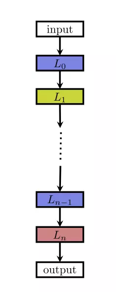

[万能近似定理(Universal approximation theorem)](https://en.wikipedia.org/wiki/Universal_approximation_theorem)表明，一个前馈神经网络如果具有线性输出层和至少一层具有任何一种“挤压”性质的激活函数的隐藏层，只要给与网络足够数量的隐藏单元，它可以以任意的精度来近似任何从一个有限维空间到另一个有限维空间的Borel可测函数。前馈网络的导数也可以任意好的来近似函数的导数。即只要给予符合条件的层和足够的隐藏单元，前馈神经网络可以表示任何函数。即使只有一个隐藏层的网络也足够适应训练集。更深层的网络通常能够对每一层使用更少的单元数和更少的参数，并且经常容易泛化到测试集，但是通常也更难以优化。那么，如何设计网络的架构来拟合我们需要的函数，同时兼顾性能呢？

所以，神经网络的架构就是网络设计的另一个关键点。架构一词是指网络的整体结构：它应该具有多少单元，以及这些单元应该如何连接。**说白了就是网络应该多深(有几层)、每层应该多宽(当前层有多少单元)、每层之间怎么连接(是前一层的分别全连当前层还是其他方式)、还有一些其他(比如多输出情况输出层怎么接、卷积核大小怎么定等)。还是，可以边看博客边玩着这个帮助理解**[http://playground.tensorflow.org](http://playground.tensorflow.org/#activation=tanh&batchSize=10&dataset=circle&regDataset=reg-plane&learningRate=0.03&regularizationRate=0&noise=0&networkShape=4,2&seed=0.37432&showTestData=false&discretize=false&percTrainData=50&x=true&y=true&xTimesY=false&xSquared=false&ySquared=false&cosX=false&sinX=false&cosY=false&sinY=false&collectStats=false&problem=classification&initZero=false&hideText=false)

目前大家自称玄学大师，很大一部分原因也是由于我们并不能通过数学方式证明设计的网络架构是最优的，现在还在摸索阶段，针对不同类型的问题，甚至同一类型不同粒度的问题，进行不断的测试以得到效果更好的架构。这也是进行搜索空间范围内的暴力搜索，也就是神经网络架构搜索(NAS)大火的原因。

本片我们简单探讨一下已知的一些架构设计的经验，指导我们在资源有限的情况下进行人工设计架构。

# 架构设计

## 深度和宽度

### 有效宽度
直觉上宽度是用平均多少个神经元，或者多少个channels描述的  一层一层整齐排列的非常容易计算，每层平均即可，然而一些迷宫一样的网络，我们度量宽度不再是利用几个神经元，或者几个channels了。而是数从输入到输出有多少连接，然后开掉weight layer的个数次方，数学上是 

### 前向深度和反向深度
大家困惑了，难道不一样，不都是weight layer个数吗？好了，请问下面那个网络更加深  A网络就是残差网络，B网络同A网络唯一不同的是否做了feature map的求和（attention???）。C和D一看似乎深多了，而且路径绕来绕去。我们在CIFAR10和CIAFR100下给出结果证实B反而是“最深的”。我们不再是利用层数度量深度，我们利用关联度量深度，对于前向深度，利用weight的关联度量，对于反向深度，利用gradient的关联度量，发展一些trick计算这些关联，发现，残差两个关联都为零，B的关联超大，C，D其次。 

那么，一个好的网络应该满足何种指标呢？

1. 小的有效宽度。（防止过拟）
2. 小的前向深度，尽量小的反向深度。（利于优化，即使层数非常多）
3. 满足条件1，2下，参数尽量多。（不要欠拟合）

深度测试，fd是前向深度，bd是反向深度， Np是参数个数（CIFAR10，CIFAR100， 都加了数据增强，黄色是自己跑的，白色是引用的） 

## 层连接
到目前为止，我们都将神经网络描述成层的简单链式结构，主要的考虑因素是网络的深度和每层的宽度。许多架构构建了一个主链，但随后又添加了额外的架构特性，例如ResNet、DenseNet从层到层或者更高层的跳跃连接。这些跳跃连接使得梯度更容易从输出层流向更接近输入的层。

# 神经网络架构搜索(Neural Architecture Search)

## 搜索空间
搜索空间定义了优化问题的变量，网络结构和超参数的变量定义有所不同，不同的变量规模对于算法的难度来说也不尽相同。

早期很多工作都是用以遗传算法为代表的进化算法对神经网络的超参数和权重进行优化，因为当时的神经网络只有几层，每层十几个神经元，也不存在复杂的网络架构，参数很有限，可直接进行优化。而深度学习模型一方面有着复杂的网络结构，另一方面权重参数通常都以百万到亿来计，进化算法根本无法优化。

但换个思路，假如我们找到了一组网络架构参数和对应的超参数，深度学习模型的性能其实是由这组参数来控制和决定的，所以只需要对复杂模型的架构参数和对应的超参数进行优化即可。

目前常见的一种网络架构是链状结构，如下图：  这种结构相当于一个 N 层的序列，每一层有几种可选的算子，比如卷积、池化等，每种算子包括一些超参数，比如卷积尺寸、卷积步长等。最近的一些工作受启发于一些人工设计的网络架构，研究带有多分支的网络，如下图  很多的深层 RNN 会有类似的结构，很多的网络结构虽然很深，但会有许多重复 cell，将 cell 抽象出来之后，复杂的结构也会变得简单，一方面可以减少优化变量数目，另一方面相同的 cell 在不同任务之间进行迁移，如下图  网络架构搜索问题由于其高维度、连续和离散混合等诸多难点，在搜索空间维度这块如果可以做些降维，将会大大提升效果，Zoph 在 2018 年的工作用了 cell 这种方式相比于 2017 年的工作有 7 倍的加速。

## 搜索策略
搜索策略定义了使用怎样的算法可以快速、准确找到最优的网络结构参数配置。常见的搜索方法包括：随机搜索、贝叶斯优化、进化算法、强化学习、基于梯度的算法。其中，2017 年谷歌大脑的那篇强化学习搜索方法将这一研究带成了研究热点，后来 Uber、Sentient、OpenAI、Deepmind 等公司和研究机构用进化算法对这一问题进行了研究，这个 task 算是进化算法一大热点应用。

注：国内有很多家公司在做 AutoML，其中用到的一种主流搜索算法是进化算法。

### 强化学习
强化学习是一种非常有意思的范式，几乎只要可以提炼出强化学习四要素，原问题就可以用强化学习来求解。 

在 NAS 任务中，将架构的生成看成是一个 agent 在选择 action，reward 是通过一个测试集上的效果预测函数来获得（这个函数类似于工程优化问题中的 surrogate model，即代理模型）。这类工作整体的框架都是基于此，不同的点在于策略表示和优化算法。 

一个工作是，用 RNN 来表示策略函数，初始化时先用策略梯度算法赋初值，然后用 PPO 来进行优化。另一个工作是，用简单的 Q-learning 算法来训练策略函数，序列地进行动作选择，即选择 layer 的类型和相关的超参数。

因为在 NAS 任务中，agent 与环境没有交互，可以降阶为无状态的多臂老虎机（MAB）问题。 

### 进化算法
进化算法是一大类算法，大概的框架也基本类似，先随机生成一个种群（N 组解），开始循环以下几个步骤：选择、交叉、变异，直到满足最终条件。最近几年流行一种基于概率模型的进化算法 EDA (Estimation Distribution of Algorithm)，基本的思路类似遗传算法，不同的是没有交叉、变异的环节，而是通过 learning 得到一个概率模型，由概率模型来 sample 下一步的种群。 

用进化算法对神经网络超参数进行优化是一种很古老、很经典的解决方案，90 年代的学者用进化算法同时优化网络结构参数和各层之间的权重，因为当时的网络规模非常小，所以还能解决，但后续深度学习模型网络规模都非常大，无法直接优化。 

进化算法是一种无梯度的优化算法（Derivative Free Optimization Algorithm），优点是可能会得到全局最优解，缺点是效率相对较低，近两年几家高科技企业做 NAS 时都在用进化算法优化网络结构，同时用基于梯度的方法（BP）来优化权值。在 NAS 任务中，进化算法的交叉算子和任务结合比较紧，被定义为一些类似添加、删除层的操作，而非简单的更改某一位编码。 

用进化算法解决 NAS 问题，不同的工作可能聚焦在不同的过程中，比如如何 sample 种群，如何 update 种群，如何生成子代种群等。

### 贝叶斯优化
贝叶斯优化（Bayesian Optimization）是超参数优化问题的常用手段，尤其是针对一些低维的问题，基于高斯过程（Gaussian Processes）和核方法（kernel trick）。对于高维优化问题，一些工作融合了树模型或者随机森林来解决，取得了不错的效果。 

除了常见的三大类方法，一些工作也在研究分层优化的思路，比如将进化算法和基于模型的序列优化方法融合起来，取各种方法的优势。Real 在 2018 年的一个工作对比了强化学习、进化算法和随机搜索三类方法，前两种的效果会更好一些。

## 评价预估
评价预估类似于工程优化中的代理模型（surrogate model），因为深度学习模型的效果非常依赖于训练数据的规模，大规模数据上的模型训练会非常耗时，对优化结果的评价将会非常耗时，所以需要一些手段去做近似的评估。 

一种思路是用一些低保真的训练集来训练模型，低保真在实际应用可以有多种表达，比如训练更少的次数，用原始训练数据的一部分，低分辨率的图片，每一层用更少的滤波器等。用这种低保真的训练集来测试优化算法会大大降低计算时间，但也存在一定的 bias，不过选择最优的架构并不需要绝对数值，只需要有相对值就可以进行排序选优了。 

另一种主流思路是借鉴于工程优化中的代理模型，在很多工程优化问题中，每一次优化得到的结果需要经过实验或者高保真仿真（有限元分析）进行评价，实验和仿真的时间非常久，不可能无限制地进行评价尝试，学者们提出了一种叫做代理模型的回归模型，用观测到的点进行插值预测，这类方法中最重要的是在大搜索空间中如何选择尽量少的点预测出最优结果的位置。 

第三种主流思路是参数级别的迁移，用之前已经训练好的模型权重参数对target问题进行赋值，从一个高起点的初值开始寻优将会大大地提高效率。在这类问题中，积累了大量的历史寻优数据，对新问题的寻优将会起到很大的帮助，用迁移学习进行求解，是一个很不错的思路。 

另一种比较有意思的思路叫做单次（One-Shot）架构搜索，这种方法将所有架构视作一个 one-shot 模型（超图）的子图，子图之间通过超图的边来共享权重。

# Source
[关于深度学习的机理，优化和网络结构的一些个人观点.](https://zhuanlan.zhihu.com/p/22067439) [https://arxiv.org/pdf/1402.1869.pdf](https://arxiv.org/pdf/1402.1869.pdf) [神经网络架构搜索（NAS）综述](https://www.jiqizhixin.com/articles/2018-08-31-4) [https://github.com/carpedm20/ENAS-pytorch](https://github.com/carpedm20/ENAS-pytorch)

