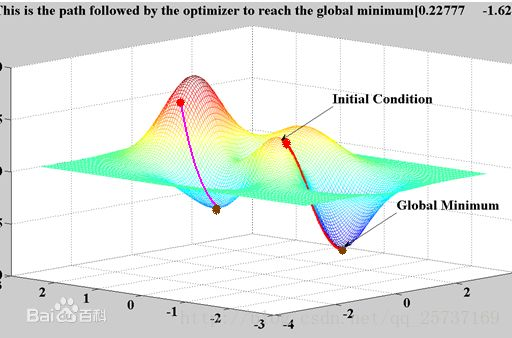
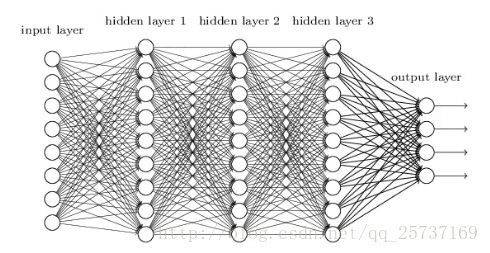
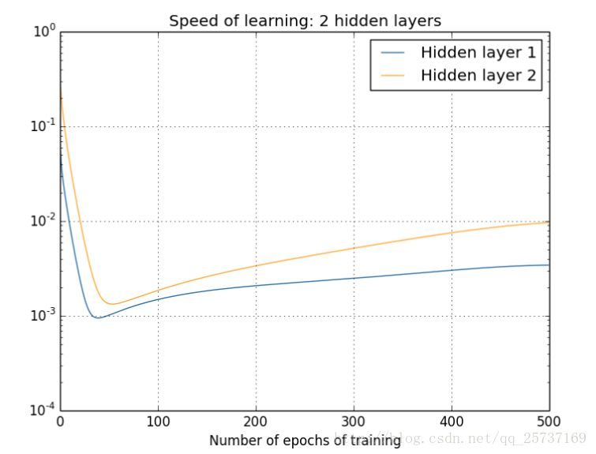
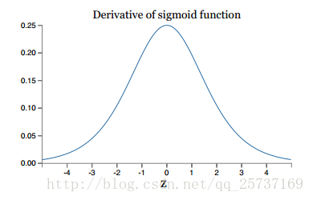
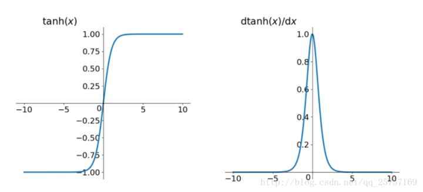

<a name="s0vyV"></a>
# 造成原因
在深层网络中，**采用了不合适的损失函数**或者**权值初始化值太大**都有可能造成梯度消失/爆炸问题。

目前深度学习方法中，深度神经网络的发展造就了我们可以构建更深层的网络完成更复杂的任务，深层网络比如深度卷积网络，LSTM等等，而且最终结果表明，在处理复杂任务上，深度网络比浅层的网络具有更好的效果。但是，目前优化神经网络的方法都是基于反向传播的思想，即根据损失函数计算的误差通过梯度反向传播的方式，指导深度网络权值的更新优化。这样做是有一定原因的，首先，深层网络由许多非线性层堆叠而来，每一层非线性层都可以视为是一个非线性函数(非线性来自于非线性激活函数），因此整个深度网络可以视为是一个复合的非线性多元函数


我们最终的目的是希望这个多元函数可以很好的完成输入到输出之间的映射，假设不同的输入，输出的最优解是，那么，优化深度网络就是为了寻找到合适的权值，满足取得极小值点，比如最简单的损失函数：


假设损失函数的数据空间是下图这样的，我们最优的权值就是为了寻找下图中的最小值点，对于这种数学寻找最小值问题，采用梯度下降的方法再适合不过了。因此，对于神经网络这种参数式的方法，使用梯度更新可以用来寻找最优的参数。<br />
<a name="NA1yx"></a>
## 深度网络角度
<br />图中是一个四层的全连接网络，假设每一层网络激活后的输出为，其中为第层，代表第层的输入，也就是第层的输出，是激活函数，那么，简单记为

BP算法基于梯度下降策略，以目标的负梯度方向对参数进行调整，参数的更新为，给定学习率，得出。如果要更新第二隐藏层的权值信息，根据链式求导法则，更新梯度信息：，其中，即第二隐藏层的输入。就是对激活函数进行求导，如果此部分大于1，那么层数增多的时候，最终的求出的梯度更新将以指数形式增加，即发生梯度爆炸，如果此部分小于1，那么随着层数增多，求出的梯度更新信息将会以指数形式衰减，即发生了梯度消失。

下面两个图可以很直观的说明深层网络的梯度问题,下图中的隐层标号和全连接图隐层标号刚好相反。图中的曲线表示权值更新的速度，对于下图两个隐层的网络来说，已经可以发现隐藏层2的权值更新速度要比隐藏层1更新的速度慢。对于四个隐层的网络来说，就更明显了，第四隐藏层比第一隐藏层的更新速度慢了两个数量级。<br />

从深层网络角度来讲，不同的层学习的速度差异很大，表现为网络中靠近输出的层学习的情况很好，靠近输入的层学习的很慢，有时甚至训练了很久，前几层的权值和刚开始随机初始化的值差不多。因此，梯度消失、爆炸，其根本原因在于反向传播训练法则，本质在于方法问题，另外多说一句，对于人来说，在大脑的思考机制里是没有反向传播的，Hinton提出capsule的原因就是为了彻底抛弃目前基于反向传播的深度学习算法，如果真能大范围普及，那真是一个革命。
<a name="x6cJZ"></a>
## 激活函数角度
其实也注意到了，上文中提到计算权值更新信息的时候需要计算前层偏导信息，因此如果激活函数选择不合适，比如使用sigmoid，梯度消失就会很明显了，原因看下图，左图是sigmoid的损失函数图，右边是其倒数的图像，如果使用sigmoid作为损失函数，其梯度是不可能超过0.25的，这样经过链式求导之后，很容易发生梯度消失，sigmoid函数数学表达式为

<br /><br />同理，tanh作为损失函数，它的导数图如下，可以看出，tanh比sigmoid要好一些，但是它的倒数仍然是小于1的。tanh数学表达为：

<br />
<a name="qVugO"></a>
# 解决方案
<a name="QxGpW"></a>
## [初始化](https://keras-cn.readthedocs.io/en/latest/other/initializations/)
Glorot和Bengio在他们的论文中提出了一种能显著缓解不稳定梯度问题的方法。他们指出，我们需要信号再两个方向上正确流动：进行预测时，信号为正向；在反向传播梯度时，信号为负向。我们既不希望信号消失，也不希望它爆炸并饱和。为了使信号正确流动，作者认为，我们需要每层输出的方差等于其输入的方差，并且我们需要在反方向时流过某层之前和之后的梯度具有相同的方差。除非该层具有相等数量的输入和神经元，即和，权重张量的扇入扇出(即输入和输出单元数目)。但实际上不可能同时保证两者，Glorot和Bengio提出了一个很好的折中方案，在实践中证明很好的发挥作用，即[Glorot初始化或Xavier初始化](http://proceedings.mlr.press/v9/glorot10a/glorot10a.pdf)，以论文的第一作者命名。Glorot初始化(使用逻辑激活函数时)：

- Keras中glorot_normal：正态分布，其均值为，方差为，其中
- Keras中glorot_uniform：从，之间的均匀分布产生，其中

如果将上式中换成，则会得到Yann LeCun在20世纪90年代提出的初始化策略，他称其为[LeCun初始化](http://yann.lecun.com/exdb/publis/pdf/lecun-98b.pdf)。由公式知，当时，，LeCun初始化等效于Glorot初始化

一些论文为不同的激活函数提供了类似的策略。这些策略的差异仅在于方差的大小以及他们使用的是还是，如下方表格(对于均匀分布，只需计算)所示。ReLU激活函数的初始化策略(及其变体，包括ELU激活函数)有时简称为[He(Kaiming He)初始化](https://arxiv.org/pdf/1502.01852.pdf)。

| 初始化 | 激活函数 |  |
| --- | --- | --- |
| Glorot | None、tanh、sigmoid、softmax |  |
| He | ReLU和变体 |  |
| LeCun | SELU |  |

默认情况下，Keras使用具有均匀分布的Glorot初始化。创建层时，可以通过kernel_initializer="he_uniform"或kernel_initializer="he_normal"来将其更改为He初始化：
```python
keras.layers.Dense(10,activation="relu",kernel_initializer="he_normal")
```
如果你要使用均匀分布但基于而不是进行He初始化，则可以使用Variance Scaling初始化
```python
he_avg_init=keras.initializers.VarianceScaling(scale=2,mode="fan_avg",distribution="uniform")
keras.layers.Dense(10,activation="sigmoid",kernel_initializer="he_avg_init")
```
<a name="SCJjE"></a>
## [非饱和激活函数](https://www.yuque.com/angsweet/machine-learning/shen-du-xue-xi_shen-du-xue-xi_shen-du-qian-kui-wang-luo_ji-huo-han-shu)

- 右饱和：当x趋向于正无穷时，函数的导数趋近于0，此时称为右饱和。
- 左饱和：当x趋向于负无穷时，函数的导数趋近于0，此时称为左饱和。

当一个函数既满足右饱和又满足左饱和，则称为饱和函数，如Sigmoid和tanh，否则称为非饱和函数，如ReLU。

Glorot和Bengio在2010年的论文中提出的一项见解是，梯度不稳定的问题部分是由于激活函数选择不当导致。在此之前，大多数人认为，如果大自然母亲选择在生物神经元中使用类似sigmoid的激活函数，那么它们必定是一个好选择。但是事实证明，其他激活函数在深度神经网络中的表现要好得多，尤其是ReLU激活函数，这主要是因为它对正值不饱和，并且计算速度很快。

不幸的是ReLU激活函数并不完美。它有一个被称为“濒死的ReLU”的问题：在训练过程中，某些神经元实际上“死亡”了，这意味着它们停止输出除零以外的任何值。在某些情况下，你可能会发现网络中一半的神经元都死了，特别是如果你使用比较大的学习率。当神经元的权重进行调整时，其输入的加权和对于训练集中的所有实例均为负数，神经元会死亡。发生这种情况时，它只会继续输出零，梯度下降不会再影响它，因为ReLU函数的输入为负时其梯度为零。<br /><br />要解决此问题，可以使用ReLU函数的变体，例如[leaky ReLU](https://www.yuque.com/angsweet/machine-learning/shen-du-xue-xi_shen-du-xue-xi_shen-du-qian-kui-wang-luo_ji-huo-han-shu#5d429a86)。该函数定义为，其中超参数定义函数“泄漏”的程度：它是时函数的斜率，通常设置为0.01。这个小的斜率确保leaky ReLU不会死亡。ReLU有很多变体，具体可见[激活函数](https://www.yuque.com/angsweet/machine-learning/shen-du-xue-xi_shen-du-xue-xi_shen-du-qian-kui-wang-luo_ji-huo-han-shu)。<br />
<a name="TJpop"></a>
## [批量归一化](https://www.yuque.com/angsweet/machine-learning/shen-du-xue-xi_shen-du-xue-xi_ji-shu-fen-xi_normalization)
尽管将He初始化与ELU(或ReLU的任何变体)一起使用可以明显减少在训练开始时的梯度消失/爆炸问题的危险，但这并不能保证它们在训练期间不会再出现。Sergey Ioffe和Christian Szegedy提出了一种称为批量归一化(BN)的技术来解决这些问题。该技术包括在模型中的每个隐藏层的激活函数之前或之后添加一个操作。该操作对每个输入中心化并归一化，然后每层使用两个新的参数向量缩放和偏移其结果：一个用于缩放，另一个用于偏移。换句话说，该操作可以使模型学习各层输入的最佳缩放和均值。在许多情况下，如果你将BN层添加为神经网络的第一层，则无须归一化训练集(例如，使用StandardScaler)，BN层会为你完成此操作。为了使输入中心化并归一化，该算法需呀哦估计每个输入的均值和标准差。通过评估当前小批次上的输入均值和标准差(因此称为“批量归一化”)来做到这一点。
<a name="wSLfX"></a>
## 梯度裁剪
缓解梯度爆炸问题的另一种流行技术是在反向传播期间裁剪梯度，使它们永远不会超过某个阈值，这称为梯度裁剪。这种技术最常用于循环神经网络，因为在RNN中难以使用批量归一化。对于其他类型的网络，BN通常就够了

在Keras中，实现梯度裁剪仅仅是一个在创建优化器时设置clipvalue或clipnorm参数的问题，例如
```python
optimizer=keras.optimizers.SGD(clipvalue=1.0)
model.compile(loss="mse",optimizer=optimizer)
```
<a name="GDCHe"></a>
# Source
[详解深度学习中的梯度消失、爆炸原因及其解决方法](https://zhuanlan.zhihu.com/p/33006526)<br />[初始化方法 - Keras中文文档](https://keras-cn.readthedocs.io/en/latest/other/initializations/)<br />[激活函数Activations - Keras中文文档](https://keras-cn.readthedocs.io/en/latest/other/activations/#activations)
