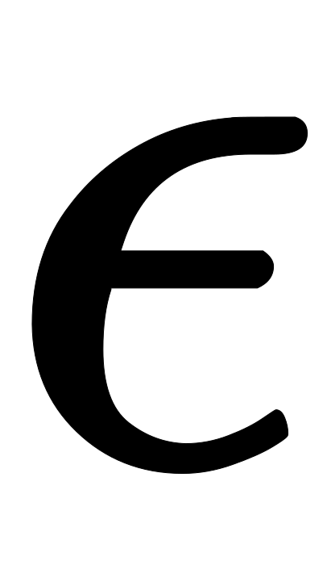
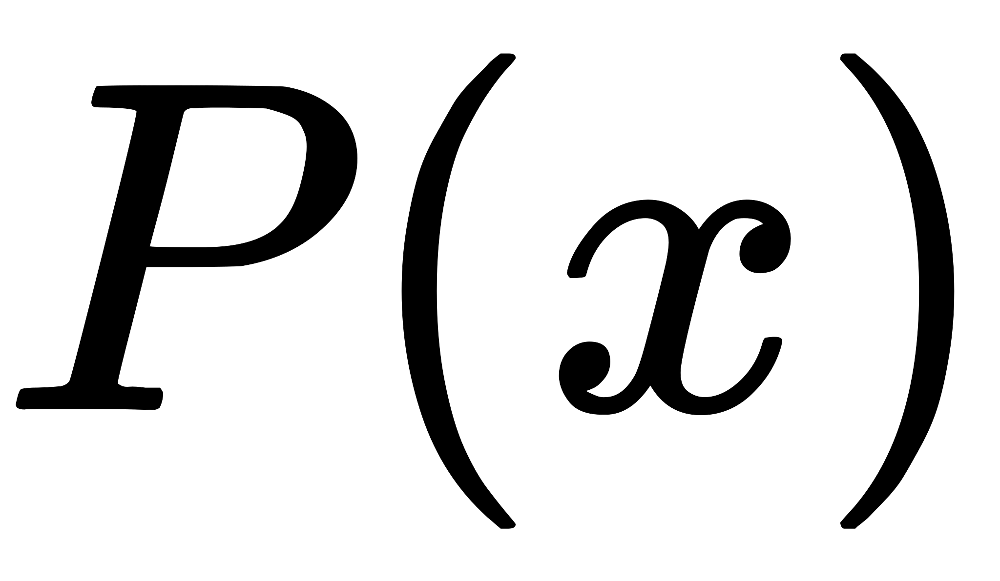

机器学习中的一个核心问题是设计不仅在训练数据上表现好，而且能在新输入上泛化好的算法。许多策略被显示地设计来减少测试误差（可能会以增大训练误差为代价），这些策略被统称为正则化。多任务学习和对抗训练也可看作是正则化的一种，由于能说的比较多，我单独摘了出来。

# 参数范数惩罚
许多正则化方法通过对目标函数添加一个参数范数惩罚，限制模型的学习能力。我们将正则化后的目标函数记为： 

其中是权衡范数惩罚项和标准目标函数相对贡献的超参数。将设为表示没有正则化。越大，对应正则化惩罚越大。

## L2正则化

这个正则化策略通过向目标函数添加一个正则项，使权重更加接近原点。在其他学术圈，也被称为岭回归或Tikhonov正则。DNN的正则化通常的做法是只针对与线性系数矩阵，而不针对偏倚系数。我们很容易可以写出DNN的正则化的损失函数：

与之对应的梯度为

使用单步梯度下降更新权重，即执行以下更新

 

通过上式我们可以看出，加入权重衰减后会引起学习规则的修改。即在每步执行通常的梯度更新之前先收缩权重向量(将权重向量乘以一个常数因子)。 由于和都是大于的数，因此相对于不加正则化的模型而言，正则化之后的模型权重在每步更新之后的值都要更小。

### 特征影响程度筛选

假设是一个二次优化问题（比如采用平方损失函数）时，模型参数可以进一步表示为，即相当于在原来的参数上添加了一个控制因子，其中是参数Hessian矩阵的特征值。由此可见

- 当时，惩罚因子作用比较小。
- 当时，对应的参数会缩减至。

如上图，实线椭圆表没有正则化目标的等值线。虚线圆圈表示正则化项的等值线。在点，这两个竞争目标达到平衡。横轴表示特征1的权重，纵轴表示特征2的权重。

可以看到虚线圆圈很扁，所以当变化很大时才能进到实线圆圈的内圈，而变化一点就可以进到实线圆圈的内圈。（方便理解可以看纵轴往右平移很大一块才能碰到内一个实线圆圈；假设横轴在实线最外面圈正下方中点，向上平移一点就碰到内一个实线圆圈。或者是想象带着实线圆圈水平或直移动）从一个实圈到另一个实圈，相当于目标函数值变化。

只有在显著减小目标函数方向上的参数会保留的相对完好。在无助于目标函数减小的方向上改变参数不会显著增加梯度，这种不重要方向对应的分量会在训练过程中因正则化而衰减掉。沿横轴变化时，目标函数变化不大，所以正则化项对该轴具有强烈的影响，正则化项将拉向零。而目标函数对沿着纵轴的移动非常敏感，对应的特征值较大，表示高曲率，因此，正则化对位置影响相对较小。

### 特征离散程度影响

目前为止，我们讨论了权重衰减对优化一个抽象通用的二次代价函数的影响。这些影响具体是怎么和机器学习关联的呢？我们可以研究线性回归，它的真实代价函数是二次的，因此我们可以使用相同的方法分析。再次应用分析，我们会在这种情况下得到相同的结果，但这次我们使用训练数据的术语表述。线性回归的代价函数时平方误差之和：

我们添加正则项后，目标函数变为

这将方程的解从

变成

不加正则项时的解中的矩阵与协方差矩阵成正比。正则项将这个矩阵替换为上式中的，这个新矩阵与原来的是一样的，不同的仅仅是在对角加了。这个矩阵的对角项对应每个输入特征的方差。我们可以看到，正则化能让学习算法“感知”到具有较高方差的输入，因此与输出目标的协方差较小（相对增加方差）的特征的权重将会收缩。即更离散的特征所占权重将会变小。

## L1正则化

对模型参数的正则化被定义为

即各个参数的绝对值之和。正则化的目标函数如下所示

对应的梯度（实际上是次梯度）：

其中只是简单地取各个元素的正负号。

我们可以看到正则化对梯度的影响不再是线性地缩放每个，而是添加了一项与同号的常数。使用这种形式的梯度之后，我们不一定能到的二次近似的直接算数解（正则化可以）

### 函数解稀疏性影响

相比正则化，正则化会产生更稀疏的解。此处稀疏性指的是最优值中的一些参数为。如上图所示，正则项等值线与没有正则化目标的等值线在时更容易在轴上有交点（这两个竞争目标达到平衡），即有特征的系数为（上图中是）。

### 特征影响程度选择

由正则化导出的稀疏性质已经被广泛地应用于特征选择机制。特征选择从可用的特征子集选择出有意义的特征，化简机器学习问题。著名的LASSO模型将惩罚和线性模型结合，并使用最小二乘代价函数。惩罚使部分自己的权重为零，表明相应的特征可以被安全的忽略。

## L2与L1区别

相对于能够产生更加稀疏的模型，即当正则在参数比较小的情况下，能够直接缩减至0。因此可以起到特征选择的作用，该技术也称之为 LASSO。

如果从概率角度进行分析，很多范数约束相当于对参数添加先验分布，其中范数相当于参数服从高斯先验分布；范数相当于拉普拉斯分布。

# 数据集增强

使用更多的样本数据训练模型可以获得更好的泛化性能，然而，实践中我们很难获得更多的训练数据。一种解决方法是人为创造一些合理的假数据并把它们添加到训练集。

这样的方法对于分类任务来说是最简单的。一个分类器需要有能力把一个复杂高维的输入映射到单一类目的输出，因此分类器需要对大量的变换保持预测结果的不变，即对于相似的输入需要有相同的输出。因此，我们可以轻易地转换训练集中的来生成新的对。例如，对于图像识别任务来说，像素的部分平移、缩放、旋转操作并不会改变图片中物体对语义表达，因而我们可以使用这些操作来生存新对训练数据。数据集增强对于语音识别任务也是有效的。

另一种数据集增强的方法是向网络的输入层注入噪声。神经网络已被证明对噪声不是非常健壮。简单地将随机噪声施加到输入再进行训练可以改善神经网络的健壮性。对于某些模型，在模型的输入上添加方差极小的噪声等价于对权重施加范数惩罚（Bishop）。

研究表明，将噪声施加到网络的隐藏层也是有效的，这可以被看成是在多个抽象层上进行数据集增强。著名的Dropout方法可以看作是对隐藏层输出乘以一个噪声后输出到下一层。

# 噪声鲁棒性

一般情况下，噪声注入远比简单的收缩参数强大，特别是噪声被添加到隐藏单元时。

另一种正则化模型的噪声使用方法是将其直接添加到学习到的权重上。这项技术主要被用于循环神经网络的情况下。这种方法可以看作是权重的贝叶斯推断的一种随机实现。贝叶斯方法认为学习到的模型权重上不确定的，并且这种不确定性可以通过权重的概率分布来表示。添加噪音到学习到的权重上可以看着是反映这种不确定行的一种随机的、实用的方式。

在适当的假设下，施加噪声到权重可以被解释与传统的正则化形式等价，鼓励学习到的函数保存一定的稳定性。这种形式的正则化鼓励模型的参数进入到参数空间中相对较稳定的区域，在这些区域小的权重扰动对于模型的输出影响较小。

大多数数据集的标签都有一定错误，错误的不利于最大化。 避免这种情况的一种方法是显式地对标签上的噪声进行建模。 例如，我们可以假设，对于一些小常数，训练集标记是正确的概率是，（以的概率）任何其他可能的标签也是正确的。这个假设很容易就能解析地与代价函数结合，而不用显式地抽取噪声样本。 例如，标签平滑(label smoothing) 通过把确切分类目标从和替换成和，正则化具有个输出的softmax函数模型。标准交叉熵损失可以用在这些非确切目标的输出上。 使用softmax函数和明确目标的最大似然学习可能永远不会收敛，因为softmax函数永远无法真正预测概率或概率，因此它会继续学习越来越大的权重，使预测更极端。使用如权重衰减等其他正则化策略能够防止这种情况。标签平滑的优势是能够防止模型追求确切概率而不影响模型学习正确分类。这种策略自20世纪80年代就已经被使用，并在现代神经网络继续保持显著特色。

# 半监督学习

在半监督学习的框架下，产生的未标记样本和中的标记样本都用于估计或者根据预测。

在深度学习的背景下，半监督学习通常指的是学习一个表示。 学习表示的目的是使相同类中的样本有类似的表示。无监督学习可以为如何在表示空间聚集样本提供有用线索。在输入空间紧密聚集的样本应该被映射到类似的表示。在许多情况下，新空间上的线性分类器可以达到较好的泛化。这种方法的一个经典变种是使用主成分分析作为分类前（在投影后的数据上分类）的预处理步骤。

我们可以构建这样一个模型，其中生成模型或与判别模型共享参数，而不用分离无监督和监督部分。 我们权衡监督模型准则和无监督或生成模型准则（如或)。生成模型准则表达了对监督学习问题解的特殊形式的先验知识，即的结构通过某种共享参数的方式连接到。通过控制在总准则中的生成准则，我们可以获得比纯生成或纯判别训练准则更好的权衡。

# 提前终止

在模型训练过程中经常出现随着不断迭代，训练误差不断减少，但是验证误差先减少然后开始增长，如下图所示。这种现象机会一定会出现。

提前停止（Early Stopping）的策略是：在验证误差不在提升后，提前结束训练；而不是一直等待验证误差到最小值。该策略可以用于任意的模型，不限于深度学习。GBDT算法天然适合采用Early Stopping策略来确定需要训练多少颗子树，因为GBDT是一个加法模型，采用提前终止策略都不需要额外存储模型的副本。

# 参数绑定和共享

有时我们需要一种方式来表达我们对模型参数适当值的先验知识。我们可能无法准确地知道应该使用什么样的参数，但我们根据领域和模型结构方面的知识得知模型参数之间应该存在一些相关性。

我们经常想要表达的一种常见依赖是某些参数应当彼此接近。考虑以下情形：我们有两个模型执行相同的分类任务（具有相同类别），但输入分布稍有不同。 形式地，我们有参数为的模型A和参数为的模型B。 这两种模型将输入映射到两个不同但相关的输出：和。

我们可以想象，这些任务会足够相似（或许具有相似的输入和输出分布），因此我们认为模型参数应彼此靠近：，应该与接近。我们可以通过正则化利用此信息。 具体来说，我们可以使用以下形式的参数范数惩罚：。 在这里我们使用惩罚，但也可以使用其他选择。

正则化一个模型（监督模式下训练的分类器）的参数，使其接近另一个无监督模式下训练的模型（捕捉观察到的输入数据的分布）的参数。 这种构造架构使得许多分类模型中的参数能与之对应的无监督模型的参数匹配。

参数范数惩罚是正则化参数使其彼此接近的一种方式，而更流行的方法是使用约束：强迫某些参数相等。 由于我们将各种模型或模型组件解释为共享独立的一组参数，这种正则化方法通常被称为参数共享。和正则化参数使其接近（通过范数惩罚）相比，参数共享的一个显著优点是，只有参数（独立一个集合）的子集需要被存储在内存中。 对于某些特定模型，如卷积神经网络，这可能可以显著减少模型所占用的内存。

最流行和广泛使用的参数共享出现应用于计算机视觉的卷积神经网络中。 自然图像有许多统计属性是对转换不变的。 例如，猫的照片即使向右边移了一个像素，仍保持猫的照片。 CNN通过在图像多个位置共享参数来考虑这个特性。 相同的特征（具有相同权重的隐藏单元）在输入的不同位置上计算获得。 这意味着无论猫出当前图像中的第列或列，我们都可以使用相同的猫探测器找到猫。

参数共享显著降低了CNN模型的参数数量，并显著提高了网络的大小而不需要相应地增加训练数据。它仍然是将领域知识有效地整合到网络架构的最佳范例之一。

# 稀疏表示

深度学习可以看着时一种表示学习（representation learning），比如卷积神经网络可以学习图像的不同层次的特征表示，word2vec学习词的Distributed representation，其共同特点是用隐层权重作为表示。

惩罚可以诱导稀疏的参数，即许多参数为零（或接近于零）。

表示的范数惩罚正则化是通过向损失函数添加对表示的范数惩罚来实现的。 我们将这个惩罚记作。 和以前一样，我们将正则化后的损失函数记作：

其中权衡范数惩罚项的相对贡献，越大的对应越多的正则化。通过上述方法，含有隐藏单元的模型在本质上都能变得稀疏。

# Bagging和其他集成方法

集成化方法是一种通用的降低泛化误差的方法，通过合并多个模型的结果，也叫作模型平均。主要想法是分别训练几个不同的模型，然后让所有模型表决测试样例的输出。

经验：原始输入每一个节点选择概率0.8，隐藏层选择概率为0.5。

Bagging是一种常用的集成学习方法。Bagging的策略很多，例如不同初始化方法、不同mini batch选择方法、不同的超参数选择方法。

与之对应的集成方法是Boosting，通过改变样本权重来训练不同模型。

# Dropout

Dropout提供了正则化一大类模型的方法，计算方便但功能强大。Dropout可以被认为是集成大量深层神经网络的实用Bagging方法。Bagging涉及训练多个模型，并在每个测试样本上评估多个模型。当每个模型都是一个很大的神经网络时，这并不现实，因为训练和评估这样的网络需要花费大量的时间和内存。Dropout提供了一种廉价的Bagging集成近似，能够训练和评估指数级数量的神经网络。

具体而言，Dropout训练的集成包括所有从基础网络除去非输出单元后形成的子网络，如下图所示。

 神经网络基于一系列仿射变换和非线性变换，我们只需将一些单元的输出乘零就能有效地删除一个单元。这个过程需要对模型进行一些修改，为了简单起见，我们这里提出乘零的简单Dropout算法，但是它被简单修改后，可以与从网络中移除单元的其他操作结合使用。

回想一下Bagging学习，我们定义个不同的模型，从训练集有放回采样构造个不同的数据集，然后在训练集上训练模型。Dropout的目标是在指数级数量的神经网络上近似这个过程。具体来说，在训练中使用Dropout时，我们会使用基于小批量产生较小步长的学习算法，如随机梯度下降等。我们每次在小批量中加载一个样本，然后随机抽样应用于网络中所有输入和隐藏单元的不同二值掩码。对于每个单元，掩码是独立采样的。掩码值为的采样概率（导致包含一个单元）是训练开始前一个固定的超参数。它不是模型当前参数值或输入样本的函数。通常在每一个小批量训练的神经网络中，一个输入单元被包括的概率为，一个隐藏单元被包括的概率为。然后，我们运行和之前一样的前向传播、反向传播以及学习更新。下图说明了Dropout下的前向传播

    

左图为我们使用的具有两个输入单元，具有两个隐藏单元以及一个输出单元的前馈网络。右图为为了执行具有Dropout的前向传播，我们随机地对向量进行采样，其中网络中的每个输入或隐藏单元对应一项。中的每项都是二值的且独立于其他项采样。超参数的采样概率为，隐藏层的采样概率通常为，输入的采样概率通常为。网络中的每个单元乘以相应的掩码，然后正常地继续沿着网络的其余部分前向传播。相当于右图中随机选择一个子网络并沿着前向传播。

更正式地说，假设一个掩码向量指定被包括的单元，是由参数和掩码定义的模型代价。那么Dropout训练的目标是最小化。这个期望包含多达指数级的项，但我们可以通过抽样获得梯度的无偏估计。

Dropout训练与Bagging训练不太一样。在Bagging的情况下，所有模型都是独立的。在Dropout的情况下，所有模型共享参数，其中每个模型继承父神经网络参数的不同子集。参数共享使得在有限可用的内存下表示指数级数量的模型变得可能。在Bagging的情况下，每一个模型在其相应训练集上训练到收敛。在Dropout的情况下，通常大部分模型都没有显示地被训练，因为通常父神经网络会很大，以致于不可能采样完所有的子网络。取而代之的，在单个步骤中我们训练一小部分的子网络，参数共享会使得剩余的子网络也能有好的参数设定。这些是仅有的区别。除了这些，Dropout与Bagging算法一样。例如，每个子网络中遇到的训练集确实是有放回采样的原始训练集的一个子集。

Bagging集成必须根据所有成员的累积投票做一个预测。在这种背景下，我们将这个过程称为推断。目前为止，我们在介绍Bagging和Dropout时没有要求模型具有明确的概率。现在，我们假定该模型的作用是输出一个概率分布。在Bagging的情况下，每个模型产生一个概率分布。集成的预测由这些分布的算术平均给出：

在Dropout的情况下，通过掩码定义每个子模型的概率分布。所有掩码算术平均由下式给出

其中是训练时采样的概率分布。

因为这个求和包含多达指数级的项，除非该模型的结构允许某种形式的简化，否则是不可能计算的。目前为止，无法得知深度神经网络是否允许某种可行的简化。相反，我们可以通过采样近似推断，即平均许多掩码的输出。即使是个掩码就足以获得不错的表现。

然而，一个更好的方法能不错地近似整个集成的预测，且只需一个前向传播的代价。要做到这一点，我们改用集成成员预测分布的几何平均而不是算数平均。多个模型分布的几何平均不能保证是一个概率分布。为了保证结果是一个概率分布，我们要求没有子模型给某一事件分配概率，并重新标准化所得分布。通过几何平均直接定义的非标准化概率分布由下式给出

其中是可被丢弃的单元数。这里为简化介绍，我们使用均匀分布的，但非均匀分布也是可以的。为了作出预测，我们必须重新标准化集成：

涉及Dropout的一个重要观点是，我们可以通过评估模型中来近似：该模型具有所有单元，但我们将单元的输出的权重乘以单元的被包含概率。这个修改的动机是得到从该单元输出的正确期望值。我们把这种方法称为权重比例推断规则。目前还没有在深度非线性网络上对这种近似推断规则的准确性作任何理论分析，但经验上表现得很好。

因为我们通常使用的包含概率，权重比例规则一般相当于在训练结束后将权重除，然后像平常一样使用模型。实现相同结果的另一种方法是在训练期间将单元的状态乘。无论哪种方式，我们的目标是确保在测试时一个单元的期望总输入与在训练时该单元的期望总输入是大致相同的。

对许多不具有非线性隐藏单元的模型族而言，权重比例推断规则是精确的。举例如下，考虑softmax函数回归分类，其中由向量表示个输入变量：

我们可以根据二值向量逐元素的乘法将一类子模型进行索引：

集成预测器被定义为重新标准化所有集成成员预测的几何平均：

其中

为了证明权重比例推断规则是精确的，我们简化：

  

由于将被标准化，我们可以放心地忽略那些相对不变的乘法：

  

代入，我们就得到了一个权重为的softmax函数分类器。

权重比例推断规则在其他设定下也是精确的，包括条件正态输出的回归网络以及那些隐藏层不包含非线性的深度网络。然而，权重比例推断规则对具有非线性的深度模型仅仅是一个近似。虽然这个近似尚未有理论上的分析，但在实践中往往效果很好。

Dropout比其他便准的计算开销小的正则化方法（如权重衰减、过滤器范数约束和稀疏激活的正则化）更有效。Dropout也可以与其他形式的正则化合并，得到进一步的提升。

计算方便是Dropout的一个优点。训练过程中使用Dropout产生个随机二进制数与状态相乘，每个样本每次更新只需的计算复杂度。根据实现，也可能需要的存储空间来持续保存这些二进制数（指导反向传播阶段）。使用训练好的模型推断时，计算每个样本的代价与不使用Dropout是一样的，尽管我们必须在开始运行推断前将权重除以。

Dropout的另一个显著优点是不怎么限制适用的模型或训练过程。几乎在所有使用分布式表示并且可以用随机梯度下降训练的模型上都表现很好。包括前馈神经网络、概率模型，如受限玻尔兹曼机，以及循环神经网络。许多效果差不多的其他正则化策略对模型结构的限制更严格。

虽然Dropout在特定模型上每一步的代价是微不足道的，但在一个完整的系统上使用Dropout的代价可能非常显著。因为Dropout是一个正则化技术，它减少了模型的有效容量。为了抵消这种影响，我们必须增大模型规模。不出意外的话，使用Dropout时最佳验证集的误差会低很多，但这是以更大的模型和更多训练算法的迭代次数代价换来的。对于非常大的数据集，正则化带来的泛化误差减少得很小。在这些情况下，使用Dropout和更大规模的计算代价可能超过正则化带来的好处。

使用Dropout训练时的随机性不是这个方法成功的必要条件。它仅仅是近似所有子模型总和的一个方法。快速Dropout减小梯度计算中的随机性而获得更快的收敛速度。这种方法也可以在测试时应用，能够比权重比例推断规则更合理地（但计算也更昂贵）近似所有子网络的平均。快速Dropout在小神经网络上的性能几乎与标准的Dropout相当，但在大问题上尚未产生显著改善或者尚未应用。

随机性对实现Dropout的正则化效果不是必要的，同时也不是充分的。Dropout Boosting的方法设计了一个对照实验，具有与传统Dropout方法完全相同的噪声掩码，但缺乏正则化效果。Dropout Boosting训练整个集成以最大化训练集上的似然。从传统Dropout类似于Bagging的角度来看，这种方式类似于Boosting。如预期一样，和单一模型训练整个网络相比，Dropout Boosting几乎没有正则化效果。这表明，使用Bagging解释Dropout比使用稳健性噪声解释Dropout更好。只有当随机抽样的集成成员相互独立地训练好后，才能达到Bagging集成的正则化效果。

Dropout启发其他以随机方法训练指数量级的共享权重的集成。DropConnect是Dropout的一个特殊情况，其中一个标量权重和单个隐藏单元状态之间的每个乘积被认为是可以丢弃的一个单元。随机池化是构造卷积神经网络集成的一种随机池化的形式，其中每个卷积网络参与每个特征图的不同空间位置。目前为止，Dropout仍然是最广泛使用的隐式集成方法。

一个关于Dropout的重要见解是，通过随机行为训练网络并平均多个随机决定进行预测，实现了一种参数共享的Bagging形式。早些时候，我们将Dropout描述为通过包括或排除单元形成模型集成的Bagging。然而，这种参数共享策略不一定要基于包括和排除。原则上，任何一种随机的修改都是可接受的。在实践中，我们必须选择让神经网络能够学习对抗的修改类型。在理想情况下，我们也应该使用可以快速近似推断的模型族。我们可以认为由向量参数化的任何形式的修改，是对所有可能的值训练的集成。注意，这里不要求具有有限数量的值。例如，可以是实值。

目前为止，我们将Dropout介绍为一种纯粹高效近似Bagging的方法。然而，还有比这更进一步的Dropout观点。Dropout不仅仅是训练一个Bagging的集成模型，并且是共享隐藏单元的集成模型。这意味着无论其他隐藏单元是否在模型中，每个隐藏单元必须都能够表现良好。隐藏单元必须准备好进行模型之间的交换和互换。有性繁殖涉及到两个不同生物体之间的交换基因，进化产生的压力使得基因不仅是良好的而且要准备好不停有机体之间的交换。这样的基因和这些特点对环境的变化是非常稳健的，因为它们一定会正确适应任何一个有机体或模型不寻常的特性。因此Dropout正则化每个隐藏单元不仅是一个很好的特征，更要在许多情况下式良好的特征。

Dropout强大的大部分原因来自施加到隐藏单元的掩码噪声，了解这一事实是重要的。这可以看作是对输入内容的信息高度智能化、自适应破坏的一种形式，而不是对输入原始值的破坏。例如，如果模型学得通过鼻检测脸的隐藏单元，那么丢失对应于擦除图像中有鼻子的信息。模型必须学习另一种，要么是鼻子存在的冗余编码，要么是像嘴这样的脸部的另一特征。传统的噪声注入技术，在输入端加非结构化的噪声不能够随机地从脸部图像中抹去关于鼻子的信息，除非噪声的幅度大到几乎能抹去图像中所有的信息。破坏提取的特征而不是原始值，让破坏过程充分利用该莫西迄今获得的关于输入分布的所有知识。

Dropout的另一个重要方面是噪声是乘性的。如果是固定规模的加性噪声，那么加了噪声的整流线性隐藏单元可以简单地学会使变得很大（使增加的噪声变得不显著）。乘性噪声不允许这样病态地解决噪声鲁棒性问题。

