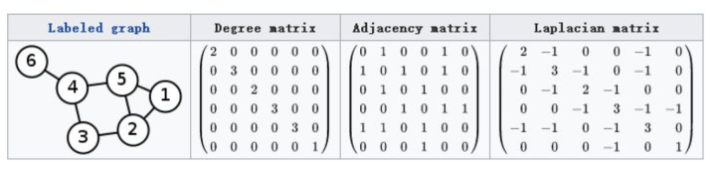
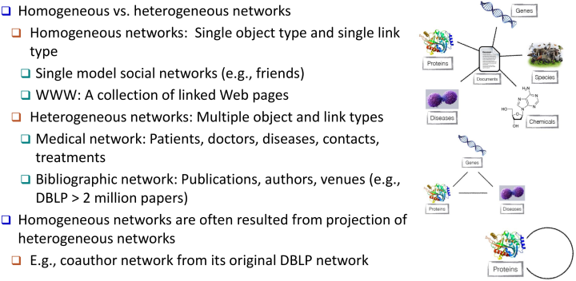

## 网络

网络/图：，其中，

## 网络分析任务

大都是描述或预测性问题：节点影响力(Node importance)；寻找节点社区(Community detection)；网络距离(Network distance)；链接预测(Link prediction)；节点分类(Node classification)... 

## 瓶颈

1. **高计算复杂度：**如果要计算一个网络中两个节点的相似度，首先要计算与其相连的各节点，而各节点又有相连节点。所以，分析一个网络中两节点的相似度，相当于需要遍历整个网络，这个计算复杂度是极其高的。
2. **低并发能力：**网络确实可以并行计算，但是因为网络节点相互间的关联性，导致并行计算的同时各机器间又要有大量交互，这大大降低了并行计算的优势。
3. **不适用机器学习方法：**现有机器学习方法大都假设元素可用向量空间中的一个向量表示，所以我们正在探寻将网络映射成向量，这样就将新的问题转化成已知问题可进行解决了。

## 网络图模型方案

因为存在上述瓶颈，现在存在两大流派去处理网络图模型：

1. 经典图处理：在系统和框架中寻求解决方案，设计网络图模型针对需求的对应算法
2. 图神经网络：将网络图进行表示学习并与深度学习结合，将新问题转化成之前解决过的问题

---

## 网络图的相关概念

这里介绍了13组相关基础概念，非常繁杂劝退，建议大家先跳到后面看Classic Graph Algorithm，对基础概念不清晰并不影响看算法。

#### 1. 图(Graph) vs. 网络(Network)

Graph是数学领域的表示，是一种数据结构。Network是现实生活中的表示，是指的数据。

#### 2. 度矩阵(Degree matrix)&邻接矩阵(Adjacency matrix)&拉普拉斯矩阵(Laplacian matrix)

度矩阵即节点度(边)的数量，邻接矩阵即节点和哪些节点相连，拉普拉斯即度矩阵减邻接矩阵 

#### 3. 无向图/网络 vs 有向图/网络 以及他们的度

#### 4. 不同类型网络及他们的度

#### 5. 基础网络结构及其性质

#### 6. 度(Degree)的分布及路径(Path)

#### 7. 路径(Path)相关
  

#### 8. 离心率(Eccentricity)&半径(Radius)&直径(Diameter)

#### 9. 无向网络(Undirected Network)与有向网络(Directed Network)中的元素

#### 10. 独立路径(Independent Path)&连通性(Connectivity)&切割集(Cut Set)

#### 11. 聚类系数(Clustering Coefficient)

#### 12. 同质网络(Homogeneous Network) vs 异构网络(Heterogeneous Network)
  

#### 13. 双边网络(Bipartite Network)

Bipartite Network: two kinds of vertices, and edges linking only vertices of unlike types 

## Source

[https://github.com/chmx0929/UIUCclasses/blob/master/512DataMiningPrinciples/Slides-pdf/1-Intro_Network.pdf](https://github.com/chmx0929/UIUCclasses/blob/master/512DataMiningPrinciples/Slides-pdf/1-Intro_Network.pdf) [http://pengcui.thumedialab.com/papers/NetworkEmbeddingSurvey.pdf](http://pengcui.thumedialab.com/papers/NetworkEmbeddingSurvey.pdf) [http://pengcui.thumedialab.com/papers/KDD%20network%20representation%20tutorial-v3.pptx](http://pengcui.thumedialab.com/papers/KDD%20network%20representation%20tutorial-v3.pptx)
