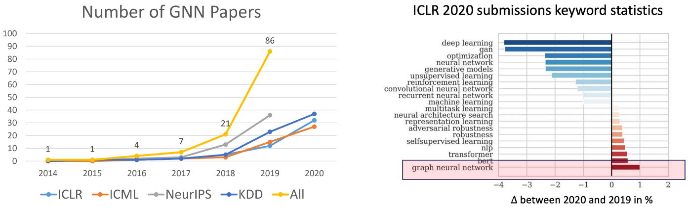
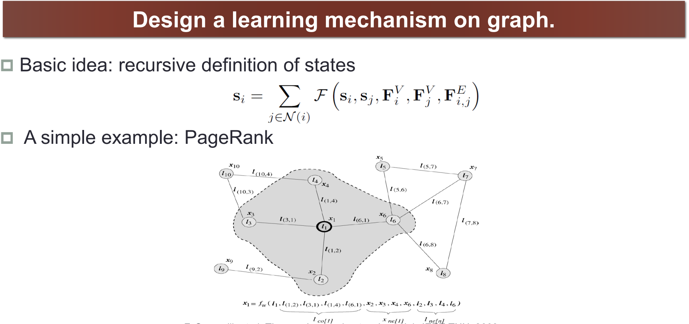
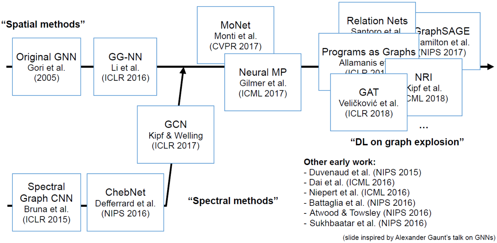
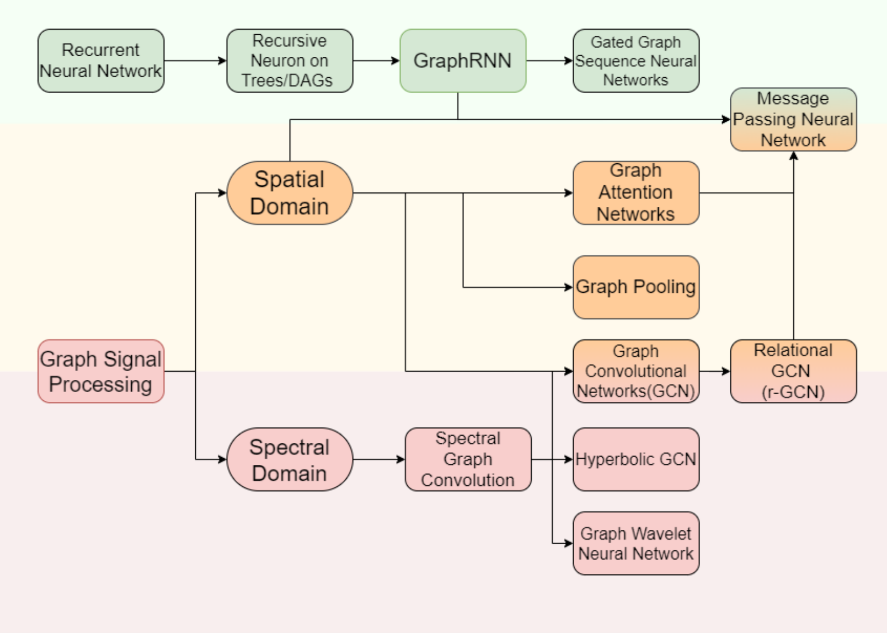
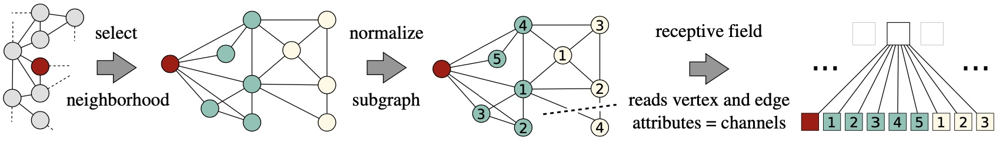
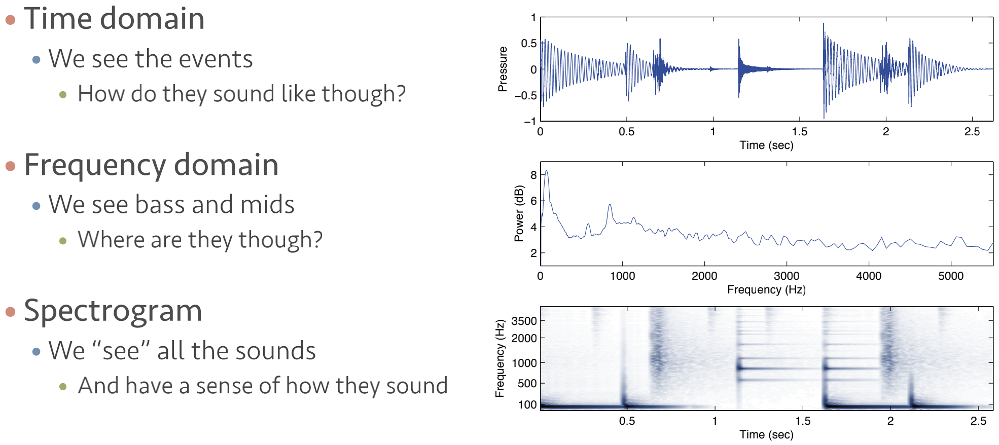
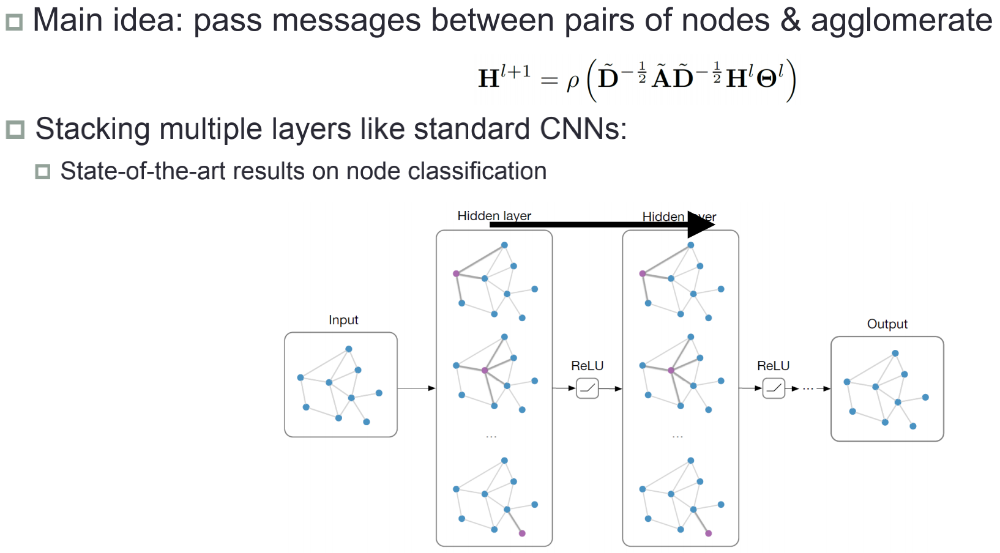

# Graph Neural Network

Graph Neural Network最近很火，各会议论文很多，可以见下图，是学术界和工业界的一个重点研究方向。这里我对不同类型深度学习与图谱结合进行简单阐述。此外，Graph/Network Embedding技术是将图数据量化技术，也和深度学习结合密切，因此也放在此章节下。  Graph Neural Network核心思想是在Graph这种数据结构上设计一种学习机制，用来学习到网络数据的隐含信息以帮助我们解决各类的问题。

就像我们在图片这种数据上采用CNN，卷积的学习机制帮助我们很好的学习到了图片特征，以帮助我们进行图片分类等任务。引入Attention机制在NLP任务中，也很好的解决了翻译等问题。这两种方式都很简单，比如卷积本质其实就是加权求和而已，但是落地验证效果都很好。原因就是两种方法都模拟了人类的认知方式，我们看图片也是看几个重要的区域识别图片上的到底是什么，Attention模拟了人通过上下文讲river的事情了解bank语义是河岸这种关联关系的提取。像图片和文本数据我们很有经验，因为他是实实在在的。而Network有一定的抽象提取，所以怎样在Graph这种数据结构上模拟人类认知经验也比较少，现在主要基于Spatial methods和Spectral methods两种思路结合Neural Network进行学习机制设计。  

# Spatial methods vs. Spectral methods

如同CNN，卷积将图片的信息加权求和后放入Neural Network进行学习，我们这里要设计的是怎样将Graph的信息处理后放入Neural Network。

## Spatial methods

Spatial methods其实就是在节点上下功夫，通过节点信息提取Graph中节点的拓扑空间特征，核心就是下面两个问题：

1. 按照什么规则逻辑选取我们中心target节点的neighbor们
2. 选取好neighbor们后，按照什么方式处理他们的特征

比如我们熟知的Deep Walk，就是一种典型的Spatial method，他的邻居选取规则逻辑：固定长度的Random Walk，特征处理方式：word2vec方法。

## Spectral methods

Spectral methods其实就是借助[光谱图理论](https://link.zhihu.com/?target=https%3A//en.wikipedia.org/wiki/Spectral_graph_theory)来提取Graph上的信息。我们已经有比较成熟的信号处理，比如语音信号，如下图。Graph也是一种信号，我们通过转换去表示他，这是信号处理的一个分之，Graph Signal Processing。

大火的Graph Convolutional Network就是一个典型的Spectral method，他将Graph进行Fourier Transformation后，融合卷积的思想，结合Neural Network去解决我们的任务。

# 

# Source
[图神经网络必读的5个基础模型: GCN, GAT, GraphSAGE, GAE, DiffPool.](https://mp.weixin.qq.com/s/t6n7wfov1fMj-QstKzN2Ow) [https://arxiv.org/pdf/1812.04202.pdf](https://arxiv.org/pdf/1812.04202.pdf) [网络图模型综述](https://zhuanlan.zhihu.com/p/86181013) [Deep Graph Learning](https://ai.tencent.com/ailab/ml/KDD-Deep-Graph-Learning.html)
