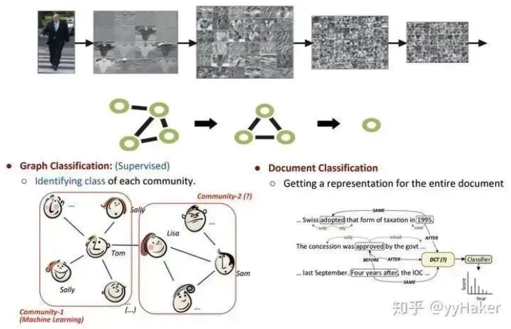
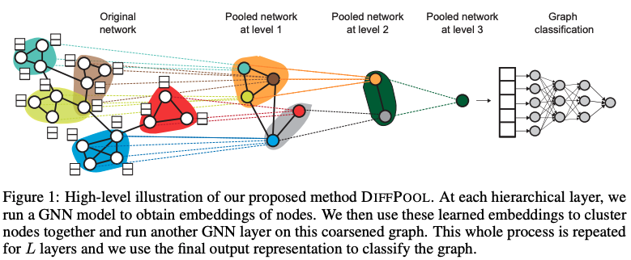
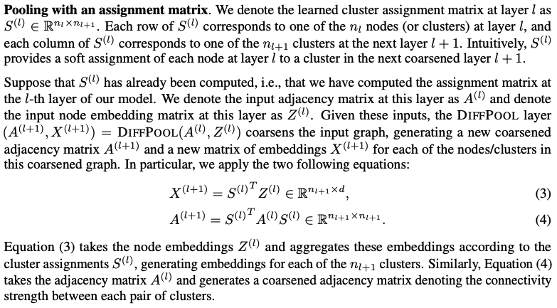
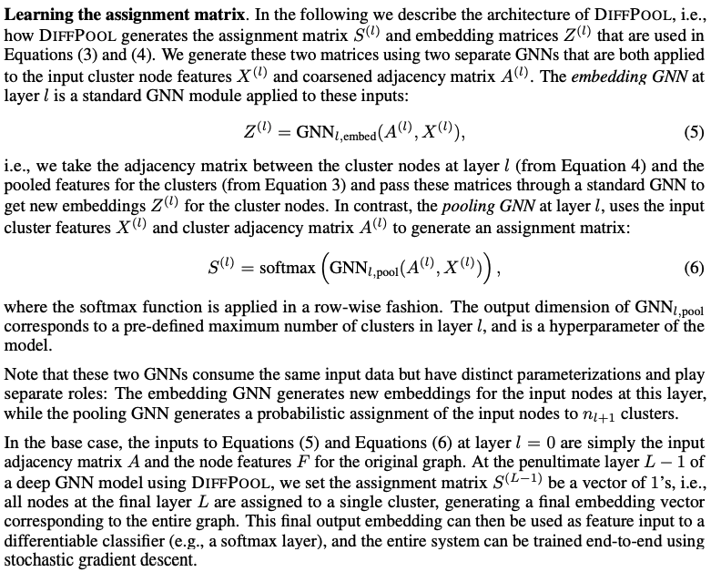
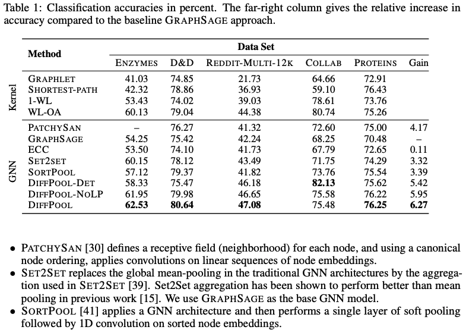
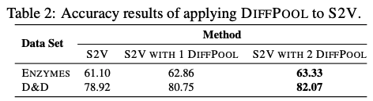
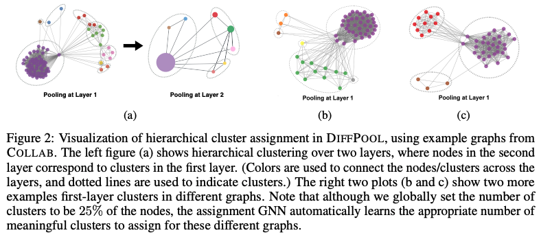

Graph pooling是GNN中很流行的一种操作，目的是为了获取一整个图的表示，主要用于处理图级别的分类任务，例如在有监督的图分类、文档分类等等。  Graph pooling的方法有很多，如简单的max pooling和mean pooling，然而这两种pooling不高效而且忽视了节点的顺序信息；这里介绍一种方法：Differentiable Pooling (DiffPool)。

在图级别的任务当中，当前的很多方法是将所有的节点嵌入进行全局池化，忽略了图中可能存在的任何层级结构，这对于图的分类任务来说尤其成问题，因为其目标是预测整个图的标签。针对这个问题，斯坦福大学团队提出了一个用于图分类的可微池化操作模块——DiffPool，可以生成图的层级表示，并且可以以端到端的方式被各种图神经网络整合。

DiffPool的核心思想是通过一个可微池化操作模块去分层的聚合图节点，具体的，这个可微池化操作模块基于GNN上一层生成的节点嵌入 以及分配矩阵 ，以端到端的方式分配给下一层的簇，然后将这些簇输入到GNN下一层，进而实现用分层的方式堆叠多个GNN层的想法。  那么这个节点嵌入和分配矩阵是怎么算的？计算完之后又是怎么分配给下一层的？这里就涉及到两部分内容，一个是池化分配矩阵，一个是分配矩阵的学习

- 池化分配矩阵

计算得到分配矩阵 和每一个簇节点新的嵌入之后，DiffPool层根据分配矩阵，对于图中的每个节点/簇生成一个新的粗化的邻接矩阵 与新的嵌入矩阵  

- 分配矩阵的学习

这里使用两个分开的GNN来生成分配矩阵 和每一个簇节点新的嵌入 ，这两个GNN都是用簇节点特征矩阵 和粗化邻接矩阵作为输入   总的来看，每层的DiffPool其实就是更新每一个簇节点的嵌入和簇节点的特征矩阵，如下公式：   作者在多种图分类的基准数据集上进行实验，如蛋白质数据集（ENZYMES，PROTEINS，D&D），社交网络数据集（REDDIT-MULTI-12K），科研合作数据集（COLLAB），实验结果如下：  其中，GraphSAGE是采用全局平均池化；DiffPool-DET是一种DiffPool变体，使用确定性图聚类算法生成分配矩阵；DiffPool-NOLP是DiffPool的变体，取消了链接预测目标部分。总的来说，DiffPool方法在GNN的所有池化方法中获得最高的平均性能。为了更好的证明DiffPool对于图分类十分有效，论文还使用了其他GNN体系结构（Structure2Vec(s2v)），并且构造两个变体，进行对比实验，如下表，可以看到DiffPool的显著改善了S2V在ENZYMES和D&D数据集上的性能。  而且DiffPool可以自动的学习到恰当的簇的数量：  至此，我们来总结一下DiffPool的优点：

1. 可以学习层次化的pooling策略
2. 可以学习到图的层次化表示
3. 可以以端到端的方式被各种图神经网络整合

然而，注意到，DiffPool也有其局限性，分配矩阵需要很大的空间去存储，空间复杂度为 ， 为池化层的层数，所以无法处理很大的图。

# Source
[https://arxiv.org/pdf/1806.08804.pdf](https://arxiv.org/pdf/1806.08804.pdf) [图神经网络必读的5个基础模型: GCN, GAT, GraphSAGE, GAE, DiffPool.](https://mp.weixin.qq.com/s/t6n7wfov1fMj-QstKzN2Ow)
