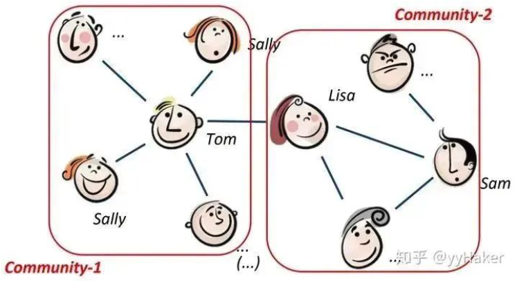
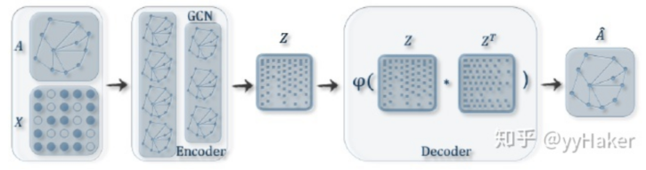
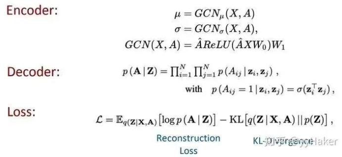
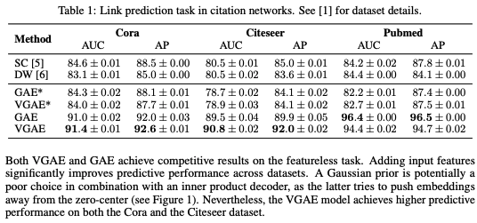

由于标注数据的成本非常高，如果能够利用无监督的方法很好的学习到节点的表示，将会有巨大的价值和意义，例如找到相同兴趣的社区、发现大规模的图中有趣的结构等等。  这其中比较经典的模型有GraphSAGE、Graph Auto-Encoder（GAE）等，GraphSAGE就是一种很好的无监督表示学习的方法，前面已经介绍了，这里就不赘述，接下来将详细讲解GAE。在介绍Graph Auto-Encoder之前，需要先了解自编码器(Auto-Encoder)、变分自编码器(Variational Auto-Encoder)，具体可以参考[Variational graph auto-encoders](https://arxiv.org/pdf/1611.07308.pdf)

理解了自编码器之后，再来理解变分图的自编码器就容易多了。如下图输入图的邻接矩阵和节点的特征矩阵，通过编码器（图卷积网络）学习节点低维向量表示的均值和方差，然后用解码器（链路预测）生成图。  编码器（Encoder）采用简单的两层GCN网络，解码器（Encoder）计算两点之间存在边的概率来重构图，损失函数包括生成图和原始图之间的距离度量，以及节点表示向量分布和正态分布的KL-散度两部分。具体公式如下图：  另外为了做比较，作者还提出了图自编码器(Graph Auto-Encoder)，相比于变分图的自编码器，图自编码器就简单多了，Encoder是两层GCN，Loss只包含Reconstruction Loss。

那么两种图自编码器的效果如何呢？作者分别在Cora、Citeseer、Pubmed数据集上做Link prediction任务，实验结果如下表，图自编码器（GAE）和变分图自编码器（VGAE）效果普遍优于传统方法，而且变分图自编码器的效果更好；当然，Pumed上GAE得到了最佳结果。可能是因为Pumed网络较大，在VGAE比GAE模型复杂，所以更难调参。 

# Source
[https://arxiv.org/pdf/1611.07308.pdf](https://arxiv.org/pdf/1611.07308.pdf) [VGAE（Variational graph auto-encoders）论文详解](https://zhuanlan.zhihu.com/p/78340397) [图神经网络必读的5个基础模型: GCN, GAT, GraphSAGE, GAE, DiffPool.](https://mp.weixin.qq.com/s/t6n7wfov1fMj-QstKzN2Ow)
