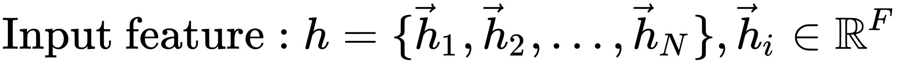
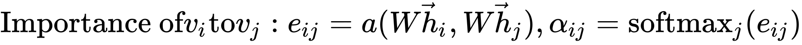
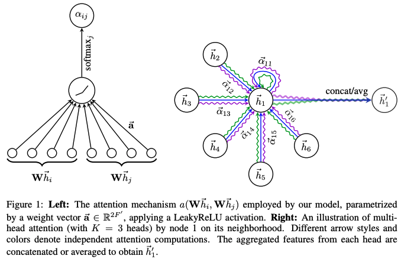
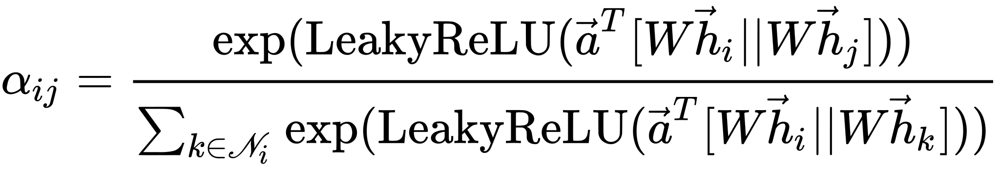
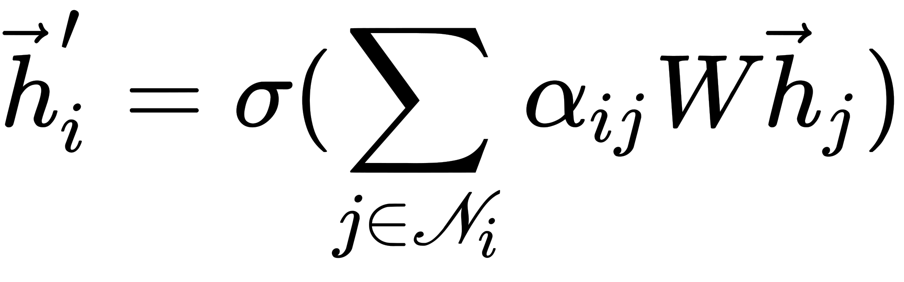
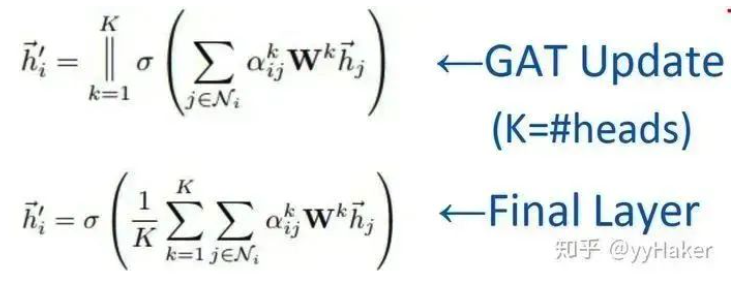
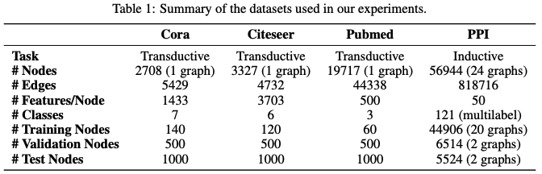
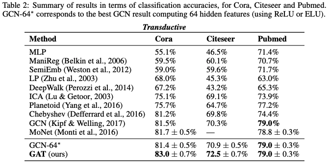
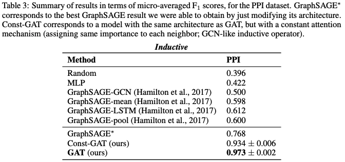

GAT(Graph Attention Networks)为了解决GNN聚合邻居节点的时候没有考虑到不同的邻居节点重要性不同的问题，借鉴了Transformer的idea，引入masked self-attention机制，在计算图中的每个节点的表示的时候，会根据邻居节点特征的不同来为其分配不同的权值。具体的，对于输入的图，一个graph attention layer如下图所示：    其中采用了单层的前馈神经网络实现，计算过程如下（注意权重矩阵 对于所有的节点是共享的）：  计算完attention之后，就可以得到某个节点聚合其邻居节点信息的新的表示，计算过程如下：  为了提高模型的拟合能力，还引入了多头的self-attention机制，即同时使用多个 计算self-attention，然后将计算的结果合并（连接或者求和）：  此外，由于GAT结构的特性，GAT无需使用预先构建好的图，因此GAT既适用于Transductive Learning，又适用于Inductive Learning。    无论是在Transductive Learning还是在Inductive Learning的任务上，GAT的效果都要优于传统方法的结果。至此，GAT的介绍完毕，我们来总结一下，GAT的一些优点：

1. 训练GCN无需了解整个图结构，只需知道每个节点的邻居节点即可；
2. 计算速度快，可以在不同的节点上进行并行计算；
3. 既可以用于Transductive Learning，又可以用于Inductive Learning，可以对未见过的图结构进行处理。

# Source
[https://arxiv.org/pdf/1710.10903.pdf](https://arxiv.org/pdf/1710.10903.pdf) [图神经网络必读的5个基础模型: GCN, GAT, GraphSAGE, GAE, DiffPool.](https://mp.weixin.qq.com/s/t6n7wfov1fMj-QstKzN2Ow)
