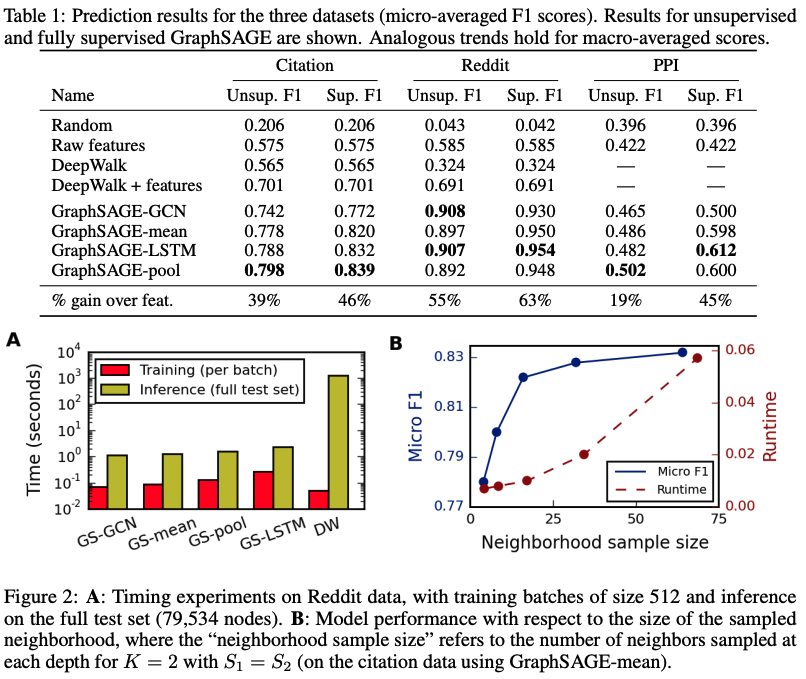

为了解决GCN的两个缺点，GraphSAGE被提了出来

1. GCN需要将整个图放到内存和显存，这将非常耗内存和显存，处理不了大图；
2. GCN在训练时需要知道整个图的结构信息(包括待预测的节点), 这在现实某些任务中也不能实现(比如用今天训练的图模型预测明天的数据，那么明天的节点是拿不到的)。

在介绍GraphSAGE之前，先介绍一下Inductive learning和Transductive learning。注意到图数据和其他类型数据的不同，图数据中的每一个节点可以通过边的关系利用其他节点的信息。这就导致一个问题，GCN输入了整个图，训练节点收集邻居节点信息的时候，用到了测试和验证集的样本，我们把这个称为Transductive learning。然而，我们所处理的大多数的机器学习问题都是Inductive learning，因为我们刻意的将样本集分为训练/验证/测试，并且训练的时候只用训练样本。这样对图来说有个好处，可以处理图中新来的节点，可以利用已知节点的信息为未知节点生成embedding，GraphSAGE就是这么干的。

GraphSAGE是一个Inductive Learning框架，具体实现中，训练时它仅仅保留训练样本到训练样本的边，然后包含Sample和Aggregate两大步骤，Sample是指如何对邻居的个数进行采样，Aggregate是指拿到邻居节点的embedding之后如何汇聚这些embedding以更新自己的embedding信息。下图是了GraphSAGE学习的一个过程： 

1. 第一步，对邻居采样；
2. 第二步，采样后的邻居embedding传到节点上来，并使用一个聚合函数聚合这些邻居信息以更新节点的embedding；
3. 第三步，根据更新后的embedding预测节点的标签。

接下来，我们详细的说明一个训练好的GrpahSAGE是如何给一个新的节点生成embedding的（即一个前向传播的过程），如下算法图：  首先，(line1)算法首先初始化输入的图中所有节点的特征向量，(line3)对于每个节点 ，拿到它采样后的邻居节点 后，(line4)利用聚合函数聚合邻居节点的信息，(line5)并结合自身embedding通过一个非线性变换更新自身的embedding表示。

注意到算法里面的 ，它是指聚合器的数量，也是指权重矩阵的数量，还是网络的层数，这是因为每一层网络中聚合器和权重矩阵是共享的。网络的层数可以理解为需要最大访问的邻居的跳数(hops)，比如在图7中，红色节点的更新拿到了它一、二跳邻居的信息，那么网络层数就是2。为了更新红色节点，首先在第一层(k=1)，我们会将蓝色节点的信息聚合到红色解节点上，将绿色节点的信息聚合到蓝色节点上。在第二层(k=2)红色节点的embedding被再次更新，不过这次用到的是更新后的蓝色节点embedding，这样就保证了红色节点更新后的embedding包括蓝色和绿色节点的信息，也就是两跳信息。

为了看的更清晰，我们将更新某个节点的过程展开来看，如下图分别为更新节点A和更新节点B的过程，可以看到更新不同的节点过程每一层网络中聚合器和权重矩阵都是共享的。  那么GraphSAGE Sample是怎么做的呢？GraphSAGE是采用定长抽样的方法，具体来说，定义需要的邻居个数 ，然后采用有放回的重采样/负采样方法达到 。保证每个节点（采样后的）邻居个数一致，这样是为了把多个节点以及它们的邻居拼接成Tensor送到GPU中进行批训练。

那么GraphSAGE 有哪些聚合器呢？主要有三个：  这里说明的一点是Mean Aggregator和GCN的做法基本是一致的（GCN实际上是求和）

到此为止，整个模型的架构就讲完了，那么GraphSAGE是如何学习聚合器的参数以及权重矩阵 呢？如果是有监督的情况下，可以使用每个节点的预测lable和真实lable的交叉熵作为损失函数。如果是在无监督的情况下，可以假设相邻的节点的embedding表示尽可能相近，因此可以设计出如下的损失函数：  那么GrpahSAGE的实际实验效果如何呢？作者在Citation、Reddit、PPI数据集上分别给出了无监督和完全有监督的结果，相比于传统方法提升还是很明显。  至此，GraphSAGE介绍完毕。我们来总结一下，GraphSAGE的一些优点：

1. 利用采样机制，很好的解决了GCN必须要知道全部图的信息问题，克服了GCN训练时内存和显存的限制，即使对于未知的新节点，也能得到其表示；
2. 聚合器和权重矩阵的参数对于所有的节点是共享的；
3. 模型的参数的数量与图的节点个数无关，这使得GraphSAGE能够处理更大的图
4. 既能处理有监督任务也能处理无监督任务。

当然，GraphSAGE也有一些缺点，每个节点那么多邻居，GraphSAGE的采样没有考虑到不同邻居节点的重要性不同，而且聚合计算的时候邻居节点的重要性和当前节点也是不同的。

# Source
[GraphSAGE](https://snap.stanford.edu/graphsage/) [图神经网络必读的5个基础模型: GCN, GAT, GraphSAGE, GAE, DiffPool.](https://mp.weixin.qq.com/s/t6n7wfov1fMj-QstKzN2Ow)
