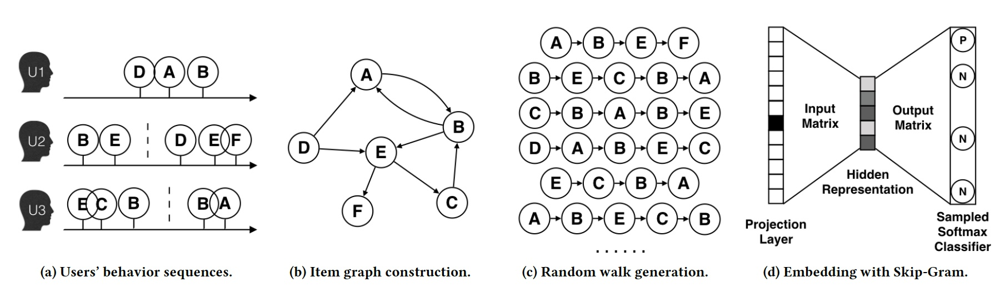

## 网络映射的目标

网络映射的目标，也就是评价网络映射好坏的指标，简单的来说就是两点：1、涵盖尽量多的网络信息；2、映射(量化)后的结果可有效用于后续算法。

### 1. 网络重构性

即原网络依旧可以从映射的空间中再重构生成。诚然，我们如果只考虑网络重构性，直接用SVD等矩阵分解就可以得到低维度矩阵来表示网络所有的节点及节点间连接关系。

但是这样丧失了很多隐含信息，比如high order的拓扑结构。（如果两个节点并未直接相连，我们并不能说两者之间没有关系，比如下图5与6虽然不相连，但second order approximation很高） 

### 2. 映射空间支持网络推断

即依旧可以反应网络结构和保持网络特性，依旧可以进行网络分析（Node importance; Community detection; Network distance; Link prediction; Node classification ...） 

## 网络映射方法与类别

### 按不同方法类型划分

### 按不同结构类型划分

对于一个网络来说，它的结构又可分为多层：结点&链接(Nodes&Links)、结点近邻(Node Neighborhood)、成对近似(Pair-wise Proximity)、社区结构(Community Structures)、超边(Hyper Edges)、全局结构(Global Structure)。现有的结构维持的网络映射各自着重不同的结构层还进行映射。

|  | 算法模型 |
| --- | --- |
| 基于Node Neighborhood | Deep Walk，Node2vec |
| 基于Pair-wise Proximity | Trans，LINE，SDNE，GraRep，AROPE |
| 基于Global Structures | GraRep，DRNE，GraphSAGE |

### 按不同网络类型划分

下面两张图取自[GATNE](https://github.com/THUDM/GATNE)论文，针对不同网络图类型列举出不同的网络映射方法。

- HON即Node和Edge都是单一类型，比如Node都是账号，Edge都是关注关系
- AHON即Node和Edge都是单一类型并有Attribute，比如Node都是账号，Edge都是关注关系，且有账号性别年龄地域或加关注关系时间等属性
- HEN即Node多类型，Edge单类型，比如Node为账号或商品，Edge为购买关系
- AHEN即Node多类型，Edge单类型，并有Attribute，比如Node为账号或商品，Edge为购买关系，且有账号性别年龄地域或购买时间金额等属性
- MHEN即Node单类型或多类型，Edge多类型，比如Node为账号，Edge为关注、转发、点赞、评论；Node为账号或文章，Edge为关注、发表、转发、点赞
- AMHEN即Node多类型，Edge多类型，并有Attribute，Node为账号或文章，Edge为关注、发表、转发、点赞，且有账号性别年龄地域或文章发布时间内容领域等属性

## 局部结构 vs. 全局结构

**局部结构(local structure)**简单易理解，即相连关系，比如first/second/third... order similarity 

**全局结构(Global structure)**也比较简单，比如在互联网公司的社交网络中：某一阿里p8和百度T7，两人一个在杭州一个在北京，并不认识，中间经过很多跳才能相连，但是在整个网络中，同样手下管理10多个人，都是向1位更高职级的人汇报。在这个网络中，他们两人全局相似。

## Graph Embedding方法

### Matrix Factorization

矩阵分解，也可以从降维的角度去理解，将大的邻接矩阵进行矩阵分解，得到k维的Embedding Matrix 

### Trans系列
基于图谱存储tuple三元组形式，h(head)，r(relation)，t(tail)构造映射

#### TransE
[TransE](https://www.utc.fr/~bordesan/dokuwiki/_media/en/transe_nips13.pdf)：核心思想为，即，其中。简单表述为每个三元组，替换里面其中一个元素作为负样本，再结合正样本进行训练。 

#### TransH
如下图所示，还是讨论h，r，t三个的关系，只不过是映射到超平面空间上。其中向量在超平面上的投影是这样计算的：， 

#### TransR
， 

#### TransD

### 

### Deep Walk

[Deep Walk](https://github.com/phanein/deepwalk)：Deep Walk用一句话来讲就是固定长度的Random Walk，如下图右上通过Random Walk将网络变成固定长度的序列。这些序列可以看作我们自然语言中一个个句子，所以再应用一些word2vector的方法就可以转成vector啦(Random Walk忘了的同学，就是一句话，节点X到节点Y的概率)。[代码链接](https://github.com/phanein/deepwalk)。  下面以SkipGram的方法进行网络中结点的表示学习为例。根据SkipGram的思路，最重要的就是定义Context，也就是Neighborhood。NLP中，Neighborhood是当前Word周围的字，本文用随机游走得到Graph或者Network中节点的Neighborhood。

- 随机游走随机均匀地选取网络节点，并生成固定长度的随机游走序列，将此序列类比为自然语言中的句子（节点序列=句子，序列中的节点=句子中的单词），应用skip-gram模型学习节点的分布式表示。
- 前提：如果一个网络的节点服从幂律分布，那么节点在随机游走序列中的出现次数也服从幂律分布，并且实证发现NLP中单词的出现频率也服从幂律分布。

 大体步骤：Network/Graph  -->  Random Walk  -->  得到节点序列（representation mapping） --> 放到skip-gram模型中 -->  output：得到representation  再以阿里的EGES为例，其主要思想是在由物品组成的图结构上进行随机游走，产生大量物品序列，然后将这些物品序列作为训练样本输入word2vec进行训练，得到物品的embedding。下图用展现了算法的过程。 

1. 图a展示了原始的用户行为序列
2. 图b基于这些用户行为序列构建了物品相关图，可以看出，物品A，B之间的边产生的原因就是因为用户U1先后购买了物品A和物品B，所以产生了一条由A到B的有向边。如果后续产生了多条相同的有向边，则有向边的权重被加强。在将所有用户行为序列都转换成物品相关图中的边之后，全局的物品相关图就建立起来了。
3. **图c采用随机游走的方式随机选择起始点，重新产生物品序列。**
4. 图d最终将这些物品序列输入word2vec模型，生成最终的物品Embedding向量。

在上述DeepWalk的算法流程中，核心是第三步，其中唯一需要形式化定义的是随机游走的跳转概率，也就是到达节点后，下一步遍历的临接点的概率。如果物品的相关图是有向有权图，那么从节点跳转到节点的概率定义如下：  其中是节点所有的出边集合，是节点到节点边的权重。如果物品相关图是无相无权重图，那么跳转概率将是上面公式的一个特例，即权重将为常数，且应是节点所有“边”的集合，而不是所有“出边”的集合。

### LINE

[LINE](https://github.com/tangjianpku/LINE)：相比DeepWalk纯粹随机游走的序列生成方式，LINE可以应用于有向图、无向图以及边有权重的网络，并通过将一阶、二阶的邻近关系引入目标函数，能够使最终学出的node embedding的分布更为均衡平滑，避免DeepWalk容易使node embedding聚集的情况发生。 

### Node2vec

[Node2Vec](http://snap.stanford.edu/node2vec/)：斯坦福大学在DeepWalk的基础上更进一步，通过调整随机游走权重的方法使Graph Embedding的结果在网络的同质性(homophily)和结构性(structural equivalence)中进行权衡权衡。[代码链接](http://snap.stanford.edu/node2vec/)。

- “同质性”指的是距离相近节点的embedding应该尽量近似。为了使Graph Embedding的结果能够表达网络的同质性，在随机游走的过程中，需要让游走的过程更倾向于宽度优先搜索(BFS)，因为BFS更喜欢游走到跟当前节点有直接连接的节点上，因此就会有更多同质性信息包含到生成的样本序列中，从而被embedding表达。
- “结构性”指的是结构上相似的节点的embedding应该尽量接近。为了抓住网络的结构性，就需要随机游走更倾向于深度优先搜索(DFS)，因为DFS会更倾向于通过多次跳转，游走到远方节点上，使得生成的样本序列包含更多网络的整体结构信息。

返回概率参数(Return parameter)，对应BFS，控制回到原来节点的概率，如图中从t跳到v以后，有的概率在节点处再跳回到。离开概率参数(In outparameter)，对应DFS，控制跳到其他节点的概率。拿下图举例，从到节点v上，下一步要决定往那边走表示节点t到节点x之间的最短路径即则表示和直接相连...参数和共同控制着随机游走的倾向性。

- BFS，广度优先：微观局部信息
- DFS，深度优先：宏观全局信息

 上图中，刚从过来，现在在节点上，要决定下一步怎么走。其中表示节点到节点之间的最短路径，表示会回到节点本身，表示节点和节点直接相连，但是在上一步却选择了节点，表示节点不与直接相连，但节点与直接相连。所以，就如上面提到的，指的是节点到节点的距离，参数和共同控制着随机游走的倾向性。参数被称为返回参数（return parameter），越小，随机游走回节点的可能性越大，node2vec就更注重表达网络的同质性，参数被称为进出参数（in-out parameter），越小，则随机游走到远方节点的可能性越大，node2vec更注重表达网络的结构性，反之，当前节点更可能在附近节点游走。

node2vec这种灵活表达同质性和结构性的特点也得到了实验的证实。下面的上图就是node2vec更注重同质性的体现，可以看到距离相近的节点颜色更为接近，而下图则是结构特点相近的节点的颜色更为接近。  node2vec所体现的网络的同质性和结构性在推荐系统中也是可以被很直观的解释的。**同质性相同的物品很可能是同品类、同属性、或者经常被一同购买的物品**，而**结构性相同的物品则是各品类的爆款、各品类的最佳凑单商品等拥有类似趋势或者结构性属性的物品**。毫无疑问，二者在推荐系统中都是非常重要的特征表达。由于node2vec的这种灵活性，以及发掘不同特征的能力，甚至可以把不同node2vec生成的embedding融合共同输入后续深度学习网络，以保留物品的不同特征信息

### SDNE

[SDNE](https://github.com/suanrong/SDNE)：SDNE是一种半监督深度模型，包含有监督和无监督两部分。有监督部分由Laplacian矩阵建模一阶相似性，无监督部分由深度自编码机对二阶相似性建模。相比于node2vec对游走方式的改进，SDNE模型主要从目标函数的设计上解决embedding网络的局部结构和全局结构的问题。而相比LINE分开学习局部结构和全局结构的做法，SDNE一次性的进行了整体的优化，更有利于获取整体最优的embedding。 

###  

### AROPE

[AROPE](https://github.com/ZW-ZHANG/AROPE)：不同的任务需要考虑不同order的proximity，那我们怎么蕴含任意order的proximity信息呢？邻接矩阵其实可以由一个多项式表示，就像泰勒展开一样，是order，是其他变量比如拉普拉斯矩阵之类，我们就可得。所以目标函数可写为。这就可以用SVD解了， 取top-d的结果即最相关d个order的信息， 

### 

### GraRep

[GraRep](https://dl.acm.org/citation.cfm?id=2806512)：如下图，拿取k步的信息，如果全局中虽不相连但第k步信息相似的结构，那他们的Embedding向量应当相近。模型里不对1阶2阶的信息进行相似查找，为什么这么做很好理解，这种低阶关系太多了意义不大还耗费计算量。 

###  

### DRNE

[DRNE](http://pengcui.thumedialab.com/papers/NE-RegularEquivalence.pdf)：DRNE步骤如下图

1. 采样目标节点的邻居们
2. 根据邻居们的度进行排序
3. 聚合目标节点的邻居们
4. 对目标节点的训练进行弱正则化

###  

### DVNE

[DVNE](http://pengcui.thumedialab.com/papers/NE-DeepVariational.pdf)：DVNE加入了Ranking Loss，这里很好理解，高圆圆和刘亦菲的Rank都高，我的Rank不高，我链接她们两个的可能高，她们链接我的可能小，我的Embedding向量当然距离也会远一些。 

###  

### GraphSAGE

[GraphSAGE](http://snap.stanford.edu/graphsage/)：思路如下图，先采样目标点的邻居节点，再聚合邻居的特征信息，基于聚合信息做映射等 

## Source
[https://github.com/thunlp/NRLPapers](https://github.com/thunlp/NRLPapers) [http://pengcui.thumedialab.com/papers/NetworkEmbeddingSurvey.pdf](http://pengcui.thumedialab.com/papers/NetworkEmbeddingSurvey.pdf) [http://pengcui.thumedialab.com/papers/KDD%20network%20representation%20tutorial-v3.pptx](http://pengcui.thumedialab.com/papers/KDD%20network%20representation%20tutorial-v3.pptx)
