小品中说不想知道怎么来的，就想知道怎么没的，但网络图的研究需要弄清网络怎么来的。若我们依照某些原则构造网络图，可以达到和现实中的网络一样，那这些原则即我们挖掘出来的现实中网络图的重要性质，现在研究得出的比较重要也比较知名的性质或因素有3个：尽管现实中网络(社交网络、生物网络...)存在于各个领域但他们之间存在一些相同的特征(直径相似(6度理论)，度较高的节点帮助聚类等)，网络形成模型可以帮助我们更深入挖掘此类特性等。换句通俗语言，知道怎么来的，可以指导我们怎么用。

## 真实网络的共性

现实中的网络最明显两个特征就是网络大，且非常稀疏

1. **Small-world性质：**平均路径长度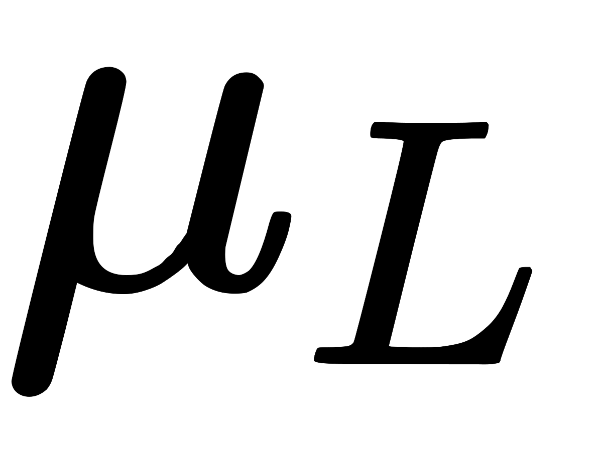大小和(网络中节点数)对数比例相关：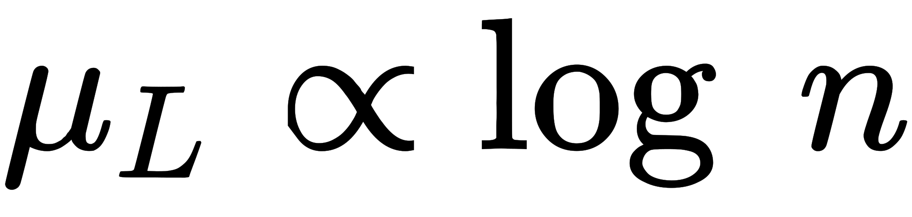。这也就是著名的6度理论(世界中任何两个人都可以通过不超过6个人关系网而联系起来)。
2. **Scale-free性质(幂定律分布)：**绝大多数节点有很少量的度(边)，而小部分节点有很大的度(边)。一个节点有度的概率：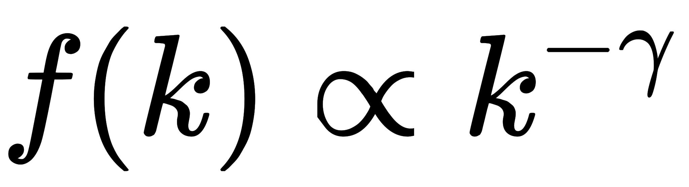。log-log图上为一条直线：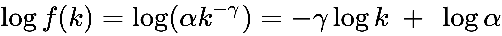
3. **Clustering effect：**如果两个节点有相同邻居，那么这两个节点链接的概率高

## 网络生成模型

### Erdös-Rényi Random graph model

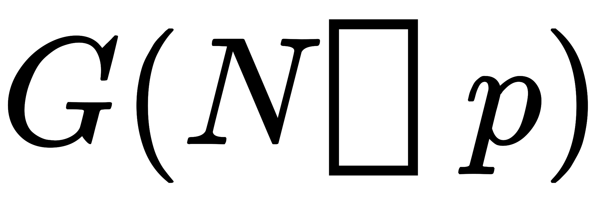：一个网络有个节点，每两个节点连接的概率为

很明显，如果网络比较小(比较小)，则服从二项分布；若网络较大(较大，相对小)则泊松分布。但是实际中网络并非泊松分布的，起码有一些中心点，节点的度更广，下图为ER model的网络与实际对比：

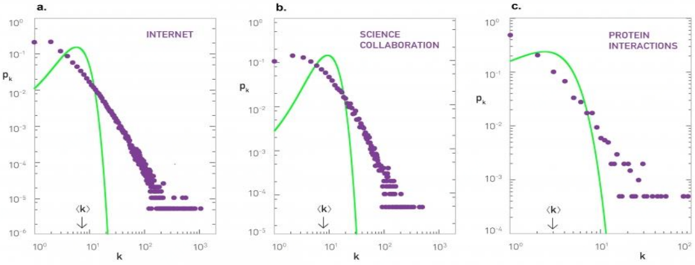

### Watts-Strogatz small world graph model

这个模型相较上面完全随机网络加入了small world特征(6度理论)，平均路径长度比随机网络短。所以这个模型网络中大部分的节点彼此并不相连，但绝大部分节点之间经过少数几步就可到达。

**集聚系数(Cluster coefficient)：**描述图或网络中的顶点(节点)之间结集成团的程度的系数。具体来说，是一个点的邻接点之间相互连接的程度。例如在社交网络中，你的朋友之间相互认识的程度。一个节点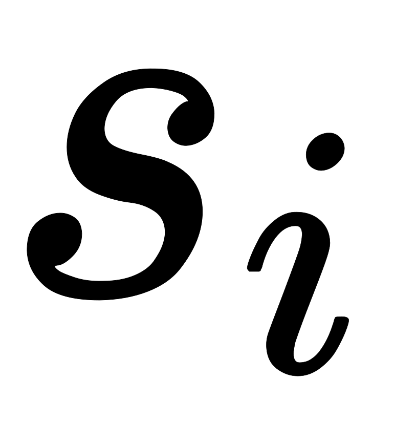的集聚系数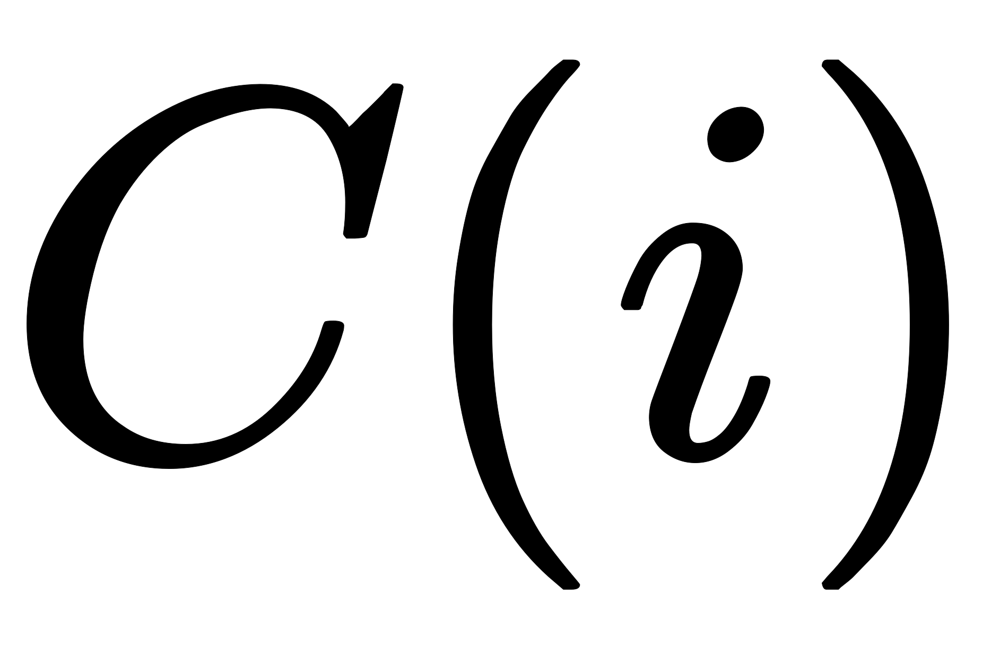等于所有与它相连的顶点相互之间所连的边的数量，除以这些顶点之间可以连出的最大边数。显然是一个介于0与1之间的数。越接近1，表示这个节点附近的点越有“抱团”的趋势。

构造思路：

1. 规则的网络开始。这个网络中的个节点排成正多边形，每个节点都与离它最近的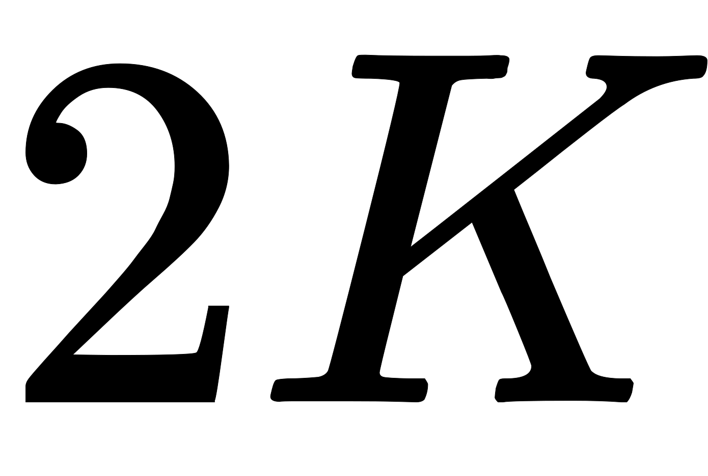个节点相连。其中是一个远小于的正整数。
2. 选择网络中的一个节点，从它开始（它自己是1号节点）将所有节点顺时针编号，再将每个节点连出的连接也按顺时针排序。然后，1号节点的第1条连接会有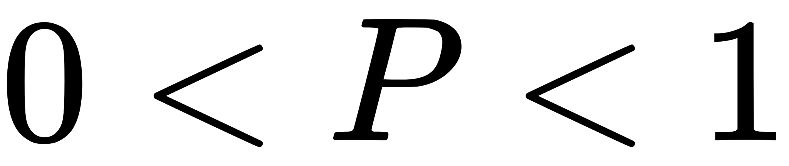的概率被重连。重连方式如下：保持1号节点这一端不变，将连接的另一端随机换成网络里的另一个节点，但不能使得两个节点之间有多于1个连接。
3. 重连之后，对2号、3号节点也做同样的事（如果这其中有连接已经有过重连的机会，就不再重复），直到绕完一圈为止。 再次从1号节点的第2条连接开始，重复第2个步骤和第3个步骤，直到绕完一圈为止。 再次从1号节点开始，重复第4个步骤，直到所有的连接都被执行过第2个步骤（重连的步骤）。

由于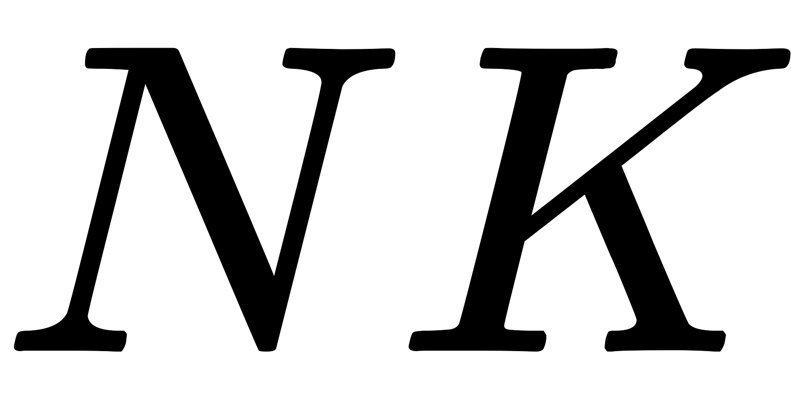个连接里每个连接都恰好有一次重连机会，所以这个过程最后总会结束。这个网络称为WS模型网络。

WS集聚系数表达式：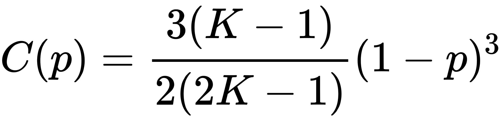

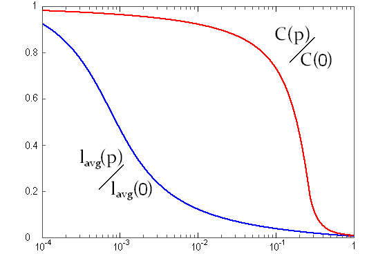

### Barabási-Albert Scale-free model

初始化：由含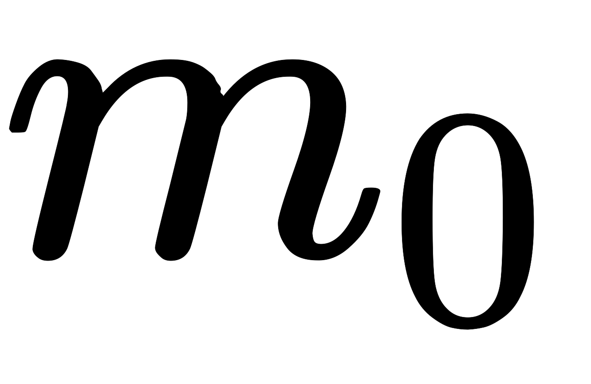个节点的初始网络开始

一次加一个节点，新节点链接到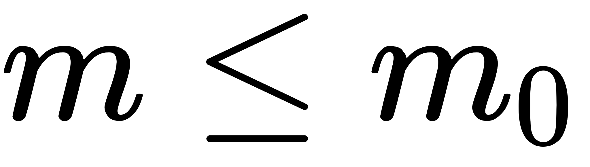个已存在节点，其概率与现有节点已有的链路数成比例。新节点链接已存节点的概率为：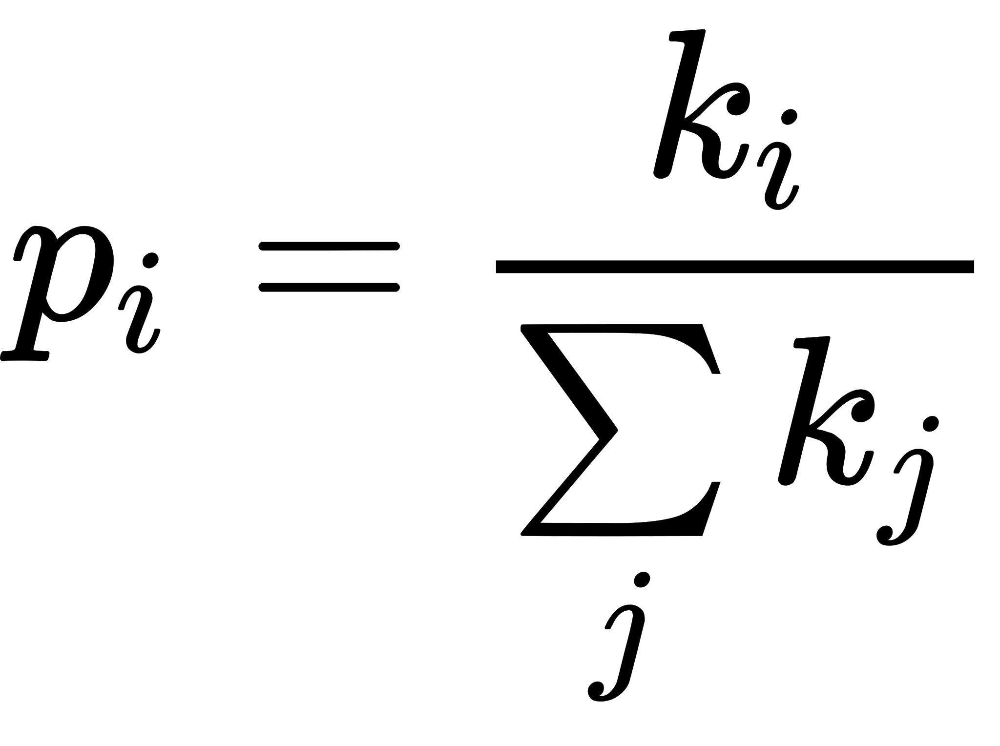，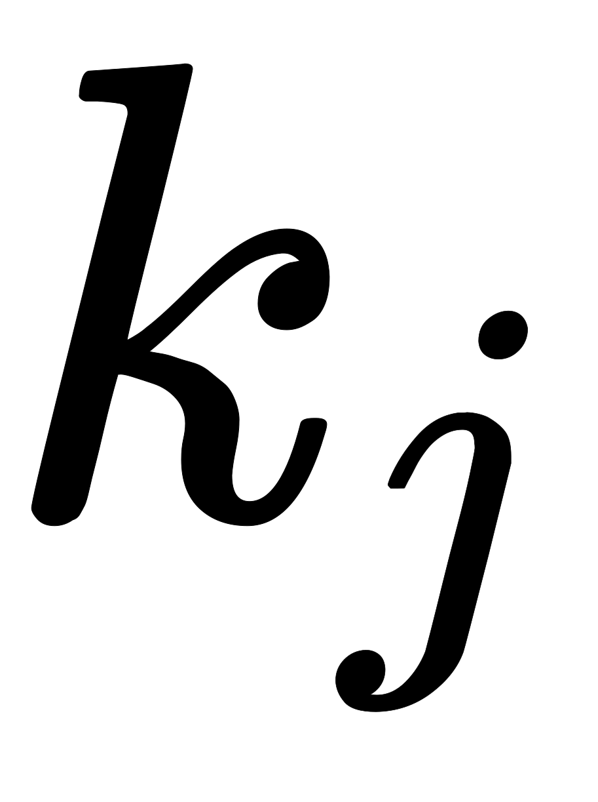为节点的度，并且在所有预先存在的节点上进行求和(比如分母是网络中当前边缘数的两倍)。重度链接的节点(hubs)倾向于快速累积更多链路，而仅具有少量链路的节点不太可能被选择作为新链路的目的地。新节点具有将其自身附加到已经高度链接的节点的“偏好”。

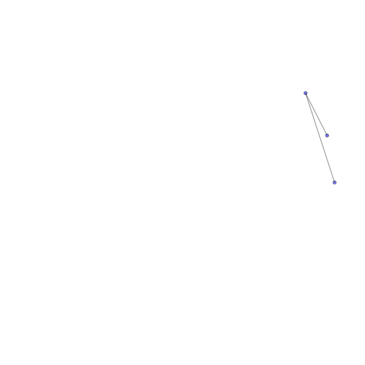
