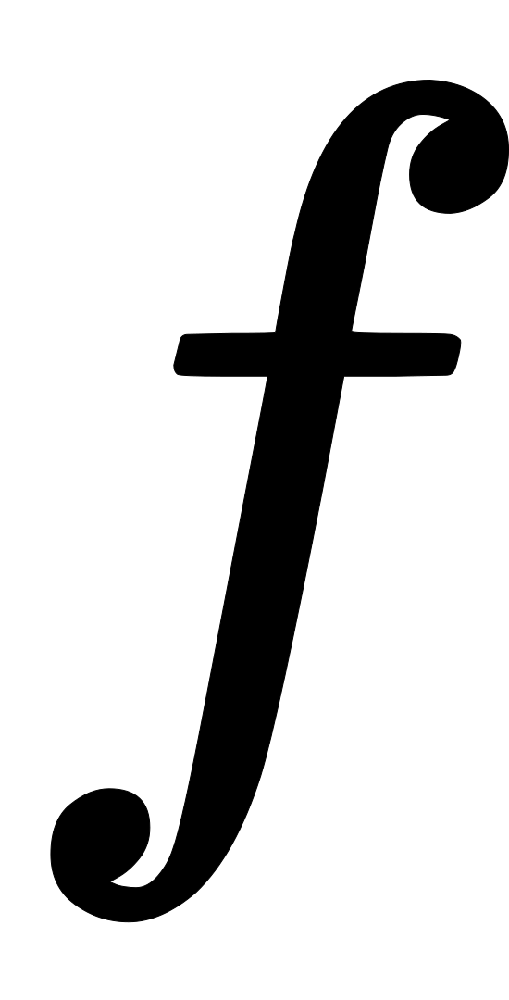

什么是全局光照？光源射出的光线打到物体后，还可以反弹照亮整个场景，如下图所示。全局光照（Global illumination）（有时也称为间接照明和间接光照）能够模拟光照与几何体及材质表面的交互效果，从而为场景添加真实的照明效果。此外，全局光照还考虑到与之相互作用的材质光线吸收性和反射性。有两种方法可以在3D世界中模拟光线运动：

1. 使用支持移动和交互的光照
2. 使用预计算的光照，不需要场景有过于动态或交互的光照

# 历史发展
1962年MIT林肯实验室发布的Sketchpad：一个人机交互通信的图形系统的博士论文开创了计算机图形学。很快，人们就能用多边形模拟三维物体，创建阴影让其显示立体感。  现实中光源发出光线，打到物体再反弹给眼睛，我们才看见了世界。CG世界也是一样，需要有个光源，发射光源，照亮场景。场景是一个个由三角面组成的模型，面越多，模型越精致。这时还需要一个摄像机，摄像机前方是一个屏幕，将模型投射到像素，就得到了一张图像，这就是渲染。
[](https://www.yuque.com/angsweet/machine-learning/rb1gvdgiy9nqamnh?_lake_card=%7B%22status%22%3A%22done%22%2C%22name%22%3A%22%E7%9C%BC%E6%9C%9B%E5%8C%97%E6%96%B9%202023-10-10%2015.31.49.mp4%22%2C%22size%22%3A2324563%2C%22taskId%22%3A%22ud95e9d08-e2cf-4d28-8aef-4eb27e3d251%22%2C%22taskType%22%3A%22upload%22%2C%22url%22%3Anull%2C%22cover%22%3Anull%2C%22videoId%22%3A%22inputs%2Fprod%2Fyuque%2F2023%2F1594055%2Fmp4%2F1696836787285-53925d3c-4120-4b4a-bc8d-26821f02e2bd.mp4%22%2C%22download%22%3Afalse%2C%22__spacing%22%3A%22both%22%2C%22id%22%3A%22vhIxW%22%2C%22margin%22%3A%7B%22top%22%3Atrue%2C%22bottom%22%3Atrue%7D%2C%22card%22%3A%22video%22%7D#vhIxW)在计算机图形学的发展历程中，人们脑洞大开，出现了很多影响至今的经典技术：

- 光栅化渲染(Rasterization)：投影过程从左到右，由上到下，一行一行如窗户栅栏

- Gouraud插值(Gouraud Shading)：能让棱角突出的模型看起来光滑流畅

- 纹理映射(Texture mapping)：也就是大家俗称的贴图，让模型具备了现实纹理

 尽管陆续产生了上述的很多技术，但依旧没有解决画面怎么才能更逼真这个问题。渲染是光的艺术，画面假一定是光出了问题，一开始光线没有单位，只能用一个模糊的强度度量，最开始强度是1，被物体反弹后会衰减，但是衰减多少呢？由材质决定，材质模型是70年代的瞩目成就。  比如经典的Lambert材质，是入射光，是反射面和入射光的角度，不同点处角度不一样，反射光强度也不一样，所以模拟就有了立体感。 材质模型：  除了粗糙表面的漫反射，还有模拟金属的Phong材质，以及后续的升级版Blinn-Phong材质  但无论怎么优化，它们都是认为假设的经验公式最后计算的结果，肯定不会百分百准确  康奈尔大学的Goral在[Modeling the Interaction of Light Between Diffuse Surfaces](https://dl.acm.org/doi/pdf/10.1145/964965.808601)中表示想要生成逼真图像，必须模拟光在场景中传播的物理行为，而光的强度和分布，又由能量的传输和守恒原理决定
> In order to generate images which realistically simulate an actual scene, the physical behavior of visible light as it is propagated through an environment must be modeled. Since the intensity and distribution of light in a scene are governed by energy transport and conservation principles, these must be considered if one wishes to accurately simulate different light sources and materials in the same scene. 

于是在1984年的一片论文中，人们摒弃人为假设，瞄向了做工程热计算的学科 -- [辐射度量学(Radiometry)](https://zh.wikipedia.org/zh-hans/%E8%BE%90%E5%B0%84%E5%BA%A6%E9%87%8F%E5%AD%A6)，计算机图形学的光照这才拥有了一个真实而准确的度量 

# 渲染方程
1986年，James Kajiya将渲染方程引入计算机图形学，真实感渲染的目标就是求解这个方程，[论文链接](https://www.cse.chalmers.se/edu/year/2016/course/TDA361/rend_eq.pdf)。  论文中渲染方程是上面这样一个可怕的方程，变换整理后为下面的公式，方便解释其纯真的内核  Kajiya从辐射度量学出发，一番推导后，会得到这样一个公式，即反射光由入射光求得，其中的叫[双向反射分布函数(BRDF)](https://help.autodesk.com/view/ARNOL/CHS/?guid=arnold_user_guide_ac_tutorials_ac_specular_brdf_html)，其实就代表光线反弹后衰减了多少   乍一看这公式和过去的材质模型似乎没什么区别，但它基于真实的物理情况推导得出，所以其计算结果也就是这条反射光是否准确只取决于两点：1、物体的BRDF；2、入射光

## BRDF
 [双向反射分布函数(BRDF)](https://help.autodesk.com/view/ARNOL/CHS/?guid=arnold_user_guide_ac_tutorials_ac_specular_brdf_html)可看作各材质的量化统一，上一节说的Lambert和Phong都可以纳入其中，现在更流行的是PBR(Physical-based Models)材质，即基于物理的模型，这种材质的BRDF要么实验测算，要么经验统计，或者套用真实存在的物理公式，也就是实践是检验真理的唯一标准，目前已经可以做到极为写实 

- 比如菲涅尔反射，基于菲涅尔公式可以模拟湖水在不同角度的折射和反射效果

- 再比如次表面散射，俗称[SSS材质](https://zh.wikipedia.org/zh-cn/%E6%AC%A1%E8%A1%A8%E9%9D%A2%E6%95%A3%E5%B0%84)，可以表现皮肤、蜡烛等物体在背光时的半透明效果

## 入射光
入射光怎么确定呢？如果场景十分复杂，入射光会从四面八方向物体反弹光线，也就是半球空间的的所有方向，都应该有入射光打过来，用对应角度的积分表示：   

# 距离场

# 无限次反弹

# Source
[【老奇】阴差阳错 撼动世界的游戏引擎_哔哩哔哩_bilibili](https://b23.tv/np3vSE4) [https://docs.unrealengine.com/5.0/zh-CN/global-illumination-in-unreal-engine/](https://docs.unrealengine.com/5.0/zh-CN/global-illumination-in-unreal-engine/) [CreateX Engine](https://www.zhihu.com/column/CreateXEngine) [Just a moment...](https://dl.acm.org/doi/pdf/10.1145/964965.808601) [https://zh.wikipedia.org/zh-hans/%E8%BE%90%E5%B0%84%E5%BA%A6%E9%87%8F%E5%AD%A6](https://zh.wikipedia.org/zh-hans/%E8%BE%90%E5%B0%84%E5%BA%A6%E9%87%8F%E5%AD%A6) [渲染方程Rendering equation](https://zhuanlan.zhihu.com/p/52497510) [https://www.cse.chalmers.se/edu/year/2016/course/TDA361/rend_eq.pdf](https://www.cse.chalmers.se/edu/year/2016/course/TDA361/rend_eq.pdf) [https://zh.wikipedia.org/zh-hans/%E9%9B%99%E5%90%91%E5%8F%8D%E5%B0%84%E5%88%86%E4%BD%88%E5%87%BD%E6%95%B8](https://zh.wikipedia.org/zh-hans/%E9%9B%99%E5%90%91%E5%8F%8D%E5%B0%84%E5%88%86%E4%BD%88%E5%87%BD%E6%95%B8) [Help](https://help.autodesk.com/view/ARNOL/CHS/?guid=arnold_user_guide_ac_tutorials_ac_specular_brdf_html)
