为什么要有差速器这么一个东西？很简单，因为车需要转弯，而转弯时两侧车轮走过的路径长度是不等的，外长内短，两侧车轮的转速也就自然不等。  内外侧车轮产生了转速差，差速器顾名思义，就是用来实现转速差的（对于四驱车型，前后轴之间往往也会出现转速差）。对于非驱动轴，两侧车轮中间可以不相连、独立转动、互不打架，转速差什么的也就无所谓。但对于驱动轴，发动机带动的是整个轮轴、两侧车轮，这时，如何让两边车轮既都拥有动力，又不在转弯时因转速差打架呢？ 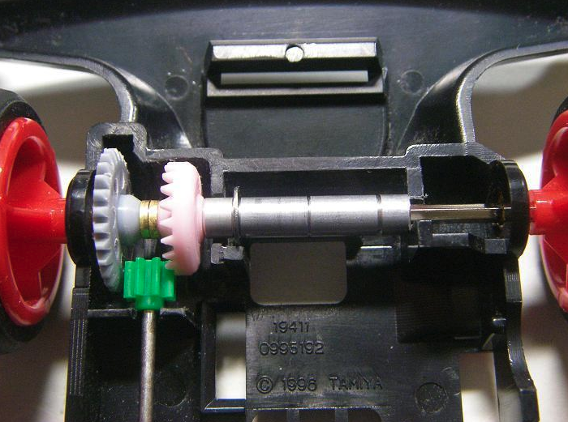 说到 “驱动轴+传动轴” 的结构原理，其实你并不陌生，比如小时候玩的四驱车(上图)。但如果两侧车轮仅用一根轴直接相连，转弯时就必定会有一侧车轮打滑。乘用车肯定不能像玩具四驱车那样，直接无视掉转弯无差速造成的打滑。所以首先，第一步肯定是要将传动轴两端分开，这样才能允许两侧车轮不等速转动。 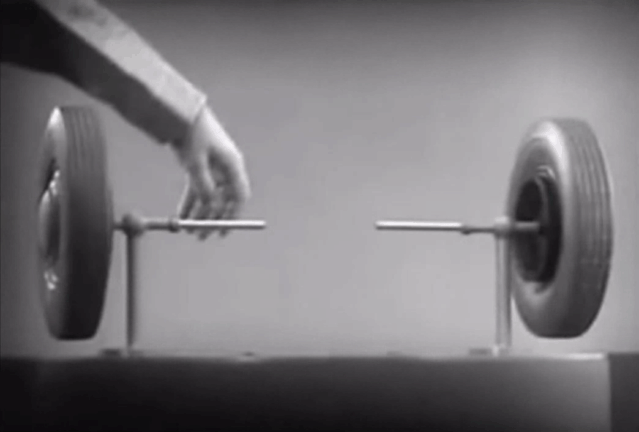 那么动力就需要经由另一部件传递到两侧轮轴上，这里用了一根短横杆，它被套在了一侧轮轴上，可以独立于轮轴自由转动。 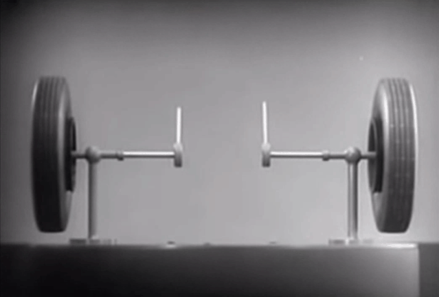 这时，如果把中间这根横杆改成可转动，就可以在左侧车轮不动/慢速转动时，让右侧车轮保持转速，形成一个小小的、短暂的差速效果。 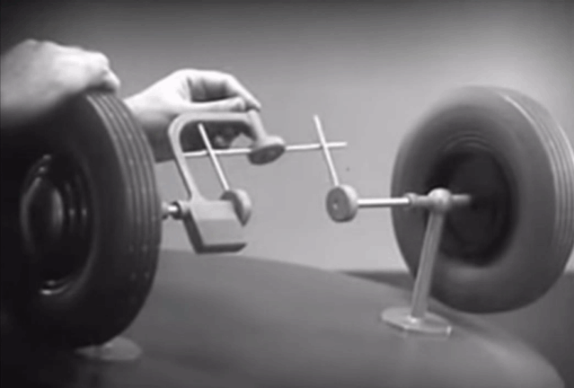 一根横杆肯定是不够的，要想让这个差速效果继续下去，可以把这些单薄的短杆都换成十字杆，整个系统便能够持续不断地运行。从正前方看，动力传递到左侧轮轴上连接中央十字杆的活动部件，整个系统既可以保持动力输入，又能够让两侧车轮以不同转速转动。 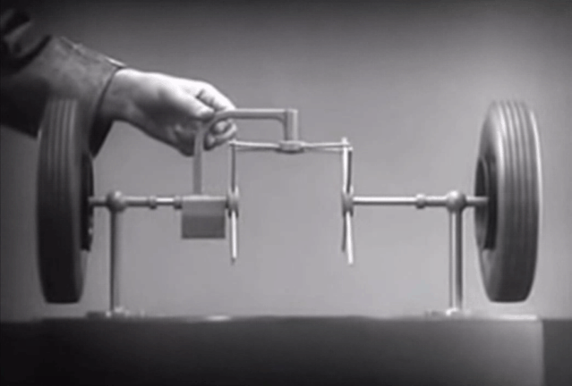 再进一步，将十字横杆加到更密集，减少部件之间的碰撞，也让动力传递更连贯…… 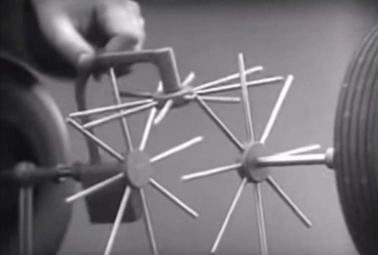 再再进一步，短杆做得更加密集，你就能看出它慢慢演变成了一套齿轮系统…… 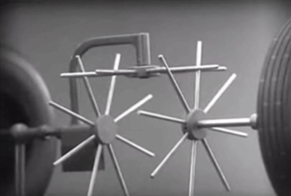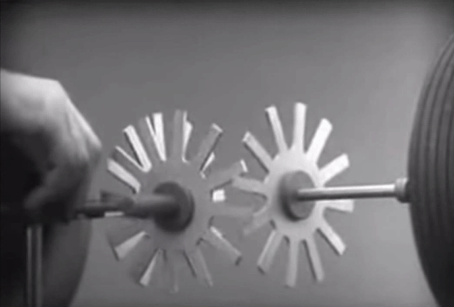 这样下来，这样一个简易版的差速器齿轮系统就形成了。动力通过左边轮轴上套着、活动的部件输入，中央的齿轮将动力分配给两侧齿轮，带动两边车轮，同时允许两边齿轮以不同速转动。为了让整个系统更稳定、连贯一些，将中央齿轮增加到一对，这就是一个基本成形的差速器模型了。 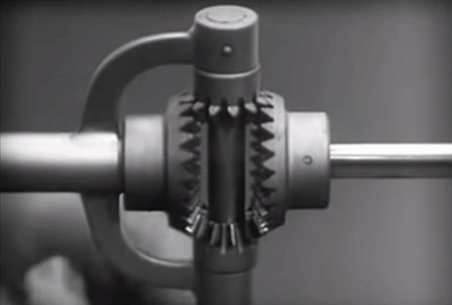 再把传动轴加入到这个模型中，传动轴连接着最左侧的大齿轮，大齿轮和差速器中央那对齿轮刚性相连，它们被套在一侧（左侧）的轮轴上自由转动。当传动轴转动，传动轴将动力传给左侧大齿轮，左侧大齿轮和差速器中央齿轮同步转动，差速器中央齿轮再带动差速器两侧齿轮，进而带动两边车轮。从传动轴到车轮，通过这样的路径传递动力，便可以做到驱动轮间（or 轴间）差速。 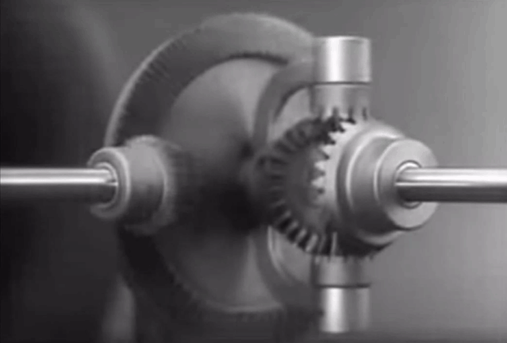 当然，真正装在车辆上的（开放式）差速器，会在这个原理模型的基础上做缩小化、实用化。不过你仍能看出各个零部件对应的原理结构。 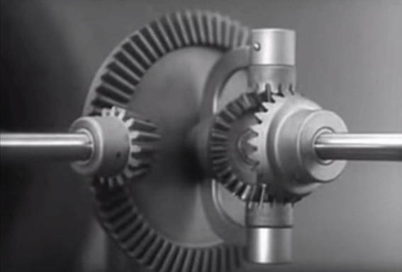

# Source
[看见「差速器」仨字就蒙圈？零分物理基础 2 分钟看懂](https://www.ifanr.com/1035014) [只要3分钟 看懂差速器原理与作用_懂车帝](https://www.dongchedi.com/article/6426245273638535426) [百度百科-验证](https://baike.baidu.com/item/%E5%B7%AE%E9%80%9F%E5%99%A8/580397)
