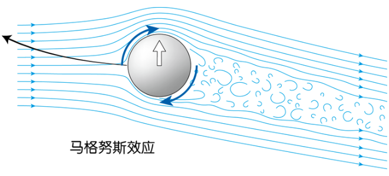

由于球进行旋转(如下图顺时针旋转)，图中球上方气流会顺着球，流速快，压力小；反之，图中球下方气流和球旋转方向相逆，流速慢，压力大。上下的压力差导致空气给球一个向上的力(图中白色箭头)，所以球的运动轨迹是黑色箭头方向，这也就是弧线球(香蕉球)的原理。 

# Source
[什么是马格努斯效应？篮球从126米大坝上扔下，神奇的现象发生了 - 知乎](https://www.zhihu.com/zvideo/1366152002943205376)
