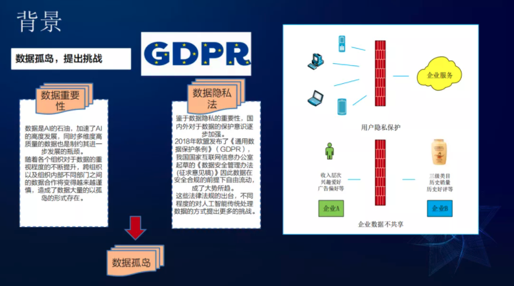

随着大家对数据的重要性与隐私性的认知程度的不断提升，跨组织的数据的合作越来越谨慎，相关隐私法律法规也陆续出台([GDPR](https://en.wikipedia.org/wiki/General_Data_Protection_Regulation) - 通用数据保护条例)，这样就造成了大量了的数据孤岛，无法充分的利用数据进行分析、决策，严重制约了AI的发展。联邦学习在保证数据隐私安全及合法合规的基础上，打破数据孤岛，实现共同建模，共创共赢，将成为未来AI发展的一个重要方向。

# 背景初衷
基于数据孤岛的考量而提出联邦学习，数据孤岛的产生有以下两方面的原因：

- 数据重要性：数据是AI的石油，加速了AI的高速发展，同时多维度高质量的数据是制约其进一步发展的瓶颈。随着各个组织对于数据重视程度的不断提升，跨组织以及组织内部不同部门之间的数据合作将变得越来越谨慎，大量数据以孤岛的形式存在。
- 数据隐私法：鉴于数据隐私的重要性，国内外对于数据的保护意识逐步加强。2018年欧盟发布了《通用数据保护条例》 ( GDPR )，我国国家互联网信息办公室起草了《数据安全管理办法 ( 征求意见稿 ) 》，因此数据在安全合规的前提下自由流动成了大势所趋。这些法律法规的出台，不同程度的对人工智能传统处理数据的方式提出了更多的挑战。

上述都限制了数据的流动，造成了大量信息孤岛，主要有两大原因造成信息孤岛：**第一是企业获得用户信息越来越难；第二是企业之间数据不共享**

# 概述介绍
信息孤岛的解决方案是联邦学习。2016年，谷歌提出在安卓手机用户中进行联邦学习，解决个人用户数据在终端上的隐私问题，它可以不上传用户隐私数据，在终端上进行模型训练。近几年谷歌在chrome上也进行了联邦学习的研究，后续众多业内研究机构和组织对联邦学习投入了极大的热情，研究了更加安全、使用范围更广的联邦学习机制，将联邦学习应用到更加广阔的领域。

- 联邦学习的本质：_基于数据隐私保护的一种分布式机器学习技术或机器学习框架_
- 联邦学习的目标：_在保证数据隐私安全及合法合规的基础上，在模型无损的前提实现共同建模，提升AI模型的效果_

## 联邦学习特征
联邦学习强调的核心理念是：**数据不动模型动，数据可用不可见**。具有以下五个特征：

- 有两个(或以上)的联邦学习参与方协作构建一个共享的机器学习模型。每个参与方都拥有若干各自希望能够用来训练模型的训练数据
- 在联邦学习模型训练过程中，每一个参与方拥有的数据不会离开该参与方，即数据不离开数据拥有者
- 与模型相关的信息(如模型参数、模型结果、参数梯度等)能够以加密方式在各方之间传输和交换，并且需要任何一个参与方在接收到这些信息时都不能推测出原始数据
- 联邦学习模型的性能要能够充分逼近理想模型(理想模型是指通过将所有训练数据集中在一起并训练获得的机器学习模型)的性能
- 联邦学习模型的构建不影响客户端设备的正常使用，即客户端在本地训练的过程中，应能够保证该设备其他进程的正常运行(如控制CPU占用率、内存使用率等)

## 联邦学习分类
联邦学习主要分为三大类：横向联邦学习(Horizontal Federated Learning, HFL)、纵向联邦学习(Vertical Federated Learning, VFL)、联邦迁移学习(Federated Transfer Learning, FTL)	

- 横向联邦学习：例如淘宝和京东，他们可能有少量的重叠客户，但客户的数据因为两者相似的商业模式而具有相似性。也就是说，淘宝和京东的用户群体重叠部分可能不大，但在数据特征维度上的重叠部分较大。淘宝和京东就可以通过横向联邦学习共同建立一个机器学习模型，更好的为客户推荐商品。
- 纵向联邦学习：例如淘宝和微博，两家公司提供不同的服务，但在客户群体上有着非常大的交集时，可以为得到一个更好的机器学习模型，在各自的不同数据特征空间上协作。比如淘宝要预测用户对某一物品的购买概率，但其只有公司内部用户电商行为信息，而微博有客户的浏览信息，可以推断出该用户近期种草了哪些商品，如果能将微博的这部分特征信息补充到电商推荐模型中，将极大的提升模型预测能力。
- 联邦迁移学习：例如一家公司有丰富的图片信息，另一家公司有文字等自然语言信息，图片和文字属于不同的特性维度空间。利用联邦学习，可以在数据不出本地的前提下，在两家公司之间通过知识迁移来学习到另一方的特征数据，扩充自身的特征信息，提升模型的性能效果。

 联邦学习的主要目的是在保证数据不出本地的前提下，协调各客户端共建模型，因此一项很重要的工作是，如何有效协调数据参与方协同构建模型。根据协调方式的不同，我们可以分类为集中式拓扑架构和对等网络拓扑架构

- 集中式拓扑：此种结构下，一般存在一个中心计算方(既可能是独立于各参与方的服务器，也可能是某一个特定的参与方)，该中心计算方承担收集其他各方传递的模型参数信息并经过相应算法更新后返回各方的任务，它的优势在于易于设计与实现。
- 对等网络拓扑：此种结构下，不存在中心计算节点，各参与方在联邦学习框架中的地位平等。由于集中式拓扑不可避免地要考虑中心计算书否会泄漏隐私或者遭受恶意攻击，所以相比之下离散式拓扑更为安全。但这种拓扑设计的难度较大，必须平等对待各参与方且能够对所有参与方有效更新模型并提升性能。

# Source
[https://mp.weixin.qq.com/s/933nA30Xg_GBbjKtDRuBnQ](https://mp.weixin.qq.com/s/933nA30Xg_GBbjKtDRuBnQ)
