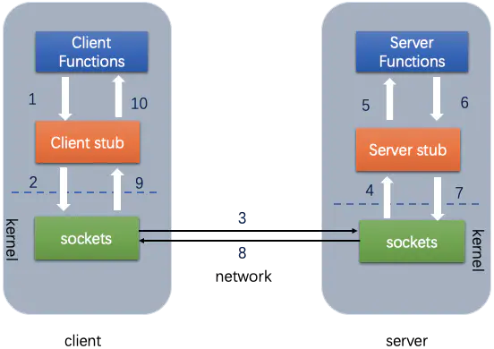
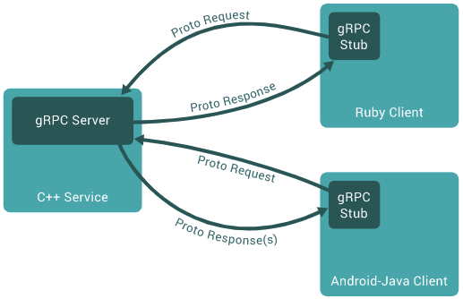

# RPC介绍
远程过程调用(Remote Procedure Caller，RPC)是指不同机器中运行的进程之间的相互通信。某一机器上运行的进程在不知道底层通信细节的情况下，像访问本地服务一样去调用远程机器上的服务。RPC要解决的两个问题：

- 分布式系统中服务之间的调用问题
- 远程调用时，要能够像本地调用一样方便，让调用者感知不到远程调用的逻辑

RPC可以通过HTTP来实现，也可以通过socket自己实现一套协议来实现。RPC是介于应用层与传输层之间的用于实现进程之间通信的中间件。RPC既不是协议，也不是新技术，严格意义上应该称它为解决方案(概念)或技术实现框架。RPC框架底层一般支持多种协议，例如HTTP、TCP等，甚至支持用户自定义的协议。

如下图所示，是一个典型的RPC调用流程。一个完整的RPC架构包含四个核心组件，分别是客户端(Client)、服务端(Server)、客户端存根(Client Stub)、服务端存根(Server Stub)，其中

- 客户端存根(Client Stub)：存放服务端的地址消息，将客户端的请求参数打包成网络消息，然后通过网络远程发送给服务方
- 服务端存根(Server Stub)：接收客户端发送过来的消息，将消息解包，并调用本地的方法

 RPC的工作流程主要包括下面的步骤： 1.客户端以本地调用的方法调用服务 2.客户端存根收到调用后，把服务调用相关信息组装成需要网络传输的消息体，并找到服务地址(host:port)，对消息进行编码后交给Connector进行发送 3-4.Connector通过网络通道发送消息给Acceptor。Acceptor收到消息后将其交给服务端存根 5.服务端存根对消息进行解码，并根据解码结果通过反射调用本地服务 6-7-8.服务端执行本地服务并返回结果给服务端存根。服务端存根对结果组装打包并编码后给Acceptor进行发送 9-10.服务端获取服务调用的最终结果

# [基于gRPC的实现](https://github.com/grpc/grpc)
gRPC(Google RPC)是Google开发的一款高性能、开源的RPC框架。gRPC基于Google的ProtoBuf序列化协议进行开发，支持多种语言(Golang、Python、Java等)，使用方便，具有良好特性：

- 具有强大的接口定义语言(Interface Definition Language， IDL)。RPC使用ProtoBuf定义服务。ProtoBuf是由Google开发的一种数据序列化协议，性能出众，已经得到了广泛的应用
- 支持多种语言，支持C++、Java、Go、Python、Ruby、C#、Node.js、Android Java、Objective-C、PHP等编程语言
- 基于HTTP/2标准设计。双向流、消息头压缩、多路复用、服务端推送等特性，使得gRPC与其他框架相比在移动端设备上更加节省网络流量

 gRPC的框架如上图所示。gRPC的客户端和服务端能够在不同的环境下进行请求响应，并且gRPC的通信协议是使用ProtoBuf来编码的。ProtoBuf(Protocol Buffers)是一种轻便、高效的结构化数据存储格式，可以用于结构化数据序列化，很适合做数据存储或RPC数据交换格式。与XML和JSON格式相比，ProtoBuf更小、更快、更便捷。ProtoBuf是跨语言的，并且自带一个编译器(protoc)，只需要用protoc进行编译，就可以编译成Java、Python、C++、C#、Go等多种语言代码，然后直接使用，不需要再编写其他代码，自带有解析的代码。只需要将要被序列化的结构化数据定义一次(在.proto文件中定义)，便可以通过特别生成的源代码(使用ProtoBuf提供的生成工具)轻松地使用不同的数据流完成对结构数据的读写操作，甚至可以更新.proto文件中对数据结构的定义而不会破坏依赖旧格式编译出来的程序。

# [基于ICE的实现](https://github.com/zeroc-ice/ice)
[互联网通信引擎(Internet Communications Engine，ICE)](https://zeroc.com/products/ice)是ZeroC公司的作品，是新一代面向对象的分布式系统中间件。ICE具有稳定、高性能、跨平台、多语言支持等优点，为客户端和服务端程序的开发提供了便利，广泛应用于复杂且庞大的互联网分布式平台的构建中。ICE的关键特性包括：

- 支持多种语言之间的RPC互通，即客户端和服务端可以使用不同的开发语言来开发。目前，ICE平台支持客户端API的语言有C++、.NET、Java、Python、Objective-C、Ruby、PHP、Javascript等。在服务器端，可以用C、.NET、Java、Python等来开发
- 高性能的RPC调用及多平台支持
- 支持传统的RPC调用、异步调用、One-Way调用、批量发起请求，支持TCP通信、UDP通信等
- ICE的这种跨语言开发主要通过与编程语言无关的中立语言Slice(Specification Language for ICE)来描述服务接口的实现，从而达到对象接口与其实现分离的目的。Slice之于ICE作用类似于ProtoBuf之于gRPC的作用
