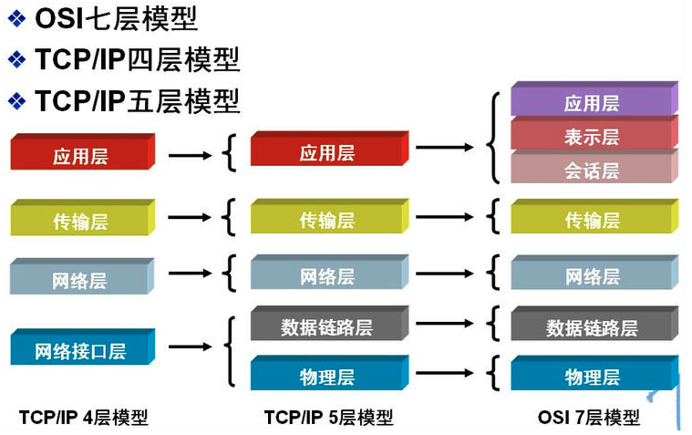

在分布式系统中，一个计算节点对应网络中的一台机器上的一个进程。计算节点是一个完整的、不可分的实体。所以，分布式系统里节点之间的通信就是进程之间的通信(Inter-Process Communication，IPC)。这里简要介绍网络中进程之间通信的原理，细节可以参考[计算机基础-计算机网络](https://www.yuque.com/angsweet/machine-learning/ji-suan-ji-ji-chu_ji-suan-ji-ji-chu_ji-suan-ji-wang-luo)部分。

分布式的本质是多进程之间的协作，以便共同完成计算任务。要实现相互间的协作，自然需要进程间通信。联邦学习系统的本质是一种地理分布式系统，通信机制是地理分布式系统中至关重要的组成部分。地理分布式系统中不同节点间的通信是基于网络协议的，例如基于广域网(Wide Area Network，WAN)和互联网(Internet)。如下图所示，常见的计算机通信网络的体系结构有两种：由开放系统互联(Open Systems Interconnection，OSI)标准定义的七层网络通信协议体系结构；由传输控制协议/互联网协议(Transmission Control Protocol/Internet Protocol，TCP/IP)簇定义的四层通信网络体系结构。  虽然OSI模型概念清楚，理论完整，但它既复杂又不实用。因此，很少有实际系统实现了OSI体系结构。相反，TCP/IP结构简单，得到了广泛的实际应用，例如广泛使用于互联网。不过从实质上讲，TCP/IP体系结构只有最上面的三层，因为其最下面的网络结构层没有具体内容。TCP/IP模型将软件通信过程抽象为四层，采用协议堆叠的方式，分别构建不同的通信协议。协议套组下的各种协议依其功能不同被分别划分到这四层之中，通常被视为简化的七层OSI模型。在实际工程应用中，我们通常采用折中的方法。例如，综合OSI和TCP/IP的优点，采用一种五层协议的通信网络体系结构，如上图中间所示。
