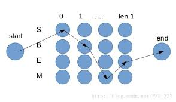

对于一些亚洲语言（如中、日、韩、泰等），词之间没有明确的分界符，因此，需要先对句子进行分词，才能再做进一步的自然语言处理。分词的好坏直接影响后面处理的，比如“联想公司”作为一个整体，很容易就找到它对应英语翻译“Lenovo”，但是分词时将其切开，“联想”，“公司”，其中“联想”就是完全不同的“想象”的意思了。

## 规则分词

基于规则的分词是一种机械分词方法，主要通过维护词典，在切分语句时，将语句的每个字符串与词表中的词进行逐一匹配，找到则切分，否则不予切分。

### 正向最大匹配法

假定分词词典中的最长词有个汉字字符，则用被处理文档的当前字串中的前个字作为匹配字段，查找字典。若字典中存在这样的一个字词，则匹配成功，匹配字段被作为下一个词切分出来。如果词典中找不到这样的一个字词，则匹配失败，将匹配字段中的最后一个字去掉，对剩下的字串重新进行匹配处理。如此进行下去，直到匹配成功，即切分出一个词或剩余字串的长度为零为止。这样就完成了一轮匹配，然后取下一个字字串进行匹配处理，直至文档被扫描完为止。

#### 算法

- 迭代：
   - 从左向右取待切分汉语句句的m个字符作为匹配字段，m为机器词典中最长词条的字符数。
   - 查找机器词典并进行匹配：
      - 匹配成功，则将这个匹配字段作为一个词切分出去。
      - 匹配不成功，则将匹配字段的最后一个字去掉，剩下的字符串作为新的匹配字段再次进行匹配。
- 终止：文本末端

### 逆向最大匹配法

逆向最大匹配的基本原理与上述正向最大匹配法一致，不同的是分词切分的方向相反，从文档末端开始匹配扫描。相应地，它使用的分词词典是逆序词典，其中的每个词条都将按逆序方式存放。

由于汉语中偏正结构较多，若从后向前匹配，可以适当提高精确度。所以，逆向最大匹配法比正向最大匹配法的误差要小。统计结果表明，单纯使用正向最大匹配的错误率为，单纯使用逆向最大匹配的错误率为。比如“南京市长江大桥”用逆向最大匹配得到“南京市”、“长江大桥”，正向可能获得“南京”、“市长”，“江大桥”。

### 双向最大匹配法

将正向最大匹配法得到的分词结果和逆向最大匹配法得到的结果进行比较，然后按照最大匹配原则，选取词数切分最少的作为结果。

**规则：** **

- 如果正反向分词结果的词数不同，则取分词较少的那个
- 如果分词结果词数相同：
   - 分词结果相同，就说明没有歧义，可返回任意一个
   - 分词结果不同，返回其中单字较少的那个(“研究生/命/的/起源”和“研究/生命/的/起源”，返回第二个)

## 统计分词

利用统计语言模型分词的方法，可以用几个数学公式简单概括。假定一个句子可以有几种分词方法，为了简单起见，假定有以下三种：

， ， 

其中，，，等都是汉语的词，上述的各种分词结果可能产生不同数量的词串，所以下标是，，。最好的一种分词方法应该保证分完词后这个句子出现的概率最大，也就是说，如果是最好的分词方法，那么其概率满足：

 

针对分词颗粒度问题解决方案是构造两个词表，一个基本词表和一个复合词表。基本词表包括像“清华”、“大学”这样无法再分的词。复合词表包含复合词以及它们由哪些基本词构成，比如“清华大学：清华-大学”。一般是先使用基本词表将语句分到最细；然后根据分词原则，再用复合词向上合并。

**主要思想：**把每个词看做是由词的最小单位的各个字组成的，如果相连的字在不同的文本中出现的次数越多，就证明这相连的字很可能就是一个词。因此我们就可以利用字与字相邻的频率来反映成词的可靠度，统计语料中相邻共现的各个字的组合的频度，当组合频度高于某一个临界值时，我们便可认为此字组可能构成一个词语。

**步骤：**

- 建立统计语言模型
- 对句子进行单词划分，然后对划分结果进行概率计算，获得概率最大的分词方式。\(HMM或CRF等\)

### 语言模型

#### 用数学的方法描述语言

假定表示某一个有意义的句子，由一连串特定顺序排列的词组成，这里是句子的长度。现在，我们想知道在文本中出现的可能性，也就是数学上所说的的概率：

利用条件概率的公式，这个序列出现的概率等于每一个词出现的条件概率想乘：

但是从计算上来看，前几个词的概率还好算，越往后条件概率无法估算。马尔可夫提出遇到这种情况时，就假设任意一个词出现的概率只同它前面的词有关（当前状态只与之前状态有关）：

接下来，就是如何估计条件概率，根据它的定义：

估计联合概率和边缘概率就很简单了，只要数一下，这对词在统计的样本中前后相邻出现了多少次，以及本身在同样的样本中出现了多少次，然后用两个数分别除以语料库的大小，即可得到这些词或二元组的相对频度：

 

根据大数定理，只要统计量足够，相对频度就相当于概率，即 ：

 

而就是这两个数的比值，再考虑到上面的两个概率有相同的分母可以约掉，因此：

#### 高阶语言模型（n-gram model）

上节公式模型的假设前提是，句子中的每个词只和前面的一个词有关，即二元模型（Bigram Model），这似乎太简化了。假定文本中的每个词和前面的个词有关，与更前面的词无关，这样当前词的概率只取决于前面的个词，因此：

上述公式的这种假设被称为阶马尔可夫假设，对应的语言模型称为元模型。当越大时，模型包含的词序信息越丰富，同时计算量随之增大。

#### 模型的训练、零概率问题和平滑方法

上文提的模型会出现一个问题，如果同时出现的次数怎么办，是否意味着条件概率。增加数据量可以解决一部分问题，零概率问题并没有完全解决。可使用古德-图灵估计进行解决。古德-图灵估计的原理是：对于没有看见的事件，我们不能认为它发生的概率就是零，因此我们从概率总量中，分配一个很小的比例给这些没有看见的事件。这样没看见的事件概率和看见的事件概率就大于了，因此，需要将所有看见的事件概率调小一点，至于小多少，要根据“越是不可信的统计折扣越多”的方法进行。

假定在语料库中出现次的词有个，特别地，未出现过的词数量为，语料库的大小为：

出现次的词在整个语料库中的相对频度则是，如果不做任何优化处理，就以这个相对频度作为这些词的概率估计。现在，我们假定当比较小时，它的统计可能不可靠，因此在计算那些出现次的词的概率时，要使用一个更小一点的次数，是（而不直接用），古德-图灵估计按下式计算：

显然

一般来说，出现一次的词的数量比出现两次的多，出现两次的比三次的多...这种定律称为Zipf定律（Zipf's Law），可以看出越大，词的数量越小，即。因此，一般请况下，，而。这样就给未出现的词赋予了一个很小的非零值，从而解决了零概率的问题，同时下调了出现频率很低的词的概率。当然，在实际操作中，一般对出现次数超过某个阈值的词，频率不下调，只对出现次数低于这个阈值的词，频率才下调，下调得到的频率总和给未出现的词。这样出现次的词的概率估计为。于是，对于频率超过一定阈值的词，它们的概率估计就是它们在语料库中的相对频度；对于频率小于这个阈值的词，它们的概率估计就小于它们的相对频度，出现次数越少的折扣越多；对于未看见的词，也给与了一个较小的频率。这样所有词的概率估计都平滑了。

对于二元组的条件估计也可以做同样的处理。我们知道，通过前一个词预测后一个词时，所有的可能情况的条件概率总和应该为，即

对于出现次数非常少的二元组，需要按古德-图灵的方法打折扣，这样

同时意味着有一部分概率量没分配出去，留给了没有看到的二元组。基于此，估计二元模型概率：

其中是一个阈值，一般在8-10左右，函数表示古德-图灵估计后的相对频度，而

这是二元模型。类似地，对于三元模型，概率估计公式如下：

对于一般情况的元模型概率估计公式，依此类推。

### 隐含马尔可夫模型(HMM)

隐含马尔可夫模型是将分词作为字在字串中的序列标注任务来实现的。其基本思路是：每个字在构造一个特定的词语时都占据着一个确定的构词位置(即词位)，现规定每个字最多只有四个构词位置：即B(词首)、M(词中)、E(词尾)和S(单独成词)，那么下面的句子(1)的分词结果就可以直接表示成如(2)所示的逐字标注形式：

(1) 中文 / 分词 / 是 / 文本处理 / 不可或缺 / 的 / 一步！

(2) 中/B 文/E 分/B词/E 是/S 文/B 本/M 处/M 理/E 不/B 可/M 或/M 缺/E 的/S 一/B 步/E！/S

用数学抽象表示如下：用代表输入的句子，为句子长度，表示字，代表输出的标签，那么理想的输出为：

在分词任务上，即为B、M、E、S这4种标记，为诸如“中”、“文”等句子中的每个字(包括标点等字符)

需要注意的是，是关于个变量的条件概率，且不固定。因此，几乎无法对进行精确计算。这里引入观测独立性假设，即每个字的输出仅仅与当前字有关，于是就能得到下式：

事实上，的计算要容易的多。通过观测独立假设，目标问题得到极大简化。然而该方法完全没考虑上下文，且会出现不合理情况，比如之前设定的B、M、E和S标记，正常来说B后面只能是M或者E，然而基于观测独立性假设，我们很可能得到BBB、BEM之类的不合理情况。

HMM就是用来解决该问题的方法。在上面公式中，我们一直期望求解的是，通过贝叶斯公式：

为给定的输入，因此计算为常数，可以忽略，因此最大化等价于最大化

针对 作马尔可夫假设，得到：

同时，对有：

这里HMM做了另外一个假设，齐次马尔可夫假设，每个输出仅与上一个输出有关（二元模型，若假设与前个有关即元模型 ），那么：

于是：

在HMM中，将称为发射概率，称为转移概率。通过设置某些，可以排除类似BBB、EM等不合理的组合。  在HMM中，求解的常用方法是维特比Veterbi算法。它是一种动态规划方法，核心思想是：如果最终的最优路径经过某个，那么从初始节点到点的路径必然也是一个最优路径，因为每一个节点只会影响前后两个和

### 其他统计分词算法

条件随机场(CRF)也是一种基于马尔可夫思想的统计模型。在隐含马尔可夫中，假设每个状态只与它前面的状态有关。这样的假设显然有偏差，于是提出了条件随机场，使得每个状态不止与他前面的状态有关，还与他后面的状态有关。
