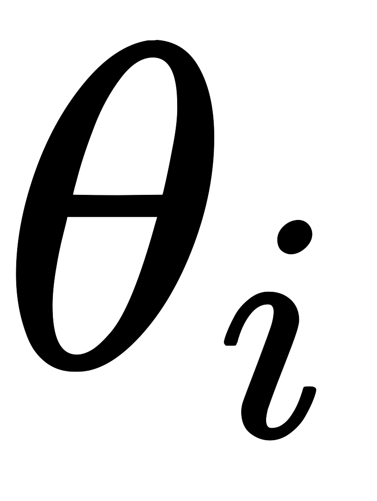
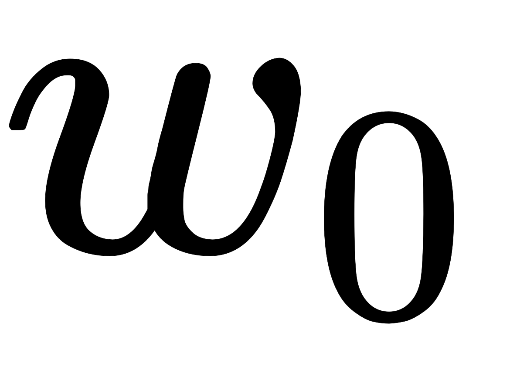
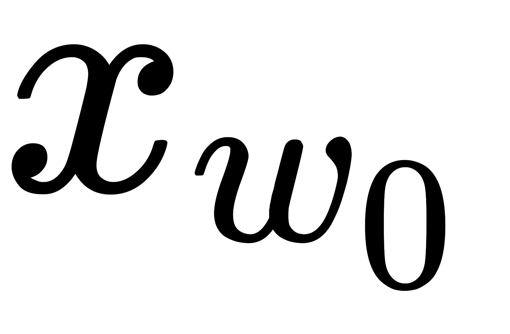

在讲基于Negative Sampling的word2vec模型前，我们先看看Hierarchical Softmax的的缺点。的确，使用霍夫曼树来代替传统的神经网络，可以提高模型训练的效率。但是如果我们的训练样本里的中心词是一个很生僻的词，那么就是在霍夫曼是中辛苦向下走了很久。能不能不用搞这么复杂的一颗霍夫曼树，将模型变的更加简单呢

Negative Sampling就是这么一种求解word2vec模型的方法，它摒弃了霍夫曼树，采用了Negative Sampling（负采样）的方法来求解，下面我们就来看看Negative Sampling的求解思路。

# 基于Negative Sampling的模型概述

既然名字叫Negative Sampling（负采样），那么肯定使用了采样的方法。

比如我们有一个训练样本，中心词是，它周围上下文共有个词，记为Context(w)。由于这个中心词的确和Context(w)相关存在，因此它是一个真实的正例。通过Negative Sampling采样，我们可以得到个和不同的中心词，这样Context(w)和就组成了个并不真实存在的负例。利用这一个正例和个负例，我们进行二元逻辑回归，得到负采样对应每个词对应的模型参数，和每个词的词向量。

从上面的描述可以看出，Negative Sampling由于没有采用霍夫曼树，每次只是通过采样个不同的中心词做负例，就可以训练模型，因此整个过程要比Hierarchical Softmax简单。我们只需要弄明白两个问题：

1. 如果通过一个正例和neg个负例进行二元逻辑回归
2. 如何进行负采样

# 基于Negative Sampling的模型梯度计算

Negative Sampling采用了二元逻辑回归来求模型参数，负采样得到个负例，为了统一描述，我们将正例定义为

在逻辑回归中，我们的正例应该期望满足：

我们的负例期望满足：

我们期望可以最大化下式：

利用逻辑回归和上一章的内容，我们容易写出此时模型的似然函数（因为只有1个正例）：

此时对应的对数似然函数为

和Hierarchical Softmax类似，我们采用随机梯度上升法，仅仅每次只用一个样本更新梯度，来进行迭代更新得到我们需要的，这里我们需要求出的梯度：

首先我们计算的梯度：

同样的方法，我们可以求出的梯度如下：

有了梯度表达式，我们就可以用梯度上升法进行迭代来一步步的求解我们需要的

# Negative Sampling负采样方法

word2vec采样的方法并不复杂，如果词汇表的大小为，那么我们就将一段长度为的线段分成份，每份对应词汇表中的一个词。当然每个词对应的线段长度是不一致的，高频词对应的线段长，低频次对应的线段短。每个词的线段长度由下式决定：

在word2vec中，分子和分母都取了次幂：

在采样前，我们将这段长度为的线段划分成等份，这里，这样可以保证每个词对应的线段都会划分成对应的小块。而份中的每一份都会落在某个词对应的线段上。在采样的时候，我们只需要从个位置中采样出个位置就行，此时采样到的每一个位置对应到的线段所属的词就是我们的负例

在word2vec中，取值默认为

# 基于Negative Sampling的CBOW模型

输入：基于CBOW语料，词向量的维度大小，CBOW的上下文大小，步长，负采样个数

输出：所有的词向量

1. 随机初始化所有的模型参数，所有的词向量
2. 对于每个训练样本，负采样出个负例中心词
3. 进行梯度上升迭代过程，对于训练集中的每一个样本：
   1. ，计算
   2. for    to  ：
      1. 
      2. 
      3. 
      4. 
   3. 对于中每一个词向量进行更新：
      1. 
   4. 如果梯度收敛，则结束梯度迭代，否则回到步骤3.继续迭代

# 基于Negative Sampling的Skip-Gram模型

输入：基于CBOW语料，词向量的维度大小，CBOW的上下文大小，步长，负采样个数

输出：所有的词向量

1. 随机初始化所有的模型参数，所有的词向量
2. 对于每个训练样本，负采样出个负例中心词
3. 进行梯度上升迭代过程，对于训练集中的每一个样本 ：
   1. for    to  ：
      1. 
      2. for    to ：
         1. 
         2. 
         3. 
         4. 
      3. 对于中每一个词向量进行更新：
         1. 
   2. 如果梯度收敛，则结束梯度迭代，否则回到步骤a继续迭代

# Source

[https://arxiv.org/pdf/1411.2738.pdf](https://arxiv.org/pdf/1411.2738.pdf) [https://blog.csdn.net/lanyu_01/article/details/80097350](https://blog.csdn.net/lanyu_01/article/details/80097350) [https://www.cnblogs.com/pinard/p/7160330.html](https://www.cnblogs.com/pinard/p/7160330.html) [https://blog.csdn.net/anshuai_aw1/article/details/84241279](https://blog.csdn.net/anshuai_aw1/article/details/84241279) [https://zhuanlan.zhihu.com/p/53194407](https://zhuanlan.zhihu.com/p/53194407)
