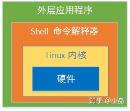
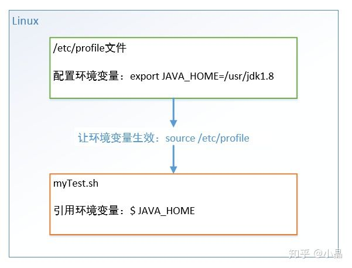

Shell 是一个命令解释权，它为用户提供了一个向 Linux 内核发送请求以便运行程序界面系统级程序，用户可以用 Shell 来启动、挂起、停止甚至是编写一些程序。<br />
<a name="xxJQG"></a>
# Shell编程快速入门
进入 Linux 终端，编写一个 Shell 脚本 hello.sh ：
```bash
#!/bin/bash 
echo 'hello world!'
```
运行：
```bash
# 方法1 
sh hello.sh  

# 方法2 
chmod +x hello.sh 
./hello.sh
```
终端打印出hello world!

说明：

- `#!` 告诉系统这个脚本需要什么解释器来执行。
- 文件扩展名 `.sh` 不是强制要求的。
- 方法1 直接运行解释器，`hello.sh` 作为 Shell 解释器的参数。此时 Shell 脚本就不需要指定解释器信息，第一行可以去掉。
- 方法2 hello.sh 作为可执行程序运行，Shell 脚本第一行一定要指定解释器

<a name="oEwRj"></a>
# Shell变量
Shell 变量分为**系统变量**和**自定义变量**。系统变量有$HOME、$PWD、$USER等，显示当前 Shell 中所有变量：`set` 。变量名可以由字母、数字、下划线组成，不能以数字开头。

- **定义变量：**变量名=变量值，等号两侧不能有空格，变量名一般习惯用大写。
- **删除变量：**unset 变量名 。
- **声明静态变量：**readonly 变量名，静态变量不能unset。
- **使用变量：**$变量名

**将命令返回值赋给变量（重点）**

- A=`ls` 反引号,执行里面的命令
- A=$(ls) 等价于反引号

<a name="N28xa"></a>
## Shell环境变量


- export 变量名=变量值，将 Shell 变量输出为环境变量。
- source 配置文件路径，让修改后的配置信息立即生效。
- echo $变量名，检查环境变量是否生效

<a name="ErPKU"></a>
## 位置参数变量

- $n ：$0 代表命令本身、$1-$9 代表第1到9个参数，10以上参数用花括号，如 ${10}。
- $* ：命令行中所有参数，且把所有参数看成一个整体。
- $@ ：命令行中所有参数，且把每个参数区分对待。
- $# ：所有参数个数。

编写 Shell 脚本 positionPara.sh ，输出命令行输入的各个参数信息。
```bash
#!/bin/bash     
# 输出各个参数 
echo $0 $1 $2 
echo $* 
echo $@ 
echo 参数个数=$#
```
运行：
```bash
chmod +x positionPara.sh 
./positionPara.sh 10 20

# 运行结果
./positionPara.sh 10 20 
10 20 
10 20 
参数个数=2
```

<a name="ArjnY"></a>
## 预定义变量
在赋值定义之前，事先在 Shell 脚本中直接引用的变量。

- $$ ：当前进程的 PID 进程号。
- $! ：后台运行的最后一个进程的 PID 进程号。
- $? ：最后一次执行的命令的返回状态，0为执行正确，非0执行失败。

编写 Shell 脚本 prePara.sh ，输出命令行输入的各个参数信息。
```bash
#!/bin/bash     
echo 当前的进程号=$$ 
# &：以后台的方式运行程序 
./hello.sh 
& echo 最后一个进程的进程号=$! 
echo 最后执行的命令结果=$?
```
运行结果：
```bash
当前的进程号=41752 
最后一个进程的进程号=41753 
最后执行的命令结果=0 # hello world!
```

<a name="fx0WM"></a>
# 运算符

- $((运算式)) 或 $[运算式]
- expr m + n 注意 expr 运算符间要有空格
- expr m - n
- expr \*，/，% 分别代表乘，除，取余
```bash
# 第1种方式 $(()) 
echo $(((2+3)*4))   

# 第2种方式 $[]，推荐 
echo $[(2+3)*4]  

# 使用 expr 
TEMP=`expr 2 + 3` 
echo `expr $TEMP \* 4`
```
条件判断：[ condition ] 注意condition前后要有空格。非空返回0，0为 true，否则为 false 。
```bash
#!/bin/bash 
if [ 'test01' = 'test' ] 
then
     echo '等于' 
fi  

# 20是否大于10 
if [ 20 -gt 10] 
then
     echo '大于' 
fi  

# 是否存在文件/root/shell/a.txt 
if [ -e /root/shell/a.txt ] 
then
     echo '存在' 
fi  

if [ 'test02' = 'test02' ] && echo 'hello' || echo 'world' 
then
     echo '条件满足，执行后面的语句' 
fi
```
<a name="lPDX5"></a>
# 流程控制
<a name="gcbwR"></a>
### if分支
```bash
if [ 条件判断式 ];then   
    程序   
fi

# 或者（推荐）
if [ 条件判断式 ]
then
    程序
elif [ 条件判断式 ]
then
    程序
fi
```
```bash
#!/bin/bash
if [ $1 -ge 60 ]
then
    echo 及格
elif [ $1 -lt 60 ]
then
    echo "不及格" 
fi
```

<a name="aP4ko"></a>
### case分支
```bash
case $变量名 in
"值1")
如果变量值等于值1，则执行此处程序1
;;
"值2")
如果变量值等于值2，则执行此处程序2
;;
...省略其它分支...
*)
如果变量值不等于以上列出的值，则执行此处程序
;;
esac
```
```bash
case $1 in
"1")
echo 周一
;;
"2")
echo 周二
;;
*)
echo 其它
;;
esac
```

<a name="PJq1Q"></a>
### for循环
```bash
# 语法1
for 变量名 in 值1 值2 值3...
do
    程序
done

# 语法2
for ((初始值;循环控制条件;变量变化))
do
    程序
done
```
```bash
#!/bin/bash  

# 使用$* 
for i in "$*" 
do     
    echo "the arg is $i" 
done 
echo "=================="  

# 使用$@ 
for j in "$@" 
do     
    echo "the arg is $j" 
done

# 运行结果
the arg is 1 2 3 
================== 
the arg is 1 
the arg is 2 
the arg is 3

# 输出从1加到100的值
#!/bin/bash 
SUM=0  
for ((i=1;i<=100;i++)) 
do     
    SUM=$[$SUM+$i] 
done 

echo $SUM
```

<a name="XNVuz"></a>
### while循环
```bash
while [ 条件判断式 ]
do
    程序
done 
```
```bash
#!/bin/bash
SUM=0
i=0

while [ $i -le $1 ]
do
    SUM=$[$SUM+$i]
    i=$[$i+1]
done       
echo $SUM
```

<a name="oX714"></a>
# 执行逻辑
| 符号 | 说明 |
| --- | --- |
| ; | 执行完成后程序继续 |
| & | 后台执行，程序继续 |
| wait | 所有后台执行完成后程序继续 |


<a name="9a5eb8e6"></a>
## [输入/输出重定向](https://www.runoob.com/linux/linux-shell-io-redirections.html)

文件描述符 0 通常是标准输入（STDIN），1 是标准输出（STDOUT），2 是标准错误输出（STDERR），下面表里的n替换成对应数字即将文件描述符对应的内容重定向到对应文件。

| 命令 | 说明 |
| --- | --- |
| command > file | 将输出重定向到 file |
| command < file | 将输入重定向到 file |
| command >> file | 将输出以追加的方式重定向到 file |
| n > file | 将文件描述符为 n 的文件重定向到 file |
| n >> file | 将文件描述符为 n 的文件以追加的方式重定向到 file |
| n >& m | 将输出文件 m 和 n 合并 |
| n <& m | 将输入文件 m 和 n 合并 |
| << tag | 将开始标记 tag 和结束标记 tag 之间的内容作为输入 |


<a name="PI2J4"></a>
# Source
[https://zhuanlan.zhihu.com/p/102176365?utm_source=wechat_session&utm_medium=social&utm_oi=566268956583706624](https://zhuanlan.zhihu.com/p/102176365?utm_source=wechat_session&utm_medium=social&utm_oi=566268956583706624)<br />[https://www.runoob.com/linux/linux-shell.html](https://www.runoob.com/linux/linux-shell.html)
