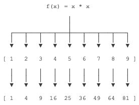

<a name="jqkMu"></a>
# map
map()传入的第一个参数是f，即函数对象本身。由于结果r是一个Iterator，Iterator是惰性序列，因此通过list()函数让它把整个序列都计算出来并返回一个list。
```python
>>> def f(x):
...     return x * x
...
>>> r = map(f, [1, 2, 3, 4, 5, 6, 7, 8, 9])
>>> list(r)
[1, 4, 9, 16, 25, 36, 49, 64, 81]
```

<a name="huRDW"></a>
# reduce
reduce把一个函数作用在一个序列[x1, x2, x3, ...]上，这个函数必须接收两个参数，reduce把结果继续和序列的下一个元素做累积计算，其效果就是：
```python
reduce(f, [x1, x2, x3, x4]) = f(f(f(x1, x2), x3), x4)

>>> from functools import reduce
>>> def add(x, y):
...     return x + y
...
>>> reduce(add, [1, 3, 5, 7, 9])
25
```
<a name="ymyBK"></a>
# lambda
lambda原型为：lambda 参数:操作(参数)。lambda函数也叫匿名函数，即没有具体名称的函数，它允许快速定义单行函数，可以用在任何需要函数的地方。这区别于def定义的函数。
```python
#单个参数的：
g = lambda x : x ** 2
print g(3)
"""
9
"""
#多个参数的：
g = lambda x, y, z : (x + y) ** z
print g(1,2,2)
"""
9
"""
```
将一个 list 里的每个元素都平方：
```python
map( lambda x: x*x, [y for y in range(10)] )
```
这个写法要好过
```python
def sq(x):
    return x * x
 
map(sq, [y for y in range(10)])
```
因为后者多定义了一个（污染环境的）函数，尤其如果这个函数只会使用一次的话。进一步讲，匿名函数本质上就是一个函数，它所抽象出来的东西是一组运算。这是什么意思呢？类比
```python
a = [1, 2, 3]

f = lambda x : x + 1
```
我们会发现，等号右边的东西完全可以脱离等号左边的东西而存在，等号左边的名字只是右边之实体的标识符。如果能习惯 [1, 2, 3] 单独存在，那么 lambda x : x + 1 也能单独存在其实也就不难理解了，它的意义就是给「某个数加一」这一运算本身。

现在回头来看 map() 函数，它可以将一个函数映射到一个可枚举类型上面。沿用上面给出的 a 和 f，可以写
```python
map(f, a)
```
也就是将函数 f 依次套用在 a 的每一个元素上面，获得结果 [2, 3, 4]。现在用 lambda 表达式来替换 f，就变成：
```python
map( lambda x : x + 1, [1, 2, 3] )
```
会不会觉得现在很一目了然了？尤其是类比
```python
a = [1, 2, 3]
r = []
for each in a:
    r.append(each+1)
```
<a name="mtu46"></a>
# apply
python中apply函数的格式为：apply(func, *args_,_ **kwargs)。当然，func可以是匿名函数。

用途：当一个函数的参数存在于一个元组或者一个字典中时，用来间接的调用这个函数，并将元组或者字典中的参数按照顺序传递给参数。

解析：args是一个包含按照函数所需参数传递的位置参数的一个元组，简单来说，假如A函数的函数位置为 A(a=1,b=2),那么这个元组中就必须严格按照这个参数的位置顺序进行传递(a=3,b=4)，而不能是(b=4,a=3)这样的顺序。kwargs是一个包含关键字参数的字典，而其中args如果不传递，kwargs需要传递，则必须在args的位置留空。

apply的返回值就是函数func函数的返回值。
```python
def function(a,b):
    print(a,b)
apply(function,('good','better'))
apply(function,(2,3+6))
apply(function,('cai','quan'))
apply(function,('cai',),{'b':'caiquan'}) 
apply(function,(),{'a':'caiquan','b':'Tom'})

'''
结果：
('good', 'better')
(2, 9)
('cai', 'quan')
('cai', 'caiquan')
('caiquan', 'Tom')
'''
```
有时候，函数的参数可能是DataFrame中的行或者列。
```python
#函数应用和映射
import numpy as np
import pandas as pd
df=pd.DataFrame(np.random.randn(4,3),columns=list('bde'),index=['utah','ohio','texas','oregon'])
print(df)
"""
               b         d         e
utah   -0.667969  1.974801  0.738890
ohio   -0.896774 -0.790914  0.474183
texas   0.043476  0.890176 -0.662676
oregon  0.701109 -2.238288 -0.154442
"""
 
#将函数应用到由各列或行形成的一维数组上。DataFrame的apply方法可以实现此功能
f=lambda x:x.max()-x.min()
#默认情况下会以列为单位，分别对列应用函数
t1=df.apply(f)
print(t1)
t2=df.apply(f,axis=1)
print(t2)
 
"""
b    1.597883
d    4.213089
e    1.401566
dtype: float64
utah      2.642770
ohio      1.370957
texas     1.552852
oregon    2.939397
dtype: float64
"""
 
#除标量外，传递给apply的函数还可以返回由多个值组成的Series
def f(x):
    return pd.Series([x.min(),x.max()],index=['min','max'])
t3=df.apply(f)
#从运行的结果可以看出，按列调用的顺序，调用函数运行的结果在右边依次追加
print(t3)
 
"""
            b         d         e
min -0.896774 -2.238288 -0.662676
max  0.701109  1.974801  0.738890
"""
 
#元素级的python函数，将函数应用到每一个元素
#将DataFrame中的各个浮点值保留两位小数
f=lambda x: '%.2f'%x
t3=df.applymap(f)
print(t3)
"""
            b      d      e
utah    -0.67   1.97   0.74
ohio    -0.90  -0.79   0.47
texas    0.04   0.89  -0.66
oregon   0.70  -2.24  -0.15
"""
 
#注意，之所以这里用map,是因为Series有一个元素级函数的map方法。而dataframe只有applymap。
t4=df['e'].map(f)
print(t4)
 
"""
utah     0.74
ohio     0.47
texas   -0.66
oregon  -0.15
"""
```
<a name="btwGT"></a>
# filter
Python内建的filter()函数用于过滤序列。和map()类似，filter()也接收一个函数和一个序列。和map()不同的是，filter()把传入的函数依次作用于每个元素，然后根据返回值是True还是False决定保留还是丢弃该元素。

例如，在一个list中，删掉偶数，只保留奇数，可以这么写：
```python
def is_odd(n):
    return n % 2 == 1

list(filter(is_odd, [1, 2, 4, 5, 6, 9, 10, 15]))
# 结果: [1, 5, 9, 15]
```
注意到filter()函数返回的是一个Iterator，也就是一个惰性序列，所以要强迫filter()完成计算结果，需要用list()函数获得所有结果并返回list。
<a name="VA5iU"></a>
# sorted
sorted()函数也是一个高阶函数，它还可以接收一个key函数来实现自定义的排序，例如按绝对值大小排序：
```python
>>> sorted([36, 5, -12, 9, -21], key=abs, reverse=False)
[5, 9, -12, -21, 36]
```
默认情况下，对字符串排序，按照ASCII的大小比较，由于'Z' < 'a'，结果，大写字母Z会排在小写字母a的前面。
<a name="MmP3k"></a>
# Source
[https://www.liaoxuefeng.com/wiki/1016959663602400/1017328525009056](https://www.liaoxuefeng.com/wiki/1016959663602400/1017328525009056)

