对于没有接触过底层技术的朋友来说，或许从未听说过cache。毕竟cache的存在对程序员来说是透明的。在接触cache之前，先为你准备段code分析。
```c
int arr[10][128];

for (i = 0; i < 10; i++)
        for (j = 0; j < 128; j++)
                arr[i][j] = 1;
```
如果你曾经学习过C/C++语言，这段code自然不会陌生。如此简单的将`arr`数组所有元素置1。 你有没有想过这段code还有下面的一种写法。
```c
int arr[10][128];

for (i = 0; i < 128; i++)
        for (j = 0; j < 10; j++)
                arr[j][i] = 1;
```
功能完全一样，但是我们一直在重复着第一种写法（或许很多的书中也是建议这么编码），你是否想过这其中的缘由？文章的主角是cache，所以你一定猜到了答案。那么cache是如何影响这2段code的呢？

<a name="BqYHA"></a>
# 为什么需要cache


在思考为什么需要cache之前，我们首先先来思考另一个问题：我们的程序是如何运行起来的？

我们应该知道程序是运行在 RAM之中，RAM 就是我们常说的DDR（例如： DDR3、DDR4等）。我们称之为main memory（主存）。当我们需要运行一个进程的时候，首先会从磁盘设备（例如，eMMC、UFS、SSD等）中将可执行程序load到主存中，然后开始执行。在CPU内部存在一堆的通用寄存器（register）。如果CPU需要将一个变量（假设地址是A）加1，一般分为以下3个步骤：

1. CPU 从主存中读取地址A的数据到内部通用寄存器 x0（ARM64架构的通用寄存器之一）
2. 通用寄存器 x0 加1
3. CPU 将通用寄存器 x0 的值写入主存


我们将这个过程可以表示如下：<br />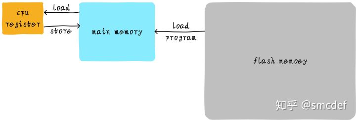<br />其实现实中，CPU通用寄存器的速度和主存之间存在着太大的差异。两者之间的速度大致如下关系：<br />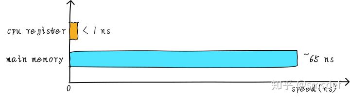<br />CPU register的速度一般小于1ns，主存的速度一般是65ns左右。速度差异近百倍。因此，上面举例的3个步骤中，步骤1和步骤3实际上速度很慢。当CPU试图从主存中load/store 操作时，由于主存的速度限制，CPU不得不等待这漫长的65ns时间。如果我们可以提升主存的速度，那么系统将会获得很大的性能提升。如今的DDR存储设备，动不动就是几个GB，容量很大。如果我们采用更快材料制作更快速度的主存，并且拥有几乎差不多的容量。其成本将会大幅度上升。我们试图提升主存的速度和容量，又期望其成本很低，这就有点难为人了。因此，我们有一种折中的方法，那就是制作一块速度极快但是容量极小的存储设备。那么其成本也不会太高。这块存储设备我们称之为cache memory。在硬件上，我们将cache放置在CPU和主存之间，作为主存数据的缓存。 当CPU试图从主存中load/store数据的时候， CPU会首先从cache中查找对应地址的数据是否缓存在cache 中。如果其数据缓存在cache中，直接从cache中拿到数据并返回给CPU。当存在cache的时候，以上程序如何运行的例子的流程将会变成如下：<br />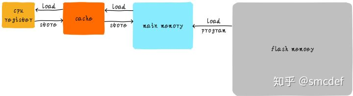<br />CPU和主存之间直接数据传输的方式转变成CPU和cache之间直接数据传输。cache负责和主存之间数据传输。

<a name="j1qTg"></a>
# 多级cache存储结构


cahe的速度在一定程度上同样影响着系统的性能。一般情况cache的速度可以达到1ns，几乎可以和CPU寄存器速度媲美。但是，这就满足人们对性能的追求了吗？并没有。当cache中没有缓存我们想要的数据的时候，依然需要漫长的等待从主存中load数据。为了进一步提升性能，引入多级cache。前面提到的cache，称之为L1 cache（第一级cache）。我们在L1 cache 后面连接L2 cache，在L2 cache 和主存之间连接L3 cache。等级越高，速度越慢，容量越大。但是速度相比较主存而言，依然很快。不同等级cache速度之间关系如下：<br />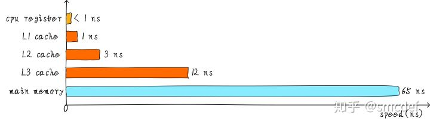<br />经过3级cache的缓冲，各级cache和主存之间的速度最萌差也逐级减小。在一个真实的系统上，各级cache之间硬件上是如何关联的呢？我们看下Cortex-A53架构上各级cache之间的硬件抽象框图如下：<br />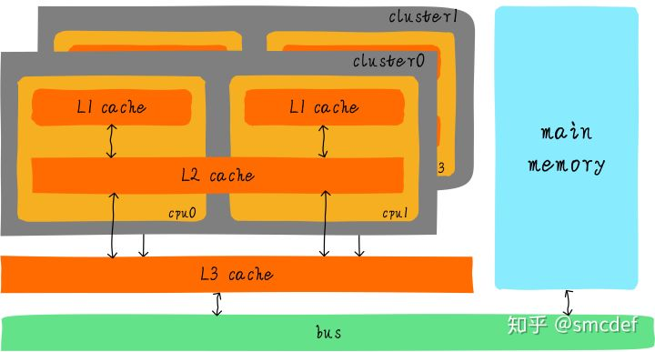<br />在Cortex-A53架构上，L1 cache分为单独的instruction cache（ICache）和data cache（DCache）。L1 cache是CPU私有的，每个CPU都有一个L1 cache。一个cluster 内的所有CPU共享一个L2 cache，L2 cache不区分指令和数据，都可以缓存。所有cluster之间共享L3 cache。L3 cache通过总线和主存相连。

<a name="jmuMW"></a>
# 多级cache之间的配合工作

首先引入两个名词概念，命中和缺失。 CPU要访问的数据在cache中有缓存，称为“命中” (hit)，反之则称为“缺失” (miss)。多级cache之间是如何配合工作的呢？我们假设现在考虑的系统只有两级cache。<br />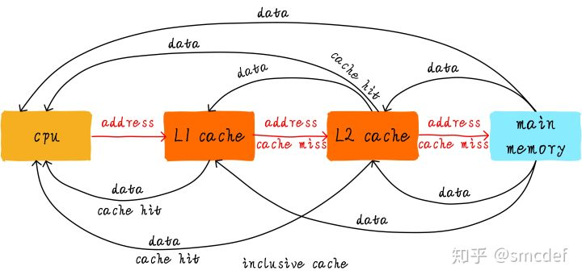<br />当CPU试图从某地址load数据时，首先从L1 cache中查询是否命中，如果命中则把数据返回给CPU。如果L1 cache缺失，则继续从L2 cache中查找。当L2 cache命中时，数据会返回给L1 cache以及CPU。如果L2 cache也缺失，很不幸，我们需要从主存中load数据，将数据返回给L2 cache、L1 cache及CPU。这种多级cache的工作方式称之为inclusive cache。某一地址的数据可能存在多级缓存中。与inclusive cache对应的是exclusive cache，这种cache保证某一地址的数据缓存只会存在于多级cache其中一级。也就是说，任意地址的数据不可能同时在L1和L2 cache中缓存。

<a name="oOPHD"></a>
# 直接映射缓存(Direct mapped cache)

我们继续引入一些cache相关的名词。cache的大小称之为cahe size，代表cache可以缓存最大数据的大小。我们将cache平均分成相等的很多块，每一个块大小称之为cache line，其大小是cache line size。例如一个64 Bytes大小的cache。如果我们将64 Bytes平均分成64块，那么cache line就是1字节，总共64行cache line。如果我们将64 Bytes平均分成8块，那么cache line就是8字节，总共8行cache line。现在的硬件设计中，一般cache line的大小是4-128 Byts。为什么没有1 byte呢？原因我们后面讨论。

这里有一点需要注意，cache line是cache和主存之间数据传输的最小单位。什么意思呢？当CPU试图load一个字节数据的时候，如果cache缺失，那么cache控制器会从主存中一次性的load cache line大小的数据到cache中。例如，cache line大小是8字节。CPU即使读取一个byte，在cache缺失后，cache会从主存中load 8字节填充整个cache line。又是因为什么呢？后面说完就懂了。

我们假设下面的讲解都是针对64 Bytes大小的cache，并且cache line大小是8字节。我们可以类似把这块cache想想成一个数组，数组总共8个元素，每个元素大小是8字节。就像下图这样。<br />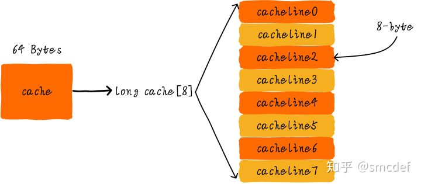<br />现在我们考虑一个问题，CPU从0x0654地址读取一个字节，cache控制器是如何判断数据是否在cache中命中呢？cache大小相对于主存来说，可谓是小巫见大巫。所以cache肯定是只能缓存主存中极小一部分数据。我们如何根据地址在有限大小的cache中查找数据呢？现在硬件采取的做法是对地址进行散列（可以理解成地址取模操作）。我们接下来看看是如何做到的？<br />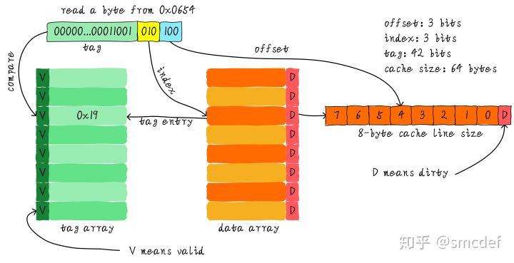<br />我们一共有8行cache line，cache line大小是8 Bytes。所以我们可以利用地址低3 bits（如上图地址蓝色部分）用来寻址8 bytes中某一字节，我们称这部分bit组合为offset。同理，8行cache line，为了覆盖所有行。我们需要3 bits（如上图地址黄色部分）查找某一行，这部分地址部分称之为index。现在我们知道，如果两个不同的地址，其地址的bit3-bit5如果完全一样的话，那么这两个地址经过硬件散列之后都会找到同一个cache line。所以，当我们找到cache line之后，只代表我们访问的地址对应的数据可能存在这个cache line中，但是也有可能是其他地址对应的数据。所以，我们又引入tag array区域，tag array和data array一一对应。每一个cache line都对应唯一一个tag，tag中保存的是整个地址位宽去除index和offset使用的bit剩余部分（如上图地址绿色部分）。tag、index和offset三者组合就可以唯一确定一个地址了。因此，当我们根据地址中index位找到cache line后，取出当前cache line对应的tag，然后和地址中的tag进行比较，如果相等，这说明cache命中。如果不相等，说明当前cache line存储的是其他地址的数据，这就是cache缺失。在上述图中，我们看到tag的值是0x19，和地址中的tag部分相等，因此在本次访问会命中。由于tag的引入，因此解答了我们之前的一个疑问“为什么硬件cache line不做成一个字节？”。这样会导致硬件成本的上升，因为原本8个字节对应一个tag，现在需要8个tag，占用了很多内存。

我们可以从图中看到tag旁边还有一个valid bit，这个bit用来表示cache line中数据是否有效（例如：1代表有效；0代表无效）。当系统刚启动时，cache中的数据都应该是无效的，因为还没有缓存任何数据。cache控制器可以根据valid bit确认当前cache line数据是否有效。所以，上述比较tag确认cache line是否命中之前还会检查valid bit是否有效。只有在有效的情况下，比较tag才有意义。如果无效，直接判定cache缺失。

上面的例子中，cache size是64 Bytes并且cache line size是8 bytes。offset、index和tag分别使用3 bits、3 bits和42 bits（假设地址宽度是48 bits）。我们现在再看一个例子：512 Bytes cache size，64 Bytes cache line size。根据之前的地址划分方法，offset、index和tag分别使用6 bits、3 bits和39 bits。如下图所示。<br />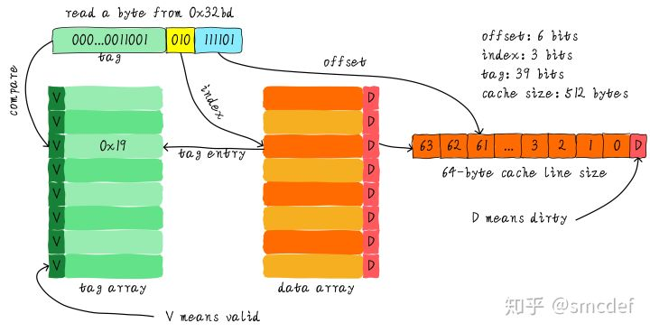

<a name="X2OzW"></a>
## 直接映射缓存的优缺点


直接映射缓存在硬件设计上会更加简单，因此成本上也会较低。根据直接映射缓存的工作方式，我们可以画出主存地址0x00-0x88地址对应的cache分布图。<br />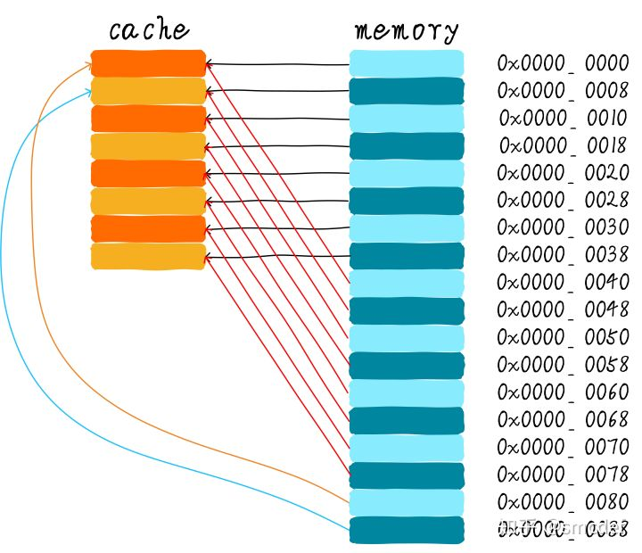<br />我们可以看到，地址0x00-0x3f地址处对应的数据可以覆盖整个cache。0x40-0x7f地址的数据也同样是覆盖整个cache。我们现在思考一个问题，如果一个程序试图依次访问地址0x00、0x40、0x80，cache中的数据会发生什么呢？首先我们应该明白0x00、0x40、0x80地址中index部分是一样的。因此，这3个地址对应的cache line是同一个。所以，当我们访问0x00地址时，cache会缺失，然后数据会从主存中加载到cache中第0行cache line。当我们访问0x40地址时，依然索引到cache中第0行cache line，由于此时cache line中存储的是地址0x00地址对应的数据，所以此时依然会cache缺失。然后从主存中加载0x40地址数据到第一行cache line中。同理，继续访问0x80地址，依然会cache缺失。这就相当于每次访问数据都要从主存中读取，所以cache的存在并没有对性能有什么提升。访问0x40地址时，就会把0x00地址缓存的数据替换。这种现象叫做cache颠簸（cache thrashing）。针对这个问题，我们引入多路组相连缓存。我们首先研究下最简单的两路组相连缓存的工作原理。

<a name="jpphm"></a>
# 两路组相连缓存(Two-way set associative cache)


我们依然假设64 Bytes cache size，cache line size是8 Bytes。什么是路（way）的概念。我们将cache平均分成多份，每一份就是一路。因此，两路组相连缓存就是将cache平均分成2份，每份32 Bytes。如下图所示。<br /><br />cache被分成2路，每路包含4行cache line。我们将所有索引一样的cache line组合在一起称之为组。例如，上图中一个组有两个cache line，总共4个组。我们依然假设从地址0x0654地址读取一个字节数据。由于cache line size是8 Bytes，因此offset需要3 bits，这和之前直接映射缓存一样。不一样的地方是index，在两路组相连缓存中，index只需要2 bits，因为一路只有4行cache line。上面的例子根据index找到第2行cache line（从0开始计算），第2行对应2个cache line，分别对应way 0和way 1。因此index也可以称作set index（组索引）。先根据index找到set，然后将组内的所有cache line对应的tag取出来和地址中的tag部分对比，如果其中一个相等就意味着命中。

因此，两路组相连缓存较直接映射缓存最大的差异就是：第一个地址对应的数据可以对应2个cache line，而直接映射缓存一个地址只对应一个cache line。那么这究竟有什么好处呢？

<a name="iqSXk"></a>
## 两路组相连缓存优缺点

两路组相连缓存的硬件成本相对于直接映射缓存更高。因为其每次比较tag的时候需要比较多个cache line对应的tag（某些硬件可能还会做并行比较，增加比较速度，这就增加了硬件设计复杂度）。为什么我们还需要两路组相连缓存呢？因为其可以有助于降低cache颠簸可能性。那么是如何降低的呢？根据两路组相连缓存的工作方式，我们可以画出主存地址0x00-0x4f地址对应的cache分布图。<br />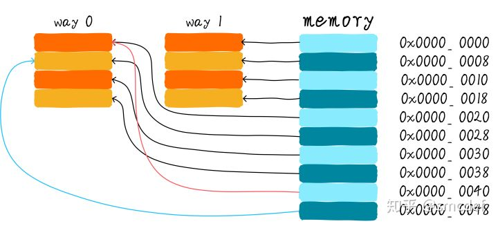<br />我们依然考虑直接映射缓存一节的问题“如果一个程序试图依次访问地址0x00、0x40、0x80，cache中的数据会发生什么呢？”。现在0x00地址的数据可以被加载到way 1，0x40可以被加载到way 0。这样是不是就在一定程度上避免了直接映射缓存的尴尬境地呢？在两路组相连缓存的情况下，0x00和0x40地址的数据都缓存在cache中。试想一下，如果我们是4路组相连缓存，后面继续访问0x80，也可能被被缓存。

因此，当cache size一定的情况下，组相连缓存对性能的提升最差情况下也和直接映射缓存一样，在大部分情况下组相连缓存效果比直接映射缓存好。同时，其降低了cache颠簸的频率。从某种程度上来说，直接映射缓存是组相连缓存的一种特殊情况，每个组只有一个cache line而已。因此，直接映射缓存也可以称作单路组相连缓存

<a name="Szjh2"></a>
# 全相连缓存(Full associative cache)

既然组相连缓存那么好，如果所有的cache line都在一个组内。岂不是性能更好。是的，这种缓存就是全相连缓存。我们依然以64 Byts大小cache为例说明。<br /><br />由于所有的cache line都在一个组内，因此地址中不需要set index部分。因为，只有一个组让你选择，间接来说就是你没得选。我们根据地址中的tag部分和所有的cache line对应的tag进行比较（硬件上可能并行比较也可能串行比较）。哪个tag比较相等，就意味着命中某个cache line。因此，在全相连缓存中，任意地址的数据可以缓存在任意的cache line中。所以，这可以最大程度的降低cache颠簸的频率。但是硬件成本上也是更高。

<a name="CuYgf"></a>
# 一个四路组相连缓存实例问题

考虑这么一个问题，32 KB大小4路组相连cache，cache line大小是32 Bytes。请思考以下2个问题：

1. 多少个组？
2. 假设地址宽度是48 bits，index、offset以及tag分别占用几个bit？


总共4路，因此每路大小是8 KB。cache line size是32 Bytes，因此一共有256组（8 KB / 32 Bytes）。由于cache line size是32 Bytes，所以offset需要5位。一共256组，所以index需要8位，剩下的就是tag部分，占用35位。这个cache可以绘制下图表示。<br />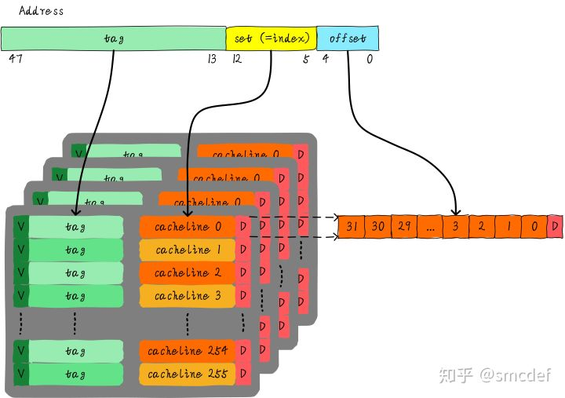

<a name="pbOnI"></a>
# Cache分配策略

cache的分配策略是指我们什么情况下应该为数据分配cache line。cache分配策略分为读和写两种情况。

<a name="xIHRk"></a>
## 读分配(read allocation)

当CPU读数据时，发生cache缺失，这种情况下都会分配一个cache line缓存从主存读取的数据。默认情况下，cache都支持读分配。

<a name="kKyv0"></a>
## 写分配(write allocation)

当CPU写数据发生cache缺失时，才会考虑写分配策略。当我们不支持写分配的情况下，写指令只会更新主存数据，然后就结束了。当支持写分配的时候，我们首先从主存中加载数据到cache line中（相当于先做个读分配动作），然后会更新cache line中的数据。

<a name="C4CSJ"></a>
# Cache更新策略(Cache update policy)

cache更新策略是指当发生cache命中时，写操作应该如何更新数据。cache更新策略分成两种：写直通和回写。

<a name="xCojp"></a>
## 写直通(write through)

当CPU执行store指令并在cache命中时，我们更新cache中的数据并且更新主存中的数据。**cache和主存的数据始终保持一致**。

<a name="w0NIc"></a>
## 写回(write back)

当CPU执行store指令并在cache命中时，我们只更新cache中的数据。并且每个cache line中会有一个bit位记录数据是否被修改过，称之为dirty bit（翻翻前面的图片，cache line旁边有一个D就是dirty bit）。我们会将dirty bit置位。主存中的数据只会在cache line被替换或者显示的clean操作时更新。因此，主存中的数据可能是未修改的数据，而修改的数据躺在cache中。**cache和主存的数据可能不一致。**<br />**<br />同时思考个问题，为什么cache line大小是cache控制器和主存之间数据传输的最小单位呢？这也是因为每个cache line只有一个dirty bit。这一个dirty bit代表着整个cache line是否被修改的状态。

<a name="mpq8l"></a>
# 实例

假设我们有一个64 Bytes大小直接映射缓存，cache line大小是8 Bytes，采用写分配和写回机制。当CPU从地址0x2a读取一个字节，cache中的数据将会如何变化呢？假设当前cache状态如下图所示(tag旁边valid一栏的数字1代表合法。0代表非法。后面Dirty的1代表dirty，0代表没有写过数据，即非dirty)。

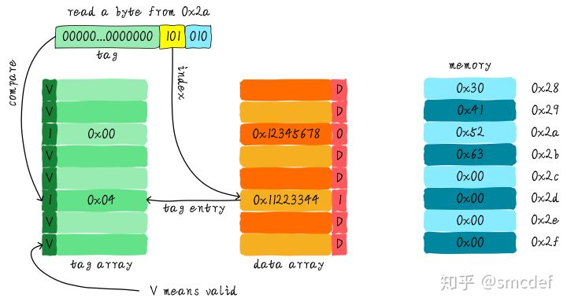

根据index找到对应的cache line，对应的tag部分valid bit是合法的，但是tag的值不相等，因此发生缺失。此时我们需要从地址0x28地址加载8字节数据到该cache line中。但是，我们发现当前cache line的dirty bit置位。因此，cache line里面的数据不能被简单的丢弃，由于采用写回机制，所以我们需要将cache中的数据0x11223344写到地址0x0128地址（这个地址根据tag中的值及所处的cache line行计算得到）。这个过程如下图所示。

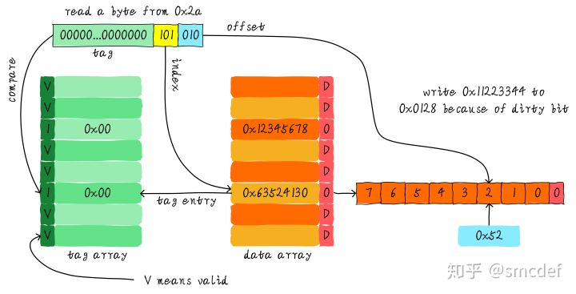<br />当写回操作完成，我们将主存中0x28地址开始的8个字节加载到该cache line中，并清除dirty bit。然后根据offset找到0x52返回给CPU。

<br />
<a name="l6Mb4"></a>
# Source

[https://zhuanlan.zhihu.com/p/102293437](https://zhuanlan.zhihu.com/p/102293437)<br />[https://zhuanlan.zhihu.com/p/102326184](https://zhuanlan.zhihu.com/p/102326184)<br />[https://zhuanlan.zhihu.com/p/107096130](https://zhuanlan.zhihu.com/p/107096130)<br />[https://github.com/chmx0929/UMNclasses/tree/master/Machine%20Architecture%20and%20Organization](https://github.com/chmx0929/UMNclasses/tree/master/Machine%20Architecture%20and%20Organization)
