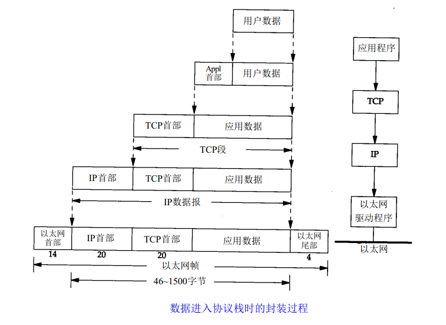
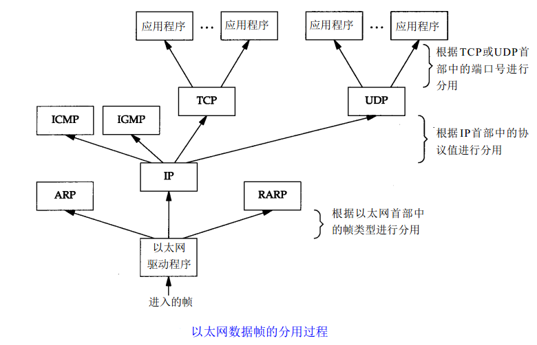

| 分层 | 作用 | 协议 |
| :---: | :---: | :---: |
| 应用层 | 允许访问OSI环境的手段（应用协议数据单元 APDU） | FTP、DNS、Telnet、SMTP、HTTP、WWW、NFS |
| 表示层 | 对数据进行翻译、加密和压缩（表示协议数据单元 PPDU） | JPEG、MPEG、ASII |
| 会话层 | 建立、管理和终止会话（会话协议数据单元 SPDU） | NFS、SQL、NETBIOS、RPC |
| 传输层 | 提供端到端的可靠报文传递和错误恢复（ 段Segment） | TCP、UDP、SPX |
| 网络层 | 负责数据包从源到宿的传递和网际互连（包 Packet） | IP、ICMP、ARP、RARP、OSPF、IPX、RIP、IGRP（路由器） |
| 数据链路层 | 将比特组装成帧和点到点的传递（帧 Frame） | PPP、FR、HDLC、VLAN、MAC（网桥，交换机） |
| 物理层 | 通过媒介传输比特，确定机械及电气规范（比特 Bit） | RJ45、CLOCK、IEEE802.3（中继器，集线器） |

    
