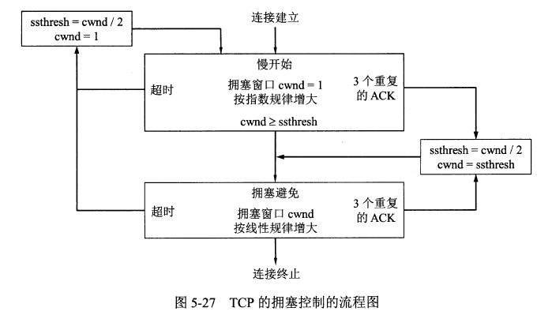
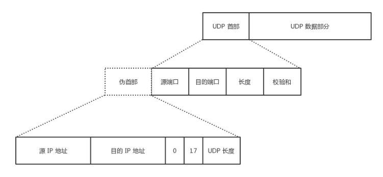

协议：TCP（Transmission Control Protocol，传输控制协议） UDP（User Datagram Protocol，用户数据报协议）

端口：

| 应用程序 | FTP | TELNET | SMTP | DNS | TFTP | HTTP | HTTPS | SNMP |
| :---: | :---: | :---: | :---: | :---: | :---: | :---: | :---: | :---: |
| 端口号 | 21 | 23 | 25 | 53 | 69 | 80 | 443 | 161 |

### TCP

TCP（Transmission Control Protocol，传输控制协议）是一种面向连接的、可靠的、基于字节流的传输层通信协议，其传输的单位是报文段。

特点：面向连接、 只能点对点（一对一）通信、 可靠交互、 全双工通信、 面向字节流

TCP 如何保证可靠传输：确认和超时重传、 数据合理分片和排序、 流量控制、 拥塞控制、 数据校验

#### 报文结构
 

#### 状态控制码（Code，Control Flag）占 6 比特，含义如下：

URG：紧急比特（urgent），当 URG＝1 时，表明紧急指针字段有效，代表该封包为紧急封包。它告诉系统此报文段中有紧急数据，应尽快传送(相当于高优先级的数据)， 且上图中的 Urgent Pointer 字段也会被启用。

ACK：确认比特（Acknowledge）。只有当 ACK＝1 时确认号字段才有效，代表这个封包为确认封包。当 ACK＝0 时，确认号无效。

PSH：（Push function）若为 1 时，代表要求对方立即传送缓冲区内的其他对应封包，而无需等缓冲满了才送。

RST：复位比特(Reset)，当 RST＝1 时，表明 TCP 连接中出现严重差错（如由于主机崩溃或其他原因），必须释放连接，然后再重新建立运输连接。

SYN：同步比特(Synchronous)，SYN 置为 1，就表示这是一个连接请求或连接接受报文，通常带有 SYN 标志的封包表示『主动』要连接到对方的意思。

FIN：终止比特(Final)，用来释放一个连接。当 FIN＝1 时，表明此报文段的发送端的数据已发送完毕，并要求释放运输连接。

### TCP三次握手

1、客户端发送 SYN 给服务器，说明客户端请求建立连接；

2、服务端收到客户端发的 SYN，并回复 SYN+ACK 给客户端（同意建立连接）；

3、客户端收到服务端的 SYN+ACK 后，回复 ACK 给服务端（表示客户端收到了服务端发的同意报文）；

4、服务端收到客户端的 ACK，连接已建立，可以数据传输。

#### TCP 为什么要进行三次握手？

1、因为信道不可靠，而 TCP 想在不可靠信道上建立可靠地传输，那么三次通信是理论上的最小值。（而 UDP 则不需建立可靠传输，因此 UDP 不需要三次握手。）

2、因为双方都需要确认对方收到了自己发送的序列号，确认过程最少要进行三次通信。

3、为了防止已失效的连接请求报文段突然又传送到了服务端，因而产生错误。

### TCP四次挥手

1、客户端发送 FIN 给服务器，说明客户端不必发送数据给服务器了（请求释放从客户端到服务器的连接）；

2、服务器接收到客户端发的 FIN，并回复 ACK 给客户端（同意释放从客户端到服务器的连接）；

3、客户端收到服务端回复的 ACK，此时从客户端到服务器的连接已释放（但服务端到客户端的连接还未释放，并且客户端还可以接收数据）；

4、服务端继续发送之前没发完的数据给客户端；

5、服务端发送 FIN+ACK 给客户端，说明服务端发送完了数据（请求释放从服务端到客户端的连接，就算没收到客户端的回复，过段时间也会自动释放）；

6、客户端收到服务端的 FIN+ACK，并回复 ACK 给客户端（同意释放从服务端到客户端的连接）；

7、服务端收到客户端的 ACK 后，释放从服务端到客户端的连接。

#### TCP 为什么要进行四次挥手？ / 为什么 TCP 建立连接需要三次，而释放连接则需要四次？

因为 TCP 是全双工模式，客户端请求关闭连接后，客户端向服务端的连接关闭（一二次挥手），服务端继续传输之前没传完的数据给客户端（数据传输），服务端向客户端的连接关闭（三四次挥手）。所以 TCP 释放连接时服务器的 ACK 和 FIN 是分开发送的（中间隔着数据传输），而 TCP 建立连接时服务器的 ACK 和 SYN 是一起发送的（第二次握手），所以 TCP 建立连接需要三次，而释放连接则需要四次。

#### 为什么 TCP 连接时可以 ACK 和 SYN 一起发送，而释放时则 ACK 和 FIN 分开发送呢？（ACK 和 FIN 分开是指第二次和第三次挥手）

因为客户端请求释放时，服务器可能还有数据需要传输给客户端，因此服务端要先响应客户端 FIN 请求（服务端发送 ACK），然后数据传输，传输完成后，服务端再提出 FIN 请求（服务端发送 FIN）；而连接时则没有中间的数据传输，因此连接时可以 ACK 和 SYN 一起发送。

#### 为什么客户端释放最后需要 TIME-WAIT 等待 2MSL 呢？

为了保证客户端发送的最后一个 ACK 报文能够到达服务端。若未成功到达，则服务端超时重传 FIN+ACK 报文段，客户端再重传 ACK，并重新计时。

防止已失效的连接请求报文段出现在本连接中。TIME-WAIT 持续 2MSL 可使本连接持续的时间内所产生的所有报文段都从网络中消失，这样可使下次连接中不会出现旧的连接报文段。

### TCP相关问题

#### TCP黏包问题

TCP 是一个基于字节流的传输服务（UDP 基于报文的），“流” 意味着 TCP 所传输的数据是没有边界的。所以可能会出现两个数据包黏在一起的情况。

解决：发送定长包。如果每个消息的大小都是一样的，那么在接收对等方只要累计接收数据，直到数据等于一个定长的数值就将它作为一个消息。 包头加上包体长度。包头是定长的 4 个字节，说明了包体的长度。接收对等方先接收包头长度，依据包头长度来接收包体。 在数据包之间设置边界，如添加特殊符号 \r\n 标记。FTP 协议正是这么做的。但问题在于如果数据正文中也含有 \r\n，则会误判为消息的边界。 使用更加复杂的应用层协议。

#### TCP流量控制

流量控制（flow control）就是让发送方的发送速率不要太快，要让接收方来得及接收。 

#### TCP拥塞控制

拥塞控制就是防止过多的数据注入到网络中，这样可以使网络中的路由器或链路不致过载。

方法：慢开始( slow-start )、 拥塞避免( congestion avoidance )、 快重传( fast retransmit )、 快恢复( fast recovery )   

### UDP

UDP（User Datagram Protocol，用户数据报协议）是 OSI（Open System Interconnection 开放式系统互联） 参考模型中一种无连接的传输层协议，提供面向事务的简单不可靠信息传送服务，其传输的单位是用户数据报。

特点：无连接； 尽最大努力交付； 面向报文； 没有拥塞控制； 支持一对一、一对多、多对一、多对多的交互通信； 首部开销小

#### 报文结构

 

### TCP与UDP区别

1、TCP 面向连接，UDP 是无连接的；

2、TCP 提供可靠的服务，也就是说，通过 TCP 连接传送的数据，无差错，不丢失，不重复，且按序到达；UDP 尽最大努力交付，即不保证可靠交付

3、TCP 的逻辑通信信道是全双工的可靠信道；UDP 则是不可靠信道

4、每一条 TCP 连接只能是点到点的；UDP 支持一对一，一对多，多对一和多对多的交互通信

5、TCP 面向字节流（可能出现黏包问题），实际上是 TCP 把数据看成一连串无结构的字节流；UDP 是面向报文的（不会出现黏包问题）

6、UDP 没有拥塞控制，因此网络出现拥塞不会使源主机的发送速率降低（对实时应用很有用，如 IP 电话，实时视频会议等）

7、TCP 首部开销20字节；UDP 的首部开销小，只有 8 个字节
