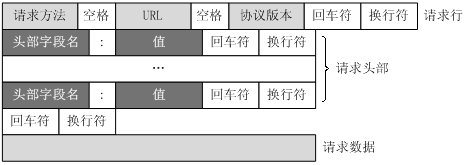
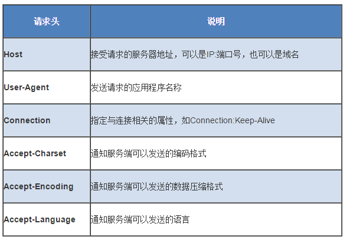

### DNS
DNS（Domain Name System，域名系统）是互联网的一项服务。它作为将域名和 IP 地址相互映射的一个分布式数据库，能够使人更方便地访问互联网。DNS 使用 TCP 和 UDP 端口 53。当前，对于每一级域名长度的限制是 63 个字符，域名总长度则不能超过 253 个字符。

### 域名
域名 ::= {<三级域名>.<二级域名>.<顶级域名>}，如：blog.huihut.com

### FTP
FTP（File Transfer Protocol，文件传输协议）是用于在网络上进行文件传输的一套标准协议，使用客户/服务器模式，使用 TCP 数据报，提供交互式访问，双向传输。

TFTP（Trivial File Transfer Protocol，简单文件传输协议）一个小且易实现的文件传输协议，也使用客户-服务器方式，使用UDP数据报，只支持文件传输而不支持交互，没有列目录，不能对用户进行身份鉴定。

### TELNET
TELNET 协议是 TCP/IP 协议族中的一员，是 Internet 远程登陆服务的标准协议和主要方式。它为用户提供了在本地计算机上完成远程主机工作的能力。

HTTP（HyperText Transfer Protocol，超文本传输协议）是用于从 WWW（World Wide Web，万维网）服务器传输超文本到本地浏览器的传送协议。

SMTP（Simple Mail Transfer Protocol，简单邮件传输协议）是一组用于由源地址到目的地址传送邮件的规则，由它来控制信件的中转方式。SMTP 协议属于 TCP/IP 协议簇，它帮助每台计算机在发送或中转信件时找到下一个目的地。

Socket 建立网络通信连接至少要一对端口号（Socket）。Socket 本质是编程接口（API），对 TCP/IP 的封装，TCP/IP 也要提供可供程序员做网络开发所用的接口，这就是 Socket 编程接口。

### WWW
WWW（World Wide Web，环球信息网，万维网）是一个由许多互相链接的超文本组成的系统，通过互联网访问

### URL
URL（Uniform Resource Locator，统一资源定位符）是因特网上标准的资源的地址（Address）

### 标准格式
协议类型:[//服务器地址[:端口号]][/资源层级UNIX文件路径]文件名[?查询][#片段ID]

### 完整格式
协议类型:[//[访问资源需要的凭证信息@]服务器地址[:端口号]][/资源层级UNIX文件路径]文件名[?查询][#片段ID]

### HTTP
HTTP（HyperText Transfer Protocol，超文本传输协议）是一种用于分布式、协作式和超媒体信息系统的应用层协议。HTTP 是万维网的数据通信的基础。

请求行分为三个部分：请求方法、请求地址和协议版本。协议版本的格式为：HTTP/主版本号.次版本号，常用的有HTTP/1.0和HTTP/1.1。

请求地址：URL:统一资源定位符，是一种自愿位置的抽象唯一识别方法。组成：<协议>：//<主机>：<端口>/<路径>。端口和路径有时可以省略（HTTP默认端口号是80）

  

#### 请求方法
| 方法 | 意义 |
| :---: | :---: |
| OPTIONS | 请求一些选项信息，允许客户端查看服务器的性能 |
| GET | 请求指定的页面信息，并返回实体主体 |
| HEAD | 类似于 get 请求，只不过返回的响应中没有具体的内容，用于获取报头 |
| POST | 向指定资源提交数据进行处理请求（例如提交表单或者上传文件）。数据被包含在请求体中。POST请求可能会导致新的资源的建立和/或已有资源的修改 |
| PUT | 从客户端向服务器传送的数据取代指定的文档的内容 |
| DELETE | 请求服务器删除指定的页面 |
| TRACE | 回显服务器收到的请求，主要用于测试或诊断 |

#### 状态码(status-code)

1xx：表示通知信息，如请求收到了或正在进行处理

- 100 Continue：继续，客户端应继续其请求
- 101 Switching Protocols 切换协议。服务器根据客户端的请求切换协议。只能切换到更高级的协议，例如，切换到 HTTP 的新版本协议

2xx：表示成功，如接收或知道了

- 200 OK: 请求成功

3xx：表示重定向，如要完成请求还必须采取进一步的行动

- 301 Moved Permanently: 永久移动。请求的资源已被永久的移动到新 URL，返回信息会包括新的 URL，浏览器会自动定向到新 URL。今后任何新的请求都应使用新的 URL 代替

4xx：表示客户的差错，如请求中有错误的语法或不能完成

- 400 Bad Request: 客户端请求的语法错误，服务器无法理解
- 401 Unauthorized: 请求要求用户的身份认证
- 403 Forbidden: 服务器理解请求客户端的请求，但是拒绝执行此请求（权限不够）
- 404 Not Found: 服务器无法根据客户端的请求找到资源（网页）。通过此代码，网站设计人员可设置 “您所请求的资源无法找到” 的个性页面

5xx：表示服务器的差错，如服务器失效无法完成请求

- 500 Internal Server Error: 服务器内部错误，无法完成请求
- 503 Service Unavailable: 由于超载或系统维护，服务器暂时的无法处理客户端的请求。延时的长度可包含在服务器的 Retry-After 头信息中
- 504 Gateway Timeout: 充当网关或代理的服务器，未及时从远端服务器获取请求

### 其他协议

SMTP（Simple Main Transfer Protocol，简单邮件传输协议）是在 Internet 传输 Email 的标准，是一个相对简单的基于文本的协议。在其之上指定了一条消息的一个或多个接收者（在大多数情况下被确认是存在的），然后消息文本会被传输。可以很简单地通过 Telnet 程序来测试一个 SMTP 服务器。SMTP 使用 TCP 端口 25。

DHCP（Dynamic Host Configuration Protocol，动态主机设置协议）是一个局域网的网络协议，使用 UDP 协议工作，主要有两个用途： 1、用于内部网络或网络服务供应商自动分配 IP 地址给用户；2、用于内部网络管理员作为对所有电脑作中央管理的手段

SNMP（Simple Network Management Protocol，简单网络管理协议）构成了互联网工程工作小组（IETF，Internet Engineering Task Force）定义的 Internet 协议族的一部分。该协议能够支持网络管理系统，用以监测连接到网络上的设备是否有任何引起管理上关注的情况。
