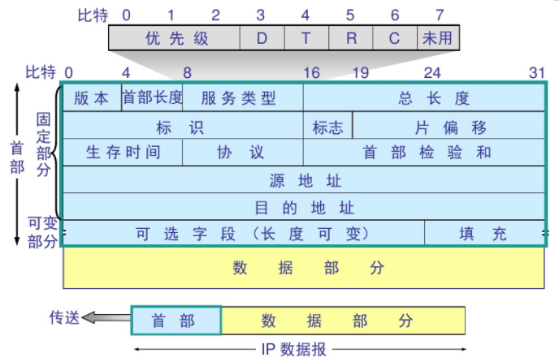

IP（Internet Protocol，网际协议）是为计算机网络相互连接进行通信而设计的协议。

ARP（Address Resolution Protocol，地址解析协议）

ICMP（Internet Control Message Protocol，网际控制报文协议）

IGMP（Internet Group Management Protocol，网际组管理协议）

### IP网际协议

IP 地址 ::= {<网络号>,<主机号>}

| IP地址类别 | 网络号 | 网络范围 | 主机号 | IP地址范围 |
| :---: | :---: | :---: | :---: | :---: |
| A | 8bit，第一位固定为 0 | 0 — 127 | 24bit | 1.0.0.0 — 127.255.255.255 |
| B | 16bit，前两位固定为 10 | 128.0 — 191.255 | 16bit | 128.0.0.0 — 191.255.255.255 |
| C | 24bit，前三位固定为 110 | 192.0.0 — 223.255.255 | 8bit | 192.0.0.0 — 223.255.255.255 |
| D | 前四位固定为 1110，后面为多播地址 |  |  |  |
| E | 前五位固定为 11110，后面保留为今后所用 |  |  |  |

### IP 数据报格式

### **ICMP 网际控制报文协议**

应用：PING（Packet InterNet Groper，分组网间探测）测试两个主机之间的连通性 TTL（Time To Live，生存时间）该字段指定 IP 包被路由器丢弃之前允许通过的最大网段数量

### 内部网关协议

RIP(Routing Information Protocol，路由信息协议)、 OSPF(Open Sortest Path First，开放最短路径优先)

### 外部网关协议

BGP（Border Gateway Protocol，边界网关协议）

### IP多播

IGMP（Internet Group Management Protocol，网际组管理协议）

### 多播路由选择协议

VPN 和 NAT VPN（Virtual Private Network，虚拟专用网）、 NAT（Network Address Translation，网络地址转换）

### **路由表包含什么**

网络 ID（Network ID, Network number）：就是目标地址的网络 ID。

子网掩码（subnet mask）：用来判断 IP 所属网络

下一跳地址/接口（Next hop / interface）：就是数据在发送到目标地址的旅途中下一站的地址。其中 interface 指向 next hop（即为下一个 route）。一个自治系统（AS, Autonomous system）中的 route 应该包含区域内所有的子网络，而默认网关（Network id: 0.0.0.0, Netmask: 0.0.0.0）指向自治系统的出口。

根据应用和执行的不同，路由表可能含有如下附加信息：

花费（Cost）：就是数据发送过程中通过路径所需要的花费；路由的服务质量；路由中需要过滤的出/入连接列表

#### 子网掩码例子

**例子1：**将一个C类网络划分为3个子网，每个子网最少要容纳55台主机，使用的子网掩码是？

子网主机数=2的Y次方-2，这里的Y是非掩码位的位数，即子网掩码中0的个数。即，得到。所以子网掩码中6个0，所以子网掩码是：11111111 11111111 11111111 11000000，转化为十进制为255.255.255.192。

**例子2：**从前有一个地主，有256间房子，地主家的门牌号码是“192.168.1”，那么他家第一间房子的门牌号码是192.168.1.0，第二间是192.168.1.1，…第256间的编号是192.168.1.255。地主老了，需要把256间房子分给4个儿子，平均分配，每个儿子可以分64间。请来一位先生主持公道，先生这么来操作：192.168.1.0-192.168.1.63 分给大儿子192.168.1.64-192.168.1.127 分给二儿子192.168.1.128 -192.168.1.191 分给三儿子192.168.1.192-192.168.1.255 分给四儿子那如何来描述四个儿子的子网网段呢？

192.168.1.0/26；192.168.1.64/26；192.168.1.128/26；192.168.1.192/26    这个/26是什么鬼？255.255.255.192的二进制是多少？ “11111111-11111111-11111111-11”大家数数一共多少个1？不用数了，是26个1，为了简化子网掩码的表示，用/26代替255.255.255.192。

按位与运算我们来看大儿子的网段192.168.1.0/26是如何得到的？以大儿子的房间为例：192.168.1.0-192.168.1.63二进制表示：192.168.1.011000000.10101000.00000001.00000000192.168.1.6311000000.10101000.00000001.00111111首尾地址完全相同的是多少？11000000.10101000.00000001.00数数一共多少位？26位！那么用这个“192.168.1.0/26”就可以表示大儿子所有房间。对照房间的门牌号码“192.168.1.199”，很显然属于四儿子的。

一个主机192.168.1.199/26 能否和直连主机192.168.1.200/24 通信？可以的，因为都是四儿子的房间。一个主机192.168.1.199/26 能否和直连主机192.168.1.1/24 通信？ 不可以，因为一个是大儿子的房间，一个是四儿子的房间，无法直连通信！
